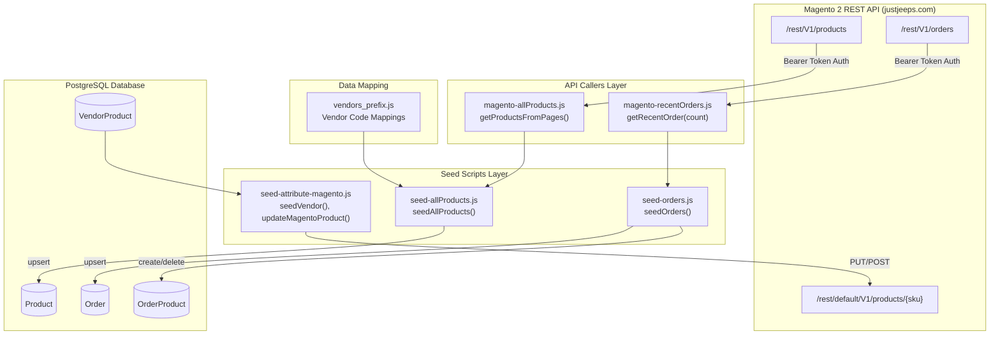
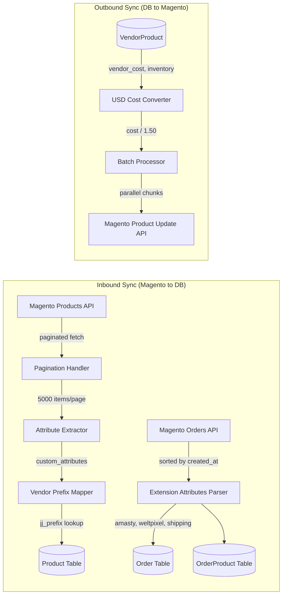
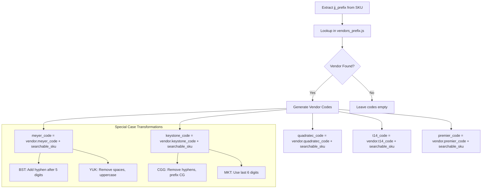
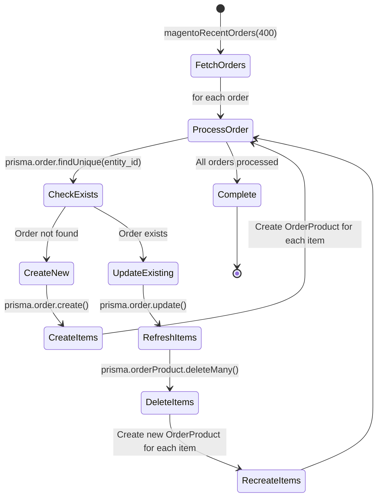
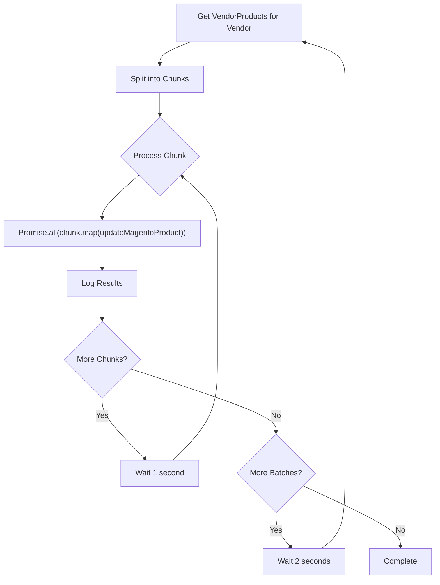
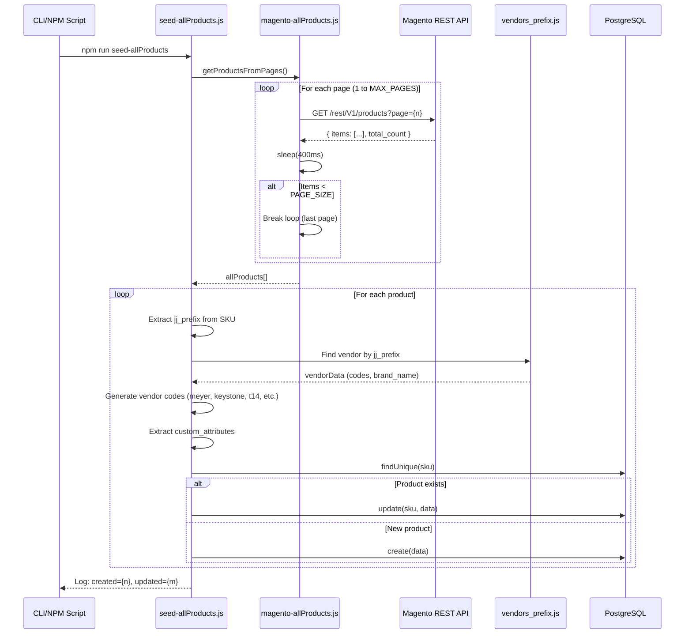
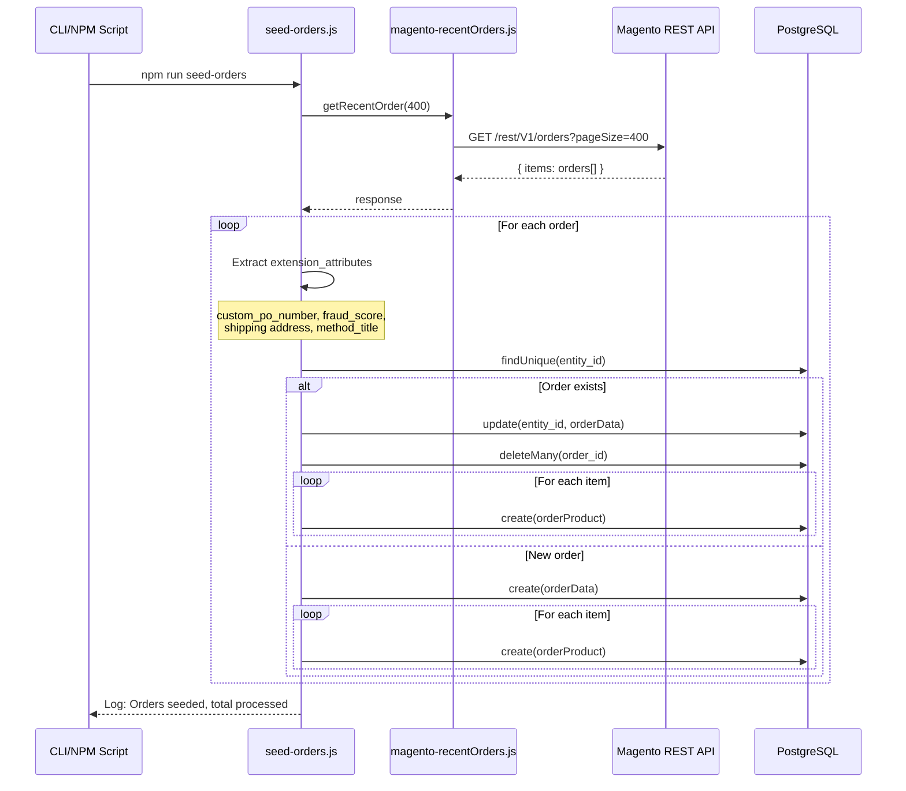

# DD-001: Magento API Integration Service

**Version**: 1.0.0
**Status**: Accepted (Current Implementation)
**Created**: 2026-01-23
**Last Updated**: 2026-01-23
**Complexity Level**: Medium
**Complexity Rationale**:
1. Requirements/ACs: Bidirectional sync with external e-commerce platform, multi-page pagination, vendor code mapping logic
2. Constraints/Risks: API rate limits, large payload handling (20k+ products), error recovery during batch operations

---

## Agreement Checklist

### Scope (What to Change)
- [x] Document existing Magento API integration architecture
- [x] Document product catalog import flow with pagination
- [x] Document order synchronization with extension attributes
- [x] Document vendor attribute push operations
- [x] Document vendor prefix mapping system
- [x] Document error handling and rate limiting strategies

### Non-Scope (What Not to Change)
- [ ] No implementation changes proposed (documentation mode)
- [ ] Customer data synchronization (out of scope per PRD)
- [ ] Real-time webhook-based sync (not implemented)
- [ ] Magento product creation (products created in Magento admin)
- [ ] Category structure synchronization

### Constraints
- Magento REST API v1 compatibility required
- Bearer token authentication (MAGENTO_KEY environment variable)
- Rate limiting: 1-second delays between chunks, 2-second delays between batches
- USD to CAD conversion factor: 1.5x (hardcoded)
- Pagination: 5000 items per page, max 19 pages default

---

## Prerequisite ADRs

None - This is a documentation of existing implementation without proposed architectural changes.

---

## Overview

The Magento API Integration Service provides bidirectional synchronization between the JustJeeps internal API system and the Magento 2 e-commerce storefront (justjeeps.com). The service handles three primary operations:

1. **Inbound Product Sync**: Import product catalog from Magento with vendor code mapping
2. **Inbound Order Sync**: Import recent orders with extension attributes for fulfillment
3. **Outbound Attribute Push**: Push vendor cost and inventory data to Magento products

---

## Architecture Diagram



---

## Data Flow Diagram



---

## Existing Codebase Analysis

### Implementation File Paths

| File | Purpose | Status |
|------|---------|--------|
| `/prisma/seeds/api-calls/magento-allProducts.js` | Paginated product fetch from Magento | Existing |
| `/prisma/seeds/api-calls/magento-recentOrders.js` | Order fetch from Magento | Existing |
| `/prisma/seeds/seed-individual/seed-allProducts.js` | Product upsert with vendor code mapping | Existing |
| `/prisma/seeds/seed-individual/seed-orders.js` | Order and OrderProduct creation | Existing |
| `/prisma/seeds/seed-individual/seed-attribute-magento.js` | Vendor attribute push to Magento | Existing |
| `/prisma/seeds/hard-code_data/vendors_prefix.js` | Vendor prefix to code mappings | Existing |

### Public Interfaces

| Interface | File | Signature | Description |
|-----------|------|-----------|-------------|
| `getProductsFromPages` | magento-allProducts.js | `async function getProductsFromPages()` | Fetches all products with pagination, returns array of product items |
| `getRecentOrder` | magento-recentOrders.js | `async function getRecentOrder(order_qty)` | Fetches recent orders sorted by created_at |
| `seedAllProducts` | seed-allProducts.js | `async function seedAllProducts()` | Processes products and upserts to database with vendor code mapping |
| `seedOrders` | seed-orders.js | `async function seedOrders()` | Upserts orders and refreshes OrderProduct records |
| `seedVendor` | seed-attribute-magento.js | `async function seedVendor(vendorName, batchSize, concurrency, maxProducts)` | Pushes vendor costs to Magento |
| `updateMagentoProduct` | seed-attribute-magento.js | `async function updateMagentoProduct(sku, vendorCost, vendorInventory, vendorName)` | Updates single product attributes in Magento |

### Similar Functionality Search

- **Existing HTTP client usage**: axios is used consistently across all Magento API calls
- **No duplicate implementations found**: Each API endpoint has a single caller module
- **Vendor code generation**: Centralized in seed-allProducts.js with vendors_prefix.js mappings

---

## Component Design

### 1. Product Catalog Import (magento-allProducts.js)

**Responsibility**: Fetch all products from Magento REST API with pagination support

**Implementation Details**:

```javascript
// Configuration
const PAGE_SIZE = Number(process.env.PAGE_SIZE || 5000);
const MAX_PAGES = Number(process.env.MAX_PAGES || 19);
const TIMEOUT = 60000; // 60 seconds
const INTER_PAGE_DELAY = 400; // ms
```

**Request Structure**:
```
GET https://www.justjeeps.com/rest/V1/products
  ?fields=items[sku,created_at,status,name,price,weight,media_gallery_entries[file],
    custom_attributes[searchable_sku,url_path,url_key,length,width,height,
    shipping_freight,part,thumbnail,black_friday_sale_attribute]]
  &searchCriteria[pageSize]=5000
  &searchCriteria[currentPage]={page}
```

**Pagination Strategy**:
- Loop from page 1 to MAX_PAGES (default 19)
- Early termination if page returns fewer items than PAGE_SIZE
- Early termination if items array is not present or not an array
- 400ms delay between page requests

**Error Handling**:
- Network errors logged with status, code, and timing
- Partial response body logged (first 800 chars)
- Graceful degradation: stops pagination on error, returns collected items

### 2. Order Import (magento-recentOrders.js)

**Responsibility**: Fetch recent orders from Magento with extended attributes

**Request Structure**:
```
GET https://www.justjeeps.com/rest/V1/orders/
  ?searchCriteria[sortOrders][0][field]=created_at
  &searchCriteria[pageSize]={order_qty}
  &fields=items[created_at,status,customer_email,customer_firstname,customer_lastname,
    entity_id,grand_total,increment_id,order_currency_code,total_qty_ordered,
    base_total_due,coupon_code,shipping_description,shipping_amount,
    items[base_total_due,name,sku,order_id,base_price,base_price_incl_tax,
    discount_amount,discount_invoiced,discount_percent,original_price,price,
    price_incl_tax,product_id,qty_ordered],
    extension_attributes[amasty_order_attributes,weltpixel_fraud_score,
    shipping_assignments,payment_additional_info]]
```

**Extension Attributes Extraction**:
| Source | Field | Target |
|--------|-------|--------|
| `amasty_order_attributes` | `custom_po_number` | `custom_po_number` |
| `extension_attributes` | `weltpixel_fraud_score` | `weltpixel_fraud_score` |
| `shipping_assignments[0].shipping.address` | `region, city, firstname, etc.` | `shipping_*` fields |
| `payment_additional_info` | `method_title` | `method_title` |

### 3. Product Seed with Vendor Code Mapping (seed-allProducts.js)

**Responsibility**: Upsert products to database with computed vendor codes

**Vendor Code Generation Logic**:



**Special Vendor Code Rules**:

| Prefix | Vendor | Meyer Code Rule | Keystone Code Rule |
|--------|--------|-----------------|-------------------|
| BST | Bestop | Insert hyphen after 5 digits (except 5240711) | Standard |
| YUK | Yukon | Remove spaces, uppercase | Same as Yukon override |
| CGG | CargoGlide | Standard | Remove hyphens, prefix with "CG" |
| MKT | Mickey Thompson | Standard | Use last 6 digits of searchable_sku |

**Custom Attributes Mapping**:

| Magento Attribute | Database Field | Transform |
|-------------------|----------------|-----------|
| `searchable_sku` | `searchableSku`, `searchable_sku` | Direct |
| `url_key` | `url_path` | Prepend `https://www.justjeeps.com/`, append `.html` |
| `length`, `width`, `height` | `length`, `width`, `height` | `parseFloat()` or `null` |
| `shipping_freight` | `shippingFreight` | Direct |
| `part` | `part` | Direct |
| `thumbnail` | `thumbnail` | Direct |
| `black_friday_sale_attribute` | `black_friday_sale` | Map to discount tier |
| `media_gallery_entries[0].file` | `image` | Prepend CDN URL |

**Black Friday Sale Mapping**:
```javascript
// Value mapping for black_friday_sale_attribute
"4556" => "20%off"
"4557" => "25%off"
"4558" => "30%off"
default => "15%off"
```

**Upsert Strategy**:
- Check if product exists by SKU
- Existing: `prisma.product.update()`
- New: `prisma.product.create()`
- Track created vs updated counts for logging

### 4. Order Seed (seed-orders.js)

**Responsibility**: Upsert orders and manage OrderProduct records

**Order Processing Flow**:



**Order Fields**:
| Magento Field | Database Field | Notes |
|---------------|----------------|-------|
| `entity_id` | `entity_id` (PK) | Primary key |
| `created_at` | `created_at` | String format |
| `customer_email` | `customer_email` | Required |
| `customer_firstname` | `customer_firstname` | Optional |
| `customer_lastname` | `customer_lastname` | Optional |
| `grand_total` | `grand_total` | Float |
| `increment_id` | `increment_id` | Customer-facing order number |
| `status` | `status` | Order status string |
| Shipping address fields | `shipping_*` | Extracted from extension_attributes |

### 5. Vendor Attribute Push (seed-attribute-magento.js)

**Responsibility**: Push vendor cost and inventory to Magento product attributes

**Configuration**:
```javascript
const MAGENTO_CONFIG = {
  baseURL: 'https://www.justjeeps.com/rest/default/V1',
  token: 'y6hyef5lqs7c94f43sui1vhb38693zy4',  // Hardcoded (should use env var)
  storeId: 1,
  timeout: 10000
};

const VENDOR_CONFIGS = {
  'priority': [
    { name: 'Omix', batch: 100, concurrency: 10 },
    { name: 'AEV', batch: 75, concurrency: 8 },
    { name: 'Rough Country', batch: 100, concurrency: 10 },
    { name: 'MetalCloak', batch: 75, concurrency: 8 },
    { name: 'KeyParts', batch: 50, concurrency: 8 }
  ]
};
```

**Update Payload**:
```json
{
  "product": {
    "sku": "ABC-12345",
    "custom_attributes": [
      {
        "attribute_code": "cost_usd",
        "value": "49.99"
      },
      {
        "attribute_code": "inventory_vendor",
        "value": "25"
      }
    ]
  }
}
```

**USD Cost Conversion**:
```javascript
const costUSD = (parseFloat(vendorCost) / 1.50).toFixed(2);
```

**HTTP Method Strategy**:
1. Attempt PUT to `/rest/default/V1/products/{sku}?storeId=1`
2. If PUT returns 405 (Method Not Allowed), fallback to POST
3. Both methods use same payload structure

**Parallel Processing Strategy**:



**Rate Limiting**:
- 1-second delay between chunks within a batch
- 2-second delay between batches
- 5-second delay between vendors in multi-vendor mode

---

## Integration Point Map

### Integration Point 1: Magento Products API
```yaml
Boundary Name: Product Catalog Fetch
  Existing Component: Magento REST API /rest/V1/products
  Integration Method: HTTP GET with Bearer token
  Input: searchCriteria params (pageSize, currentPage), fields filter
  Output: JSON { items: Product[], total_count: number } (sync)
  On Error: Log error details, stop pagination, return partial results
  Impact Level: High (data source)
  Required Test Coverage: Pagination handling, network timeout, partial response
```

### Integration Point 2: Magento Orders API
```yaml
Boundary Name: Order Data Fetch
  Existing Component: Magento REST API /rest/V1/orders
  Integration Method: HTTP GET with Bearer token
  Input: searchCriteria params (pageSize, sortOrders), fields filter
  Output: JSON { items: Order[] } (sync)
  On Error: Log error, throw to caller
  Impact Level: High (data source)
  Required Test Coverage: Extension attributes parsing, date ordering
```

### Integration Point 3: Magento Product Update API
```yaml
Boundary Name: Vendor Attribute Push
  Existing Component: Magento REST API /rest/default/V1/products/{sku}
  Integration Method: HTTP PUT/POST with Bearer token
  Input: Product update payload with custom_attributes
  Output: Updated product data (sync)
  On Error: Return error object, continue with other products
  Impact Level: Medium (data modification)
  Required Test Coverage: PUT/POST fallback, 404 handling, batch processing
```

### Integration Point 4: PostgreSQL via Prisma
```yaml
Boundary Name: Database Operations
  Existing Component: Prisma Client (Product, Order, OrderProduct, VendorProduct)
  Integration Method: Prisma ORM methods
  Input: Product/Order data objects
  Output: Created/updated records (sync)
  On Error: Log error, continue with next record
  Impact Level: High (data persistence)
  Required Test Coverage: Upsert logic, cascade deletes, foreign key relations
```

### Integration Point 5: Vendor Prefix Configuration
```yaml
Boundary Name: Vendor Code Mapping
  Existing Component: vendors_prefix.js static configuration
  Integration Method: Array lookup by jj_prefix
  Input: SKU prefix (first part before hyphen)
  Output: Vendor code prefixes object (sync)
  On Error: Return empty codes (graceful degradation)
  Impact Level: Low (configuration read)
  Required Test Coverage: Prefix matching, missing prefix handling
```

---

## Data Contracts

### Magento Product Response Contract

```typescript
interface MagentoProductResponse {
  items: MagentoProduct[];
  total_count: number;
}

interface MagentoProduct {
  sku: string;
  created_at?: string;
  status: number;
  name: string;
  price: number;
  weight?: number;
  media_gallery_entries?: MediaGalleryEntry[];
  custom_attributes?: CustomAttribute[];
}

interface MediaGalleryEntry {
  file: string;
}

interface CustomAttribute {
  attribute_code: string;
  value: string;
}
```

### Magento Order Response Contract

```typescript
interface MagentoOrderResponse {
  items: MagentoOrder[];
}

interface MagentoOrder {
  entity_id: number;
  created_at: string;
  customer_email: string;
  customer_firstname?: string;
  customer_lastname?: string;
  grand_total: number;
  increment_id: string;
  order_currency_code: string;
  total_qty_ordered: number;
  status?: string;
  base_total_due?: number;
  coupon_code?: string;
  shipping_description?: string;
  shipping_amount?: number;
  items: MagentoOrderItem[];
  extension_attributes?: ExtensionAttributes;
}

interface ExtensionAttributes {
  amasty_order_attributes?: AmastyAttribute[];
  weltpixel_fraud_score?: number;
  shipping_assignments?: ShippingAssignment[];
  payment_additional_info?: PaymentInfo[];
}
```

### Vendor Prefix Configuration Contract

```typescript
interface VendorPrefix {
  jj_prefix: string;           // SKU prefix (e.g., "AEV", "BST")
  brand_name: string;          // Display name
  vendors: string;             // Comma-separated vendor list
  keystone_code?: string;      // Keystone vendor code prefix
  meyer_code?: string;         // Meyer vendor code prefix
  quadratec_code?: string;     // Quadratec vendor code prefix
  t14_code?: string;           // Turn14 vendor code prefix
  premier_code?: string;       // Premier vendor code prefix
  tdot_code?: string;          // TDot vendor code prefix
  ctp_code?: string;           // CTP vendor code prefix
  partsEngine_code?: string;   // PartsEngine URL suffix
  keystone_code_site?: string; // Keystone site-specific code
  keystone_ftp_brand?: string; // Keystone FTP brand identifier
}
```

### Database Product Contract (Prisma)

```prisma
model Product {
  sku                String    @id @unique
  status             Int?
  name               String
  price              Float
  searchableSku      String
  searchable_sku     String?
  jj_prefix          String?
  meyer_code         String?
  keystone_code      String?
  quadratec_code     String?
  t14_code           String?
  premier_code       String?
  omix_code          String?
  tdot_code          String?
  ctp_code           String?
  partsEngine_code   String?
  keystone_code_site String?
  keystone_ftp_brand String?
  image              String?
  url_path           String?
  weight             Float?
  length             Float?
  width              Float?
  height             Float?
  shippingFreight    String?
  part               String?
  thumbnail          String?
  black_friday_sale  String?
  brand_name         String?
  vendors            String?
}
```

---

## Change Impact Map

```yaml
Change Target: Magento API Integration Service
Direct Impact:
  - /prisma/seeds/api-calls/magento-allProducts.js (API caller)
  - /prisma/seeds/api-calls/magento-recentOrders.js (API caller)
  - /prisma/seeds/seed-individual/seed-allProducts.js (data processor)
  - /prisma/seeds/seed-individual/seed-orders.js (data processor)
  - /prisma/seeds/seed-individual/seed-attribute-magento.js (outbound sync)
Indirect Impact:
  - /prisma/seeds/hard-code_data/vendors_prefix.js (configuration dependency)
  - /prisma/schema.prisma Product model (schema dependency)
  - /prisma/schema.prisma Order/OrderProduct models (schema dependency)
  - DD-002 Vendor Integration Framework (consumes Product records)
  - DD-003 Product Catalog Controller (serves Product data)
No Ripple Effect:
  - Authentication system (separate concern)
  - Competitor price tracking (separate data flow)
  - Purchase order management (downstream consumer only)
```

---

## Error Handling Strategy

### Product Fetch Errors

| Error Type | Handling | Recovery |
|------------|----------|----------|
| Network timeout | Log with timing, break pagination | Return partial results |
| HTTP 4xx/5xx | Log status and partial body | Break pagination loop |
| Invalid response shape | Warn and break | Return collected items |
| Missing items array | Warn "no items array" | Stop early |

### Order Fetch Errors

| Error Type | Handling | Recovery |
|------------|----------|----------|
| API error | Log full error | Throw to caller |
| Missing extension_attributes | Use null defaults | Continue processing |

### Product Upsert Errors

| Error Type | Handling | Recovery |
|------------|----------|----------|
| Database error | Log error with SKU | Continue to next product |
| Missing required field | Skip product | Log warning |

### Order Upsert Errors

| Error Type | Handling | Recovery |
|------------|----------|----------|
| Create error | Log with entity_id | Continue to next order |
| Update error | Log with entity_id | Continue to next order |
| OrderProduct create error | Captured in order error | Continue |

### Attribute Push Errors

| Error Type | Handling | Recovery |
|------------|----------|----------|
| PUT 405 | Retry with POST | Return POST result |
| Product not found (404) | Log error | Continue with batch |
| Timeout | Log with SKU | Mark as failed, continue |
| Rate limit (429) | Log warning | Built-in delays should prevent |

---

## Performance Characteristics

### Product Sync Performance

| Metric | Value | Notes |
|--------|-------|-------|
| Total Products | ~20,000+ | Full catalog |
| Page Size | 5,000 | Configurable via PAGE_SIZE env |
| Max Pages | 19 | Configurable via MAX_PAGES env |
| Request Timeout | 60 seconds | Handles large payloads |
| Inter-page Delay | 400ms | Rate limiting |
| Expected Duration | 15-20 minutes | Full sync |

### Order Sync Performance

| Metric | Value | Notes |
|--------|-------|-------|
| Default Order Count | 400 | Configurable parameter |
| Items per Order | Variable | Typically 1-10 |
| Expected Duration | < 5 minutes | For 400 orders |

### Attribute Push Performance

| Metric | Value | Notes |
|--------|-------|-------|
| Concurrency | 8-15 | Per vendor configuration |
| Batch Size | 50-200 | Per vendor configuration |
| Chunk Delay | 1 second | Between parallel chunks |
| Batch Delay | 2 seconds | Between batches |
| Vendor Delay | 5 seconds | Between vendors |
| Throughput | 5-10 products/sec | Depends on concurrency |

---

## CLI Interface

### Available Commands

| Command | Script Call | Description |
|---------|-------------|-------------|
| `node seed-attribute-magento.js list` | `listVendors()` | Show all vendors with product counts |
| `node seed-attribute-magento.js priority` | `seedMultipleVendors(VENDOR_CONFIGS.priority)` | Seed priority vendors |
| `node seed-attribute-magento.js all` | `seedMultipleVendors(VENDOR_CONFIGS.all)` | Seed all vendors |
| `node seed-attribute-magento.js vendor "Name" [batch] [conc] [max]` | `seedVendor(name, batch, conc, max)` | Seed specific vendor |
| `node seed-attribute-magento.js test [vendor] [size]` | `testSeed(vendor, size)` | Test with sample products |

### NPM Scripts

| Script | Command | Description |
|--------|---------|-------------|
| `npm run seed-allProducts` | Run seed-allProducts.js | Import all products |
| `npm run seed-orders` | Run seed-orders.js | Import recent orders |

---

## Environment Variables

| Variable | Required | Default | Description |
|----------|----------|---------|-------------|
| `MAGENTO_KEY` | Yes | - | Bearer token for Magento API |
| `PAGE_SIZE` | No | 5000 | Products per page |
| `MAX_PAGES` | No | 19 | Maximum pages to fetch |
| `DATABASE_URL` | Yes | - | PostgreSQL connection string |

---

## Sequence Diagram: Product Sync Flow



---

## Sequence Diagram: Order Sync Flow



---

## Acceptance Criteria

### Product Import

| ID | Criterion | Verification |
|----|-----------|--------------|
| AC-PI-01 | All pages up to MAX_PAGES are fetched with correct pagination | Check logs for page numbers |
| AC-PI-02 | Products are upserted (created or updated) by SKU | Query database for created/updated counts |
| AC-PI-03 | Vendor codes are generated correctly for each prefix | Spot-check products with known prefixes |
| AC-PI-04 | Custom attributes are extracted and mapped | Verify length, width, height, url_path populated |
| AC-PI-05 | Image URLs are constructed with CDN prefix | Check image field format |
| AC-PI-06 | Pagination stops early if page has fewer items than PAGE_SIZE | Observe early termination in logs |

### Order Import

| ID | Criterion | Verification |
|----|-----------|--------------|
| AC-OI-01 | Recent orders are fetched (default 400) | Count orders in database |
| AC-OI-02 | Extension attributes are parsed correctly | Verify custom_po_number, fraud_score populated |
| AC-OI-03 | Shipping address fields are extracted | Check shipping_* fields |
| AC-OI-04 | Existing orders are updated, not duplicated | Run twice, verify no duplicates |
| AC-OI-05 | OrderProduct records are refreshed on update | Verify items match Magento |

### Attribute Push

| ID | Criterion | Verification |
|----|-----------|--------------|
| AC-AP-01 | cost_usd is calculated as vendor_cost / 1.50 | Check Magento product attribute |
| AC-AP-02 | inventory_vendor is pushed as string | Verify attribute value |
| AC-AP-03 | Parallel processing respects concurrency limits | Monitor rate limit errors |
| AC-AP-04 | PUT/POST fallback works on 405 errors | Test with problematic SKU |
| AC-AP-05 | Failed updates are logged but don't halt batch | Verify continuation after error |

---

## Dependencies

### Upstream Dependencies

| Dependency | Type | Description |
|------------|------|-------------|
| DD-002 Vendor Integration Framework | Design Doc | Provides VendorProduct records for attribute push |
| DD-003 Product Catalog Controller | Design Doc | Consumes Product records |
| magento-integration-prd.md | PRD | Business requirements |
| data-synchronization-prd.md | PRD | Data sync requirements |

### External Dependencies

| Dependency | Version | Purpose |
|------------|---------|---------|
| axios | ^1.x | HTTP client for Magento API |
| @prisma/client | ^5.x | Database ORM |
| Magento 2 REST API | v1 | E-commerce platform API |

---

## References

- [Magento 2 REST API Documentation](https://developer.adobe.com/commerce/webapi/rest/)
- [Prisma ORM Documentation](https://www.prisma.io/docs)
- Parent PRD: `/docs/prd/magento-integration-prd.md`
- Parent PRD: `/docs/prd/data-synchronization-prd.md`

---

## Revision History

| Version | Date | Author | Changes |
|---------|------|--------|---------|
| 1.0.0 | 2026-01-23 | System | Initial documentation of existing implementation |
