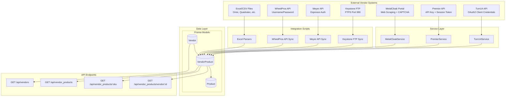
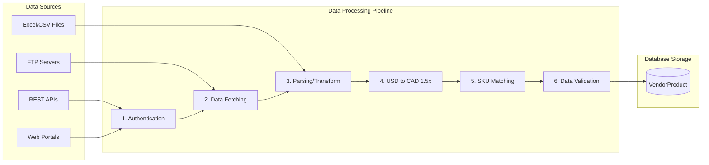
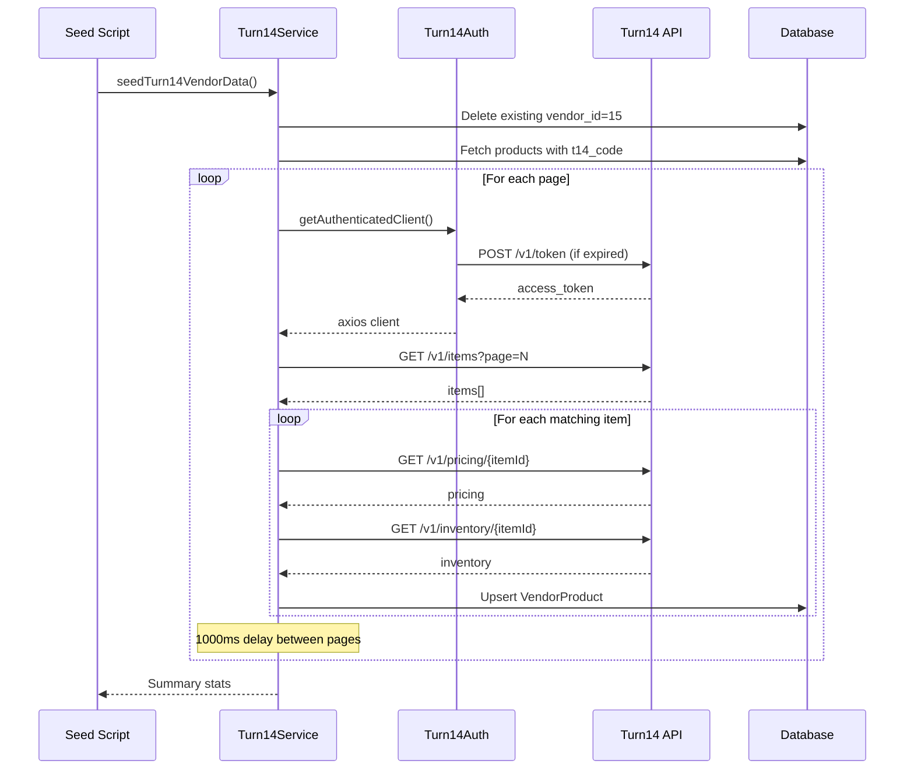
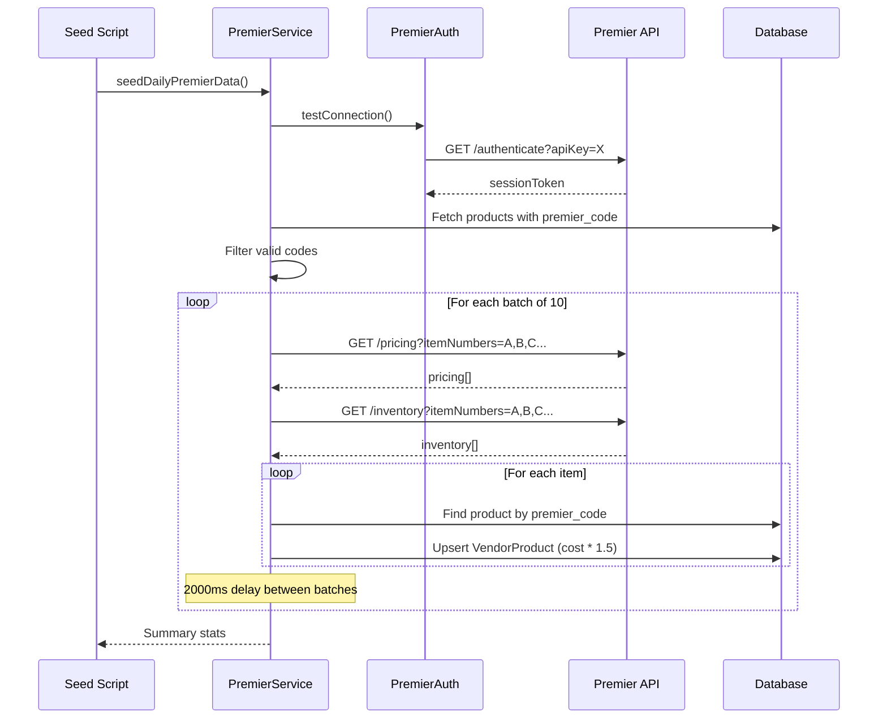

# DD-002: Vendor Integration Framework - Design Document

**Version**: 1.0.0
**Status**: Accepted (Documentation of Existing Architecture)
**Created**: 2026-01-23
**Last Updated**: 2026-01-23
**Author**: System (Reverse-Engineered from Implementation)

---

## Agreement Checklist

This document captures the existing architecture. No new implementation is proposed.

- [x] **Scope**: Document current vendor integration architecture across 17+ vendors
- [x] **Non-scope**: No architectural changes or new feature proposals
- [x] **Constraints**: Existing rate limits, authentication flows, and data formats preserved
- [x] **Dependencies**: DD-003 (Product Catalog Controller) for product data relationships

---

## Prerequisite ADRs

None currently documented. The following common ADR topics should be considered for future documentation:

- ADR-COMMON-001: Error Handling Strategy (implicit: fail-fast with logging)
- ADR-COMMON-002: Currency Conversion Approach (USD to CAD 1.5x multiplier)
- ADR-COMMON-003: Rate Limiting Patterns (vendor-specific rate limiting)
- ADR-COMMON-004: Authentication Token Management (OAuth2, API Key, Session Token patterns)

---

## Executive Summary

The Vendor Integration Framework is a multi-protocol integration system that synchronizes product cost, inventory, and SKU mapping data from 17 automotive parts vendors. The framework supports REST APIs, FTP downloads, Excel/CSV file parsing, and web scraping, providing a unified data synchronization layer for the JustJeeps e-commerce platform.

---

## Existing Codebase Analysis

### Implementation Path Mapping

| Component | File Path | Status |
|-----------|-----------|--------|
| Turn14 Service | `/services/turn14/` (index.js, auth.js, config.js, items.js, pricing.js, inventory.js) | Existing |
| Premier Service | `/services/premier/` (index.js, auth.js, config.js, pricing.js, inventory.js) | Existing |
| MetalCloak Service | `/services/metalcloak/index.js` | Existing |
| Keystone FTP Integration | `/prisma/seeds/api-calls/keystone-ftp.js` | Existing |
| Meyer API Integration | `/prisma/seeds/api-calls/meyer-api.js` | Existing |
| WheelPros API Integration | `/prisma/seeds/api-calls/wheelPros-api.js` | Existing |
| Vendor Data Definitions | `/prisma/seeds/hard-code_data/vendors_data.js` | Existing |
| Individual Seed Scripts | `/prisma/seeds/seed-individual/seed-*.js` (40+ files) | Existing |
| API Endpoints | `/server.js` (monolithic routes) | Existing |
| Database Schema | `/prisma/schema.prisma` | Existing |

### Similar Functionality Search Results

No duplicate vendor integration patterns were found. Each vendor has a dedicated integration implementation due to:
- Unique API authentication requirements
- Different data formats (JSON, XML, CSV, Excel)
- Vendor-specific rate limiting rules
- Custom SKU mapping transformations

---

## Architecture Overview

### Architecture Diagram



### Data Flow Diagram



---

## Component Design

### 1. Turn14 Service Architecture

The Turn14 service implements OAuth2 client credentials authentication with comprehensive rate limiting.

**Class Structure:**

```
Turn14Service
├── Turn14Auth (authentication module)
│   ├── getAccessToken() - Token retrieval with caching
│   ├── isTokenValid() - 60-second expiry buffer
│   ├── refreshToken() - OAuth2 client credentials flow
│   └── getAuthenticatedClient() - Configured axios instance
├── Turn14Items (product catalog)
│   ├── getAllItems(page) - Paginated item retrieval
│   ├── getItem(itemId) - Single item lookup
│   ├── getBrandItems(brandId, page) - Brand-filtered items
│   ├── getAllBrands() - Brand catalog
│   ├── searchByPartNumber(partNumber, brandId) - Part number search
│   └── findBrandIdByName(brandName) - Brand ID resolution
├── Turn14Pricing (pricing data)
│   ├── getAllPricing(page) - Paginated pricing
│   ├── getItemPricing(itemId) - Single item pricing
│   ├── getBrandPricing(brandId, page) - Brand pricing
│   ├── getSimplifiedItemPricing(itemId) - Extracted cost data
│   └── extractPricingInfo(pricingData) - Price extraction utility
└── Turn14Inventory (stock data)
    ├── getAllInventory(page) - Paginated inventory
    ├── getItemInventory(itemIds) - Batch inventory (max 250)
    ├── getBrandInventory(brandId, page) - Brand inventory
    ├── getUpdatedInventory(minutes, page) - Recent updates
    ├── getLocations() - Warehouse locations
    ├── checkItemStock(itemId) - Stock status
    └── extractInventoryInfo(inventoryData) - Inventory extraction
```

**Configuration Parameters:**

| Parameter | Environment Variable | Default | Description |
|-----------|---------------------|---------|-------------|
| Client ID | `TURN14_CLIENT_ID` | Required | OAuth2 client ID |
| Client Secret | `TURN14_CLIENT_SECRET` | Required | OAuth2 client secret |
| Environment | `TURN14_ENVIRONMENT` | testing | production or testing |
| Request Timeout | `TURN14_REQUEST_TIMEOUT` | 30000ms | API timeout |
| Rate Limit | `TURN14_RATE_LIMIT` | 10 req/sec | Request throttling |
| Batch Size | `TURN14_BATCH_SIZE` | 5 | Parallel request count |
| Batch Delay | `TURN14_BATCH_DELAY` | 1000ms | Delay between batches |

**Rate Limits:**

- 5 requests per second
- 5,000 requests per hour
- 30,000 requests per day

### 2. Premier Service Architecture

The Premier service uses API key authentication followed by session token management.

**Class Structure:**

```
PremierService
├── PremierAuth (authentication module)
│   ├── getAccessToken() - Session token with 23-hour cache
│   ├── getAuthenticatedClient() - Configured axios instance
│   └── clearToken() - Force re-authentication
├── PremierPricing (pricing data)
│   ├── getItemPricing(itemNumber) - Single item pricing
│   ├── getBatchPricing(itemNumbers) - Batch pricing (max 50)
│   ├── getBatchPricingLarge(itemNumbers) - Large batch processor
│   ├── extractCostPrice(pricingData) - USD cost extraction
│   ├── extractJobberPrice(pricingData) - Jobber price extraction
│   └── extractMAPPrice(pricingData) - MAP extraction
└── PremierInventory (inventory data)
    ├── getItemInventory(itemNumber) - Single item inventory
    ├── getBatchInventory(itemNumbers) - Batch inventory (max 50)
    ├── getBatchInventoryLarge(itemNumbers) - Large batch processor
    ├── calculateTotalInventory(data) - Sum across warehouses
    ├── calculateUSInventory(data) - US warehouse filtering
    ├── getBestWarehouse(data) - Optimal warehouse selection
    └── checkItemStock(itemNumber) - Stock availability
```

**Configuration Parameters:**

| Parameter | Environment Variable | Default | Description |
|-----------|---------------------|---------|-------------|
| API Key | `PREMIER_API_KEY` | Required | API authentication key |
| Base URL | `PREMIER_BASE_URL` | api.premierwd.com/api/v5 | API endpoint |
| Environment | `PREMIER_ENVIRONMENT` | production | production or test |
| Request Timeout | `PREMIER_REQUEST_TIMEOUT` | 30000ms | API timeout |
| Batch Size | `PREMIER_BATCH_SIZE` | 50 | Items per batch |
| Batch Delay | `PREMIER_BATCH_DELAY` | 1000ms | Delay between batches |

### 3. MetalCloak Service Architecture

The MetalCloak service processes scraped data from the jobber portal (requires manual CAPTCHA solving).

**Class Structure:**

```
MetalCloakService
├── processScrapedData(filePath) - Main entry point
├── processProduct(productData) - Individual product processing
├── findMatchingProduct(code, title) - SKU matching
├── updateProductPricing(productId, pricingData) - VendorProduct upsert
├── saveUnmatchedProduct(productData) - Unmatched product logging
└── getMetalCloakStats() - Statistics retrieval
```

**Key Implementation Details:**

- Vendor ID: 17
- Currency: USD (converted to CAD at 1.5x)
- Matching Strategy: `searchable_sku` + `brand_name = 'MetalCloak'`
- Batch Size: 50 products with 1-second delays

### 4. FTP Integration (Keystone)

The Keystone integration uses FTP over implicit TLS (port 990).

**Implementation Pattern:**

```javascript
// Connection Configuration
{
  host: "ftp.ekeystone.com",
  port: 990,
  secure: "implicit",
  secureOptions: { rejectUnauthorized: false },
  timeout: 180000  // 3 minutes
}

// Files Downloaded
- Inventory.csv
- SpecialOrder.csv

// CSV Field Mapping
{
  VendorName: row["VendorName"],
  vcPn: cleanField(row["VCPN"]),      // Vendor Code Part Number
  vendorCode: cleanField(row["VendorCode"]),
  partNumber: cleanField(row["PartNumber"]),
  manufacturerPartNo: cleanField(row["ManufacturerPartNo"]),
  cost: parseFloat(row["Cost"]),
  totalQty: parseInt(row["TotalQty"], 10)
}
```

**Features:**
- Resume capability on connection failure (up to 5 retries)
- Stream processing for large files
- Field cleaning for Excel-style quoted values (`="11317"`)

### 5. Excel/CSV Integration Pattern

Multiple vendors use file-based integration with consistent patterns.

**Supported Formats:**

| Vendor | Format | Parser | Key Fields |
|--------|--------|--------|------------|
| Quadratec | Excel | xlsx | SKU, Cost, Inventory |
| Omix | Excel | xlsx | PartNumber, DealerPrice, QtyAvailable |
| Rough Country | CSV | csv-parser | SKU, MAP, Cost, Inventory |
| AEV | Excel | xlsx | PartNumber, DealerCost |
| Dirty Dog 4x4 | Excel | xlsx | SKU, Price |
| Alpine | Excel | xlsx | Item, Cost |
| CTP | Excel | xlsx | PartNumber, Cost |
| KeyParts | Excel | xlsx | PartNumber, Cost |
| Curt | Excel | xlsx | UPC, Cost |

### 6. WheelPros API Integration

**Authentication Flow:**

```javascript
// 1. Authenticate
POST https://api.wheelpros.com/auth/v1/authorize
Body: { userName, password }
Response: { accessToken }

// 2. Search Pricing
POST https://api.wheelpros.com/pricings/v1/search
Headers: { Authorization: Bearer ${token} }
Body: {
  filters: { sku: [...], company: "4000", currency: "CAD", customer: "1081993" },
  limit: 10,
  priceType: ["msrp", "map", "nip"]
}
```

**SKU Transformation Rules:**

| Brand | Transformation | Example |
|-------|---------------|---------|
| Default | Remove JJ prefix | `KMC-XD123` -> `XD123` |
| TeraFlex | Pad to 18 chars | `TF-1234` -> `000000000000001234` |
| Smittybilt | Add SB prefix | `SM-12345` -> `SB12345` |
| PRO COMP Alloy | Add PXA prefix | `PC-123` -> `PXA123` |
| PRO COMP Suspension | Add EXP prefix | `PC-456` -> `EXP456` |
| Nitto Tire | Add N prefix, format | `NT-123456` -> `N123-456` |

---

## Data Contracts

### VendorProduct Model

```prisma
model VendorProduct {
  id                      Int            @id @default(autoincrement())
  product_sku             String         // Foreign key to Product.sku
  vendor_id               Int            // Foreign key to Vendor.id
  vendor_sku              String         // Vendor's part number
  vendor_cost             Float          // Cost in CAD (after 1.5x conversion)
  vendor_inventory        Float?         // Quantity available
  partStatus_meyer        String?        // Meyer-specific part status
  vendor_inventory_string String?        // Warehouse-level inventory detail
  quadratec_sku           String?        // Quadratec-specific SKU
  manufacturer_sku        String?        // Original manufacturer SKU
}
```

### Product Vendor Code Fields

```prisma
model Product {
  // ... other fields
  premier_code       String?    // Premier Performance item number
  t14_code           String?    // Turn14 part number
  t14_id             String?    // Turn14 item ID
  meyer_code         String?    // Meyer Distributing part number
  keystone_code      String?    // Keystone Automotive part number
  omix_code          String?    // Omix-ADA part number
  quadratec_code     String?    // Quadratec wholesale part number
  rough_country_code String?    // Rough Country SKU
  gentecdirect_code  String?    // Gentec Direct code
  tdot_code          String?    // Tire Discounter code
  ctp_code           String?    // CTP part number
  partsEngine_code   String?    // PartsEngine code
}
```

### Vendor Model

```prisma
model Vendor {
  id             Int             @id @default(autoincrement())
  name           String
  website        String
  address        String?
  phone_number   String?
  main_contact   String
  username       String
  password       String
}
```

---

## Integration Point Map

### Integration Points

```yaml
Integration Point 1:
  Existing Component: Product model (Product.sku)
  Integration Method: Foreign key reference from VendorProduct.product_sku
  Impact Level: High (Data relationship)
  Required Test Coverage: SKU matching validation

Integration Point 2:
  Existing Component: Vendor model (Vendor.id)
  Integration Method: Foreign key reference from VendorProduct.vendor_id
  Impact Level: High (Data relationship)
  Required Test Coverage: Vendor ID validation

Integration Point 3:
  Existing Component: OrderProduct model (OrderProduct.vendor_product_id)
  Integration Method: Optional foreign key for supplier selection
  Impact Level: Medium (Purchase order support)
  Required Test Coverage: Supplier cost retrieval

Integration Point 4:
  Existing Component: server.js API endpoints
  Integration Method: Prisma queries on VendorProduct
  Impact Level: Medium (Data consumption)
  Required Test Coverage: API response validation
```

### Integration Boundary Contracts

```yaml
Turn14 Service Boundary:
  Input: Part number (string), Brand name (optional string)
  Output: { success, results[], pricing, inventory } (async)
  On Error: Return { success: false, error: message }

Premier Service Boundary:
  Input: Item numbers (string array, max 50)
  Output: { success, results[], totalItems, successfulItems } (async)
  On Error: Continue processing, log errors, return partial results

Keystone FTP Boundary:
  Input: Remote file path
  Output: Parsed CSV records array (async)
  On Error: Retry up to 5 times, resume from last byte

VendorProduct Upsert Boundary:
  Input: { product_sku, vendor_id, vendor_sku, vendor_cost, vendor_inventory }
  Output: Created or updated VendorProduct record
  On Error: Log and continue (partial failure handling)
```

---

## Change Impact Map

This document describes existing architecture. No changes are proposed.

```yaml
Change Target: N/A (Documentation Only)
Direct Impact: None
Indirect Impact: None
No Ripple Effect:
  - Turn14Service (unchanged)
  - PremierService (unchanged)
  - MetalCloakService (unchanged)
  - FTP integrations (unchanged)
  - Excel parsers (unchanged)
  - API endpoints (unchanged)
```

---

## Vendor Integration Matrix

| Vendor | ID | Protocol | Auth Method | Rate Limits | Currency | Batch Size | Seed Script |
|--------|------|----------|-------------|-------------|----------|------------|-------------|
| Keystone | 1 | FTP/CSV | Username/Password | None | USD | Full file | seed-keystone-ftp |
| Meyer | 2 | REST API | Espresso Token | 100ms delay | USD | 100 | seed-meyer |
| Omix | 3 | Excel + API | N/A | None | USD | N/A | seed-omix |
| Quadratec | 4 | Excel + API | N/A | None | USD | N/A | seed-quadratec |
| WheelPros | 5 | REST API | Bearer Token | Moderate | CAD | 50 | seed-wheelPros |
| Dirty Dog 4x4 | 6 | Excel | N/A | None | USD | N/A | seed-dirtyDog |
| Tire Discounter | 7 | REST API | API Token | Low | CAD | N/A | seed-tireDiscounter |
| AEV | 8 | Excel | N/A | None | USD | N/A | seed-aev |
| Rough Country | 9 | CSV | N/A | None | USD | N/A | seed-roughCountry |
| Downsview | 10 | Excel | N/A | None | USD | N/A | - |
| KeyParts | 11 | Excel | N/A | None | USD | N/A | seed-keyparts |
| CTP | 12 | Excel | N/A | None | USD | N/A | seed-ctp |
| Alpine | 13 | Excel | N/A | None | USD | N/A | seed-alpine |
| Curt | 14 | Excel | N/A | None | USD | N/A | seed-curt |
| Turn14 (T14) | 15 | REST API | OAuth2 | 5/sec, 5000/hr | USD | 5 | seed-turn14-production |
| Premier | 16 | REST API | API Key + Token | 10/batch | USD | 50 | seed-daily-premier |
| MetalCloak | 17 | Web Scraping | Manual CAPTCHA | N/A | USD | 50 | seed-metalcloak |

---

## API Endpoints

### Vendor Endpoints

| Endpoint | Method | Description | Response |
|----------|--------|-------------|----------|
| `/api/vendors` | GET | List all vendors | `Vendor[]` |
| `/api/vendor_products` | GET | All vendor products (simplified) | `{ product_sku, vendor_cost }[]` |
| `/api/vendor_products/:sku` | GET | Vendor products by SKU | `VendorProduct[]` with vendor info |
| `/api/vendor_products/vendor/:id` | GET | Products for specific vendor | `VendorProduct[]` |

### Response Formats

**GET /api/products (includes vendor data):**

```json
{
  "sku": "RU-11513.04",
  "name": "Product Name",
  "price": 299.99,
  "vendorProducts": [
    {
      "product_sku": "RU-11513.04",
      "vendor_sku": "11513.04",
      "vendor_cost": 149.99,
      "vendor_inventory": 25,
      "vendor_inventory_string": "TX:10,CA:15",
      "vendor": {
        "name": "Meyer"
      }
    }
  ]
}
```

---

## Currency Conversion

All USD prices are converted to CAD using a fixed multiplier:

```javascript
const cadCost = usdCost * 1.50;
```

**Implementation Locations:**
- `/services/metalcloak/index.js` (line 152)
- `/prisma/seeds/seed-individual/seed-*.js` (various locations)

**Currency by Vendor:**
- **Native CAD**: WheelPros, Keystone
- **USD -> CAD (1.5x)**: Turn14, Premier, Meyer, Omix, Quadratec, Rough Country, MetalCloak, and all other vendors

---

## Error Handling Strategy

### Fail-Fast with Continuation

The framework implements partial failure handling:

1. **Individual Record Errors**: Logged and skipped, processing continues
2. **Batch Errors**: Logged with batch context, move to next batch
3. **Authentication Errors**: Fatal, abort vendor sync
4. **Network Errors**: Retry with exponential backoff (where implemented)

**Example Pattern:**

```javascript
for (const product of batch) {
  try {
    await processProduct(product);
    results.totalProcessed++;
  } catch (error) {
    results.errors.push({
      productCode: product.productCode,
      error: error.message
    });
    // Continue processing remaining products
  }
}
```

### Rate Limit Management

| Vendor | Strategy | Implementation |
|--------|----------|----------------|
| Turn14 | Hourly pause | Check `requestCount >= maxRequestsPerHour`, pause if needed |
| Premier | Batch delay | 2-second delay between batches |
| Meyer | Request delay | 100ms between individual requests |
| WheelPros | Chunk delay | Implicit delays in chunk processing |

---

## Sequence Diagrams

### Turn14 Sync Flow



### Premier Sync Flow



---

## Test Strategy

### Unit Test Coverage

| Component | Test Focus | Status |
|-----------|------------|--------|
| Turn14Auth | Token caching, expiry buffer | Not implemented |
| Turn14Items | Part number search, brand lookup | Not implemented |
| Turn14Pricing | Price extraction, pricelist parsing | Not implemented |
| Turn14Inventory | Stock calculation, warehouse aggregation | Not implemented |
| PremierAuth | Session token management | Not implemented |
| PremierPricing | Batch processing, USD extraction | Not implemented |
| PremierInventory | Warehouse filtering, stock status | Not implemented |
| MetalCloakService | SKU matching, price conversion | Not implemented |

### Integration Test Scenarios

1. **Turn14 Authentication**: Verify OAuth2 flow with test credentials
2. **Premier Batch Processing**: Test 50-item batch handling
3. **Keystone FTP Download**: Verify resume capability
4. **Currency Conversion**: Validate 1.5x multiplication accuracy
5. **SKU Matching**: Test product lookup by vendor codes

### E2E Verification Procedures

1. Run vendor seed script
2. Verify VendorProduct record count
3. Spot-check vendor_cost values (USD * 1.5)
4. Verify vendor_inventory population
5. Check API endpoint responses

---

## Non-Functional Requirements

### Performance

| Metric | Target | Current |
|--------|--------|---------|
| Turn14 full sync | < 4 hours | 2-4 hours (rate limit dependent) |
| Premier daily sync | < 30 minutes | 15-30 minutes |
| Keystone FTP download | < 5 minutes | 2-5 minutes |
| API response time | < 500ms | < 200ms (database query) |
| Product catalog size | 20,000+ SKUs | ~20,000 SKUs |

### Reliability

- **Error Recovery**: Individual errors do not abort sync
- **Resume Support**: FTP downloads resume from last byte
- **Token Caching**: OAuth tokens cached until near-expiry
- **Retry Logic**: Network failures retry up to 5 times (FTP)

### Security

- **Credentials**: Stored in environment variables
- **Token Storage**: In-memory only (not persisted)
- **API Keys**: Not logged in plaintext
- **FTP**: Implicit TLS on port 990

---

## Complexity Assessment

```yaml
complexity_level: high

complexity_rationale:
  requirements_and_acs:
    - Multi-protocol support (REST, FTP, file, web scraping)
    - 17 distinct vendor integrations with unique requirements
    - Multiple authentication flows (OAuth2, API Key, session, username/password)
    - Currency conversion and SKU transformation rules
    - Rate limiting management across vendors

  constraints_and_risks:
    - Turn14 strict rate limits (5/sec, 5000/hr, 30000/day)
    - MetalCloak CAPTCHA requires manual intervention
    - FTP connection instability (requires resume capability)
    - Vendor API changes can break integrations
    - Large data volume (20,000+ products, multiple vendors per product)
```

---

## References

### Internal Documentation

- [multi-vendor-integration-prd.md](/docs/prd/multi-vendor-integration-prd.md) - Product Requirements Document
- [data-synchronization-prd.md](/docs/prd/data-synchronization-prd.md) - Data Sync PRD
- [CLAUDE.md](/CLAUDE.md) - Repository documentation

### External API Documentation

- Turn14 API: https://api.turn14.com/documentation
- Premier Performance API: v5 (internal documentation)
- WheelPros API: Internal documentation
- Meyer API: Internal documentation

### Related Design Documents

- DD-003: Product Catalog Controller (dependency)

---

## Glossary

| Term | Definition |
|------|------------|
| **VendorProduct** | Junction record linking a Product to a Vendor with cost/inventory |
| **vendor_sku** | The vendor's internal part number for a product |
| **product_sku** | JustJeeps internal SKU (format: PREFIX-partNumber) |
| **jj_prefix** | Two/three letter brand prefix in JustJeeps SKUs |
| **FTP Sync** | File Transfer Protocol download of vendor data files |
| **Rate Limiting** | API throttling to avoid exceeding vendor request quotas |
| **Upsert** | Create if not exists, otherwise update existing record |
| **Seeding** | Batch process of populating database with external data |
| **OAuth2** | Authentication protocol used by Turn14 API |
| **Session Token** | Time-limited authentication token (Premier) |
| **Jobber Portal** | Wholesale customer portal (MetalCloak) |
| **MAP** | Minimum Advertised Price set by manufacturers |

---

## Change Log

| Version | Date | Author | Changes |
|---------|------|--------|---------|
| 1.0.0 | 2026-01-23 | System | Initial design document (reverse-engineered from implementation) |
