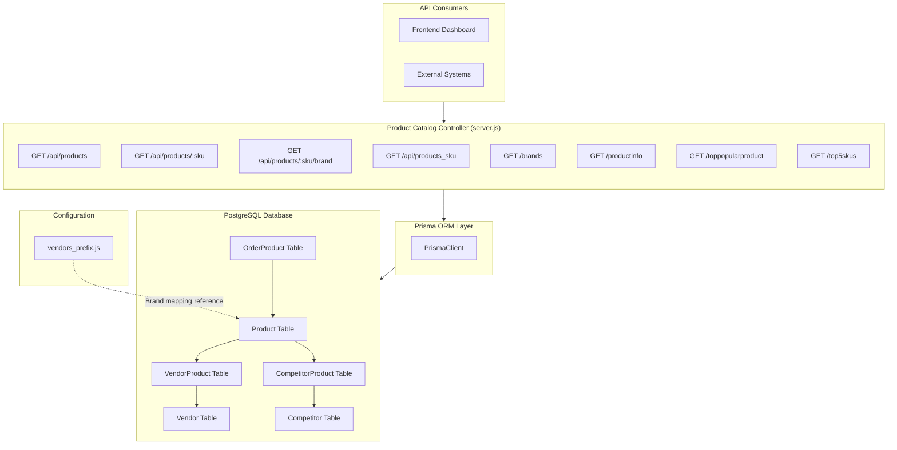
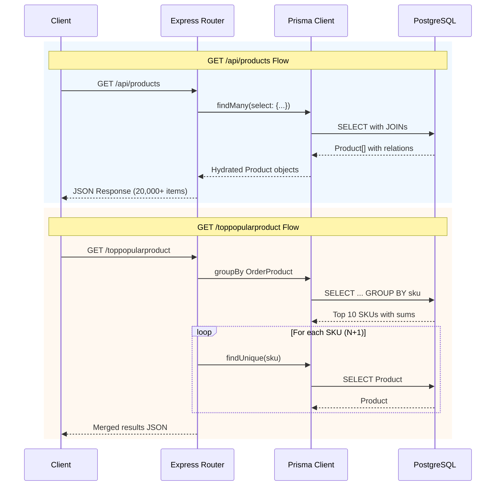

# DD-003: Product Catalog Management Controller

## Document Information

| Attribute | Value |
|-----------|-------|
| Version | 1.0.0 |
| Status | Documented (Existing Implementation) |
| Created | 2026-01-23 |
| Last Updated | 2026-01-23 |
| Author | Architecture Documentation |
| Parent PRD | [product-catalog-management-prd.md](../prd/product-catalog-management-prd.md) |
| Dependencies | DD-002 (Vendor Product Integration), DD-005 (Competitor Price Tracking) |
| Complexity Level | Medium |

---

## Agreement Checklist

| Agreement | Status | Reflected In |
|-----------|--------|--------------|
| Document current architecture only | Confirmed | Entire document |
| Do not propose changes | Confirmed | All sections descriptive only |
| RESTful API endpoints for product queries | Confirmed | Section 5: Public API Interfaces |
| Multi-vendor code mappings documented | Confirmed | Section 6: Data Contracts |
| Brand management documented | Confirmed | Section 6.3: Brand Configuration |
| Competitive pricing integration | Confirmed | Section 5.1, 5.2: API responses |

---

## 1. Overview

### 1.1 Purpose

This Design Document describes the current architecture of the Product Catalog Management Controller component within the JustJeeps API backend. This component serves as the core product data management layer, providing RESTful API endpoints for product queries and statistics.

### 1.2 Scope

**In Scope:**
- Product REST API endpoints (8 endpoints)
- Database query patterns via Prisma ORM
- Data relationships with VendorProduct and CompetitorProduct entities
- Brand and vendor code configuration
- Product statistics aggregation

**Out of Scope:**
- Product creation/mutation (managed via Magento sync)
- Data synchronization processes (covered in separate documentation)
- Authentication/authorization layer (feature-flag controlled)
- Frontend integration details

### 1.3 Complexity Rationale

**Complexity Level: Medium**

Rationale:
1. **Requirements/ACs**: 8 API endpoints with varied query patterns (simple lookups, aggregations, joins)
2. **Constraints/Risks**:
   - Large dataset handling (20,000+ SKUs returned in single response)
   - N+1 query patterns in analytics endpoints
   - Multi-vendor code mapping complexity (200+ brand configurations)

---

## 2. Existing Codebase Analysis

### 2.1 Implementation Path Mapping

| Component | File Path | Lines | Type |
|-----------|-----------|-------|------|
| Product API Endpoints | `/Users/ricardotassio/DEV/TRABALHO/JUSTJEEPS/JustJeepsAPI-back-end/server.js` | 103-327, 1013-1073 | Existing |
| Product Data Model | `/Users/ricardotassio/DEV/TRABALHO/JUSTJEEPS/JustJeepsAPI-back-end/schema.prisma` | 70-114 | Existing |
| VendorProduct Model | `/Users/ricardotassio/DEV/TRABALHO/JUSTJEEPS/JustJeepsAPI-back-end/schema.prisma` | 116-130 | Existing |
| CompetitorProduct Model | `/Users/ricardotassio/DEV/TRABALHO/JUSTJEEPS/JustJeepsAPI-back-end/schema.prisma` | 185-194 | Existing |
| Brand/Vendor Prefix Config | `/Users/ricardotassio/DEV/TRABALHO/JUSTJEEPS/JustJeepsAPI-back-end/prisma/seeds/hard-code_data/vendors_prefix.js` | Full file | Existing |

### 2.2 Similar Functionality Search Results

**Search Keywords Used**: product, catalog, sku, brand, vendor

**Findings**:
- Product endpoints are centralized in `server.js` (monolithic pattern)
- No separate controller/service layer exists
- All product-related endpoints follow same pattern: direct Prisma queries within route handlers
- No duplicate implementations found

### 2.3 Integration Points with Existing Code

| Integration Point | Location | Coupling Level |
|-------------------|----------|----------------|
| Prisma Client | `server.js:8-14` | Direct dependency |
| OrderProduct (for statistics) | `server.js:1020-1024, 1039-1050` | Read-only |
| VendorProduct relation | `server.js:203-218, 279-292` | Nested select |
| CompetitorProduct relation | `server.js:219-229, 294-304` | Nested select |

---

## 3. Architecture Diagram



---

## 4. Data Flow Diagram



---

## 5. Public API Interfaces

### 5.1 GET /api/products - Full Catalog with Vendor/Competitor Data

**Location**: `server.js:170-240`

**Request**: No parameters

**Response Schema**:
```typescript
interface ProductListResponse {
  sku: string;
  name: string;
  url_path: string | null;
  status: number | null;
  price: number;
  MAP: number | null;
  searchable_sku: string | null;
  jj_prefix: string | null;
  image: string | null;
  brand_name: string | null;
  vendors: string | null;
  partStatus_meyer: string | null;
  keystone_code: string | null;
  meyer_weight: number | null;
  meyer_length: number | null;
  meyer_width: number | null;
  meyer_height: number | null;
  weight: number | null;
  length: number | null;
  width: number | null;
  height: number | null;
  black_friday_sale: string | null;
  shippingFreight: string | null;
  partsEngine_code: string | null;
  tdot_url: string | null;
  keystone_code_site: string | null;
  part: string | null;
  thumbnail: string | null;
  vendorProducts: VendorProductNested[];
  competitorProducts: CompetitorProductNested[];
}[]

interface VendorProductNested {
  product_sku: string;
  vendor_sku: string;
  vendor_cost: number;
  vendor_inventory: number | null;
  vendor_inventory_string: string | null;
  partStatus_meyer: string | null;
  quadratec_sku: string | null;
  vendor: { name: string };
}

interface CompetitorProductNested {
  competitor_price: number;
  product_url: string | null;
  competitor: { name: string };
}
```

**Error Response**: `500 { error: 'Failed to fetch products' }`

---

### 5.2 GET /api/products/:sku - Single Product Lookup

**Location**: `server.js:243-311`

**Request Parameters**:
| Parameter | Type | Required | Description |
|-----------|------|----------|-------------|
| sku | string | Yes | Product SKU (URL path) |

**Response**: Single `ProductListResponse` object (same schema as list endpoint)

**Error Response**: `500 { error: 'Failed to fetch product' }`

---

### 5.3 GET /api/products/:sku/brand - Brand Name by SKU

**Location**: `server.js:154-166`

**Request Parameters**:
| Parameter | Type | Required | Description |
|-----------|------|----------|-------------|
| sku | string | Yes | Product SKU (URL path) |

**Response Schema**:
```typescript
interface BrandResponse {
  brand: string | null;
}
```

**Error Response**: `500 { error: 'Failed to fetch brand' }`

---

### 5.4 GET /api/products_sku - SKU List Only

**Location**: `server.js:140-152`

**Request**: No parameters

**Response Schema**:
```typescript
interface SkuListResponse {
  sku: string;
}[]
```

**Constraints**: Maximum 20,001 records returned (`take: 20001`)

**Error Response**: `500 { error: 'Failed to fetch products' }`

---

### 5.5 GET /brands - Unique Brand Names

**Location**: `server.js:313-327`

**Request**: No parameters

**Response Schema**:
```typescript
interface BrandListResponse {
  brand_name: string | null;
}[]
```

**Query Pattern**: Uses `distinct: ['brand_name']`

**Error Response**: `500 'Internal server error'`

---

### 5.6 GET /productinfo - Count and Totals

**Location**: `server.js:1013-1033`

**Request**: No parameters

**Response Schema**:
```typescript
interface ProductInfoResponse {
  numProduct: number;
  totalSold: number | null;
}
```

**Query Pattern**:
- `prisma.product.aggregate({ _count: { _all: true } })`
- `prisma.orderProduct.aggregate({ _sum: { qty_ordered: true } })`

**Error Response**: `500 { error: 'Internal Server Error' }`

---

### 5.7 GET /toppopularproduct - Top 10 by Sales

**Location**: `server.js:1036-1073`

**Request**: No parameters

**Response Schema**:
```typescript
interface TopProductResponse {
  qty_ordered: number;
  sku: string;
  name: string;
  price: number;
  // ... all Product fields
}[]
```

**Query Pattern**:
1. `groupBy` on OrderProduct by SKU, sum qty_ordered, order desc, take 10
2. For each result, `findUnique` on Product (N+1 pattern)
3. Merge sum with product data

**Error Response**: `500 { error: 'Internal Server Error' }`

---

### 5.8 GET /top5skus - Top SKUs by Quantity

**Location**: `server.js:103-137`

**Request**: No parameters

**Response Schema**:
```typescript
interface Top5SkusResponse {
  sku: string;
  _sum: { qty_ordered: number };
  product: Product | null;
}[]
```

**Note**: Despite name, returns top 10 (not 5) due to `take: 10`

**Query Pattern**:
1. `groupBy` on OrderProduct by SKU, sum qty_ordered, order desc, take 10
2. `Promise.all` with `findUnique` for each SKU (parallel N+1)

**Error Response**: `500 { message: '<error>' }`

---

## 6. Data Contracts

### 6.1 Product Model (schema.prisma lines 70-114)

```prisma
model Product {
  sku                String              @id @unique
  status             Int?
  name               String
  price              Float
  searchableSku      String
  searchable_sku     String?
  jj_prefix          String?
  premier_code       String?
  t14_code           String?
  t14_id             String?
  meyer_code         String?
  keystone_code      String?
  omix_code          String?
  vendors            String?
  brand_name         String?
  image              String?
  weight             Float?
  url_path           String?
  quadratec_code     String?
  rough_country_code String?
  gentecdirect_code  String?
  MAP                Float?
  partStatus_meyer   String?
  black_friday_sale  String?
  height             Float?
  length             Float?
  width              Float?
  meyer_height       Float?
  meyer_length       Float?
  meyer_weight       Float?
  meyer_width        Float?
  tdot_code          String?
  shippingFreight    String?
  part               String?
  thumbnail          String?
  ctp_code           String?
  partsEngine_code   String?
  keystone_code_site String?
  tdot_url           String?
  keystone_ftp_brand String?

  // Relations
  competitorProducts CompetitorProduct[]
  orderProducts      OrderProduct[]
  vendorProducts     VendorProduct[]
}
```

### 6.2 VendorProduct Model (schema.prisma lines 116-130)

```prisma
model VendorProduct {
  id                      Int            @id @default(autoincrement())
  product_sku             String
  vendor_id               Int
  vendor_sku              String
  vendor_cost             Float
  vendor_inventory        Float?
  partStatus_meyer        String?
  vendor_inventory_string String?
  quadratec_sku           String?
  manufacturer_sku        String?

  // Relations
  orderProducts           OrderProduct[]
  product                 Product        @relation(fields: [product_sku], references: [sku], onDelete: Cascade)
  vendor                  Vendor         @relation(fields: [vendor_id], references: [id])
}
```

### 6.3 Brand Configuration (vendors_prefix.js)

The brand configuration maps JustJeeps internal prefixes to vendor-specific codes:

```javascript
// Structure of each brand entry
{
  jj_prefix: "BST",              // JustJeeps internal prefix
  brand_name: "Bestop",          // Display brand name
  vendors: "Meyer, Keystone",    // Available vendors (comma-separated)
  keystone_code: "B33",          // Keystone vendor code
  meyer_code: "BES",             // Meyer vendor code
  quadratec_code: "Bestop",      // Quadratec brand name
  t14_code: "bes",               // Turn14 code
  premier_code: "BES",           // Premier code
  partsEngine_code: "-vp-...",   // PartsEngine URL suffix
  keystone_code_site: "BST",     // Keystone site code
  keystone_ftp_brand: "BESTOP",  // Keystone FTP brand name
}
```

**Total Brands Configured**: 200+ entries

**Key Vendors Supported**:
| Vendor | Config Field |
|--------|--------------|
| Meyer | `meyer_code` |
| Keystone | `keystone_code`, `keystone_code_site`, `keystone_ftp_brand` |
| Quadratec | `quadratec_code` |
| Turn14 | `t14_code` |
| Premier | `premier_code` |
| Omix-ADA | `omix_code` (on Product) |
| TDot | `tdot_code`, `tdot_url` |
| PartsEngine | `partsEngine_code` |
| CTP | `ctp_code` (on Product) |
| Gentecdirect | `gentecdirect_code` (on Product) |

---

## 7. Integration Point Map

```yaml
Integration Point 1:
  Existing Component: server.js Express application
  Integration Method: Route definition within monolithic server
  Impact Level: Low (Read-Only)
  Required Test Coverage: API response validation

Integration Point 2:
  Existing Component: Prisma Client (PrismaClient)
  Integration Method: Direct instance usage
  Impact Level: Medium (Database queries)
  Required Test Coverage: Query correctness, relation loading

Integration Point 3:
  Existing Component: OrderProduct table
  Integration Method: Aggregate queries for statistics
  Impact Level: Low (Read-Only)
  Required Test Coverage: Sum/count accuracy

Integration Point 4:
  Existing Component: VendorProduct/CompetitorProduct relations
  Integration Method: Nested select in Prisma queries
  Impact Level: Low (Read-Only)
  Required Test Coverage: Relation data inclusion
```

---

## 8. Integration Boundary Contracts

### 8.1 Database Layer Boundary

```yaml
Boundary Name: Prisma-PostgreSQL
  Input: Prisma query objects (findMany, findUnique, aggregate, groupBy)
  Output: Synchronous Promise resolving to typed objects
  On Error: Throw PrismaClientKnownRequestError or PrismaClientUnknownRequestError
```

### 8.2 HTTP Layer Boundary

```yaml
Boundary Name: Express-Client
  Input: HTTP GET requests with optional path parameters
  Output: Synchronous JSON response (200 OK or 500 Error)
  On Error: Return 500 status with error object { error: string } or { message: string }
```

---

## 9. Change Impact Map

```yaml
Change Target: Product Catalog Controller
Direct Impact:
  - /Users/ricardotassio/DEV/TRABALHO/JUSTJEEPS/JustJeepsAPI-back-end/server.js (lines 103-327, 1013-1073)

Indirect Impact:
  - Frontend Dashboard (API consumer)
  - Data Synchronization processes (depend on Product schema)
  - Order Management (references Product via OrderProduct)
  - Purchase Order Management (uses Product/VendorProduct data)

No Ripple Effect:
  - Authentication middleware (endpoints not protected)
  - Health check endpoint
  - Non-product API endpoints (orders, vendors, users)
```

---

## 10. Current Behavior Characteristics

### 10.1 Query Patterns

| Endpoint | Query Type | Joins/Relations | Performance Concern |
|----------|------------|-----------------|---------------------|
| `/api/products` | findMany | VendorProduct, CompetitorProduct, Vendor, Competitor | Returns all 20,000+ products |
| `/api/products/:sku` | findUnique | Same as above | Single record, efficient |
| `/api/products/:sku/brand` | findUnique | None | Very efficient |
| `/api/products_sku` | findMany | None | Limited to 20,001 |
| `/brands` | findMany distinct | None | Distinct operation |
| `/productinfo` | aggregate (x2) | None | Count operations, efficient |
| `/toppopularproduct` | groupBy + loop findUnique | None | N+1 pattern (10 queries) |
| `/top5skus` | groupBy + Promise.all findUnique | None | Parallel N+1 (11 queries) |

### 10.2 Error Handling Pattern

All endpoints follow consistent error handling:
```javascript
try {
  // Prisma query
  res.json(result);
} catch (error) {
  console.error(error); // or console.log(error)
  res.status(500).json({ error: 'Failed to ...' });
}
```

### 10.3 Response Characteristics

| Endpoint | Typical Response Size | Caching | Pagination |
|----------|----------------------|---------|------------|
| `/api/products` | ~50-100MB (20,000+ products) | None | None |
| `/api/products/:sku` | ~5-10KB | None | N/A |
| `/api/products/:sku/brand` | ~50 bytes | None | N/A |
| `/api/products_sku` | ~500KB | None | Hardcoded limit |
| `/brands` | ~10KB | None | None |
| `/productinfo` | ~50 bytes | None | N/A |
| `/toppopularproduct` | ~20KB | None | Hardcoded limit (10) |
| `/top5skus` | ~20KB | None | Hardcoded limit (10) |

---

## 11. Acceptance Criteria (Current Implementation)

### 11.1 Functional Acceptance Criteria

| ID | Criterion | Verification Method |
|----|-----------|---------------------|
| AC-001 | GET /api/products returns all products with vendor and competitor data | API call returns array with vendorProducts and competitorProducts nested |
| AC-002 | GET /api/products/:sku returns single product matching the SKU | API call with valid SKU returns single object |
| AC-003 | GET /api/products/:sku/brand returns brand name or null | API call returns `{ brand: string | null }` |
| AC-004 | GET /api/products_sku returns array of SKU-only objects | API call returns `[{ sku: string }, ...]` |
| AC-005 | GET /brands returns distinct brand names | API call returns unique brand_name values |
| AC-006 | GET /productinfo returns product count and total sold | API call returns `{ numProduct, totalSold }` |
| AC-007 | GET /toppopularproduct returns top 10 products by sales | API call returns 10 products with qty_ordered |
| AC-008 | GET /top5skus returns top 10 SKUs with product details | API call returns grouped results with product |

### 11.2 Error Handling Acceptance Criteria

| ID | Criterion | Verification Method |
|----|-----------|---------------------|
| AC-E01 | All endpoints return 500 on database error | Simulate database failure |
| AC-E02 | Error responses include descriptive message | Check error response body |

---

## 12. Known Limitations

1. **No Pagination**: `/api/products` returns entire catalog in single response
2. **N+1 Queries**: Statistics endpoints execute multiple sequential queries
3. **No Caching**: All queries hit database directly
4. **No Search/Filter**: No query parameters for filtering products
5. **Inconsistent Naming**: `/top5skus` returns 10 items, not 5
6. **No Authentication**: Endpoints publicly accessible (unless ENABLE_AUTH=true)
7. **Monolithic Architecture**: All routes in single server.js file

---

## 13. References

### Internal Documentation
- [Product Catalog Management PRD](../prd/product-catalog-management-prd.md)
- [Multi-Vendor Integration PRD](../prd/multi-vendor-integration-prd.md)
- [Competitor Price Tracking PRD](../prd/competitor-price-tracking-prd.md)

### Source Files
- `/Users/ricardotassio/DEV/TRABALHO/JUSTJEEPS/JustJeepsAPI-back-end/server.js` (lines 103-327, 1013-1073)
- `/Users/ricardotassio/DEV/TRABALHO/JUSTJEEPS/JustJeepsAPI-back-end/schema.prisma` (lines 70-130, 185-194)
- `/Users/ricardotassio/DEV/TRABALHO/JUSTJEEPS/JustJeepsAPI-back-end/prisma/seeds/hard-code_data/vendors_prefix.js`

---

## Change History

| Version | Date | Author | Changes |
|---------|------|--------|---------|
| 1.0.0 | 2026-01-23 | Architecture Documentation | Initial documentation of existing implementation |
