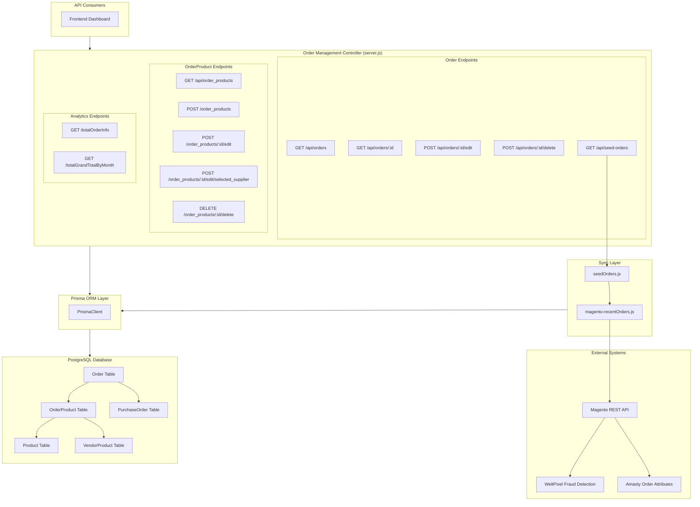
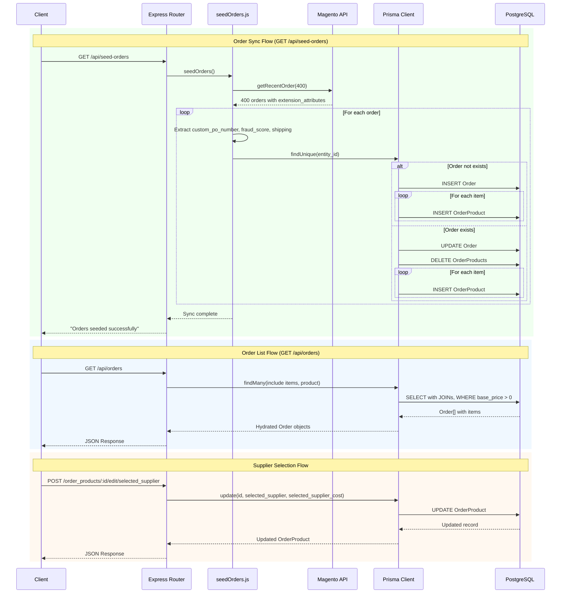
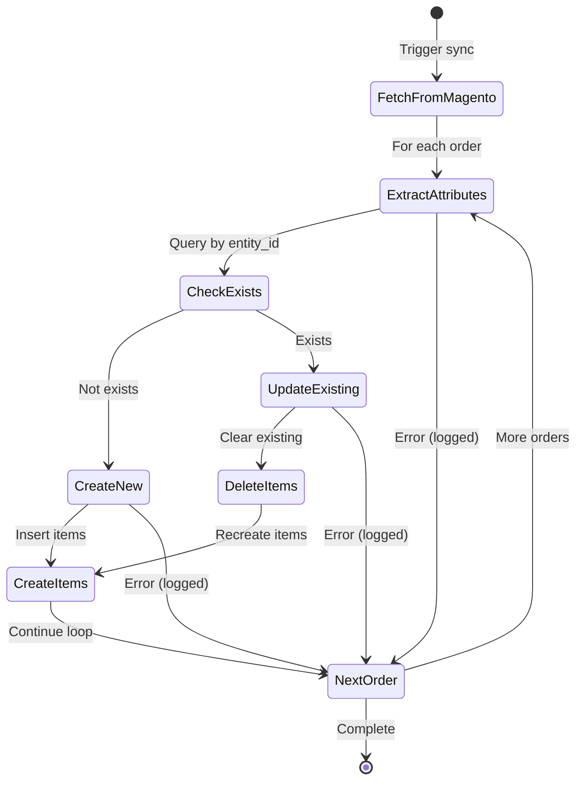
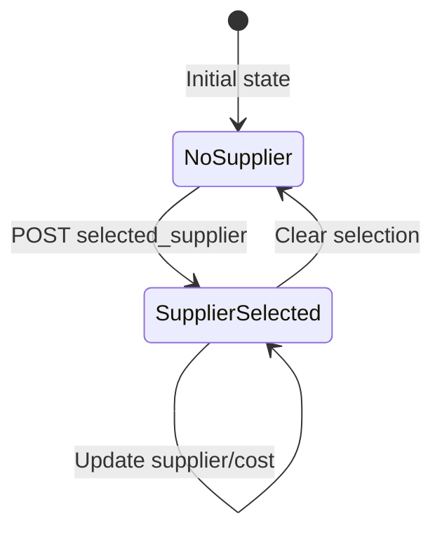

# DD-004: Order Management Controller

## Document Information

| Attribute | Value |
|-----------|-------|
| Version | 1.0.0 |
| Status | Documented (Existing Implementation) |
| Created | 2026-01-23 |
| Last Updated | 2026-01-23 |
| Author | Architecture Documentation |
| Parent PRD | [order-management-prd.md](../prd/order-management-prd.md) |
| Dependencies | DD-001 (Magento API Integration), DD-003 (Product Catalog Controller) |
| Complexity Level | Medium |

---

## Agreement Checklist

| Agreement | Status | Reflected In |
|-----------|--------|--------------|
| Document current architecture only | Confirmed | Entire document |
| Do not propose changes | Confirmed | All sections descriptive only |
| Order synchronization from Magento | Confirmed | Section 5.1: Seed Orders endpoint |
| Customer/shipping info management | Confirmed | Section 5.4: Order edit endpoint |
| Fraud score tracking | Confirmed | Section 6.1: Order Model |
| Supplier selection workflow | Confirmed | Section 5.7-5.8: OrderProduct endpoints |
| Order lifecycle management | Confirmed | Sections 5.1-5.10: All order endpoints |

---

## 1. Overview

### 1.1 Purpose

This Design Document describes the current architecture of the Order Management Controller component within the JustJeeps API backend. This component serves as the bridge between the Magento storefront and internal operations, handling order synchronization, customer/shipping information management, fraud score tracking, and supplier selection workflow.

### 1.2 Scope

**In Scope:**
- Order REST API endpoints (12 endpoints)
- Order synchronization from Magento API
- OrderProduct CRUD operations
- Supplier selection and cost tracking
- Order analytics/statistics endpoints
- Customer and shipping information management

**Out of Scope:**
- Order creation (managed via Magento storefront)
- Payment processing (handled by Magento/payment gateway)
- Shipping label generation (separate workflow)
- Push synchronization back to Magento (one-way sync only)
- Email notifications (handled by Magento)

### 1.3 Complexity Rationale

**Complexity Level: Medium**

Rationale:
1. **Requirements/ACs**: 12 API endpoints with varied operations (CRUD, sync, analytics)
2. **Constraints/Risks**:
   - External API dependency (Magento REST API)
   - Data transformation from Magento extension attributes
   - Cascade delete implications for order products
   - Upsert pattern for order synchronization
   - In-memory aggregation for monthly statistics

---

## 2. Existing Codebase Analysis

### 2.1 Implementation Path Mapping

| Component | File Path | Lines | Type |
|-----------|-----------|-------|------|
| Order API Endpoints | `/Users/ricardotassio/DEV/TRABALHO/JUSTJEEPS/JustJeepsAPI-back-end/server.js` | 329-647, 959-1010 | Existing |
| Order Data Model | `/Users/ricardotassio/DEV/TRABALHO/JUSTJEEPS/JustJeepsAPI-back-end/schema.prisma` | 11-45 | Existing |
| OrderProduct Data Model | `/Users/ricardotassio/DEV/TRABALHO/JUSTJEEPS/JustJeepsAPI-back-end/schema.prisma` | 47-68 | Existing |
| Magento Order Sync Logic | `/Users/ricardotassio/DEV/TRABALHO/JUSTJEEPS/JustJeepsAPI-back-end/prisma/seeds/seed-individual/seed-orders.js` | Full file | Existing |
| Magento API Client | `/Users/ricardotassio/DEV/TRABALHO/JUSTJEEPS/JustJeepsAPI-back-end/prisma/seeds/api-calls/magento-recentOrders.js` | Full file | Existing |

### 2.2 Similar Functionality Search Results

**Search Keywords Used**: order, magento, sync, shipping, fraud, supplier

**Findings**:
- Order endpoints are centralized in `server.js` (monolithic pattern)
- Magento sync logic is separated into dedicated seed file
- No separate controller/service layer exists
- All order-related endpoints follow same pattern: direct Prisma queries within route handlers
- No duplicate implementations found

### 2.3 Integration Points with Existing Code

| Integration Point | Location | Coupling Level |
|-------------------|----------|----------------|
| Prisma Client | `server.js:8-14` | Direct dependency |
| seedOrders function | `server.js:15` imported, `server.js:396` called | Direct call |
| Product relation | `server.js:367-369, 478-480` | Nested include via SKU FK |
| Magento API | `seed-orders.js:23` via `magento-recentOrders.js` | External HTTP |
| date-fns | `server.js:2` for monthly aggregation | Library dependency |

---

## 3. Architecture Diagram



---

## 4. Data Flow Diagram



---

## 5. Public API Interfaces

### 5.1 GET /api/orders - List All Orders with Items

**Location**: `server.js:362-392`

**Request**: No parameters

**Response Schema**:
```typescript
interface OrderListResponse {
  entity_id: number;
  id: number;
  created_at: string;
  customer_email: string;
  coupon_code: string | null;
  customer_firstname: string | null;
  customer_lastname: string | null;
  grand_total: number;
  increment_id: string;
  order_currency_code: string;
  total_qty_ordered: number;
  status: string | null;
  base_total_due: number | null;
  shipping_amount: number | null;
  shipping_description: string | null;
  custom_po_number: string | null;
  weltpixel_fraud_score: number | null;
  city: string | null;
  region: string | null;
  method_title: string | null;
  shipping_city: string | null;
  shipping_country_id: string | null;
  shipping_firstname: string | null;
  shipping_lastname: string | null;
  shipping_postcode: string | null;
  shipping_region: string | null;
  shipping_street1: string | null;
  shipping_street2: string | null;
  shipping_street3: string | null;
  shipping_telephone: string | null;
  shipping_company: string | null;
  items: OrderProductNested[];
}[]

interface OrderProductNested {
  id: number;
  name: string;
  sku: string;
  order_id: number;
  base_price: number;
  base_price_incl_tax: number | null;
  discount_amount: number;
  discount_invoiced: number;
  discount_percent: number;
  original_price: number;
  price: number;
  price_incl_tax: number | null;
  product_id: number | null;
  qty_ordered: number;
  selected_supplier: string | null;
  selected_supplier_cost: string | null;
  vendor_product_id: number | null;
  product: Product;
}
```

**Query Behavior**:
- Includes items with `base_price > 0` (filters out zero-price items)
- Orders by `created_at` descending (newest first)
- Includes product relation for each item

**Error Response**: `500 { error: '<Error> Failed to fetch orders' }`

---

### 5.2 GET /api/orders/:id - Single Order Lookup

**Location**: `server.js:404-416`

**Request Parameters**:
| Parameter | Type | Required | Description |
|-----------|------|----------|-------------|
| id | number | Yes | Order entity_id (URL path) |

**Response**: Single `Order` object (without items relation)

**Error Response**: `500 { error: 'Failed to fetch order' }`

---

### 5.3 GET /api/seed-orders - Trigger Magento Sync

**Location**: `server.js:394-402`

**Request**: No parameters

**Response**: `200 'Orders seeded successfully'`

**Sync Behavior**:
1. Fetches up to 400 recent orders from Magento API
2. For each order:
   - Extracts `custom_po_number` from `amasty_order_attributes`
   - Extracts `weltpixel_fraud_score` from extension attributes
   - Extracts shipping address from `shipping_assignments`
   - Extracts `method_title` from `payment_additional_info`
3. If order does not exist: Creates order and all items
4. If order exists: Updates order, deletes all items, recreates items
5. Errors on individual orders do not halt the sync (continue pattern)

**Error Response**: `500 'Error seeding data'`

---

### 5.4 POST /api/orders/:id/edit - Update Order Information

**Location**: `server.js:418-455`

**Request Parameters**:
| Parameter | Type | Required | Description |
|-----------|------|----------|-------------|
| id | number | Yes | Order entity_id (URL path) |

**Request Body**:
```typescript
interface OrderEditRequest {
  customer_email: string;
  customer_firstname: string;
  customer_lastname: string;
  grand_total: string | number;  // Parsed as float
  base_total_due: string | number;  // Parsed as float
  total_qty_ordered: string | number;  // Parsed as float
  shipping_firstname: string;
  shipping_lastname: string;
  shipping_postcode: string;
  shipping_street1: string;
  shipping_street2: string;
  shipping_street3: string;
  shipping_telephone: string;
  shipping_city: string;
  shipping_region: string;
  shipping_country_id: string;
  shipping_company: string;
}
```

**Response**: Updated `Order` object

**Note**: Status and coupon_code updates are commented out in current implementation

**Error Response**: `500 { error: 'Failed to update order' }`

---

### 5.5 POST /api/orders/:id/delete - Delete Order

**Location**: `server.js:457-469`

**Request Parameters**:
| Parameter | Type | Required | Description |
|-----------|------|----------|-------------|
| id | number | Yes | Order entity_id (URL path) |

**Response**: Deleted `Order` object

**Cascade Behavior**: Associated OrderProducts are automatically deleted via database cascade (`onDelete: Cascade`)

**Error Response**: `500 { error: 'Failed to delete order' }`

---

### 5.6 GET /api/order_products - List All Order Products

**Location**: `server.js:474-486`

**Request**: No parameters

**Response Schema**:
```typescript
interface OrderProductListResponse {
  id: number;
  name: string;
  sku: string;
  order_id: number;
  base_price: number;
  base_price_incl_tax: number | null;
  discount_amount: number;
  discount_invoiced: number;
  discount_percent: number;
  original_price: number;
  price: number;
  price_incl_tax: number | null;
  product_id: number | null;
  qty_ordered: number;
  selected_supplier: string | null;
  selected_supplier_cost: string | null;
  vendor_product_id: number | null;
  order: Order;
  product: Product;
}[]
```

**Error Response**: `500 { error: 'Failed to fetch product orders' }`

---

### 5.7 POST /order_products - Create Order Product

**Location**: `server.js:488-528`

**Request Body**:
```typescript
interface CreateOrderProductRequest {
  order_id: number;
  name: string;
  sku: string;
  base_price: number;
  base_price_incl_tax: number | null;
  discount_amount: number;
  discount_invoiced: number;
  discount_percent: number;
  original_price: number;
  price: number;
  price_incl_tax: number | null;
  product_id: number | null;
  qty_ordered: number;
}
```

**Response**: Created `OrderProduct` object

**Error Response**: `500 { error: 'Failed to create order product' }`

---

### 5.8 POST /order_products/:id/edit - Update Order Product

**Location**: `server.js:530-576`

**Request Parameters**:
| Parameter | Type | Required | Description |
|-----------|------|----------|-------------|
| id | number | Yes | OrderProduct ID (URL path) |

**Request Body**:
```typescript
interface UpdateOrderProductRequest {
  name: string;
  sku: string;
  base_price: number;
  base_price_incl_tax: number | null;
  discount_amount: number;
  discount_invoiced: number;
  discount_percent: number;
  original_price: number;
  price: string | number;  // Parsed as float
  price_incl_tax: number | null;
  product_id: number | null;
  qty_ordered: string | number;  // Parsed as float
  selected_supplier: string | null;
  selected_supplier_cost: string | null;
}
```

**Response**: Updated `OrderProduct` object

**Error Response**: `500 { error: 'Failed to update order product' }`

---

### 5.9 POST /order_products/:id/edit/selected_supplier - Update Supplier Selection

**Location**: `server.js:578-624`

**Request Parameters**:
| Parameter | Type | Required | Description |
|-----------|------|----------|-------------|
| id | number | Yes | OrderProduct ID (URL path) |

**Request Body**: Same as `UpdateOrderProductRequest` (includes all fields)

**Response**: Updated `OrderProduct` object

**Note**: This endpoint is functionally similar to `/order_products/:id/edit` but does not parse price/qty_ordered as floats

**Error Response**: `500 { error: 'Failed to update order product' }`

---

### 5.10 DELETE /order_products/:id/delete - Delete Order Product

**Location**: `server.js:626-647`

**Request Parameters**:
| Parameter | Type | Required | Description |
|-----------|------|----------|-------------|
| id | number | Yes | OrderProduct ID (URL path) |

**Response**: Full `Order[]` list with items (refreshed order list)

**Note**: Returns updated orders list after deletion, not the deleted item

**Error Response**: `500 { error: 'Failed to delete order product' }`

---

### 5.11 GET /totalOrderInfo - Order Statistics

**Location**: `server.js:959-984`

**Request**: No parameters

**Response Schema**:
```typescript
interface TotalOrderInfoResponse {
  totalSum: number | null;  // Sum of grand_total
  count: number;            // Total order count
  avg: number | null;       // Average grand_total
  totalQty: number | null;  // Sum of total_qty_ordered
}
```

**Query Pattern**: Uses Prisma `aggregate` with `_sum`, `_count`, `_avg`

**Note**: Disconnects Prisma client after query (`prisma.$disconnect()`)

**Error Response**: `500 { error: 'Internal Server Error' }`

---

### 5.12 GET /totalGrandTotalByMonth - Monthly Revenue Breakdown

**Location**: `server.js:987-1010`

**Request**: No parameters

**Response Schema**:
```typescript
interface TotalByMonthResponse {
  orders: Order[];
  total_by_month: { [key: string]: number };  // "YYYY-MM" -> sum
  total_this_month: number | undefined;
  total_last_month: number | undefined;
}
```

**Query Pattern**:
1. Fetches all orders
2. In-memory aggregation using `reduce`
3. Groups by `YYYY-MM` format using date-fns `format` and `parseISO`

**Error Response**: `500 { error: 'Internal Server Error' }`

---

## 6. Data Contracts

### 6.1 Order Model (schema.prisma lines 11-45)

```prisma
model Order {
  entity_id             Int             @id        // Magento entity ID
  id                    Int             @unique @default(autoincrement())
  created_at            String                     // ISO timestamp from Magento
  customer_email        String
  coupon_code           String?
  customer_firstname    String?
  customer_lastname     String?
  grand_total           Float
  increment_id          String                     // Magento order number (e.g., "100001234")
  order_currency_code   String
  total_qty_ordered     Int
  status                String?
  base_total_due        Float?
  shipping_amount       Float?
  shipping_description  String?
  custom_po_number      String?                    // From Amasty extension
  weltpixel_fraud_score Float?                     // From WeltPixel extension
  city                  String?                    // Billing city
  region                String?                    // Billing region
  method_title          String?                    // Payment method
  shipping_city         String?
  shipping_country_id   String?
  shipping_firstname    String?
  shipping_lastname     String?
  shipping_postcode     String?
  shipping_region       String?
  shipping_street1      String?
  shipping_street2      String?
  shipping_street3      String?
  shipping_telephone    String?
  shipping_company      String?

  // Relations
  items                 OrderProduct[]
  purchaseOrder         PurchaseOrder[]
}
```

### 6.2 OrderProduct Model (schema.prisma lines 47-68)

```prisma
model OrderProduct {
  id                     Int            @id @default(autoincrement())
  name                   String
  sku                    String
  order_id               Int                        // FK to Order.entity_id
  base_price             Float
  base_price_incl_tax    Float?
  discount_amount        Float
  discount_invoiced      Float
  discount_percent       Float
  original_price         Float
  price                  Float
  price_incl_tax         Float?
  product_id             Int?
  qty_ordered            Int
  selected_supplier      String?                    // Supplier name
  selected_supplier_cost String?                    // Supplier cost (stored as string)
  vendor_product_id      Int?                       // FK to VendorProduct

  // Relations
  order                  Order          @relation(fields: [order_id], references: [entity_id], onDelete: Cascade)
  product                Product        @relation(fields: [sku], references: [sku], onDelete: Cascade)
  vendorProduct          VendorProduct? @relation(fields: [vendor_product_id], references: [id], onDelete: Cascade)
}
```

### 6.3 Magento API Response Structure

**API Endpoint**: `https://www.justjeeps.com/rest/V1/orders/`

**Request Fields**:
```
searchCriteria[sortOrders][0][field]=created_at
searchCriteria[pageSize]=400
fields=items[
  created_at,status,customer_email,customer_firstname,customer_lastname,
  entity_id,grand_total,increment_id,order_currency_code,total_qty_ordered,
  base_total_due,coupon_code,shipping_description,shipping_amount,
  items[...],
  extension_attributes[
    amasty_order_attributes,
    weltpixel_fraud_score,
    shipping_assignments,
    payment_additional_info
  ]
]
```

**Extension Attribute Extraction**:
| Source | Field | Target Field |
|--------|-------|--------------|
| `amasty_order_attributes` | `custom_po_number` | `Order.custom_po_number` |
| `extension_attributes` | `weltpixel_fraud_score` | `Order.weltpixel_fraud_score` |
| `shipping_assignments[0].shipping.address` | All fields | `Order.shipping_*` |
| `payment_additional_info` | `method_title` | `Order.method_title` |

---

## 7. Integration Point Map

```yaml
Integration Point 1:
  Existing Component: server.js Express application
  Integration Method: Route definition within monolithic server
  Impact Level: Low (Read/Write operations)
  Required Test Coverage: API response validation, CRUD operations

Integration Point 2:
  Existing Component: Prisma Client (PrismaClient)
  Integration Method: Direct instance usage
  Impact Level: Medium (Database queries and mutations)
  Required Test Coverage: Query correctness, relation loading, cascade behavior

Integration Point 3:
  Existing Component: Magento REST API
  Integration Method: HTTP GET via axios with Bearer token
  Impact Level: High (External dependency)
  Required Test Coverage: API availability, response parsing, error handling

Integration Point 4:
  Existing Component: seedOrders function
  Integration Method: Direct function import and call
  Impact Level: Medium (Data sync process)
  Required Test Coverage: Upsert logic, item refresh

Integration Point 5:
  Existing Component: Product table via SKU foreign key
  Integration Method: Prisma relation (OrderProduct -> Product)
  Impact Level: Medium (Data integrity)
  Required Test Coverage: SKU existence validation

Integration Point 6:
  Existing Component: PurchaseOrder table
  Integration Method: Prisma relation (Order -> PurchaseOrder[])
  Impact Level: Low (Read-only for this component)
  Required Test Coverage: Relation integrity
```

---

## 8. Integration Boundary Contracts

### 8.1 Magento API Boundary

```yaml
Boundary Name: Magento-Sync
  Input: HTTP GET with searchCriteria and fields parameters
  Output: Asynchronous JSON response with items array
  Authentication: Bearer token via MAGENTO_KEY environment variable
  On Error: axios throws exception, caught at sync level, logged, continues to next order
```

### 8.2 Database Layer Boundary

```yaml
Boundary Name: Prisma-PostgreSQL
  Input: Prisma query objects (findMany, findUnique, create, update, delete, aggregate)
  Output: Synchronous Promise resolving to typed objects
  On Error: Throw PrismaClientKnownRequestError or PrismaClientUnknownRequestError
```

### 8.3 HTTP Layer Boundary

```yaml
Boundary Name: Express-Client
  Input: HTTP requests (GET, POST, DELETE) with path/body parameters
  Output: Synchronous JSON response (200 OK or 500 Error)
  On Error: Return 500 status with error object { error: string }
```

---

## 9. Change Impact Map

```yaml
Change Target: Order Management Controller
Direct Impact:
  - /Users/ricardotassio/DEV/TRABALHO/JUSTJEEPS/JustJeepsAPI-back-end/server.js (lines 329-647, 959-1010)
  - /Users/ricardotassio/DEV/TRABALHO/JUSTJEEPS/JustJeepsAPI-back-end/prisma/seeds/seed-individual/seed-orders.js
  - /Users/ricardotassio/DEV/TRABALHO/JUSTJEEPS/JustJeepsAPI-back-end/prisma/seeds/api-calls/magento-recentOrders.js

Indirect Impact:
  - Frontend Dashboard (API consumer)
  - Purchase Order Management (references Order via order_id)
  - Product Catalog (referenced by OrderProduct via SKU)
  - VendorProduct (referenced by OrderProduct via vendor_product_id)

No Ripple Effect:
  - Authentication middleware (endpoints not protected by default)
  - Health check endpoint
  - Non-order API endpoints (products, vendors, competitors)
  - Other seeding processes (vendor seeders)
```

---

## 10. Current Behavior Characteristics

### 10.1 Query Patterns

| Endpoint | Query Type | Joins/Relations | Performance Concern |
|----------|------------|-----------------|---------------------|
| `GET /api/orders` | findMany | OrderProduct, Product | Returns all orders, filtered items |
| `GET /api/orders/:id` | findUnique | None | Single record, efficient |
| `GET /api/seed-orders` | Multiple create/update | N/A | 400 orders x items, sequential |
| `POST /api/orders/:id/edit` | update | None | Single record |
| `POST /api/orders/:id/delete` | delete | Cascade | Triggers cascade delete |
| `GET /api/order_products` | findMany | Order, Product | Returns all order products |
| `POST /order_products` | create | None | Single record |
| `POST /order_products/:id/edit` | update | None | Single record |
| `DELETE /order_products/:id/delete` | delete + findMany | OrderProduct | Deletes then fetches all orders |
| `GET /totalOrderInfo` | aggregate | None | Efficient aggregation |
| `GET /totalGrandTotalByMonth` | findMany + reduce | None | Fetches all orders, in-memory |

### 10.2 Error Handling Pattern

All endpoints follow consistent error handling:
```javascript
try {
  // Prisma query or sync operation
  res.json(result);  // or res.status(200).send(message)
} catch (error) {
  console.error(error);  // or console.log(error)
  res.status(500).json({ error: 'Failed to ...' });
}
```

**Sync-specific Pattern** (seed-orders.js):
```javascript
for (const orderData of orders) {
  try {
    // Process individual order
  } catch (error) {
    console.error(`Error seeding order ${entity_id}:`, error);
    continue;  // Continue to next order
  }
}
```

### 10.3 Response Characteristics

| Endpoint | Typical Response Size | Pagination |
|----------|----------------------|------------|
| `GET /api/orders` | Variable (all orders with items) | None |
| `GET /api/orders/:id` | ~2-5KB | N/A |
| `GET /api/order_products` | Variable (all order products) | None |
| `GET /totalOrderInfo` | ~100 bytes | N/A |
| `GET /totalGrandTotalByMonth` | Variable (all orders + aggregation) | None |

---

## 11. Acceptance Criteria (Current Implementation)

### 11.1 Functional Acceptance Criteria

| ID | Criterion | Verification Method |
|----|-----------|---------------------|
| AC-001 | GET /api/orders returns all orders sorted by created_at descending | API call returns array sorted by date |
| AC-002 | GET /api/orders includes items with base_price > 0 only | Verify no zero-price items in response |
| AC-003 | GET /api/orders/:id returns single order by entity_id | API call with valid ID returns single object |
| AC-004 | GET /api/seed-orders triggers Magento sync and returns success | API call returns 200 with success message |
| AC-005 | POST /api/orders/:id/edit updates customer and shipping info | Updated order reflects new values |
| AC-006 | POST /api/orders/:id/delete removes order and cascades to items | Order and items deleted from database |
| AC-007 | GET /api/order_products returns all order products with relations | API call returns array with order and product |
| AC-008 | POST /order_products creates new order product | New record created with provided data |
| AC-009 | POST /order_products/:id/edit updates order product | Record updated with new values |
| AC-010 | POST /order_products/:id/edit/selected_supplier updates supplier | selected_supplier and cost fields updated |
| AC-011 | DELETE /order_products/:id/delete removes item and returns orders | Item deleted, refreshed orders returned |
| AC-012 | GET /totalOrderInfo returns sum, count, avg, and total qty | API call returns aggregated statistics |
| AC-013 | GET /totalGrandTotalByMonth returns monthly breakdown | API call returns total_by_month object |

### 11.2 Sync Acceptance Criteria

| ID | Criterion | Verification Method |
|----|-----------|---------------------|
| AC-S01 | Sync fetches up to 400 orders from Magento | Verify pageSize parameter in API call |
| AC-S02 | New orders are created with all items | Check database after sync |
| AC-S03 | Existing orders are updated, items refreshed | Compare before/after sync |
| AC-S04 | Extension attributes are extracted correctly | Verify fraud_score, custom_po_number populated |
| AC-S05 | Individual order errors do not halt sync | Simulate error, verify other orders processed |

### 11.3 Error Handling Acceptance Criteria

| ID | Criterion | Verification Method |
|----|-----------|---------------------|
| AC-E01 | All endpoints return 500 on database error | Simulate database failure |
| AC-E02 | Error responses include descriptive message | Check error response body |
| AC-E03 | Sync errors are logged with entity_id context | Check console output |

---

## 12. Known Limitations

1. **No Pagination**: `/api/orders` returns entire order history in single response
2. **In-Memory Aggregation**: `/totalGrandTotalByMonth` fetches all orders for aggregation
3. **One-Way Sync**: Changes in internal system are not pushed back to Magento
4. **Manual Sync Trigger**: No automatic/scheduled order synchronization
5. **SKU Dependency**: Order products require matching product SKU in Products table
6. **Inconsistent $disconnect**: Only `/totalOrderInfo` calls `prisma.$disconnect()`
7. **Duplicate Endpoint**: `/order_products/:id/edit` and `/order_products/:id/edit/selected_supplier` are nearly identical
8. **String Cost Field**: `selected_supplier_cost` stored as String instead of Float
9. **No Authentication**: Endpoints publicly accessible (unless ENABLE_AUTH=true)
10. **Monolithic Architecture**: All routes in single server.js file

---

## 13. State Transitions

### 13.1 Order Sync State Flow



### 13.2 Order Product Supplier Selection Flow



---

## 14. References

### Internal Documentation
- [Order Management PRD](../prd/order-management-prd.md)
- [Magento Integration PRD](../prd/magento-integration-prd.md)
- [DD-001 Magento API Integration](dd-001-magento-api-integration.md)
- [DD-003 Product Catalog Controller](dd-003-product-catalog-controller.md)

### Source Files
- `/Users/ricardotassio/DEV/TRABALHO/JUSTJEEPS/JustJeepsAPI-back-end/server.js` (lines 329-647, 959-1010)
- `/Users/ricardotassio/DEV/TRABALHO/JUSTJEEPS/JustJeepsAPI-back-end/schema.prisma` (lines 11-68)
- `/Users/ricardotassio/DEV/TRABALHO/JUSTJEEPS/JustJeepsAPI-back-end/prisma/seeds/seed-individual/seed-orders.js`
- `/Users/ricardotassio/DEV/TRABALHO/JUSTJEEPS/JustJeepsAPI-back-end/prisma/seeds/api-calls/magento-recentOrders.js`

### External References
- Magento REST API Documentation
- WeltPixel Fraud Detection Extension
- Amasty Order Attributes Extension
- Prisma ORM Documentation
- date-fns Library Documentation

---

## Change History

| Version | Date | Author | Changes |
|---------|------|--------|---------|
| 1.0.0 | 2026-01-23 | Architecture Documentation | Initial documentation of existing implementation |
