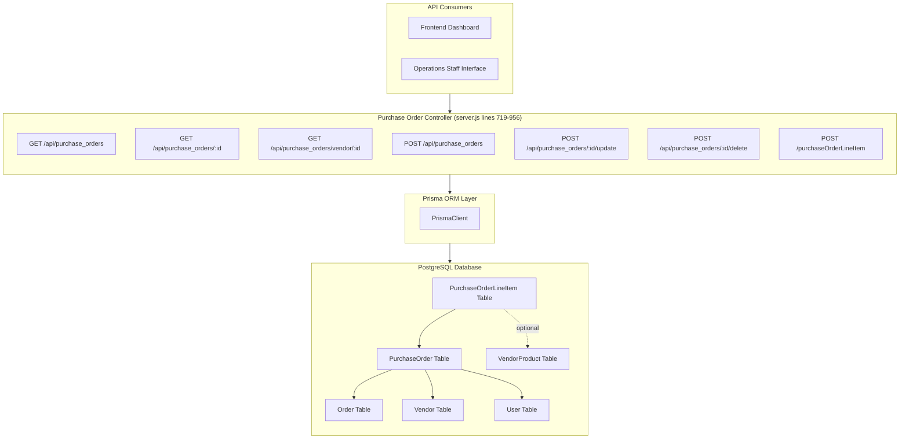
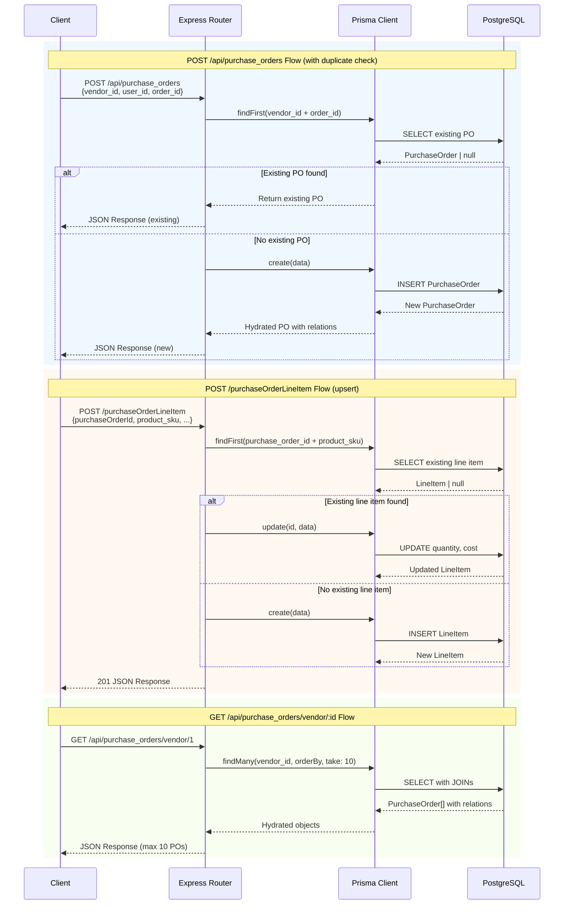
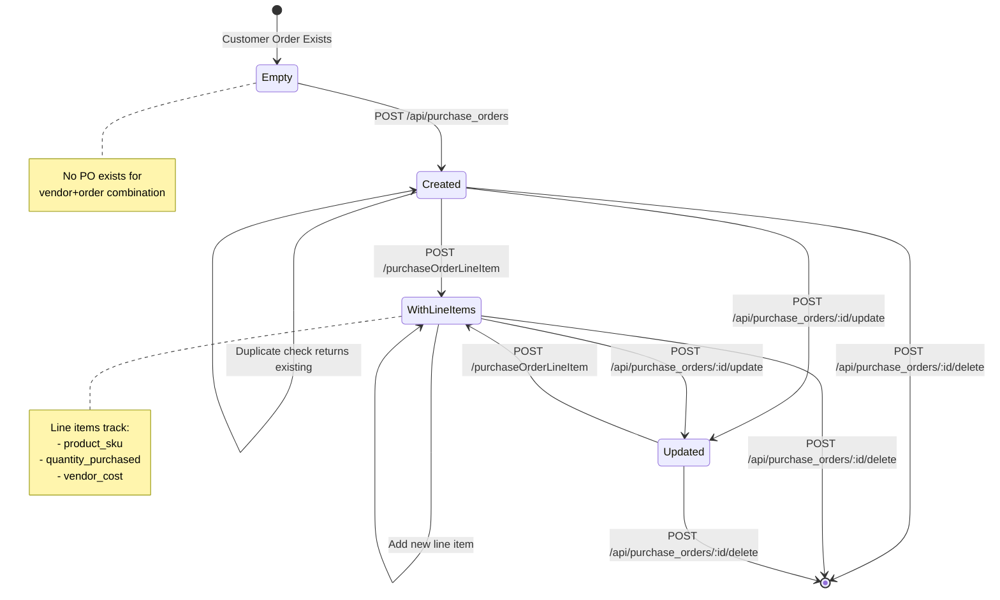

# DD-005: Purchase Order Management Controller

## Document Information

| Attribute | Value |
|-----------|-------|
| Version | 1.0.0 |
| Status | Documented (Existing Implementation) |
| Created | 2026-01-23 |
| Last Updated | 2026-01-23 |
| Author | Architecture Documentation |
| Parent PRD | [purchase-order-management-prd.md](../prd/purchase-order-management-prd.md) |
| Dependencies | DD-002 (Vendor Integration Framework), DD-003 (Product Catalog Controller) |
| Complexity Level | Low |

---

## Agreement Checklist

| Agreement | Status | Reflected In |
|-----------|--------|--------------|
| Document current architecture only | Confirmed | Entire document |
| Do not propose changes | Confirmed | All sections descriptive only |
| RESTful API endpoints for PO operations | Confirmed | Section 5: Public API Interfaces |
| Multi-vendor PO creation documented | Confirmed | Section 4: Data Flow |
| Duplicate prevention logic documented | Confirmed | Section 5.3: Create PO |
| Line item SKU tracking documented | Confirmed | Section 5.7: Create/Update Line Item |
| User attribution documented | Confirmed | Section 6: Data Contracts |

---

## 1. Overview

### 1.1 Purpose

This Design Document describes the current architecture of the Purchase Order Management Controller component within the JustJeeps API backend. This component provides a multi-vendor procurement workflow system that creates purchase orders from customer orders, manages line items with SKU/quantity/cost tracking, and prevents duplicate purchase orders per vendor-order combination.

### 1.2 Scope

**In Scope:**
- Purchase Order REST API endpoints (6 endpoints)
- Purchase Order Line Item endpoint (1 endpoint)
- Database operations via Prisma ORM
- Duplicate prevention logic for vendor-order combinations
- Line item upsert logic based on product SKU
- Data relationships with Order, Vendor, User, and VendorProduct entities

**Out of Scope:**
- Vendor communication/email sending
- PDF generation for purchase orders
- PO approval workflows
- Automatic cost lookup from VendorProduct
- Shipping tracking integration
- Payment processing to vendors

### 1.3 Complexity Rationale

**Complexity Level: Low**

Rationale:
1. **Requirements/ACs**: 7 API endpoints with straightforward CRUD operations and simple duplicate-check logic
2. **Constraints/Risks**:
   - Simple foreign key relationships (no complex joins)
   - Linear data flow (create PO -> add line items)
   - Race condition on duplicate check (low probability)
   - No cascade delete configured for line items

---

## 2. Existing Codebase Analysis

### 2.1 Implementation Path Mapping

| Component | File Path | Lines | Type |
|-----------|-----------|-------|------|
| Purchase Order API Endpoints | `/Users/ricardotassio/DEV/TRABALHO/JUSTJEEPS/JustJeepsAPI-back-end/server.js` | 719-956 | Existing |
| PurchaseOrder Data Model | `/Users/ricardotassio/DEV/TRABALHO/JUSTJEEPS/JustJeepsAPI-back-end/schema.prisma` | 155-165 | Existing |
| PurchaseOrderLineItem Model | `/Users/ricardotassio/DEV/TRABALHO/JUSTJEEPS/JustJeepsAPI-back-end/schema.prisma` | 167-176 | Existing |
| Seed Data | `/Users/ricardotassio/DEV/TRABALHO/JUSTJEEPS/JustJeepsAPI-back-end/prisma/seeds/seed-individual/seed-po.js` | Full file | Existing |

### 2.2 Similar Functionality Search Results

**Search Keywords Used**: purchase, order, procurement, po, line item

**Findings**:
- Purchase order endpoints are centralized in `server.js` (monolithic pattern)
- No separate controller/service layer exists
- All PO-related endpoints follow same pattern: direct Prisma queries within route handlers
- Line item endpoint uses different URL pattern (`/purchaseOrderLineItem` vs `/api/purchase_orders/...`)
- No duplicate implementations found

### 2.3 Integration Points with Existing Code

| Integration Point | Location | Coupling Level |
|-------------------|----------|----------------|
| Prisma Client | `server.js` global instance | Direct dependency |
| Order Model (entity_id) | `schema.prisma:11-45` | Foreign key |
| Vendor Model | `schema.prisma:132-143` | Foreign key |
| User Model | `schema.prisma:145-153` | Foreign key |
| VendorProduct Model (optional) | `schema.prisma:116-130` | Optional foreign key on line items |

---

## 3. Architecture Diagram



---

## 4. Data Flow Diagram



---

## 5. Public API Interfaces

### 5.1 GET /api/purchase_orders - List All Purchase Orders

**Location**: `server.js:748-760`

**Request**: No parameters

**Response Schema**:
```typescript
interface PurchaseOrderListResponse {
  id: number;
  created_at: string; // ISO 8601 DateTime
  user_id: number;
  order_id: number;
  vendor_id: number;
  purchaseOrderLineItems: PurchaseOrderLineItem[];
}[]
```

**Note**: This endpoint returns minimal data (no vendor/user/order relations included)

**Error Response**: `500 { error: 'Failed to fetch purchase orders' }`

---

### 5.2 GET /api/purchase_orders/:id - Single Purchase Order with Full Details

**Location**: `server.js:797-815`

**Request Parameters**:
| Parameter | Type | Required | Description |
|-----------|------|----------|-------------|
| id | number | Yes | Purchase Order ID (URL path) |

**Response Schema**:
```typescript
interface PurchaseOrderDetailResponse {
  id: number;
  created_at: string;
  user_id: number;
  order_id: number;
  vendor_id: number;
  vendor: {
    id: number;
    name: string;
    website: string;
    address: string | null;
    phone_number: string | null;
    main_contact: string;
    username: string;
    password: string;
  };
  user: {
    id: number;
    firstname: string;
    lastname: string;
    username: string;
    email: string;
    password: string;
  };
  order: Order;
  purchaseOrderLineItems: {
    id: number;
    purchase_order_id: number;
    vendor_product_id: number | null;
    quantity_purchased: number;
    vendor_cost: number | null;
    product_sku: string | null;
    vendor_sku: string | null;
    vendorProduct: VendorProduct | null;
    purchaseOrder: PurchaseOrder;
  }[];
}
```

**Security Note**: Response includes sensitive data (vendor credentials, user passwords) - should be filtered in production.

**Error Behavior**: Returns `null` if PO not found (no explicit error handling)

---

### 5.3 GET /api/purchase_orders/vendor/:id - Purchase Orders by Vendor

**Location**: `server.js:763-793`

**Request Parameters**:
| Parameter | Type | Required | Description |
|-----------|------|----------|-------------|
| id | number | Yes | Vendor ID (URL path) |

**Response Schema**: Array of `PurchaseOrderDetailResponse` (same as single PO endpoint)

**Query Characteristics**:
- Filtered by `vendor_id`
- Ordered by `created_at` descending (most recent first)
- Limited to 10 results (`take: 10`)
- Includes full relations (vendor, user, order with items, line items)

**Error Response**: `500 { error: 'Failed to fetch purchase orders' }`

---

### 5.4 POST /api/purchase_orders - Create Purchase Order

**Location**: `server.js:820-861`

**Request Body**:
```typescript
interface CreatePurchaseOrderRequest {
  vendor_id: number;
  user_id: number;
  order_id: number;
}
```

**Business Logic**:
1. Check for existing PO with same `vendor_id` AND `order_id`
2. If found, return existing PO (idempotent behavior)
3. If not found, create new PO with auto-generated `created_at` timestamp

**Response Schema**: `PurchaseOrderDetailResponse` (new or existing)

**Duplicate Prevention**:
```javascript
// Duplicate check query
prisma.purchaseOrder.findFirst({
  where: {
    vendor_id: vendor_id,
    order_id: order_id,
  },
})
```

**Error Response**: `500 { error: 'Failed to create purchase order' }`

---

### 5.5 POST /api/purchase_orders/:id/update - Update Purchase Order

**Location**: `server.js:915-942`

**Request Parameters**:
| Parameter | Type | Required | Description |
|-----------|------|----------|-------------|
| id | number | Yes | Purchase Order ID (URL path) |

**Request Body**:
```typescript
interface UpdatePurchaseOrderRequest {
  vendor_id: number;
  user_id: number;
  order_id: number;
}
```

**Response Schema**: Updated `PurchaseOrderDetailResponse`

**Error Response**: `500 { error: 'Failed to update purchase order' }`

---

### 5.6 POST /api/purchase_orders/:id/delete - Delete Purchase Order

**Location**: `server.js:945-956`

**Request Parameters**:
| Parameter | Type | Required | Description |
|-----------|------|----------|-------------|
| id | number | Yes | Purchase Order ID (URL path) |

**Response Schema**: Deleted `PurchaseOrder` record (minimal, no relations)

**Important**: Associated line items are NOT automatically deleted (no cascade delete configured)

**Error Response**: `500 { error: 'Failed to delete purchase order' }`

---

### 5.7 POST /purchaseOrderLineItem - Create or Update Line Item

**Location**: `server.js:864-912`

**Note**: Uses different URL pattern (not under `/api/` prefix)

**Request Body**:
```typescript
interface CreateUpdateLineItemRequest {
  purchaseOrderId: number;
  vendorProductId?: number | null;
  quantityPurchased: number;
  vendorCost: number;
  product_sku: string;
  vendor_sku?: string | null;
}
```

**Business Logic**:
1. Search for existing line item with same `purchase_order_id` AND `product_sku`
2. If found, update `quantity_purchased` and `vendor_cost` only
3. If not found, create new line item with all fields

**Response**: `201` status with created/updated line item

**Upsert Pattern**:
```javascript
// Existing line item lookup
prisma.purchaseOrderLineItem.findFirst({
  where: {
    purchase_order_id: purchaseOrderId,
    product_sku: product_sku,
  },
})

// If exists: update quantity and cost
// If not exists: create with all fields
```

**Console Logging**: Request body and found line item are logged to console

**Error Response**: `500 { message: 'Something went wrong' }`

---

## 6. Data Contracts

### 6.1 PurchaseOrder Model (schema.prisma lines 155-165)

```prisma
model PurchaseOrder {
  id                     Int                     @id @default(autoincrement())
  created_at             DateTime                @default(now())
  user_id                Int
  order_id               Int
  vendor_id              Int
  order                  Order                   @relation(fields: [order_id], references: [entity_id])
  user                   User                    @relation(fields: [user_id], references: [id])
  vendor                 Vendor                  @relation(fields: [vendor_id], references: [id])
  purchaseOrderLineItems PurchaseOrderLineItem[]
}
```

**Foreign Key Relationships**:
| Field | References | On Delete |
|-------|------------|-----------|
| order_id | Order.entity_id | Default (restrict) |
| user_id | User.id | Default (restrict) |
| vendor_id | Vendor.id | Default (restrict) |

### 6.2 PurchaseOrderLineItem Model (schema.prisma lines 167-176)

```prisma
model PurchaseOrderLineItem {
  id                 Int           @id @default(autoincrement())
  purchase_order_id  Int
  vendor_product_id  Int?
  quantity_purchased Int
  vendor_cost        Float?
  product_sku        String?
  vendor_sku         String?
  purchaseOrder      PurchaseOrder @relation(fields: [purchase_order_id], references: [id])
}
```

**Field Notes**:
- `vendor_product_id`: Optional reference to VendorProduct (not enforced as FK in current schema)
- `product_sku`: String field for product identification (not FK to Product.sku)
- `vendor_sku`: Vendor-specific part number for reference
- `vendor_cost`: Cost in CAD from vendor

### 6.3 Request/Response Field Mapping

| API Field (camelCase) | Database Field (snake_case) | Type |
|-----------------------|----------------------------|------|
| purchaseOrderId | purchase_order_id | Int |
| vendorProductId | vendor_product_id | Int? |
| quantityPurchased | quantity_purchased | Int |
| vendorCost | vendor_cost | Float? |
| product_sku | product_sku | String? |
| vendor_sku | vendor_sku | String? |

---

## 7. Integration Point Map

```yaml
Integration Point 1:
  Existing Component: Order model (Order.entity_id)
  Integration Method: Foreign key reference from PurchaseOrder.order_id
  Impact Level: High (Data relationship)
  Required Test Coverage: Order existence validation before PO creation

Integration Point 2:
  Existing Component: Vendor model (Vendor.id)
  Integration Method: Foreign key reference from PurchaseOrder.vendor_id
  Impact Level: High (Data relationship)
  Required Test Coverage: Vendor existence validation

Integration Point 3:
  Existing Component: User model (User.id)
  Integration Method: Foreign key reference from PurchaseOrder.user_id
  Impact Level: High (User attribution)
  Required Test Coverage: User existence validation

Integration Point 4:
  Existing Component: VendorProduct model (optional)
  Integration Method: Optional reference from PurchaseOrderLineItem.vendor_product_id
  Impact Level: Low (Optional enrichment)
  Required Test Coverage: Graceful handling of null references

Integration Point 5:
  Existing Component: server.js Express application
  Integration Method: Route definition within monolithic server
  Impact Level: Low (Read-Write operations)
  Required Test Coverage: API response validation
```

---

## 8. Integration Boundary Contracts

### 8.1 Database Layer Boundary

```yaml
Boundary Name: Prisma-PostgreSQL
  Input: Prisma query objects (findMany, findUnique, findFirst, create, update, delete)
  Output: Synchronous Promise resolving to typed objects
  On Error: Throw PrismaClientKnownRequestError (constraint violations, not found)
```

### 8.2 HTTP Layer Boundary

```yaml
Boundary Name: Express-Client (Purchase Orders)
  Input: HTTP GET/POST requests with path parameters and JSON body
  Output: Synchronous JSON response (200 OK, 201 Created, or 500 Error)
  On Error: Return 500 status with error object { error: string } or { message: string }
```

### 8.3 Duplicate Prevention Contract

```yaml
Boundary Name: PO-Duplicate-Check
  Input: { vendor_id: number, order_id: number }
  Output: Existing PurchaseOrder or null
  Behavior: Returns existing PO if vendor+order combination exists
  Limitation: Race condition possible (no database-level unique constraint)
```

### 8.4 Line Item Upsert Contract

```yaml
Boundary Name: LineItem-Upsert
  Input: { purchase_order_id: number, product_sku: string, quantity_purchased: number, vendor_cost: number }
  Output: Created or Updated PurchaseOrderLineItem
  Behavior:
    - If line item exists for PO+SKU: update quantity and cost
    - If no line item exists: create new with all fields
  Limitation: Race condition possible (no database-level unique constraint)
```

---

## 9. Change Impact Map

```yaml
Change Target: Purchase Order Controller
Direct Impact:
  - /Users/ricardotassio/DEV/TRABALHO/JUSTJEEPS/JustJeepsAPI-back-end/server.js (lines 719-956)

Indirect Impact:
  - Frontend Dashboard (API consumer for PO management)
  - Operations Staff workflow (PO creation and line item entry)
  - Order Management (PO references Order.entity_id)
  - Vendor Management (PO references Vendor.id)
  - User Management (PO references User.id)

No Ripple Effect:
  - Product Catalog endpoints (read-only relationship)
  - Competitor Price Tracking (no relationship)
  - Health check endpoint
  - Authentication middleware (endpoints not protected by default)
  - Magento sync processes (read-only reference to Orders)
```

---

## 10. Current Behavior Characteristics

### 10.1 Query Patterns

| Endpoint | Query Type | Joins/Relations | Performance Concern |
|----------|------------|-----------------|---------------------|
| `GET /api/purchase_orders` | findMany | purchaseOrderLineItems only | Minimal relations |
| `GET /api/purchase_orders/:id` | findUnique | All relations (vendor, user, order, line items with vendorProduct) | Full object graph |
| `GET /api/purchase_orders/vendor/:id` | findMany | All relations | Limited to 10 results |
| `POST /api/purchase_orders` | findFirst + create | All relations on create | Two queries for duplicate check |
| `POST /api/purchase_orders/:id/update` | update | All relations | Full object graph return |
| `POST /api/purchase_orders/:id/delete` | delete | None | Minimal return |
| `POST /purchaseOrderLineItem` | findFirst + create/update | None | Two queries for upsert |

### 10.2 Error Handling Pattern

All endpoints follow consistent error handling:
```javascript
try {
  // Prisma query
  res.json(result);
} catch (error) {
  console.log(error); // or console.error(error)
  res.status(500).json({ error: 'Failed to ...' });
}
```

**Exception**: Line item endpoint uses `{ message: '...' }` instead of `{ error: '...' }`

### 10.3 Response Characteristics

| Endpoint | Typical Response Size | Authentication | Pagination |
|----------|----------------------|----------------|------------|
| `GET /api/purchase_orders` | ~2KB per 10 POs | None (unless ENABLE_AUTH=true) | None |
| `GET /api/purchase_orders/:id` | ~5KB (full relations) | None | N/A |
| `GET /api/purchase_orders/vendor/:id` | ~50KB (10 POs with relations) | None | Hardcoded limit (10) |
| `POST /api/purchase_orders` | ~5KB | None | N/A |
| `POST /purchaseOrderLineItem` | ~200 bytes | None | N/A |

### 10.4 Security Concerns

**Sensitive Data Exposure**:
- Vendor passwords returned in API responses (`vendor.password`)
- User passwords returned in API responses (`user.password`)
- No authentication required by default (`ENABLE_AUTH=false`)

---

## 11. Acceptance Criteria (Current Implementation)

### 11.1 Functional Acceptance Criteria

| ID | Criterion | Verification Method |
|----|-----------|---------------------|
| AC-001 | GET /api/purchase_orders returns all POs with line items | API call returns array with purchaseOrderLineItems nested |
| AC-002 | GET /api/purchase_orders/:id returns single PO with all relations | API call with valid ID returns object with vendor, user, order, line items |
| AC-003 | GET /api/purchase_orders/vendor/:id returns latest 10 POs for vendor | API call returns max 10 POs ordered by created_at desc |
| AC-004 | POST /api/purchase_orders creates new PO when no duplicate exists | New PO created with unique vendor+order combination |
| AC-005 | POST /api/purchase_orders returns existing PO when duplicate exists | Same vendor_id+order_id returns existing PO, no new record created |
| AC-006 | POST /api/purchase_orders/:id/update modifies PO fields | Updated fields reflected in response |
| AC-007 | POST /api/purchase_orders/:id/delete removes PO from database | PO no longer returned by GET endpoints |
| AC-008 | POST /purchaseOrderLineItem creates new line item when SKU not on PO | New line item with all fields created |
| AC-009 | POST /purchaseOrderLineItem updates existing line item when SKU exists on PO | Only quantity_purchased and vendor_cost updated |

### 11.2 Error Handling Acceptance Criteria

| ID | Criterion | Verification Method |
|----|-----------|---------------------|
| AC-E01 | All endpoints return 500 on database error | Simulate database failure |
| AC-E02 | Error responses include descriptive message | Check error response body for `error` or `message` key |
| AC-E03 | FK constraint violation returns 500 | Attempt to create PO with non-existent order_id |

---

## 12. Known Limitations

1. **No Cascade Delete**: Deleting a PO does not automatically delete associated line items
2. **Race Condition on Duplicate Check**: `findFirst` + `create` pattern allows race condition for concurrent requests
3. **No Database Unique Constraint**: Duplicate prevention relies on application logic, not database constraint
4. **Sensitive Data Exposure**: Vendor and user passwords included in API responses
5. **Inconsistent URL Pattern**: Line item endpoint uses `/purchaseOrderLineItem` (no `/api/` prefix)
6. **No Input Validation**: Request body fields not validated before database operations
7. **Inconsistent Error Format**: Line items use `{ message: ... }`, others use `{ error: ... }`
8. **No Pagination**: List endpoint returns all POs (except vendor-filtered which is limited to 10)
9. **Console Logging**: Line item endpoint logs request body to console (debug code)
10. **No Transaction**: PO creation and line item operations are not transactional

---

## 13. State Transition Diagram

The Purchase Order system follows a simple state model (implicitly managed):



---

## 14. Entity Relationship Diagram

```mermaid
erDiagram
    Order ||--o{ PurchaseOrder : "fulfilled by"
    Vendor ||--o{ PurchaseOrder : "receives"
    User ||--o{ PurchaseOrder : "creates"
    PurchaseOrder ||--o{ PurchaseOrderLineItem : "contains"
    VendorProduct ||--o| PurchaseOrderLineItem : "references (optional)"

    Order {
        int entity_id PK
        int id UK
        string increment_id
        string customer_email
        float grand_total
        string status
    }

    Vendor {
        int id PK
        string name
        string website
        string main_contact
    }

    User {
        int id PK
        string firstname
        string lastname
        string username
        string email
    }

    PurchaseOrder {
        int id PK
        datetime created_at
        int user_id FK
        int order_id FK
        int vendor_id FK
    }

    PurchaseOrderLineItem {
        int id PK
        int purchase_order_id FK
        int vendor_product_id FK_nullable
        int quantity_purchased
        float vendor_cost
        string product_sku
        string vendor_sku
    }

    VendorProduct {
        int id PK
        string product_sku
        int vendor_id
        string vendor_sku
        float vendor_cost
    }
```

---

## 15. Seed Data Reference

The seed file (`seed-po.js`) demonstrates the data structure:

```javascript
// Example seed data structure
{
  "id": 12,
  "created_at": "2023-04-25T18:26:15.382Z",
  "user_id": 2,
  "order_id": 82123,
  "vendor_id": 1,
  "purchaseOrderLineItems": [
    {
      "id": 16,
      "product_sku": "BST-52584-35",
      "vendor_sku": null,
      "purchase_order_id": 12,
      "vendor_product_id": null,
      "quantity_purchased": 1,
      "vendor_cost": 134.14
    }
  ]
}
```

**Seed Data Characteristics**:
- 28 sample purchase orders
- Vendors: 1 (Keystone), 2 (Meyer), 3 (Omix)
- Users: 2, 3, 4, 5
- Line items per PO: 1-4
- Vendor cost range: $2.19 - $1,616.87

---

## 16. References

### Internal Documentation
- [Purchase Order Management PRD](../prd/purchase-order-management-prd.md)
- [Order Management PRD](../prd/order-management-prd.md)
- [Multi-Vendor Integration PRD](../prd/multi-vendor-integration-prd.md)

### Related Design Documents
- [DD-002: Vendor Integration Framework](./dd-002-vendor-integration-framework.md) - VendorProduct data source
- [DD-003: Product Catalog Controller](./dd-003-product-catalog-controller.md) - Product data reference

### Source Files
- `/Users/ricardotassio/DEV/TRABALHO/JUSTJEEPS/JustJeepsAPI-back-end/server.js` (lines 719-956)
- `/Users/ricardotassio/DEV/TRABALHO/JUSTJEEPS/JustJeepsAPI-back-end/schema.prisma` (lines 155-176)
- `/Users/ricardotassio/DEV/TRABALHO/JUSTJEEPS/JustJeepsAPI-back-end/prisma/seeds/seed-individual/seed-po.js`

---

## 17. Glossary

| Term | Definition |
|------|------------|
| **PO (Purchase Order)** | Internal document tracking products to be ordered from a vendor |
| **Line Item** | Individual product entry on a purchase order with quantity and cost |
| **vendor_id** | Internal identifier for vendor in JustJeeps system |
| **order_id** | Reference to customer order (Magento entity_id) |
| **product_sku** | JustJeeps SKU identifying the product |
| **vendor_sku** | Vendor-specific part number for the product |
| **vendor_cost** | Price charged by vendor for the product (in CAD) |
| **user_id** | Staff member who created the purchase order |
| **Upsert** | Create if not exists, otherwise update existing record |
| **Duplicate Prevention** | Logic to prevent multiple POs for same vendor+order combination |

---

## Change History

| Version | Date | Author | Changes |
|---------|------|--------|---------|
| 1.0.0 | 2026-01-23 | Architecture Documentation | Initial documentation of existing implementation |
