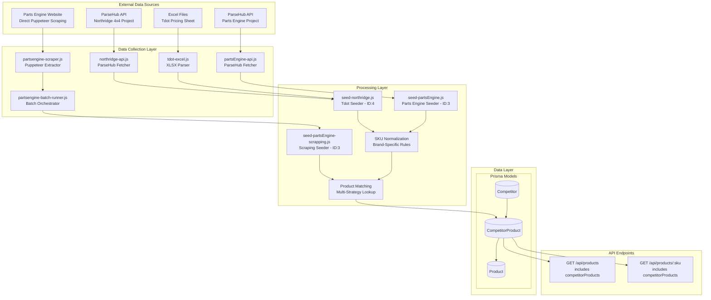
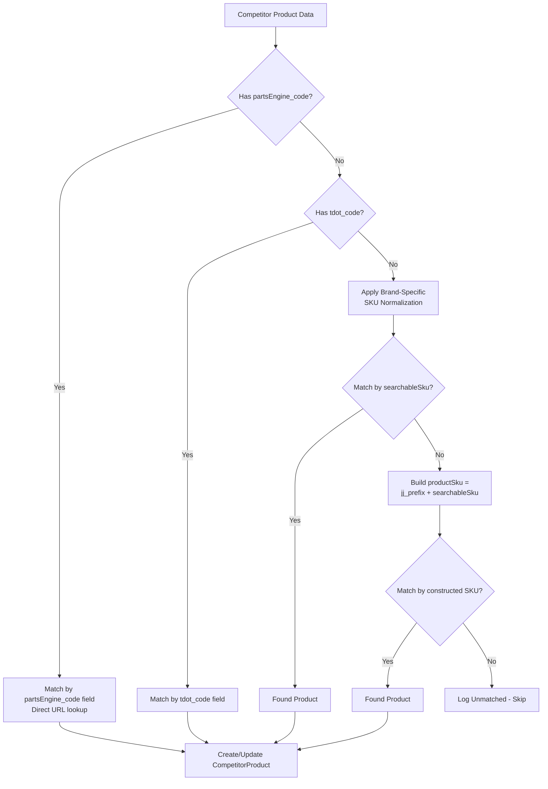
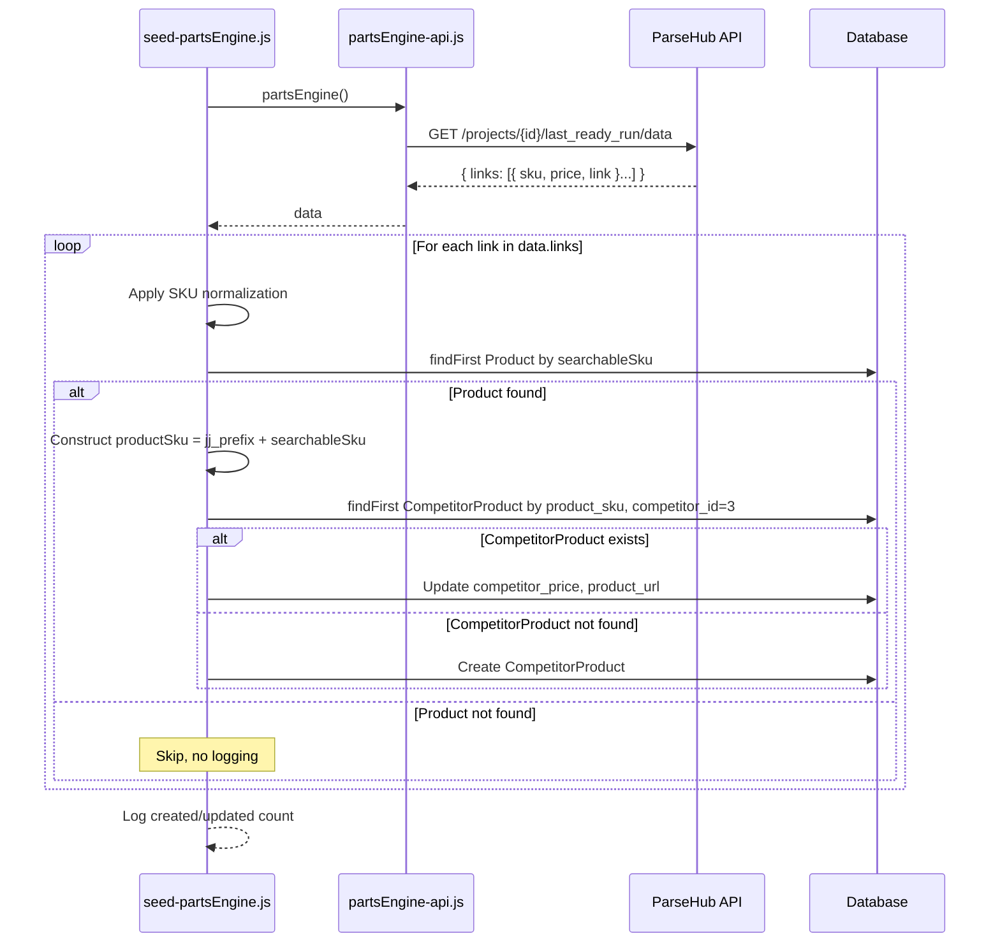
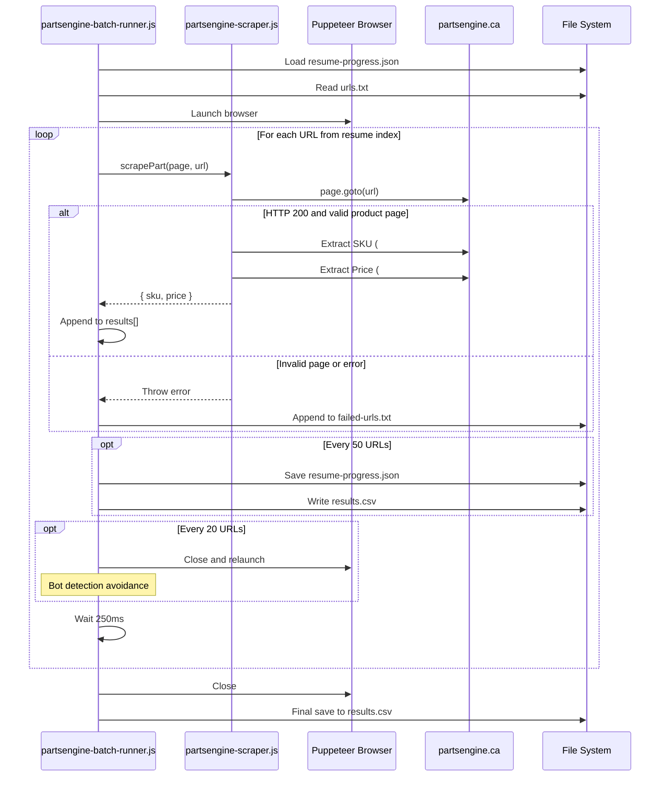
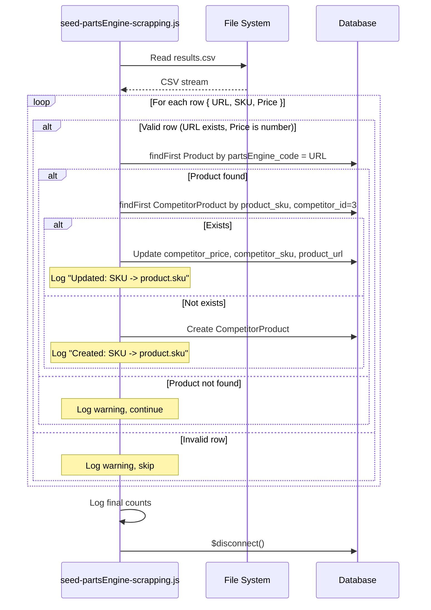

# DD-006: Competitor Price Tracking Service - Design Document

**Version**: 1.0.0
**Status**: Accepted (Documentation of Existing Architecture)
**Created**: 2026-01-23
**Last Updated**: 2026-01-23
**Author**: System (Reverse-Engineered from Implementation)

---

## Agreement Checklist

This document captures the existing architecture. No new implementation is proposed.

- [x] **Scope**: Document current competitor price tracking architecture across 3 registered competitors
- [x] **Non-scope**: No architectural changes or new feature proposals
- [x] **Constraints**: Existing ParseHub API rate limits, web scraping limitations preserved
- [x] **Dependencies**: DD-002 (Vendor Integration Framework) for architectural patterns, DD-003 (Product Catalog Controller) for product data relationships
- [x] **Parent PRD**: `/docs/prd/competitor-price-tracking-prd.md`

---

## Prerequisite ADRs

None currently documented. The following common ADR topics should be considered for future documentation:

- ADR-COMMON-001: Error Handling Strategy (implicit: continue-on-error with logging)
- ADR-COMMON-005: Web Scraping Bot Detection Avoidance Patterns
- ADR-COMMON-006: SKU Normalization Standards

---

## Executive Summary

The Competitor Price Tracking Service is a multi-source pricing intelligence system that monitors competitor prices from Canadian automotive parts retailers. The system integrates pricing data from Northridge 4x4, Parts Engine, and GTA Jeeps & Trucks through ParseHub API, Puppeteer-based web scraping, and Excel file imports. Product matching is achieved through sophisticated SKU normalization algorithms with brand-specific transformation rules.

---

## Existing Codebase Analysis

### Implementation Path Mapping

| Component | File Path | Status |
|-----------|-----------|--------|
| Competitor Registry Data | `/prisma/seeds/hard-code_data/competitors_data.js` | Existing |
| Northridge/Tdot Seeder | `/prisma/seeds/seed-individual/seed-northridge.js` | Existing |
| Parts Engine ParseHub Seeder | `/prisma/seeds/seed-individual/seed-partsEngine.js` | Existing |
| Parts Engine Scraping Seeder | `/prisma/seeds/scrapping/partsEngine/seed-partsEngine-scrapping.js` | Existing |
| Parts Engine Scraper | `/prisma/seeds/scrapping/partsEngine/partsengine-scraper.js` | Existing |
| Parts Engine Batch Runner | `/prisma/seeds/scrapping/partsEngine/partsengine-batch-runner.js` | Existing |
| Northridge ParseHub API | `/prisma/seeds/api-calls/northridge-api.js` | Existing |
| Parts Engine ParseHub API | `/prisma/seeds/api-calls/partsEngine-api.js` | Existing |
| Tdot Excel Parser | `/prisma/seeds/api-calls/tdot-excel.js` | Existing |
| Database Schema | `/prisma/schema.prisma` (Competitor, CompetitorProduct models) | Existing |
| Product API Endpoints | `/server.js` (GET /api/products, GET /api/products/:sku) | Existing |

### Similar Functionality Search Results

The Competitor Price Tracking Service follows similar architectural patterns to the Vendor Integration Framework (DD-002):
- **Multi-source data collection**: Similar to vendor integrations (API, file import, web scraping)
- **SKU matching algorithms**: Similar to vendor code matching logic
- **Upsert patterns**: Consistent with vendor product synchronization

Key difference: Competitor data tracks external market prices; vendor data tracks internal cost/inventory.

---

## Architecture Overview

### Architecture Diagram



### Data Flow Diagram

```mermaid
flowchart LR
    subgraph Sources["Competitor Data Sources"]
        direction TB
        PH[ParseHub API<br/>Scraped Data]
        SCRAPE[Direct Scraping<br/>Puppeteer]
        EXCEL[Excel Import<br/>Manual Upload]
    end

    subgraph Processing["Data Processing Pipeline"]
        direction TB
        FETCH[1. Data Fetching<br/>API/File/Web]
        PARSE[2. Parsing<br/>JSON/CSV/XLSX]
        NORM[3. SKU Normalization<br/>Brand Rules]
        MATCH[4. Product Matching<br/>searchableSku/codes]
        UPSERT[5. Upsert Logic<br/>Create or Update]
    end

    subgraph Storage["Database Storage"]
        CP[(CompetitorProduct)]
    end

    subgraph Consumption["API Response"]
        API[Product API<br/>competitorProducts[]]
    end

    PH --> FETCH
    SCRAPE --> FETCH
    EXCEL --> PARSE

    FETCH --> PARSE
    PARSE --> NORM
    NORM --> MATCH
    MATCH --> UPSERT
    UPSERT --> CP
    CP --> API
```

---

## Component Design

### 1. Competitor Registry

The competitor registry is defined as static data and seeded into the database.

**Data Definition (`/prisma/seeds/hard-code_data/competitors_data.js`):**

```javascript
const competitorsData = [
  { name: "Northridge 4x4", website: "https://www.northridge4x4.ca/" },  // ID: 1
  { name: "GTA Jeeps & Trucks", website: "https://www.gtajeeps.ca/" },   // ID: 2
  { name: "Parts Engine", website: "https://www.partsengine.ca/" }       // ID: 3
];
// Note: Tdot (ID: 4) is used in seed-northridge.js for Excel-based data
```

**Competitor Integration Status:**

| Competitor | ID | Website | Active Integration | Data Source |
|------------|----|---------|--------------------|-------------|
| Northridge 4x4 | 1 | northridge4x4.ca | Partial (uses ID 4 in seeder) | ParseHub |
| GTA Jeeps & Trucks | 2 | gtajeeps.ca | Registered Only | None |
| Parts Engine | 3 | partsengine.ca | Active | ParseHub + Puppeteer |
| Tdot | 4 | N/A (Northridge alt) | Active | Excel Import |

### 2. ParseHub API Integration

Both Northridge and Parts Engine use ParseHub for automated web scraping.

**Northridge API (`/prisma/seeds/api-calls/northridge-api.js`):**

```
Endpoint: https://www.parsehub.com/api/v2/projects/{PROJECT_ID}/last_ready_run/data
Project ID: tXLcYOFE6taM
API Key: t0UjHTnrieK_
Response Format: JSON with scraped product data

Flow:
1. HTTP GET request to ParseHub project endpoint
2. Returns last successful scrape results
3. Data contains product links and pricing information
```

**Parts Engine API (`/prisma/seeds/api-calls/partsEngine-api.js`):**

```
Endpoint: https://www.parsehub.com/api/v2/projects/{PROJECT_ID}/last_ready_run/data
Project ID: tp8CNvT37gGV
API Key: t0UjHTnrieK_
Response Format: JSON with links[] containing sku, price, link

Data Structure:
{
  links: [
    { sku: "ABC123", price: "$199.99", link: "https://..." },
    ...
  ]
}
```

### 3. Excel Import (Tdot/Northridge)

The Tdot Excel parser handles manual file imports with brand-specific SKU transformations.

**Implementation (`/prisma/seeds/api-calls/tdot-excel.js`):**

```
Input: tdot-excel.xlsx file (manually placed)
Parser: xlsx library (XLSX.readFile, XLSX.utils.sheet_to_json)

Column Mapping:
- Column 2 (index 2): tdot_price
- Column 3 (index 3): tdot_code

Bestop SKU Normalization:
- Pattern: "Bestop XXXXX-XX" -> remove dash: "BestopXXXXXXX"
- Rule: Replace pattern (\d+)-(\d+) with $1$2 if starts with "Bestop "

Output: Array of { tdot_price, tdot_code }
```

### 4. Web Scraping (Parts Engine)

Direct Puppeteer-based scraping provides an alternative to ParseHub for Parts Engine data.

**Scraper Module (`/prisma/seeds/scrapping/partsEngine/partsengine-scraper.js`):**

```
Technology: puppeteer-extra with StealthPlugin
Target Page Elements:
  - SKU: #PDPTitleBoxV2 h1 b span:nth-of-type(2)
  - Price: #variantPrice

Page Validation:
1. Check HTTP status == 200
2. Detect search page redirects (h1 contains "results for")
3. Wait for SKU element (1.5s timeout)
4. Wait for price element with content (2s timeout)

Output: { sku, price } or throws error
```

**Batch Runner (`/prisma/seeds/scrapping/partsEngine/partsengine-batch-runner.js`):**

```
Configuration:
- BACKUP_EVERY: 50 URLs (progress save interval)
- RESTART_EVERY: 20 URLs (browser restart for bot detection avoidance)
- Delay: 250ms between requests

Resume Capability:
- resume-progress.json: Stores { lastIndex: N }
- results.csv: Running output file
- failed-urls.txt: Failed URL logging

Browser Settings:
- headless: false (visible browser for debugging)
- Custom User-Agent string
- Chrome executable path (macOS hardcoded)
```

### 5. SKU Matching Algorithms

The seed scripts implement multi-strategy SKU matching with brand-specific normalization rules.

**SKU Normalization Rules (Parts Engine ParseHub Seeder):**

| Brand (URL Pattern) | SKU Transformation | Example |
|---------------------|-------------------|---------|
| Omix (`-vp-omix-ada-614.aspx`) | Replace last dash with dot if pattern `^\d+-\d+$` | `11317-01` -> `11317.01` |
| Rugged Ridge (`-vp-rugged-ridge-160.aspx`) | Same as Omix | `11504-01` -> `11504.01` |
| Rough Country (`-vp-rough-country-384.aspx`) | Replace dash before single capital letter with underscore | `1234-A` -> `1234_A` |
| Z Automotive (`-vp-z-automotive-2560.aspx`) | Replace all dashes with underscores | `Z-AB-123` -> `Z_AB_123` |
| AirBedz (`-vp-airbedz-270.aspx`) | Replace only last dash with underscore | `PPI-XXX-123` -> `PPI-XXX_123` |
| Chemical Guys (`-vp-chemical-guys-1309.aspx`) | Replace only last dash with underscore | `CG-XXX-123` -> `CG-XXX_123` |
| DV8 Offroad (`-vp-dv8-offroad-911.aspx`) | Replace first dash with dot if pattern `^[A-Z]\d-` | `S4-XXX` -> `S4.XXX` |
| Bestop (`-vp-bestop-15.aspx`) | Remove all dashes | `51-509-01` -> `5150901` |

**Matching Strategy Flow:**



### 6. Seeder Implementation Patterns

**Tdot/Northridge Seeder (`seed-northridge.js`):**

```javascript
// Matching Strategy: tdot_code
// Competitor ID: 4

Algorithm:
1. Load data from tdot-excel.js
2. For each { tdot_price, tdot_code }:
   a. Find Product by tdot_code
   b. If not found: log error, continue
   c. Check CompetitorProduct by product_sku
   d. If exists: update competitor_price, set competitor_id=4
   e. If not exists: create new CompetitorProduct

Output: Created/updated counts logged
```

**Parts Engine ParseHub Seeder (`seed-partsEngine.js`):**

```javascript
// Matching Strategy: searchableSku with normalization
// Competitor ID: 3

Algorithm:
1. Fetch data from partsEngine-api.js (ParseHub)
2. For each link in data.links:
   a. Skip if no sku
   b. Apply brand-specific SKU normalization
   c. Find Product by searchableSku
   d. If found: construct productSku = jj_prefix + searchableSku
   e. Check/upsert CompetitorProduct:
      - competitor_id: 3
      - product_sku: constructed SKU
      - competitor_price: parsed price (remove currency symbols)
      - product_url: link.link

Price Parsing: parseFloat(link.price.replace(/[^0-9.-]+/g,""))*1.00
```

**Parts Engine Scraping Seeder (`seed-partsEngine-scrapping.js`):**

```javascript
// Matching Strategy: partsEngine_code (URL-based)
// Competitor ID: 3

Algorithm:
1. Parse results.csv from batch scraper
2. For each row { URL, SKU, Price }:
   a. Skip if missing URL or invalid price
   b. Find Product by partsEngine_code = URL
   c. If not found: log warning, continue
   d. Check existing CompetitorProduct by product_sku + competitor_id
   e. If exists: update competitor_price, competitor_sku, product_url
   f. If not exists: create CompetitorProduct
```

---

## Data Contracts

### Competitor Model

```prisma
model Competitor {
  id                 Int                 @id @default(autoincrement())
  name               String              // e.g., "Parts Engine"
  website            String              // e.g., "https://www.partsengine.ca/"
  competitorProducts CompetitorProduct[]
}
```

### CompetitorProduct Model

```prisma
model CompetitorProduct {
  id               Int        @id @default(autoincrement())
  product_sku      String     // Foreign key to Product.sku
  competitor_id    Int        // Foreign key to Competitor.id
  product_url      String?    // Competitor's product page URL
  competitor_price Float      // Price in CAD
  competitor_sku   String?    // Competitor's SKU for the product
  competitor       Competitor @relation(fields: [competitor_id], references: [id])
  product          Product    @relation(fields: [product_sku], references: [sku], onDelete: Cascade)
}
```

### Product Competitor-Related Fields

```prisma
model Product {
  // ... other fields
  tdot_code          String?    // Tdot/Northridge product code for Excel matching
  partsEngine_code   String?    // Parts Engine URL for direct matching
  competitorProducts CompetitorProduct[]
}
```

### API Response Contract

**GET /api/products and GET /api/products/:sku:**

```json
{
  "sku": "RU-11513.04",
  "name": "Example Product",
  "price": 299.99,
  "competitorProducts": [
    {
      "competitor_price": 279.99,
      "product_url": "https://www.partsengine.ca/example-product-page.aspx",
      "competitor": {
        "name": "Parts Engine"
      }
    },
    {
      "competitor_price": 289.99,
      "product_url": null,
      "competitor": {
        "name": "Northridge 4x4"
      }
    }
  ]
}
```

---

## Integration Point Map

### Integration Points

```yaml
Integration Point 1:
  Existing Component: Product model (Product.sku)
  Integration Method: Foreign key reference from CompetitorProduct.product_sku
  Impact Level: High (Data relationship)
  Required Test Coverage: SKU matching validation, cascading delete behavior

Integration Point 2:
  Existing Component: Competitor model (Competitor.id)
  Integration Method: Foreign key reference from CompetitorProduct.competitor_id
  Impact Level: High (Data relationship)
  Required Test Coverage: Competitor ID validation

Integration Point 3:
  Existing Component: Product.tdot_code field
  Integration Method: Lookup key for Tdot/Northridge Excel matching
  Impact Level: Medium (Data matching)
  Required Test Coverage: tdot_code uniqueness, null handling

Integration Point 4:
  Existing Component: Product.partsEngine_code field
  Integration Method: Lookup key for Parts Engine URL-based matching
  Impact Level: Medium (Data matching)
  Required Test Coverage: URL matching accuracy

Integration Point 5:
  Existing Component: server.js Product API endpoints
  Integration Method: Prisma include on competitorProducts
  Impact Level: Low (Read-only data exposure)
  Required Test Coverage: API response structure validation

Integration Point 6:
  Existing Component: ParseHub API (external)
  Integration Method: HTTP GET requests to project endpoints
  Impact Level: Medium (External dependency)
  Required Test Coverage: API availability, response format
```

### Integration Boundary Contracts

```yaml
ParseHub API Boundary:
  Input: Project ID, API Key
  Output: JSON with scraped data (async HTTP)
  On Error: Log error, return undefined (graceful degradation)

Puppeteer Scraper Boundary:
  Input: Product URL
  Output: { sku: string, price: string } (async)
  On Error: Throw error with descriptive message, logged by batch runner

Excel Parser Boundary:
  Input: File path (tdot-excel.xlsx)
  Output: Array of { tdot_price, tdot_code }
  On Error: Throws if file not found or malformed

CompetitorProduct Upsert Boundary:
  Input: { product_sku, competitor_id, competitor_price, product_url?, competitor_sku? }
  Output: Created or updated CompetitorProduct record
  On Error: Log and continue (partial failure handling)
```

---

## Change Impact Map

This document describes existing architecture. No changes are proposed.

```yaml
Change Target: N/A (Documentation Only)
Direct Impact: None
Indirect Impact: None
No Ripple Effect:
  - Competitor model (unchanged)
  - CompetitorProduct model (unchanged)
  - ParseHub integrations (unchanged)
  - Puppeteer scrapers (unchanged)
  - Excel parsers (unchanged)
  - Product API endpoints (unchanged)
  - SKU normalization logic (unchanged)
```

---

## Sequence Diagrams

### Parts Engine ParseHub Flow



### Parts Engine Puppeteer Scraping Flow



### Scraping Data to Database Flow



---

## Error Handling Strategy

### Continue-on-Error Pattern

All seeders implement partial failure handling:

```javascript
// Pattern used across all competitor seeders
for (const data of competitorProductsData) {
  try {
    // Product matching and upsert logic
    await processCompetitorProduct(data);
  } catch (error) {
    console.error(`Error processing: ${error.message}`);
    // Continue with next product
  }
}
```

### Error Categories

| Error Type | Handling | Recovery |
|------------|----------|----------|
| Product not found | Log warning, skip | Manual review of unmatched SKUs |
| ParseHub API failure | Log error, return undefined | Retry script later |
| Puppeteer page timeout | Log failed URL, continue | Retry from failed-urls.txt |
| Invalid price format | Skip row | Data quality review |
| Excel file not found | Script throws | Ensure file placement |
| Database connection | Script fails | Retry after connection fix |

### Bot Detection Mitigation

```
Puppeteer Stealth Measures:
1. puppeteer-extra-plugin-stealth: Hides automation indicators
2. Browser restart every 20 URLs: Fresh browser fingerprint
3. Custom User-Agent: Mimics real Chrome browser
4. headless: false: Some sites detect headless mode
5. Request delays: 250ms between requests (previously 3-5s)
```

---

## Test Strategy

### Unit Test Coverage

| Component | Test Focus | Status |
|-----------|------------|--------|
| SKU Normalization | Brand-specific transformation rules | Not implemented |
| Price Parsing | Currency symbol removal, float conversion | Not implemented |
| Product Matching | searchableSku lookup, tdot_code lookup | Not implemented |
| Excel Parser | Column mapping, Bestop normalization | Not implemented |

### Integration Test Scenarios

1. **ParseHub API Integration**: Verify data structure from live API call
2. **Puppeteer Scraper**: Test against known product pages
3. **Excel Import**: Validate with sample Tdot file
4. **Database Upsert**: Verify create vs update logic
5. **API Response**: Validate competitorProducts in /api/products

### E2E Verification Procedures

1. Run competitor seed script (e.g., `node prisma/seeds/seed-individual/seed-partsEngine.js`)
2. Check console output for created/updated counts
3. Query CompetitorProduct table:
   ```sql
   SELECT COUNT(*) FROM "CompetitorProduct" WHERE competitor_id = 3;
   ```
4. Verify API response includes competitor data:
   ```bash
   curl http://localhost:8080/api/products/SAMPLE-SKU
   ```
5. Spot-check competitor prices against source websites

---

## Non-Functional Requirements

### Performance

| Metric | Target | Current |
|--------|--------|---------|
| Parts Engine ParseHub sync | < 10 minutes | ~5 minutes |
| Parts Engine batch scraping | 1000 URLs in 30 min | ~4 URLs/sec with 250ms delay |
| Tdot Excel import | < 5 minutes | ~1-2 minutes |
| API response (with competitors) | < 500ms | < 300ms |

### Reliability

- **Resume Support**: Batch scraper saves progress every 50 URLs
- **Failed URL Tracking**: Separate file for retry attempts
- **Partial Failure**: Individual errors don't abort full sync
- **Bot Detection Avoidance**: Browser restart every 20 URLs

### Security

- **API Keys**: Currently hardcoded (identified as issue in PRD)
- **No Authentication**: Competitor data is read-only, no sensitive data
- **Data Masking**: No PII in competitor pricing data

### Scalability

- **Product Volume**: Handles 20,000+ products
- **Competitor Addition**: New competitors add rows to Competitor table
- **URL Volume**: Batch scraper handles unlimited URLs with resume

---

## Complexity Assessment

```yaml
complexity_level: medium

complexity_rationale:
  requirements_and_acs:
    - Multi-source data collection (3 methods: API, scraping, file)
    - Brand-specific SKU normalization (8+ distinct rules)
    - Multiple matching strategies (searchableSku, tdot_code, partsEngine_code)
    - Upsert logic with existence checking
    - Bot detection avoidance for web scraping

  constraints_and_risks:
    - ParseHub API dependency (external service, rate limits)
    - Parts Engine website structure changes break scraper
    - Bot detection may block Puppeteer (mitigated with stealth plugin)
    - Excel file manual acquisition process
    - API keys hardcoded in source (security concern)
    - Competitor ID inconsistency (Northridge ID 1 vs Tdot ID 4)
```

---

## Known Issues and Undetermined Items

### Known Issues

1. **Competitor ID Inconsistency**: Northridge 4x4 is registered as ID 1, but `seed-northridge.js` uses `competitor_id: 4` (Tdot). This needs clarification on intended relationship.

2. **Hardcoded API Keys**: ParseHub API key `t0UjHTnrieK_` is hardcoded in source files. Should be moved to environment variables.

3. **Hardcoded Chrome Path**: `partsengine-batch-runner.js` hardcodes macOS Chrome path. Not portable to other environments.

4. **GTA Jeeps & Trucks**: Competitor registered (ID 2) but no active integration exists.

### Undetermined Items

- [ ] Should Northridge 4x4 (ID 1) and Tdot (ID 4) be consolidated as a single competitor?
- [ ] Is GTA Jeeps & Trucks integration planned for future development?
- [ ] Should price history tracking be added (currently overwrites on update)?
- [ ] Should automated scheduling (cron) be implemented for data collection?
- [ ] Should dedicated competitor API endpoints be created (GET /api/competitors)?

---

## References

### Internal Documentation

- [competitor-price-tracking-prd.md](/docs/prd/competitor-price-tracking-prd.md) - Product Requirements Document
- [DD-002: Vendor Integration Framework](/docs/design/dd-002-vendor-integration-framework.md) - Similar architectural patterns
- [CLAUDE.md](/CLAUDE.md) - Repository documentation

### External Documentation

- ParseHub API: https://www.parsehub.com/docs
- Puppeteer Documentation: https://pptr.dev/
- puppeteer-extra-plugin-stealth: https://github.com/berstend/puppeteer-extra/tree/master/packages/puppeteer-extra-plugin-stealth

### Related Files

| Script | Location | Purpose |
|--------|----------|---------|
| seed-northridge.js | `/prisma/seeds/seed-individual/` | Tdot Excel import (competitor_id: 4) |
| seed-partsEngine.js | `/prisma/seeds/seed-individual/` | Parts Engine ParseHub import (competitor_id: 3) |
| seed-partsEngine-scrapping.js | `/prisma/seeds/scrapping/partsEngine/` | Parts Engine web scraping import (competitor_id: 3) |
| partsengine-batch-runner.js | `/prisma/seeds/scrapping/partsEngine/` | Puppeteer batch orchestrator |
| partsengine-scraper.js | `/prisma/seeds/scrapping/partsEngine/` | Single page scraper module |
| northridge-api.js | `/prisma/seeds/api-calls/` | ParseHub API client (Northridge) |
| partsEngine-api.js | `/prisma/seeds/api-calls/` | ParseHub API client (Parts Engine) |
| tdot-excel.js | `/prisma/seeds/api-calls/` | Excel file parser (Tdot) |
| competitors_data.js | `/prisma/seeds/hard-code_data/` | Competitor registry data |

---

## Glossary

| Term | Definition |
|------|------------|
| **Competitor** | A business selling similar products in the Canadian automotive parts market |
| **CompetitorProduct** | A record linking a competitor's price for a product to JustJeeps catalog |
| **ParseHub** | Third-party web scraping service with visual configuration and REST API |
| **Puppeteer** | Node.js library for controlling headless Chrome for web scraping |
| **StealthPlugin** | Puppeteer extension to avoid bot detection |
| **SKU Normalization** | Process of transforming competitor SKU formats to match internal identifiers |
| **searchableSku** | Internal product identifier without brand prefix |
| **jj_prefix** | Two/three letter brand prefix in JustJeeps SKUs (e.g., "RU" for Rugged Ridge) |
| **partsEngine_code** | Product field storing Parts Engine URL for direct matching |
| **tdot_code** | Product field storing Tdot/Northridge product code for Excel matching |
| **Upsert** | Database operation that creates if not exists, otherwise updates |
| **Seeding** | Batch process of populating database with external data |

---

## Change Log

| Version | Date | Author | Changes |
|---------|------|--------|---------|
| 1.0.0 | 2026-01-23 | System | Initial design document (reverse-engineered from implementation) |
