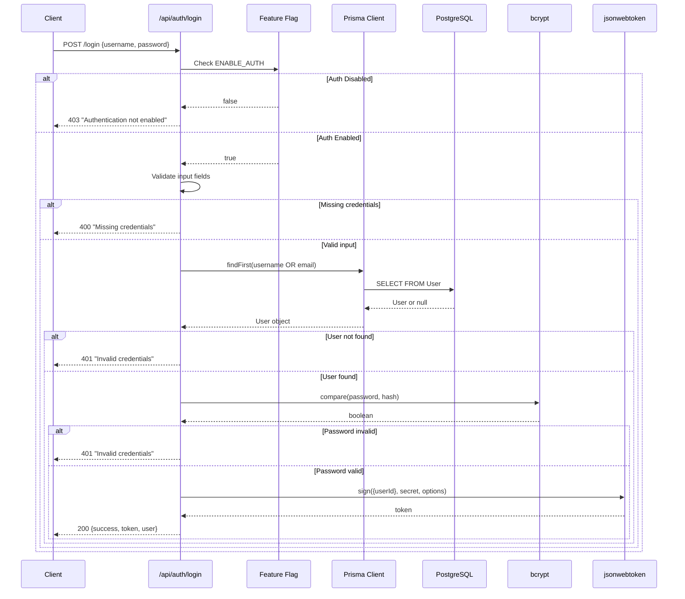
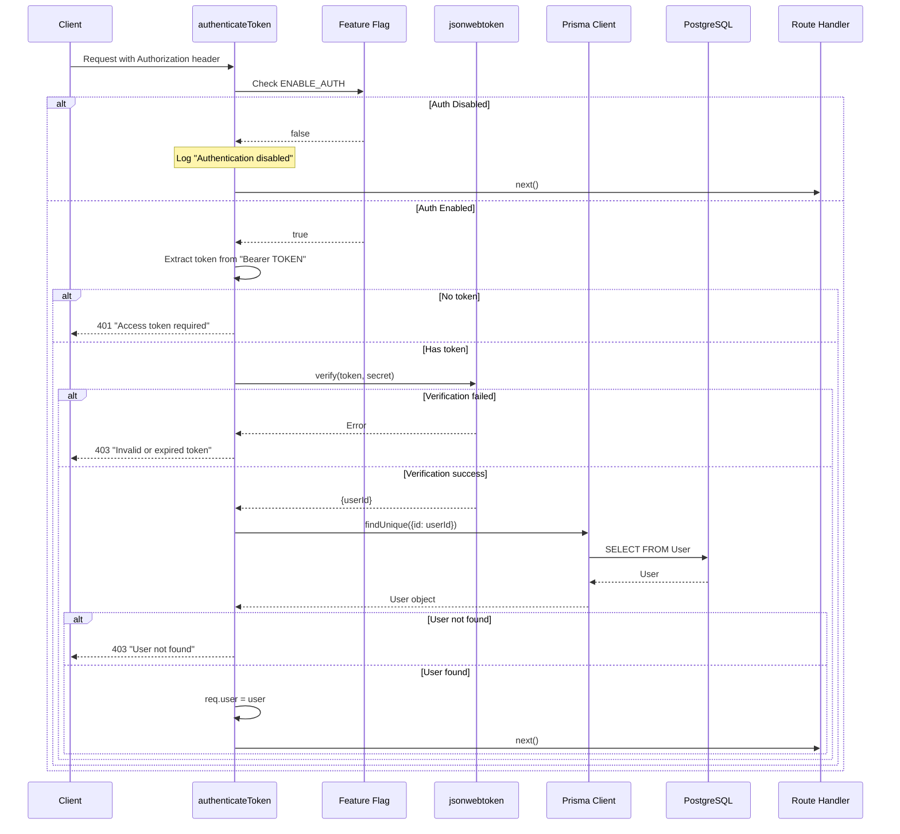

# DD-007: Authentication & Authorization Middleware

## Document Information

| Attribute | Value |
|-----------|-------|
| Version | 1.0.0 |
| Status | Documented (Existing Implementation) |
| Created | 2026-01-23 |
| Last Updated | 2026-01-23 |
| Author | Architecture Documentation |
| Parent PRD | [user-authentication-prd.md](../prd/user-authentication-prd.md) |
| Dependencies | None |
| Complexity Level | Medium |

---

## Agreement Checklist

| Agreement | Status | Reflected In |
|-----------|--------|--------------|
| Document current architecture only | Confirmed | Entire document |
| Do not propose changes | Confirmed | All sections descriptive only |
| JWT-based authentication system | Confirmed | Section 5: Authentication Flow |
| Feature flag control (ENABLE_AUTH) | Confirmed | Section 4.2: Feature Flag Mechanism |
| Zero-downtime deployment support | Confirmed | Section 4.2, 11.2: Deployment Characteristics |
| User registration and login via username/email | Confirmed | Section 6: Public API Interfaces |

---

## 1. Overview

### 1.1 Purpose

This Design Document describes the current architecture of the Authentication & Authorization Middleware component within the JustJeeps API backend. This component provides JWT-based authentication with feature flag control, enabling secure user management while supporting zero-downtime deployment through gradual rollout capabilities.

### 1.2 Scope

**In Scope:**
- JWT token generation and validation
- User registration and login endpoints
- Feature flag controlled authentication (`ENABLE_AUTH`)
- Password hashing with bcrypt
- Authentication middleware (`authenticateToken`, `optionalAuth`)
- User data model and seeding

**Out of Scope:**
- Role-based access control (RBAC) - planned future enhancement
- Password reset functionality - planned future enhancement
- OAuth/Social login integration - planned future enhancement
- Multi-factor authentication (MFA) - planned future enhancement
- Session refresh tokens - planned future enhancement
- Rate limiting and brute force protection - planned future enhancement

### 1.3 Complexity Rationale

**Complexity Level: Medium**

Rationale:
1. **Requirements/ACs**: 6 API endpoints with JWT handling, 2 middleware variants, feature flag conditional logic
2. **Constraints/Risks**:
   - Stateless JWT design requires careful token expiration management
   - Feature flag creates dual code paths in middleware
   - Password security requires proper bcrypt implementation
   - Database user lookup on each authenticated request

---

## 2. Existing Codebase Analysis

### 2.1 Implementation Path Mapping

| Component | File Path | Lines | Type |
|-----------|-----------|-------|------|
| Auth Routes | `/Users/ricardotassio/DEV/TRABALHO/JUSTJEEPS/JustJeepsAPI-back-end/routes/auth.js` | 1-212 | Existing |
| Auth Middleware | `/Users/ricardotassio/DEV/TRABALHO/JUSTJEEPS/JustJeepsAPI-back-end/middleware/auth.js` | 1-92 | Existing |
| User Model | `/Users/ricardotassio/DEV/TRABALHO/JUSTJEEPS/JustJeepsAPI-back-end/schema.prisma` | 145-153 | Existing |
| User Seed Script | `/Users/ricardotassio/DEV/TRABALHO/JUSTJEEPS/JustJeepsAPI-back-end/prisma/seeds/seed-individual/seed-users.js` | 1-72 | Existing |
| User Seed Data | `/Users/ricardotassio/DEV/TRABALHO/JUSTJEEPS/JustJeepsAPI-back-end/prisma/seeds/hard-code_data/users_data.js` | 1-49 | Existing |
| Server Integration | `/Users/ricardotassio/DEV/TRABALHO/JUSTJEEPS/JustJeepsAPI-back-end/server.js` | 19-21, 43-44 | Existing |

### 2.2 Similar Functionality Search Results

**Search Keywords Used**: auth, authentication, login, jwt, token, user, password

**Findings**:
- Authentication is centralized in dedicated `/routes/auth.js` and `/middleware/auth.js` files
- No duplicate authentication implementations found
- Clear separation between route handlers and middleware logic
- User model is minimal with no additional auth-related fields (no roles, no refresh tokens)

### 2.3 Integration Points with Existing Code

| Integration Point | Location | Coupling Level |
|-------------------|----------|----------------|
| Express Router | `server.js:44` | Route mounting (`/api/auth`) |
| Prisma Client | `routes/auth.js:9`, `middleware/auth.js:5` | Direct dependency |
| Environment Variables | Both files via `dotenv` | Configuration dependency |
| PurchaseOrder Model | `schema.prisma:158` | User foreign key reference |

---

## 3. Architecture Diagram

```mermaid
flowchart TB
    subgraph Client["API Consumers"]
        FE[Frontend Application]
        API[API Clients]
    end

    subgraph FeatureFlag["Feature Flag Layer"]
        FF{ENABLE_AUTH?}
    end

    subgraph AuthRoutes["Authentication Routes (/api/auth)"]
        direction TB
        LOGIN["POST /login"]
        REGISTER["POST /register"]
        ME["GET /me"]
        LOGOUT["POST /logout"]
        STATUS["GET /status"]
    end

    subgraph Middleware["Authentication Middleware"]
        direction TB
        AT["authenticateToken()"]
        OA["optionalAuth()"]
    end

    subgraph Services["Supporting Services"]
        direction TB
        JWT["jsonwebtoken"]
        BCRYPT["bcryptjs"]
    end

    subgraph Database["PostgreSQL Database"]
        direction TB
        UT[User Table]
        POT[PurchaseOrder Table]
    end

    subgraph Config["Configuration"]
        ENV[".env Variables"]
    end

    Client --> AuthRoutes
    Client --> Middleware

    AuthRoutes --> FF
    Middleware --> FF

    FF -->|true| JWT
    FF -->|true| BCRYPT
    FF -->|false| |"Bypass Auth"|

    JWT --> UT
    BCRYPT --> UT

    UT --> POT
    ENV -.-> FF
    ENV -.-> JWT

    style FF fill:#f9f,stroke:#333,stroke-width:2px
    style UT fill:#e8f5e9
    style POT fill:#e3f2fd
```

---

## 4. Data Flow Diagrams

### 4.1 Login Flow



### 4.2 Feature Flag Mechanism

```mermaid
flowchart TD
    subgraph Request["Incoming Request"]
        REQ[HTTP Request]
    end

    subgraph CheckAuth["Feature Flag Check"]
        FF{ENABLE_AUTH === 'true'?}
    end

    subgraph AuthEnabled["Auth Enabled Path"]
        HEADER[Extract Authorization Header]
        TOKEN[Parse Bearer Token]
        VERIFY[JWT Verify]
        LOOKUP[Database User Lookup]
        ATTACH[Attach user to req.user]
    end

    subgraph AuthDisabled["Auth Disabled Path"]
        LOG["Log: Authentication disabled"]
        SKIP[Skip authentication]
    end

    subgraph Next["Continue to Route Handler"]
        NEXT[next()]
    end

    subgraph Error["Error Responses"]
        E401[401 - Token required]
        E403[403 - Invalid token]
        E403U[403 - User not found]
    end

    REQ --> FF

    FF -->|false| LOG
    LOG --> SKIP
    SKIP --> NEXT

    FF -->|true| HEADER
    HEADER --> TOKEN
    TOKEN -->|No token| E401
    TOKEN -->|Has token| VERIFY
    VERIFY -->|Invalid| E403
    VERIFY -->|Valid| LOOKUP
    LOOKUP -->|Not found| E403U
    LOOKUP -->|Found| ATTACH
    ATTACH --> NEXT

    style FF fill:#ff9,stroke:#333,stroke-width:2px
    style AuthDisabled fill:#e8f5e9
    style AuthEnabled fill:#fff3e0
```

### 4.3 Token Validation Middleware Flow



---

## 5. Component Design

### 5.1 Auth Routes Module (`routes/auth.js`)

**Responsibilities:**
- Handle authentication API endpoints
- Generate JWT tokens
- Hash and verify passwords
- Manage user registration and login

**Internal Functions:**

| Function | Purpose | Parameters | Returns |
|----------|---------|------------|---------|
| `generateToken(userId)` | Create signed JWT | `userId: number` | `string` (JWT) |
| `hashPassword(password)` | bcrypt hash with salt | `password: string` | `Promise<string>` |

**Exported Router:**
- Express Router with 5 endpoint handlers

### 5.2 Auth Middleware Module (`middleware/auth.js`)

**Responsibilities:**
- Validate JWT tokens on protected routes
- Attach user information to request object
- Provide optional authentication for mixed-access routes

**Exported Functions:**

| Function | Purpose | Feature Flag Behavior |
|----------|---------|----------------------|
| `authenticateToken` | Require valid JWT | Disabled: `next()` without validation |
| `optionalAuth` | Attach user if token present | Disabled: `next()` without processing |

### 5.3 User Model (`schema.prisma`)

```prisma
model User {
  id             Int             @id @default(autoincrement())
  firstname      String
  lastname       String
  username       String
  email          String
  password       String
  purchaseOrders PurchaseOrder[]
}
```

**Notes:**
- No unique constraints at database level (enforced at application level)
- Password stored as bcrypt hash
- User linked to PurchaseOrder via foreign key

---

## 6. Public API Interfaces

### 6.1 POST /api/auth/login - User Authentication

**Location**: `routes/auth.js:27-97`

**Feature Flag**: Returns 403 when `ENABLE_AUTH !== 'true'`

**Request Body**:
```typescript
interface LoginRequest {
  username: string;  // Can be username OR email
  password: string;
}
```

**Success Response (200)**:
```typescript
interface LoginResponse {
  success: true;
  message: "Login successful";
  token: string;  // JWT token
  user: {
    id: number;
    username: string;
    email: string;
    firstname: string;
    lastname: string;
  };
}
```

**Error Responses**:
| Status | Condition | Response |
|--------|-----------|----------|
| 400 | Missing username or password | `{ error: "Missing credentials", message: "..." }` |
| 401 | Invalid credentials | `{ error: "Invalid credentials", message: "..." }` |
| 403 | Auth disabled | `{ error: "Authentication not enabled", message: "..." }` |
| 500 | Server error | `{ error: "Login failed", message: "..." }` |

---

### 6.2 POST /api/auth/register - User Registration

**Location**: `routes/auth.js:99-175`

**Feature Flag**: Returns 403 when `ENABLE_AUTH !== 'true'`

**Request Body**:
```typescript
interface RegisterRequest {
  username: string;
  email: string;
  password: string;
  firstname: string;
  lastname: string;
}
```

**Success Response (201)**:
```typescript
interface RegisterResponse {
  success: true;
  message: "Registration successful";
  token: string;  // JWT token
  user: {
    id: number;
    username: string;
    email: string;
    firstname: string;
    lastname: string;
  };
}
```

**Error Responses**:
| Status | Condition | Response |
|--------|-----------|----------|
| 400 | Missing required fields | `{ error: "Missing information", message: "..." }` |
| 403 | Auth disabled | `{ error: "Authentication not enabled", message: "..." }` |
| 409 | Duplicate username/email | `{ error: "User exists", message: "..." }` |
| 500 | Server error | `{ error: "Registration failed", message: "..." }` |

---

### 6.3 GET /api/auth/me - Current User Information

**Location**: `routes/auth.js:177-191`

**Middleware**: `authenticateToken` (requires valid JWT when auth enabled)

**Request Headers**:
```
Authorization: Bearer <JWT_TOKEN>
```

**Success Response (200)**:
```typescript
interface MeResponse {
  success: true;
  user: {
    id: number;
    username: string;
    email: string;
    firstname: string;
    lastname: string;
  };
}
```

**Error Responses**:
| Status | Condition | Response |
|--------|-----------|----------|
| 401 | Missing token (auth enabled) | `{ error: "Access token required", message: "..." }` |
| 403 | Invalid/expired token | `{ error: "Invalid or expired token", message: "..." }` |
| 500 | Server error | `{ error: "Failed to get user info", message: "..." }` |

---

### 6.4 POST /api/auth/logout - User Logout

**Location**: `routes/auth.js:193-200`

**Note**: Stateless logout - always succeeds, client responsible for token removal

**Success Response (200)**:
```typescript
interface LogoutResponse {
  success: true;
  message: "Logout successful";
}
```

---

### 6.5 GET /api/auth/status - Authentication Status Check

**Location**: `routes/auth.js:202-210`

**Note**: Always accessible (no authentication required)

**Success Response (200)**:
```typescript
interface StatusResponse {
  authEnabled: boolean;
  message: string;  // Human-readable status
}
```

**Examples**:
```json
// When ENABLE_AUTH=true
{ "authEnabled": true, "message": "Authentication is enabled" }

// When ENABLE_AUTH=false or not set
{ "authEnabled": false, "message": "Authentication is disabled" }
```

---

## 7. Middleware Interfaces

### 7.1 authenticateToken

**Location**: `middleware/auth.js:8-58`

**Usage**:
```javascript
router.get('/protected', authenticateToken, (req, res) => {
  // req.user available when auth enabled
});
```

**Behavior Matrix**:
| ENABLE_AUTH | Token Present | Token Valid | User Exists | Result |
|-------------|---------------|-------------|-------------|--------|
| false | N/A | N/A | N/A | `next()` called |
| true | No | N/A | N/A | 401 response |
| true | Yes | No | N/A | 403 response |
| true | Yes | Yes | No | 403 response |
| true | Yes | Yes | Yes | `req.user` set, `next()` called |

**Request Object Mutation**:
```typescript
// After successful authentication
req.user = {
  id: number;
  username: string;
  email: string;
  firstname: string;
  lastname: string;
};
```

---

### 7.2 optionalAuth

**Location**: `middleware/auth.js:60-87`

**Usage**:
```javascript
router.get('/mixed', optionalAuth, (req, res) => {
  if (req.user) {
    // Authenticated user
  } else {
    // Anonymous access
  }
});
```

**Behavior Matrix**:
| ENABLE_AUTH | Token Present | Token Valid | User Exists | Result |
|-------------|---------------|-------------|-------------|--------|
| false | N/A | N/A | N/A | `next()` called, no `req.user` |
| true | No | N/A | N/A | `next()` called, no `req.user` |
| true | Yes | No | N/A | `next()` called, no `req.user` |
| true | Yes | Yes | No | `next()` called, no `req.user` |
| true | Yes | Yes | Yes | `req.user` set, `next()` called |

**Note**: `optionalAuth` never returns error responses - it silently continues without user

---

## 8. Data Contracts

### 8.1 JWT Token Payload

```typescript
interface JWTPayload {
  userId: number;   // User.id from database
  iat: number;      // Issued at (Unix timestamp)
  exp: number;      // Expiration (Unix timestamp)
}
```

**Token Configuration**:
| Setting | Source | Default |
|---------|--------|---------|
| Algorithm | jsonwebtoken default | HS256 |
| Secret | `process.env.JWT_SECRET` | Required |
| Expiration | `process.env.JWT_EXPIRES_IN` | "24h" |

### 8.2 User Entity

```typescript
interface User {
  id: number;           // Auto-increment primary key
  firstname: string;    // Required
  lastname: string;     // Required
  username: string;     // Required (unique at app level)
  email: string;        // Required (unique at app level)
  password: string;     // bcrypt hash (10 salt rounds)
}

// User response object (excludes password)
interface UserResponse {
  id: number;
  username: string;
  email: string;
  firstname: string;
  lastname: string;
}
```

### 8.3 Password Security

| Property | Value |
|----------|-------|
| Hash Algorithm | bcrypt |
| Salt Rounds | 10 |
| Comparison | `bcrypt.compare()` (timing-safe) |
| Storage | Hash only (never plaintext) |

---

## 9. Integration Point Map

```yaml
Integration Point 1:
  Existing Component: server.js Express application
  Integration Method: Router mounting at /api/auth
  Impact Level: Low (Isolated module)
  Required Test Coverage: Route accessibility

Integration Point 2:
  Existing Component: Prisma Client (User model)
  Integration Method: Direct database queries
  Impact Level: Medium (Read/Write operations)
  Required Test Coverage: User CRUD operations

Integration Point 3:
  Existing Component: Environment Configuration
  Integration Method: process.env variable access
  Impact Level: High (Feature flag controls behavior)
  Required Test Coverage: Both enabled/disabled paths

Integration Point 4:
  Existing Component: PurchaseOrder model
  Integration Method: Foreign key relationship (user_id)
  Impact Level: Low (Read-only reference)
  Required Test Coverage: User deletion constraints
```

---

## 10. Integration Boundary Contracts

### 10.1 JWT Service Boundary

```yaml
Boundary Name: jsonwebtoken Integration
  Input:
    - sign(): payload object, secret string, options object
    - verify(): token string, secret string
  Output:
    - sign(): Synchronous string (JWT token)
    - verify(): Asynchronous callback with error or decoded payload
  On Error:
    - sign(): Throws Error
    - verify(): Callback receives error object (TokenExpiredError, JsonWebTokenError)
```

### 10.2 Password Service Boundary

```yaml
Boundary Name: bcryptjs Integration
  Input:
    - hash(): password string, salt rounds number
    - compare(): password string, hash string
  Output:
    - hash(): Promise<string> (hashed password)
    - compare(): Promise<boolean> (match result)
  On Error: Throws Error (invalid input)
```

### 10.3 Database Boundary

```yaml
Boundary Name: Prisma User Operations
  Input: Prisma query objects (findFirst, findUnique, create)
  Output: Promise resolving to User object or null
  On Error: Throws PrismaClientKnownRequestError or PrismaClientUnknownRequestError
```

---

## 11. Change Impact Map

```yaml
Change Target: Authentication & Authorization Middleware
Direct Impact:
  - /Users/ricardotassio/DEV/TRABALHO/JUSTJEEPS/JustJeepsAPI-back-end/routes/auth.js
  - /Users/ricardotassio/DEV/TRABALHO/JUSTJEEPS/JustJeepsAPI-back-end/middleware/auth.js
  - /Users/ricardotassio/DEV/TRABALHO/JUSTJEEPS/JustJeepsAPI-back-end/server.js (import/mount lines)

Indirect Impact:
  - Frontend AuthContext (consumes /api/auth endpoints)
  - Any route using authenticateToken or optionalAuth middleware
  - PurchaseOrder creation (requires user_id foreign key)

No Ripple Effect:
  - Product endpoints (no auth middleware applied)
  - Order endpoints (no auth middleware applied)
  - Vendor endpoints (no auth middleware applied)
  - Health check endpoint
  - Data seeding scripts (except seed-users.js)
```

---

## 12. Current Behavior Characteristics

### 12.1 Security Characteristics

| Aspect | Implementation | Notes |
|--------|---------------|-------|
| Password Storage | bcrypt hash (10 rounds) | Industry standard |
| Token Algorithm | HS256 | JWT default, symmetric |
| Token Expiration | Configurable (default 24h) | Via `JWT_EXPIRES_IN` |
| Credential Enumeration | Prevented | Generic "Invalid credentials" message |
| Token Storage | Client-side (localStorage) | Frontend responsibility |
| Token Invalidation | None (stateless) | Logout is client-side only |

### 12.2 Deployment Characteristics

| Characteristic | Value | Implication |
|----------------|-------|-------------|
| Feature Flag Default | `false` | Safe deployment (auth disabled) |
| Backward Compatibility | Full | Existing clients unaffected |
| Zero Downtime | Supported | Toggle via environment variable |
| Restart Required | Yes | To change ENABLE_AUTH |

### 12.3 Performance Characteristics

| Operation | Database Queries | Estimated Latency |
|-----------|------------------|-------------------|
| Login | 1 (findFirst) | ~50-100ms (+ bcrypt ~100ms) |
| Register | 2 (findFirst, create) | ~100-200ms (+ bcrypt ~100ms) |
| Token Validation | 1 (findUnique) | ~20-50ms |
| Status Check | 0 | ~1ms |

### 12.4 Error Handling Pattern

```javascript
// Consistent try/catch pattern across all endpoints
try {
  // Authentication logic
  res.json({ success: true, ... });
} catch (error) {
  console.error('Operation error:', error);
  res.status(500).json({
    error: 'Operation failed',
    message: 'Internal server error during operation'
  });
}
```

---

## 13. Acceptance Criteria (Current Implementation)

### 13.1 Feature Flag Acceptance Criteria

| ID | Criterion | Verification Method |
|----|-----------|---------------------|
| AC-FF01 | When ENABLE_AUTH=false, authenticateToken calls next() without validation | Unit test with mocked env |
| AC-FF02 | When ENABLE_AUTH=false, login/register return 403 | API call returns 403 |
| AC-FF03 | GET /api/auth/status correctly reports authEnabled boolean | API call verification |
| AC-FF04 | Feature flag change requires server restart | Manual verification |

### 13.2 Login Acceptance Criteria

| ID | Criterion | Verification Method |
|----|-----------|---------------------|
| AC-L01 | Login accepts username field as username OR email | Test both formats |
| AC-L02 | Successful login returns JWT token and user object | Response body check |
| AC-L03 | Invalid credentials return 401 with generic message | Test wrong password |
| AC-L04 | Missing credentials return 400 | Test empty body |

### 13.3 Registration Acceptance Criteria

| ID | Criterion | Verification Method |
|----|-----------|---------------------|
| AC-R01 | Registration creates user with bcrypt-hashed password | DB inspection |
| AC-R02 | Duplicate username/email returns 409 | Test duplicate |
| AC-R03 | Successful registration returns JWT and user | Response check |
| AC-R04 | All fields required (username, email, password, firstname, lastname) | Test missing fields |

### 13.4 Middleware Acceptance Criteria

| ID | Criterion | Verification Method |
|----|-----------|---------------------|
| AC-M01 | authenticateToken attaches user to req.user on valid token | Middleware test |
| AC-M02 | authenticateToken returns 401 on missing token | API test |
| AC-M03 | authenticateToken returns 403 on invalid/expired token | API test |
| AC-M04 | optionalAuth never returns errors, only attaches user | Middleware test |
| AC-M05 | optionalAuth continues without user on invalid token | Middleware test |

---

## 14. Known Limitations

1. **No Token Blacklisting**: JWT tokens cannot be invalidated server-side before expiration
2. **No Refresh Tokens**: Users must re-login when token expires
3. **No Rate Limiting**: Auth endpoints vulnerable to brute force (planned enhancement)
4. **No Unique Database Constraints**: Username/email uniqueness enforced at application level only
5. **Single JWT Secret**: All tokens signed with same secret (no key rotation)
6. **No Password Complexity Rules**: Any password accepted
7. **No Audit Logging**: Security events not logged
8. **Synchronous Password Hashing**: bcrypt blocks event loop during hash operations

---

## 15. Environment Configuration

### 15.1 Required Variables

| Variable | Description | Required | Default |
|----------|-------------|----------|---------|
| `ENABLE_AUTH` | Feature flag to enable authentication | Yes | `false` |
| `JWT_SECRET` | Secret key for signing tokens | When auth enabled | None |
| `JWT_EXPIRES_IN` | Token expiration duration | No | `"24h"` |

### 15.2 Security Recommendations

```bash
# Generate secure JWT secret (64+ characters recommended)
node -e "console.log(require('crypto').randomBytes(64).toString('hex'))"

# Production .env example
ENABLE_AUTH=true
JWT_SECRET=<generated-64-char-hex-string>
JWT_EXPIRES_IN=24h
```

---

## 16. User Seeding

### 16.1 Seeding Script

**Location**: `prisma/seeds/seed-individual/seed-users.js`

**Command**: `npm run seed-users`

**Behavior**:
- Hashes passwords using bcrypt (10 rounds)
- Upserts users (creates or updates)
- Safe to run multiple times

### 16.2 Seed User Data

| Username | Email | Purpose |
|----------|-------|---------|
| jerry | jerry@justjeeps.com | Staff |
| jacob | jkemper@justjeeps.com | Staff |
| david | dhunter@justjeeps.com | Staff |
| paula | pmello@justjeeps.com | Staff |
| tess | tsantos@justjeeps.com | Staff |
| rafael | rafaelp@justjeeps.com | Staff |

**Note**: Passwords are stored in `users_data.js` as plaintext and hashed during seeding.

---

## 17. References

### Internal Documentation
- [User Authentication PRD](../prd/user-authentication-prd.md)
- [README-AUTHENTICATION.md](/Users/ricardotassio/DEV/TRABALHO/JUSTJEEPS/JustJeepsAPI-back-end/README-AUTHENTICATION.md)
- [SECURITY.md](/Users/ricardotassio/DEV/TRABALHO/JUSTJEEPS/JustJeepsAPI-back-end/SECURITY.md)
- [CLAUDE.md](/Users/ricardotassio/DEV/TRABALHO/JUSTJEEPS/JustJeepsAPI-back-end/CLAUDE.md)

### External References
- [JSON Web Token (JWT) RFC 7519](https://tools.ietf.org/html/rfc7519)
- [bcrypt Password Hashing](https://en.wikipedia.org/wiki/Bcrypt)
- [OWASP Authentication Cheat Sheet](https://cheatsheetseries.owasp.org/cheatsheets/Authentication_Cheat_Sheet.html)
- [Express.js Middleware Documentation](https://expressjs.com/en/guide/using-middleware.html)

### Source Files
- `/Users/ricardotassio/DEV/TRABALHO/JUSTJEEPS/JustJeepsAPI-back-end/routes/auth.js`
- `/Users/ricardotassio/DEV/TRABALHO/JUSTJEEPS/JustJeepsAPI-back-end/middleware/auth.js`
- `/Users/ricardotassio/DEV/TRABALHO/JUSTJEEPS/JustJeepsAPI-back-end/schema.prisma` (lines 145-153)
- `/Users/ricardotassio/DEV/TRABALHO/JUSTJEEPS/JustJeepsAPI-back-end/prisma/seeds/seed-individual/seed-users.js`
- `/Users/ricardotassio/DEV/TRABALHO/JUSTJEEPS/JustJeepsAPI-back-end/prisma/seeds/hard-code_data/users_data.js`
- `/Users/ricardotassio/DEV/TRABALHO/JUSTJEEPS/JustJeepsAPI-back-end/server.js` (lines 19-21, 43-44)

---

## Change History

| Version | Date | Author | Changes |
|---------|------|--------|---------|
| 1.0.0 | 2026-01-23 | Architecture Documentation | Initial documentation of existing implementation |
