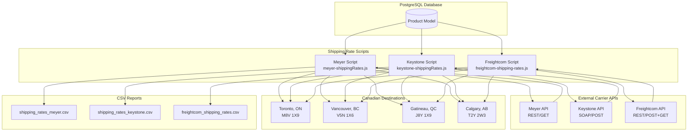
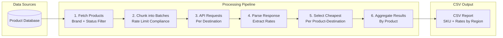
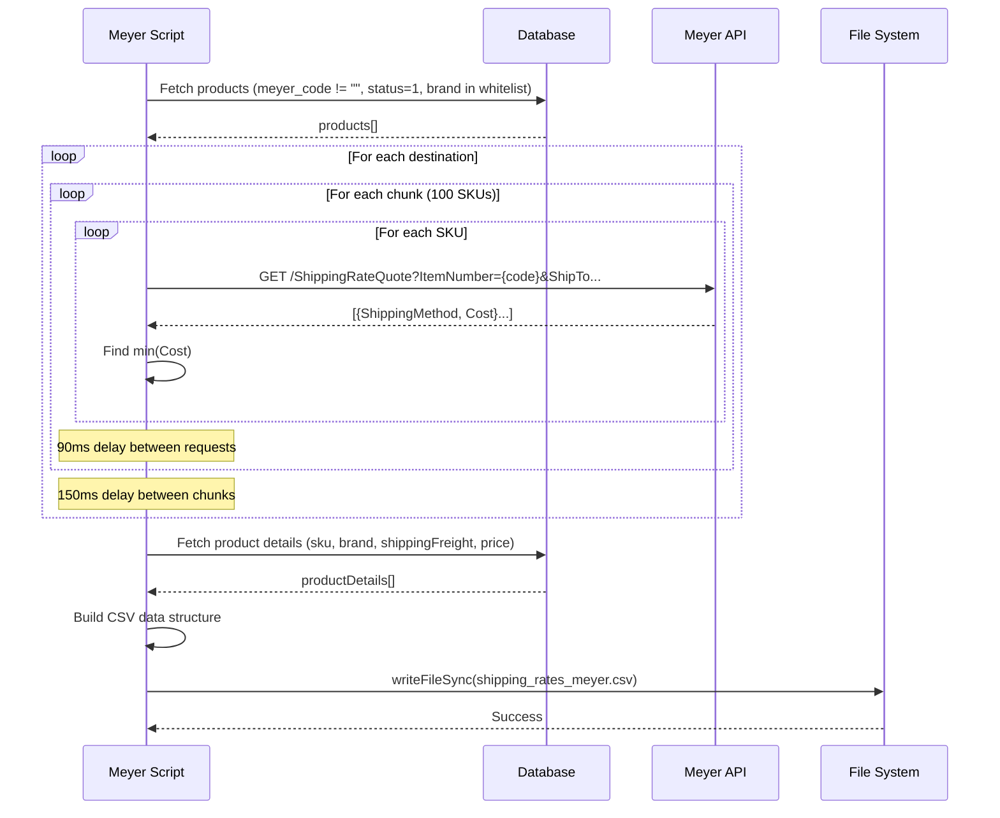
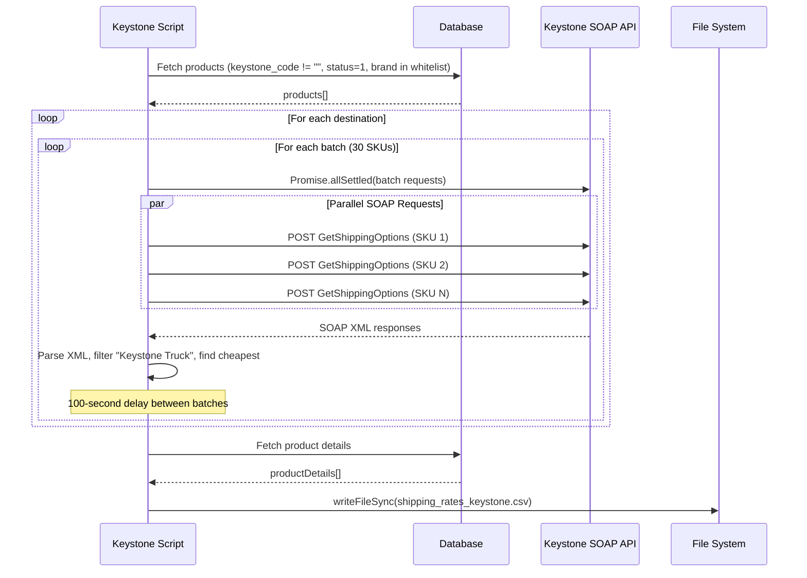
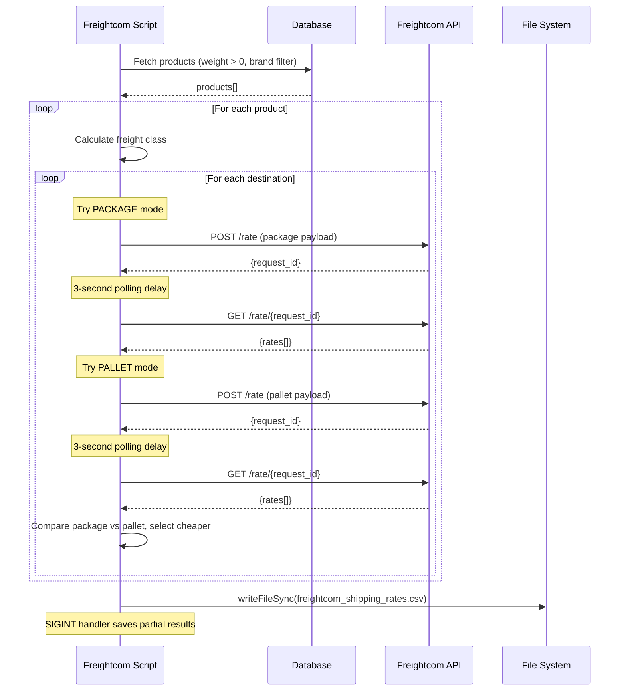
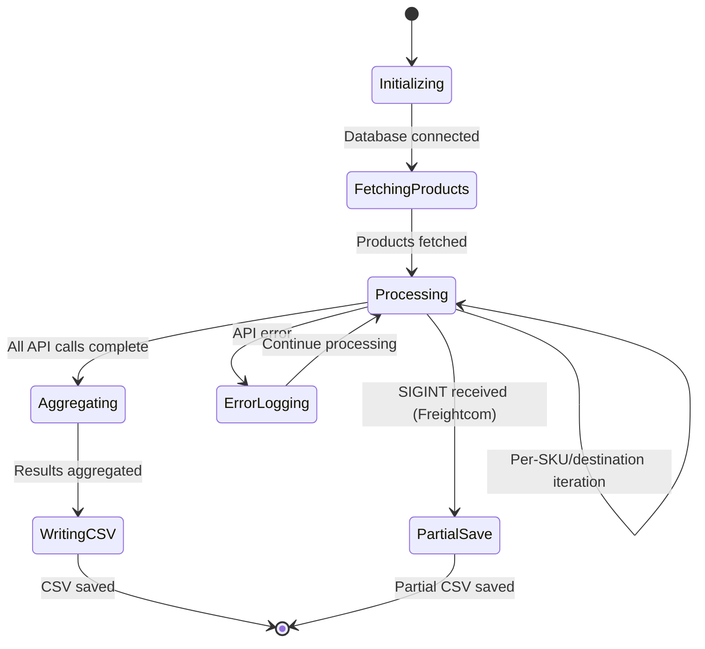

# DD-008: Shipping Rate Calculation Service - Design Document

**Version**: 1.0.0
**Status**: Accepted (Documentation of Existing Architecture)
**Created**: 2026-01-23
**Last Updated**: 2026-01-23
**Author**: System (Reverse-Engineered from Implementation)

---

## Agreement Checklist

This document captures the existing architecture. No new implementation is proposed.

- [x] **Scope**: Document current shipping rate calculation system across three carrier APIs
- [x] **Non-scope**: No architectural changes or new feature proposals
- [x] **Constraints**: Existing rate limits, authentication flows, and CSV output formats preserved
- [x] **Dependencies**: Product model with vendor codes and dimension fields

---

## Prerequisite ADRs

None currently documented. The following common ADR topics should be considered for future documentation:

- ADR-COMMON-001: Error Handling Strategy (implicit: continue processing with error logging)
- ADR-COMMON-003: Rate Limiting Patterns (carrier-specific rate limiting)
- ADR-COMMON-005: Batch Processing Patterns (chunking strategies)

---

## Executive Summary

The Shipping Rate Calculation Service is a batch processing system that calculates shipping rates for products across three carrier APIs (Meyer, Keystone, Freightcom). The system generates CSV reports identifying the cheapest shipping options per product across four major Canadian metropolitan destinations (Toronto, Vancouver, Gatineau, Calgary). This enables data-driven shipping cost analysis for pricing decisions and shipping charge configuration.

---

## Existing Codebase Analysis

### Implementation Path Mapping

| Component | File Path | Status |
|-----------|-----------|--------|
| Meyer Shipping Script | `/prisma/seeds/api-calls/meyer-shippingRates.js` | Existing |
| Keystone Shipping Script | `/prisma/seeds/api-calls/keystone-shippingRates.js` | Existing |
| Freightcom Shipping Script | `/prisma/seeds/api-calls/freightcom-shipping-rates.js` | Existing |
| Product Model | `/prisma/schema.prisma` | Existing |
| NPM Scripts | `/package.json` (lines 30-32) | Existing |
| CSV Output Directory | `/prisma/seeds/api-calls/api-csv-responses/` | Existing |

### Similar Functionality Search Results

No duplicate shipping rate functionality was found. Each carrier integration is unique due to:
- Different API protocols (REST, SOAP)
- Unique authentication mechanisms
- Carrier-specific rate structures and response formats
- Different product filtering criteria

---

## Architecture Overview

### Architecture Diagram



### Data Flow Diagram



---

## Component Design

### 1. Meyer Shipping Rate Script

**Purpose**: Calculate shipping rates from Meyer Distributing API for products with `meyer_code`.

**Execution**: `npm run meyer-shipping`

**Process Flow**:

```
getMeyerShippingRates()
├── Fetch products (status=1, meyer_code != "", brand in whitelist)
├── Chunk products into batches of 100
├── For each destination (4 cities)
│   └── For each chunk
│       └── makeRequests(chunk, chunkIndex, address)
│           └── For each product
│               ├── Call Meyer ShippingRateQuote API
│               ├── Find cheapest option (min Cost)
│               └── Return {brand_name, sku, destination, cheapest_shipping}
├── Aggregate all responses
└── saveToCSV(allResponses)
    ├── Create product lookup map from database
    ├── Build CSV rows with rates per region
    └── Write to file
```

**API Integration Details**:

| Aspect | Detail |
|--------|--------|
| Endpoint | `https://meyerapi.meyerdistributing.com/http/default/ProdAPI/v2/ShippingRateQuote` |
| Method | GET |
| Authentication | `Authorization: Espresso {MEYER_KEY}` |
| Parameters | ItemNumber, ShipToAddress1, ShipToCity, Quantity, ShipToZipcode, ShipToCountry, ShipToState |
| Response | JSON array of shipping options with `Cost` field |
| Rate Control | 90ms delay between requests, 150ms delay between chunks |
| Batch Size | 100 SKUs per chunk |

**Brand Whitelist**: The script filters products by 200+ approved brand names including: Rancho, Thule Racks, Bilstein, K&N, Rough Country, BDS Suspension, and many others.

### 2. Keystone Shipping Rate Script

**Purpose**: Calculate shipping rates from Keystone SOAP API for products with `keystone_code`.

**Execution**: `npm run keystone-shipping`

**Process Flow**:

```
getKeystoneShippingRates()
├── Fetch products (status=1, keystone_code != "", brand in whitelist)
├── Process in batches of 30 SKUs
├── For each destination (4 cities)
│   └── For each batch
│       └── Promise.allSettled(batch.map(makeRequests))
│           └── makeRequests({keystone_code, brand_name}, address)
│               ├── Build SOAP XML request
│               ├── Call Keystone GetShippingOptions
│               ├── Parse XML response
│               ├── Filter out "Keystone Truck" and zero-cost options
│               └── Find cheapest valid option
├── Wait 100 seconds between batches
├── Aggregate responses
└── saveToCSV(allResponses)
```

**API Integration Details**:

| Aspect | Detail |
|--------|--------|
| Endpoint | `http://order.ekeystone.com/wselectronicorder/electronicorder.asmx` |
| Method | POST (SOAP) |
| Authentication | API Key + Account Number in SOAP body |
| Parameters | Key, FullAccountNo, FullPartNo, ToZip |
| Response | SOAP/XML with Rates array containing Name and Rate |
| Rate Control | 100-second delay between batches |
| Batch Size | 30 SKUs per batch |
| Filter | Excludes "Keystone Truck" service; filters rates > $0 |

**SOAP Request Structure**:

```xml
<soapenv:Envelope xmlns:soapenv="http://schemas.xmlsoap.org/soap/envelope/"
    xmlns:ekey="http://eKeystone.com">
  <soapenv:Header/>
  <soapenv:Body>
    <ekey:GetShippingOptions>
      <ekey:Key>{KEYSTONE_KEY_DS}</ekey:Key>
      <ekey:FullAccountNo>{KEYSTONE_ACCOUNT_DS}</ekey:FullAccountNo>
      <ekey:FullPartNo>{keystone_code}</ekey:FullPartNo>
      <ekey:ToZip>{postal_code}</ekey:ToZip>
    </ekey:GetShippingOptions>
  </soapenv:Body>
</soapenv:Envelope>
```

### 3. Freightcom Shipping Rate Script

**Purpose**: Calculate LTL freight and parcel rates via Freightcom API for products with weight data.

**Execution**: `npm run freightcom`

**Process Flow**:

```
fetchFreightcomRates()
├── Fetch products (status=1, weight > 0, brand in filter)
├── Optional: Filter for pallet-eligible products (dimWeight > 139 || weight > 150)
├── For each product
│   ├── Calculate freight class from density
│   ├── For each destination (4 cities)
│   │   ├── Try PACKAGE mode
│   │   │   ├── POST to /rate (async request)
│   │   │   ├── Wait 3 seconds
│   │   │   └── GET /rate/{request_id} (retrieve rates)
│   │   ├── Try PALLET mode
│   │   │   └── Same POST/GET flow
│   │   └── Select cheaper of package vs pallet
│   └── Build result row
├── Handle SIGINT for partial save
└── Write CSV with all carrier options
```

**API Integration Details**:

| Aspect | Detail |
|--------|--------|
| Endpoint | `https://customer-external-api.ssd-test.freightcom.com/rate` |
| Method | POST (initiate) + GET (retrieve) |
| Authentication | `Authorization: {FREIGHTCOM_API_KEY}` |
| Parameters | services, origin, destination, packaging_type, packaging_properties |
| Modes | Package (parcel) and Pallet (LTL freight) |
| Response | JSON with rates array containing `total.value` (in cents) |
| Polling | 3-second delay between request and retrieval |
| Carriers | 200+ service codes (UPS, FedEx, Purolator, Canada Post, DHL, regional LTL) |

**Freight Class Calculation**:

```javascript
function calculateFreightClass(length, width, height, weight) {
  // If dimensions unknown, use weight-based defaults
  if (!length || !width || !height) {
    if (weight > 300) return "500";
    if (weight > 200) return "400";
    if (weight > 150) return "300";
    // ... etc
  }

  // Density-based calculation
  const volumeCubicFeet = (length * width * height) / 1728;
  const density = weight / volumeCubicFeet;

  if (density > 50) return "50";
  if (density > 35) return "55";
  // ... NMFC class mapping
}
```

**Weight-Only Product Handling**:

When products lack dimensions, the script uses estimated package sizes:

| Weight Range | Estimated L x W x H (inches) |
|--------------|------------------------------|
| <= 5 lbs | 8 x 6 x 4 |
| <= 15 lbs | 12 x 8 x 6 |
| <= 30 lbs | 16 x 12 x 8 |
| > 30 lbs | 20 x 16 x 12 |

For pallet mode with unknown dimensions, standard pallet size (48 x 40 x 48) is used.

---

## Data Contracts

### Product Model Fields Used

```prisma
model Product {
  sku                String   @id @unique
  status             Int?     // Filter: status = 1 (active)
  brand_name         String?  // Used for brand filtering

  // Carrier-specific codes
  meyer_code         String?  // Used by Meyer shipping script
  keystone_code      String?  // Used by Keystone shipping script

  // Dimensions for Freightcom
  weight             Float?   // Required for Freightcom
  length             Float?   // Optional (inches)
  width              Float?   // Optional (inches)
  height             Float?   // Optional (inches)

  // Output field
  shippingFreight    String?  // Target for calculated rates
  price              Float    // Included in CSV output
}
```

### CSV Output Contracts

**Meyer/Keystone CSV Format**:

| Column | Type | Description |
|--------|------|-------------|
| Meyer_Code / Keystone_Code | String | Vendor-specific product code |
| SKU | String | Internal JustJeeps SKU |
| Brand | String | Product brand name |
| Shipping_Freight | String | Current shippingFreight value from database |
| Vancouver | Number/String | Cheapest rate to Vancouver, BC |
| Ontario | Number/String | Cheapest rate to Toronto, ON |
| Quebec | Number/String | Cheapest rate to Gatineau, QC |
| Alberta | Number/String | Cheapest rate to Calgary, AB |
| Price | Number | Product price |

**Freightcom CSV Format**:

| Column | Type | Description |
|--------|------|-------------|
| Meyer_Code | String | Vendor code or SKU fallback |
| SKU | String | Internal JustJeeps SKU |
| Brand | String | Product brand name |
| Price | Number | Product price |
| Length | Number | Product length (inches) or "N/A" |
| Width | Number | Product width (inches) or "N/A" |
| Height | Number | Product height (inches) or "N/A" |
| Weight | Number | Product weight (lbs) |
| {City} best price | String | Cheapest rate formatted as "$XX.XX" |
| {City} best carrier | String | Carrier and service name |
| {City} all rates | String | All rates (newline-separated) |

### Destination Address Contract

```javascript
const destinations = [
  { city: "TORONTO", state: "ON", zip: "M8V 1X9", label: "Ontario" },
  { city: "VANCOUVER", state: "BC", zip: "V5N 1X6", label: "Vancouver" },
  { city: "GATINEAU", state: "QC", zip: "J8Y 1X9", label: "Quebec" },
  { city: "CALGARY", state: "AB", zip: "T2Y 2W3", label: "Alberta" }
];
```

### Origin Address Contract (Freightcom)

```javascript
const ORIGIN = {
  name: "Just Jeeps Warehouse",
  address: {
    address_line_1: "128 Oakdale Road",
    city: "North York",
    region: "ON",
    country: "CA",
    postal_code: "M3N 1V9"
  },
  phone_number: {
    number: "5554447777",
    extension: "123"
  }
};
```

---

## Integration Point Map

### Integration Points

```yaml
Integration Point 1:
  Existing Component: Product model (Product.sku, meyer_code, keystone_code)
  Integration Method: Prisma query with brand/status filters
  Impact Level: Medium (Read-only data source)
  Required Test Coverage: SKU retrieval and code presence validation

Integration Point 2:
  Existing Component: Product.shippingFreight field
  Integration Method: Read-only in CSV generation (not updated by scripts)
  Impact Level: Low (Read-only reference)
  Required Test Coverage: Ensure existing values are preserved in output

Integration Point 3:
  Existing Component: External Carrier APIs
  Integration Method: HTTP requests (REST/SOAP)
  Impact Level: High (External dependency)
  Required Test Coverage: Error handling for API failures

Integration Point 4:
  Existing Component: File system (CSV output)
  Integration Method: fs.writeFileSync
  Impact Level: Medium (Output generation)
  Required Test Coverage: File creation and format validation
```

### Integration Boundary Contracts

```yaml
Meyer API Boundary:
  Input: ItemNumber (string), ShipTo address fields
  Output: JSON array of {ShippingMethod, Cost, EstimatedDays} (sync)
  On Error: Return empty array, log error, mark as "Error" in output

Keystone API Boundary:
  Input: SOAP XML with FullPartNo and ToZip
  Output: SOAP XML with Rates array containing Name and Rate (sync)
  On Error: Return N/A, log error, continue processing

Freightcom API Boundary:
  Input: Rate request JSON with packaging details
  Output: {request_id} (async), then rates array with total.value in cents
  On Error: Log error, continue to next mode/product

CSV Output Boundary:
  Input: Aggregated rate results by product and destination
  Output: CSV file with header row and data rows
  On Error: Partial save on SIGINT (Freightcom only)
```

---

## Change Impact Map

This document describes existing architecture. No changes are proposed.

```yaml
Change Target: N/A (Documentation Only)
Direct Impact: None
Indirect Impact: None
No Ripple Effect:
  - meyer-shippingRates.js (unchanged)
  - keystone-shippingRates.js (unchanged)
  - freightcom-shipping-rates.js (unchanged)
  - Product model (unchanged)
  - CSV output format (unchanged)
```

---

## Sequence Diagrams

### Meyer Shipping Rate Flow



### Keystone Shipping Rate Flow



### Freightcom Shipping Rate Flow



---

## Error Handling Strategy

### Partial Failure Model

All three scripts implement a "continue on error" pattern:

```javascript
// Pattern used across all scripts
try {
  const response = await callCarrierAPI(sku, destination);
  results.push(processResponse(response));
} catch (error) {
  console.error(`Error for SKU ${sku} to ${destination}: ${error.message}`);
  results.push({
    sku: sku,
    destination: destination,
    cheapest_shipping: "Error"  // or "N/A"
  });
  // Continue processing remaining items
}
```

### Error Status Values

| Script | Error Value | No Data Value | Notes |
|--------|-------------|---------------|-------|
| Meyer | "Error" | "N/A" | Empty response = "N/A" |
| Keystone | "Error" | "N/A" | Missing Rates = "N/A" |
| Freightcom | N/A (skipped) | "N/A" | No error rows, only skipped |

### Rate Limit Compliance

| Carrier | Rate Limit Strategy | Implementation |
|---------|--------------------|--------------------|
| Meyer | Request-level delay | 90ms `setTimeout` between requests |
| Meyer | Chunk-level delay | 150ms `setTimeout` between chunks |
| Keystone | Batch-level delay | 100-second delay between 30-SKU batches |
| Freightcom | Polling delay | 3-second wait after request submission |

### Partial Save (Freightcom Only)

```javascript
process.on("SIGINT", () => {
  console.log("\nProcess interrupted. Saving partial results...");
  savePartialCSV();
  process.exit();
});
```

---

## State Management

### Script Execution States



### In-Memory Data Structures

**Meyer/Keystone Result Structure**:

```javascript
const allResponses = {
  "TORONTO": [
    { brand_name, sku, destination, cheapest_shipping }
  ],
  "VANCOUVER": [...],
  "GATINEAU": [...],
  "CALGARY": [...]
};
```

**Freightcom Result Structure**:

```javascript
const results = [
  {
    Meyer_Code: string,
    SKU: string,
    Brand: string,
    Price: string,
    Length: number | "N/A",
    Width: number | "N/A",
    Height: number | "N/A",
    Weight: number,
    "Toronto best price": string,
    "Toronto best carrier": string,
    "Toronto all rates": string,
    // ... other destinations
  }
];
```

---

## Test Strategy

### Unit Test Coverage

| Component | Test Focus | Status |
|-----------|------------|--------|
| Meyer makeRequests | Rate extraction, min cost calculation | Not implemented |
| Meyer saveToCSV | CSV format, product mapping | Not implemented |
| Keystone XML parsing | SOAP response parsing | Not implemented |
| Keystone rate filtering | Exclude Keystone Truck, filter > $0 | Not implemented |
| Freightcom freight class | Density calculation, class mapping | Not implemented |
| Freightcom mode comparison | Package vs pallet selection | Not implemented |

### Integration Test Scenarios

1. **Meyer API Authentication**: Verify Espresso token authentication
2. **Keystone SOAP Parsing**: Test XML response parsing with various rate structures
3. **Freightcom Async Flow**: Test request/poll/retrieve pattern
4. **CSV Output Format**: Validate header and data row structure
5. **Error Handling**: Verify script continues after individual API failures

### E2E Verification Procedures

**Meyer Script**:
1. Run `npm run meyer-shipping`
2. Verify CSV created at configured path
3. Spot-check: rates should be numeric or "N/A"/"Error"
4. Verify all four destination columns populated

**Keystone Script**:
1. Run `npm run keystone-shipping`
2. Verify CSV created at configured path
3. Confirm no "Keystone Truck" rates in output
4. Verify rate values extracted from formatted strings

**Freightcom Script**:
1. Run `npm run freightcom`
2. Verify CSV includes best price, carrier, and all rates
3. Confirm freight class calculation for products with dimensions
4. Test SIGINT handling (Ctrl+C) produces partial CSV

---

## Non-Functional Requirements

### Performance

| Metric | Target | Notes |
|--------|--------|-------|
| Meyer full catalog | Variable | Depends on product count and rate limits |
| Keystone full catalog | Long | 100-second delays between batches |
| Freightcom per product | ~10 seconds | 2 modes x 4 destinations x 3s polling |
| CSV write | < 1 second | In-memory aggregation before write |

### Reliability

| Aspect | Implementation |
|--------|----------------|
| API Failures | Logged and marked as "Error", processing continues |
| Network Timeouts | Axios default timeout (30 seconds) |
| Partial Results | Freightcom supports SIGINT partial save |
| Resume Capability | Not implemented (full restart required) |

### Security

| Aspect | Implementation |
|--------|----------------|
| API Keys | Environment variables (MEYER_KEY, KEYSTONE_KEY_DS, etc.) |
| Credentials | Never logged in plaintext |
| Output Files | Local filesystem only, no external transmission |

---

## Complexity Assessment

```yaml
complexity_level: medium

complexity_rationale:
  requirements_and_acs:
    - Three distinct carrier API integrations with different protocols
    - Multiple shipping modes (package vs pallet for Freightcom)
    - Brand filtering with 200+ approved brands
    - Four destination addresses per product
    - Cheapest rate selection logic

  constraints_and_risks:
    - Rate limiting varies significantly between carriers
    - Keystone SOAP responses require XML parsing
    - Freightcom async request/poll pattern
    - Long execution times for full catalog
    - External API availability dependencies
```

---

## Environment Variables

```bash
# Meyer API
MEYER_KEY=                    # Espresso authentication token

# Keystone API
KEYSTONE_KEY_DS=              # API key for rate requests
KEYSTONE_ACCOUNT_DS=          # Account number for authentication

# Freightcom API
FREIGHTCOM_API_KEY=           # Bearer token for API access
```

---

## NPM Scripts

| Command | Script | Description |
|---------|--------|-------------|
| `npm run meyer-shipping` | `node prisma/seeds/api-calls/meyer-shippingRates.js` | Run Meyer rate calculation |
| `npm run keystone-shipping` | `node prisma/seeds/api-calls/keystone-shippingRates.js` | Run Keystone rate calculation |
| `npm run freightcom` | `node prisma/seeds/api-calls/freightcom-shipping-rates.js` | Run Freightcom rate calculation |

---

## File Locations

| File | Purpose |
|------|---------|
| `/prisma/seeds/api-calls/meyer-shippingRates.js` | Meyer carrier rate script |
| `/prisma/seeds/api-calls/keystone-shippingRates.js` | Keystone carrier rate script |
| `/prisma/seeds/api-calls/freightcom-shipping-rates.js` | Freightcom carrier rate script |
| `/prisma/seeds/api-calls/api-csv-responses/shipping_rates_meyer.csv` | Meyer output file |
| `/prisma/seeds/api-calls/api-csv-responses/shipping_rates_keystone.csv` | Keystone output file |
| `/prisma/seeds/api-calls/freightcom_shipping_rates.csv` | Freightcom output file |

---

## References

### Internal Documentation

- [shipping-rate-calculation-prd.md](/docs/prd/shipping-rate-calculation-prd.md) - Product Requirements Document
- [DD-002: Vendor Integration Framework](/docs/design/dd-002-vendor-integration-framework.md) - Related vendor integration patterns
- [CLAUDE.md](/CLAUDE.md) - Repository documentation

### External API Documentation

- Meyer API: Internal documentation (Espresso authentication)
- Keystone Electronic Order API: SOAP-based XML interface
- Freightcom API: https://docs.freightcom.com/

### Libraries Used

- **axios**: HTTP client for REST/SOAP API calls
- **fast-xml-parser**: XML parsing for Keystone SOAP responses
- **json2csv**: CSV generation
- **@prisma/client**: Database queries

---

## Glossary

| Term | Definition |
|------|------------|
| **LTL** | Less Than Truckload - freight shipping for shipments too large for parcel but not requiring full truck |
| **Freight Class** | NMFC classification (50-500) based on density, used for LTL pricing |
| **Dimensional Weight** | Calculated weight based on package dimensions: (L x W x H) / 139 |
| **Pallet** | Shipping mode for heavy/bulky items requiring freight carrier handling |
| **Package** | Standard parcel shipping via courier (UPS, FedEx, Purolator, etc.) |
| **shippingFreight** | Product field indicating shipping category or calculated freight cost |
| **SOAP** | Simple Object Access Protocol - XML-based messaging protocol used by Keystone |
| **Espresso Auth** | Meyer-specific authentication header format |
| **Polling** | Async pattern: submit request, wait, retrieve result (Freightcom) |

---

## Change Log

| Version | Date | Author | Changes |
|---------|------|--------|---------|
| 1.0.0 | 2026-01-23 | System | Initial design document (reverse-engineered from implementation) |
