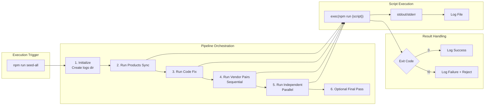
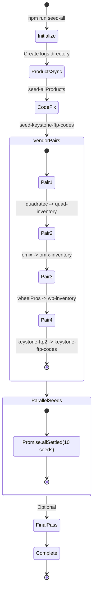
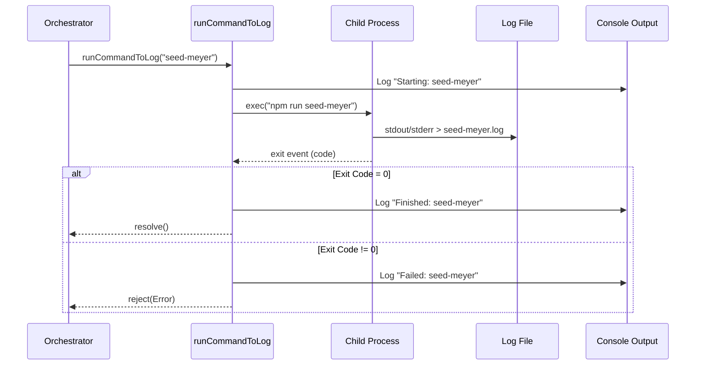
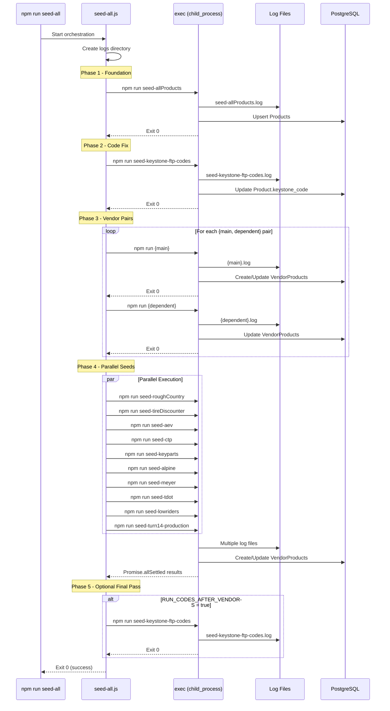
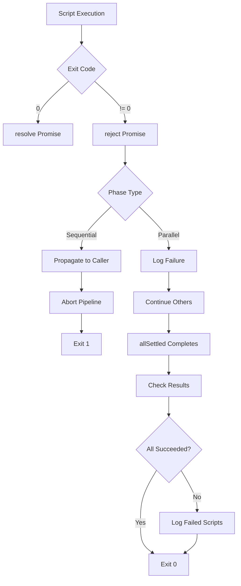

# DD-009: Data Synchronization Orchestrator

**Version**: 1.0.0
**Status**: Accepted (Documentation of Existing Architecture)
**Created**: 2026-01-23
**Last Updated**: 2026-01-23
**Author**: System (Reverse-Engineered from Implementation)
**Complexity Level**: High
**Complexity Rationale**:
1. Requirements/ACs: Coordinating 40+ independent scripts with dependency management, parallel/sequential execution, comprehensive logging, error recovery, and multiple execution modes
2. Constraints/Risks: Script interdependencies, rate limit coordination across vendors, disk space for logs, process isolation, failure cascade prevention

---

## Agreement Checklist

This document captures the existing architecture. No new implementation is proposed.

- [x] **Scope**: Document current orchestration system for vendor data synchronization
- [x] **Non-scope**: No architectural changes or new feature proposals
- [x] **Constraints**: Existing execution patterns, logging conventions, and dependency chains preserved
- [x] **Dependencies**: DD-001 (Magento API Integration), DD-002 (Vendor Integration Framework)

---

## Prerequisite ADRs

None currently documented. The following common ADR topics should be considered for future documentation:

- ADR-COMMON-005: Pipeline Orchestration Patterns (sequential vs parallel execution)
- ADR-COMMON-006: Script Logging Strategy (file-based logs with timestamps)
- ADR-COMMON-007: Error Recovery Approach (fail-fast vs continue-on-error)

---

## Executive Summary

The Data Synchronization Orchestrator is a pipeline orchestration system that manages the execution of 40+ vendor synchronization scripts. It coordinates sequential and parallel execution based on dependency relationships, provides comprehensive logging to file, and supports multiple execution modes (full pipeline, individual vendors, reference data).

The primary entry point is `seed-all.js`, which implements a five-phase execution pipeline:
1. Products sync (foundation data)
2. Keystone code fix (vendor code mapping)
3. Dependent vendor pairs (sequential)
4. Independent vendors (parallel)
5. Optional final code sync pass

---

## Existing Codebase Analysis

### Implementation Path Mapping

| Component | File Path | Status |
|-----------|-----------|--------|
| Main Orchestrator | `/prisma/seeds/seed-individual/seed-all.js` | Existing |
| Reference Data Seeder | `/prisma/seeds/seed-hard-code.js` | Existing |
| Individual Vendor Seeds | `/prisma/seeds/seed-individual/seed-*.js` (40+ files) | Existing |
| API Call Modules | `/prisma/seeds/api-calls/*.js` (25+ files) | Existing |
| Scraping Scripts | `/prisma/seeds/scrapping/**/*.js` | Existing |
| Hard-coded Data | `/prisma/seeds/hard-code_data/*.js` | Existing |
| Log Output Directory | `/prisma/seeds/logs/` | Existing (created on-demand) |
| Package Scripts | `/package.json` (scripts section) | Existing |

### Similar Functionality Search Results

No duplicate orchestration patterns were found. The orchestration system is centralized in `seed-all.js` with individual vendor scripts following a consistent pattern:
- Import Prisma client
- Import data source module (API caller, Excel parser, etc.)
- Execute main seeding logic
- Log results with counts
- Disconnect Prisma client

---

## Architecture Overview

### Architecture Diagram

```mermaid
flowchart TB
    subgraph EntryPoints["Entry Points"]
        CLI[npm run seed-all]
        CLI_HC[npm run seed-hard-code]
        CLI_IND[npm run seed-{vendor}]
    end

    subgraph Orchestrator["Orchestrator Layer (seed-all.js)"]
        RUNNER[runCommandToLog<br/>Process Executor]
        SEQ[Sequential Executor<br/>Vendor Pairs]
        PAR[Parallel Executor<br/>Promise.allSettled]
    end

    subgraph Phase1["Phase 1: Foundation"]
        SP[seed-allProducts<br/>Magento Products]
    end

    subgraph Phase2["Phase 2: Code Fix"]
        KC[seed-keystone-ftp-codes<br/>Vendor Code Mapping]
    end

    subgraph Phase3["Phase 3: Dependent Pairs"]
        direction LR
        P1[seed-quadratec] --> P1D[seed-quad-inventory]
        P2[seed-omix] --> P2D[seed-omix-inventory]
        P3[seed-wheelPros] --> P3D[seed-wp-inventory]
        P4[seed-keystone-ftp2] --> P4D[seed-keystone-ftp-codes]
    end

    subgraph Phase4["Phase 4: Parallel Seeds"]
        I1[seed-roughCountry]
        I2[seed-tireDiscounter]
        I3[seed-aev]
        I4[seed-ctp]
        I5[seed-keyparts]
        I6[seed-alpine]
        I7[seed-meyer]
        I8[seed-tdot]
        I9[seed-lowriders]
        I10[seed-turn14-production]
    end

    subgraph Logging["Logging Layer"]
        LOG_DIR[/prisma/seeds/logs/]
        LOG_FILE["{script-name}.log"]
    end

    subgraph Database["PostgreSQL Database"]
        PROD[(Product)]
        VP[(VendorProduct)]
        VND[(Vendor)]
    end

    CLI --> RUNNER
    RUNNER --> Phase1
    Phase1 --> Phase2
    Phase2 --> SEQ
    SEQ --> Phase3
    Phase3 --> PAR
    PAR --> Phase4

    RUNNER --> LOG_DIR
    LOG_DIR --> LOG_FILE

    Phase1 --> PROD
    Phase3 --> VP
    Phase4 --> VP
```

### Data Flow Diagram



---

## Component Design

### 1. Main Orchestrator (seed-all.js)

**Responsibility**: Coordinate execution of all vendor sync scripts in correct dependency order with logging and error handling.

**Implementation Details**:

```javascript
// Configuration
const ROOT = path.resolve(__dirname, "../../");
const logsDir = path.resolve(ROOT, "prisma/seeds/logs");

// Dependency Pairs (must run main before dependent)
const vendorSeeds = [
  { main: "seed-quadratec",     dependent: "seed-quad-inventory" },
  { main: "seed-omix",          dependent: "seed-omix-inventory" },
  { main: "seed-wheelPros",     dependent: "seed-wp-inventory" },
  { main: "seed-keystone-ftp2", dependent: "seed-keystone-ftp-codes" },
];

// Independent Seeds (can run in parallel)
const otherSeeds = [
  "seed-roughCountry", "seed-tireDiscounter", "seed-aev",
  "seed-ctp", "seed-keyparts", "seed-alpine", "seed-meyer",
  "seed-tdot", "seed-lowriders", "seed-turn14-production"
];

// Configuration flag
const RUN_CODES_AFTER_VENDORS = false;
```

**Execution Pattern**:



### 2. Script Runner Function

**Responsibility**: Execute npm scripts as child processes with logging and error handling.

**Function Signature**:
```javascript
function runCommandToLog(cmd) -> Promise<void>
```

**Implementation Flow**:



**Key Features**:
- Creates log file per script: `prisma/seeds/logs/{script-name}.log`
- Redirects both stdout and stderr to log file
- Uses `exec()` from `child_process` module
- Sets working directory to project root
- Returns Promise for async/await composition

### 3. Execution Phases

#### Phase 1: Foundation Data (Products)

**Purpose**: Sync all products from Magento to establish the foundation for vendor mappings.

```javascript
await runCommandToLog("seed-allProducts");
```

**Why First**:
- VendorProduct records require Product.sku as foreign key
- Vendor code columns (meyer_code, keystone_code, etc.) populated during product sync
- All subsequent vendor syncs depend on these codes for matching

#### Phase 2: Keystone Code Fix

**Purpose**: Update product keystone codes based on FTP data matching.

```javascript
await runCommandToLog("seed-keystone-ftp-codes");
```

**Why Second**:
- Fixes keystone_code and keystone_code_site based on FTP file data
- Must run after products have keystone_ftp_brand populated
- Updates enable proper matching in subsequent Keystone syncs

#### Phase 3: Dependent Vendor Pairs (Sequential)

**Purpose**: Execute vendor pairs where the second script depends on data from the first.

```javascript
for (const g of vendorSeeds) {
  await runCommandToLog(g.main);
  await runCommandToLog(g.dependent);
}
```

**Dependency Relationships**:

| Main Script | Dependent Script | Reason |
|-------------|------------------|--------|
| seed-quadratec | seed-quad-inventory | Base pricing before inventory update |
| seed-omix | seed-omix-inventory | Create VendorProducts before inventory |
| seed-wheelPros | seed-wp-inventory | WheelPros API auth before inventory |
| seed-keystone-ftp2 | seed-keystone-ftp-codes | FTP data before code matching |

#### Phase 4: Independent Vendors (Parallel)

**Purpose**: Execute independent vendor syncs concurrently for efficiency.

```javascript
await Promise.allSettled(otherSeeds.map(runCommandToLog));
```

**Parallel Execution Benefits**:
- Reduced total execution time
- No interdependencies between these vendors
- Uses `Promise.allSettled` to continue even if some fail

**Vendors in Parallel Pool**:
- Rough Country, Tire Discounter, AEV, CTP
- KeyParts, Alpine, Meyer, TDot, Lowriders
- Turn14 (production sync)

#### Phase 5: Optional Final Pass

**Purpose**: Re-run code fix if vendor syncs modified relevant data.

```javascript
if (RUN_CODES_AFTER_VENDORS) {
  await runCommandToLog("seed-keystone-ftp-codes");
}
```

**Configuration**: Disabled by default (`RUN_CODES_AFTER_VENDORS = false`)

### 4. Logging System

**Responsibility**: Capture all script output for debugging and audit purposes.

**Log Directory Structure**:
```
prisma/seeds/logs/
  seed-allProducts.log
  seed-keystone-ftp-codes.log
  seed-quadratec.log
  seed-quad-inventory.log
  seed-omix.log
  seed-omix-inventory.log
  seed-wheelPros.log
  seed-wp-inventory.log
  seed-roughCountry.log
  seed-tireDiscounter.log
  seed-aev.log
  seed-ctp.log
  seed-keyparts.log
  seed-alpine.log
  seed-meyer.log
  seed-tdot.log
  seed-lowriders.log
  seed-turn14-production.log
  keystone-code-fix-{timestamp}.csv
```

**Log File Format**:
- Raw console output from each script
- Includes timestamps from individual scripts
- Contains error messages and stack traces
- CSV audit files for code fix operations

**Directory Creation**:
```javascript
const logsDir = path.resolve(ROOT, "prisma/seeds/logs");
if (!fs.existsSync(logsDir)) fs.mkdirSync(logsDir, { recursive: true });
```

### 5. Reference Data Seeder (seed-hard-code.js)

**Responsibility**: Seed essential reference data that other syncs depend on.

**Seeded Data**:
- Vendors (vendor ID to name mappings)
- Users (authentication accounts)
- Competitors (price tracking targets)
- Vendor prefix mappings

**Execution**: Separate from main pipeline, run manually when needed.

```bash
npm run seed-hard-code
```

---

## Integration Point Map

### Integration Point 1: Product Foundation

```yaml
Boundary Name: Product Data Dependency
  Existing Component: seed-allProducts.js
  Integration Method: Must execute before any vendor sync
  Input: Magento API products
  Output: Product records with vendor code columns (async)
  On Error: Abort entire pipeline (critical dependency)
  Impact Level: High (foundation data)
  Required Test Coverage: Product count verification, vendor code population
```

### Integration Point 2: Vendor Pair Sequencing

```yaml
Boundary Name: Sequential Dependency Execution
  Existing Component: vendorSeeds array configuration
  Integration Method: Await main script before starting dependent
  Input: Completion of main script (exit code 0)
  Output: Ready state for dependent script (async)
  On Error: Log failure, reject promise chain
  Impact Level: High (data integrity)
  Required Test Coverage: Dependency order verification, partial failure handling
```

### Integration Point 3: Parallel Execution Pool

```yaml
Boundary Name: Independent Vendor Execution
  Existing Component: Promise.allSettled with otherSeeds
  Integration Method: Concurrent execution with isolated failures
  Input: Array of script names
  Output: Array of PromiseSettledResult (async)
  On Error: Log per-script failures, continue with others
  Impact Level: Medium (isolated failures)
  Required Test Coverage: Parallel execution timing, individual failure isolation
```

### Integration Point 4: Log File System

```yaml
Boundary Name: Script Output Logging
  Existing Component: File system logs directory
  Integration Method: exec stdout/stderr redirect to file
  Input: Child process output streams
  Output: Log files per script (sync file write)
  On Error: Log file creation failure doesn't abort script
  Impact Level: Low (observability)
  Required Test Coverage: Log file creation, content capture
```

### Integration Point 5: NPM Script Interface

```yaml
Boundary Name: Package Script Execution
  Existing Component: package.json scripts
  Integration Method: exec("npm run {script-name}")
  Input: Script name string
  Output: Exit code (async)
  On Error: Non-zero exit code triggers rejection
  Impact Level: High (execution layer)
  Required Test Coverage: Script existence, execution environment
```

---

## Integration Boundary Contracts

```yaml
Orchestrator Entry:
  Input: None (triggered by npm run seed-all)
  Output: Process exit code 0 (success) or 1 (failure)
  On Error: Log error message, exit with code 1

Script Runner:
  Input: Script name (string matching npm script)
  Output: Promise<void> resolving on exit code 0
  On Error: Promise rejection with Error containing script name

Log Writer:
  Input: Script name (for filename), stdout/stderr streams
  Output: Log file at prisma/seeds/logs/{script-name}.log
  On Error: Console warning (non-blocking)

Vendor Pair Executor:
  Input: Array of { main: string, dependent: string }
  Output: All pairs executed in sequence
  On Error: Stop at first failure, don't continue to next pair
```

---

## Data Contracts

### Vendor Seeds Configuration

```typescript
interface VendorPair {
  main: string;      // NPM script name for main sync
  dependent: string; // NPM script name for dependent sync
}

type IndependentSeed = string; // NPM script name

// Configuration Arrays
const vendorSeeds: VendorPair[] = [
  { main: "seed-quadratec", dependent: "seed-quad-inventory" },
  { main: "seed-omix", dependent: "seed-omix-inventory" },
  { main: "seed-wheelPros", dependent: "seed-wp-inventory" },
  { main: "seed-keystone-ftp2", dependent: "seed-keystone-ftp-codes" },
];

const otherSeeds: IndependentSeed[] = [
  "seed-roughCountry", "seed-tireDiscounter", "seed-aev",
  "seed-ctp", "seed-keyparts", "seed-alpine", "seed-meyer",
  "seed-tdot", "seed-lowriders", "seed-turn14-production"
];
```

### Script Runner Interface

```typescript
interface RunResult {
  script: string;
  success: boolean;
  logPath: string;
  duration?: number;
  error?: Error;
}

// Function signature
function runCommandToLog(cmd: string): Promise<void>;
```

### NPM Scripts Mapping

| Script Name | Target File | Vendor/Purpose |
|-------------|-------------|----------------|
| seed-all | seed-individual/seed-all.js | Main orchestrator |
| seed-hard-code | seed-hard-code.js | Reference data |
| seed-allProducts | seed-individual/seed-allProducts.js | Magento products |
| seed-keystone-ftp-codes | api-calls/keystone-ftp-codes.js | Keystone code fix |
| seed-quadratec | seed-individual/seed-quadratec.js | Quadratec vendor |
| seed-quad-inventory | seed-individual/seed-quad-inventory.js | Quadratec inventory |
| seed-omix | seed-individual/seed-omix.js | Omix vendor |
| seed-omix-inventory | seed-individual/seed-omix-inventory.js | Omix inventory |
| seed-wheelPros | seed-individual/seed-wheelPros.js | WheelPros vendor |
| seed-wp-inventory | seed-individual/seed-wp-inventory.js | WheelPros inventory |
| seed-keystone-ftp2 | seed-individual/seed-keystone-ftp-2.js | Keystone FTP |
| seed-meyer | seed-individual/seed-meyer.js | Meyer vendor |
| seed-aev | seed-individual/seed-aev.js | AEV vendor |
| seed-alpine | seed-individual/seed-alpine.js | Alpine vendor |
| seed-ctp | seed-individual/seed-ctp.js | CTP vendor |
| seed-keyparts | seed-individual/seed-keyparts.js | KeyParts vendor |
| seed-roughCountry | seed-individual/seed-roughCountry.js | Rough Country |
| seed-tdot | seed-individual/seed-tdot.js | TDot vendor |
| seed-lowriders | seed-individual/seed-lowriders.js | Lowriders vendor |
| seed-tireDiscounter | seed-individual/seed-tireDiscounter-api.js | Tire Discounter |
| seed-turn14-production | seed-individual/seed-turn14-production.js | Turn14 full sync |
| seed-daily-turn14-production | seed-individual/turn14-seeding-production.js | Turn14 daily |
| seed-daily-premier | seed-individual/seed-daily-premier.js | Premier daily |

---

## Change Impact Map

This document describes existing architecture. No changes are proposed.

```yaml
Change Target: N/A (Documentation Only)
Direct Impact: None
Indirect Impact: None
No Ripple Effect:
  - seed-all.js orchestrator (unchanged)
  - Individual vendor seeds (unchanged)
  - Logging system (unchanged)
  - NPM scripts (unchanged)
  - Database schema (unchanged)
```

---

## Execution Flow Diagram

### Complete Pipeline Sequence



---

## Error Handling Strategy

### Error Types and Recovery

| Error Type | Handling | Recovery |
|------------|----------|----------|
| Phase 1 failure (Products) | Abort pipeline | Cannot continue without products |
| Phase 2 failure (Code fix) | Abort pipeline | Code mappings required for vendors |
| Phase 3 pair failure | Abort at failure | Sequential dependency broken |
| Phase 4 individual failure | Continue others | Isolated via Promise.allSettled |
| Log file creation failure | Console warning | Non-blocking, continue execution |

### Error Propagation Flow



### Console Output Pattern

```
// Success pattern
Starting: seed-meyer
Finished: seed-meyer (log: prisma/seeds/logs/seed-meyer.log)

// Failure pattern
Starting: seed-meyer
Failed: seed-meyer (see prisma/seeds/logs/seed-meyer.log)
```

---

## Performance Characteristics

### Execution Time Estimates

| Phase | Estimated Duration | Notes |
|-------|-------------------|-------|
| Phase 1 (Products) | 15-20 minutes | 20,000+ products from Magento |
| Phase 2 (Code Fix) | 1-2 minutes | Database matching and updates |
| Phase 3 (Pairs) | 30-45 minutes | 4 pairs x 2 scripts each |
| Phase 4 (Parallel) | 2-4 hours | Turn14 rate limits dominate |
| **Total Pipeline** | **3-5 hours** | Depends on API response times |

### Resource Usage

| Resource | Usage Pattern |
|----------|---------------|
| CPU | Low to moderate (mostly I/O bound) |
| Memory | Moderate (20,000+ records in memory during product sync) |
| Disk (Logs) | 10-100 MB per full run |
| Network | Variable (API calls, FTP downloads) |
| Database Connections | 1 per script (scripts run in separate processes) |

### Parallelism Limits

- **Phase 3**: Strictly sequential (1 script at a time within pairs)
- **Phase 4**: 10 concurrent scripts by default
- **Database**: Each script creates own Prisma client connection

---

## Test Strategy

### Unit Test Coverage

| Component | Test Focus | Status |
|-----------|------------|--------|
| runCommandToLog | Promise resolution/rejection | Not implemented |
| Log directory creation | fs.mkdirSync behavior | Not implemented |
| Exit code handling | Code 0 vs non-zero | Not implemented |
| Configuration arrays | Vendor pairs structure | Not implemented |

### Integration Test Scenarios

1. **Full Pipeline Success**: Verify all phases complete in order
2. **Phase 1 Failure**: Verify pipeline aborts on product sync failure
3. **Phase 3 Partial Failure**: Verify pair stops at first failure
4. **Phase 4 Partial Failure**: Verify other scripts continue
5. **Log File Creation**: Verify logs created for each script

### E2E Verification Procedures

1. Run `npm run seed-all`
2. Monitor console output for phase transitions
3. Verify log files created in `prisma/seeds/logs/`
4. Check database for updated VendorProduct counts
5. Verify no error messages in log files
6. Validate exit code is 0

---

## CLI Interface Reference

### Primary Commands

| Command | Description | Typical Duration |
|---------|-------------|------------------|
| `npm run seed-all` | Complete sync pipeline | 3-5 hours |
| `npm run seed-hard-code` | Reference data only | < 1 minute |
| `npm run seed-allProducts` | Products from Magento | 15-20 minutes |
| `npm run seed-orders` | Orders from Magento | < 5 minutes |

### Individual Vendor Commands

| Command | Vendor | Integration Type |
|---------|--------|------------------|
| `npm run seed-meyer` | Meyer | API |
| `npm run seed-keystone` | Keystone | API |
| `npm run seed-keystone-ftp` | Keystone | FTP |
| `npm run seed-keystone-ftp2` | Keystone | FTP (v2) |
| `npm run seed-omix` | Omix | Excel |
| `npm run seed-quadratec` | Quadratec | Excel |
| `npm run seed-wheelPros` | WheelPros | API |
| `npm run seed-aev` | AEV | Excel |
| `npm run seed-alpine` | Alpine | Excel |
| `npm run seed-ctp` | CTP | Excel |
| `npm run seed-keyparts` | KeyParts | Excel |
| `npm run seed-roughCountry` | Rough Country | CSV |
| `npm run seed-tdot` | TDot | CSV |
| `npm run seed-lowriders` | Lowriders | CSV |
| `npm run seed-tireDiscounter` | Tire Discounter | API |
| `npm run seed-turn14-production` | Turn14 | API (full) |
| `npm run seed-daily-turn14-production` | Turn14 | API (daily) |
| `npm run seed-daily-premier` | Premier | API (daily) |

### Utility Commands

| Command | Description |
|---------|-------------|
| `npm run seed-keystone-ftp-codes` | Fix Keystone codes from FTP |
| `npm run seed-omix-inventory` | Update Omix inventory only |
| `npm run seed-quad-inventory` | Update Quadratec inventory only |
| `npm run seed-wp-inventory` | Update WheelPros inventory only |
| `npm run scrape-metalcloak` | MetalCloak web scraping |
| `npm run process-metalcloak` | Process scraped MetalCloak data |

---

## Acceptance Criteria

### Pipeline Orchestration

| ID | Criterion | Verification |
|----|-----------|--------------|
| AC-PO-01 | Logs directory created before any script execution | Check directory exists |
| AC-PO-02 | Products sync runs before any vendor sync | Verify execution order in logs |
| AC-PO-03 | Keystone code fix runs after products, before vendors | Check timestamps |
| AC-PO-04 | Vendor pairs execute in strict sequence (main before dependent) | Verify log timestamps |
| AC-PO-05 | Independent vendors run in parallel | Verify overlapping timestamps |
| AC-PO-06 | Each script produces its own log file | List log directory contents |
| AC-PO-07 | Pipeline exits with code 0 on success | Check process exit code |
| AC-PO-08 | Pipeline exits with code 1 on any failure | Force failure, check exit |

### Error Handling

| ID | Criterion | Verification |
|----|-----------|--------------|
| AC-EH-01 | Phase 1 failure aborts entire pipeline | Fail products, check no vendors run |
| AC-EH-02 | Phase 3 pair failure stops that pair | Fail main, check dependent doesn't run |
| AC-EH-03 | Phase 4 failure doesn't stop other scripts | Fail one, check others complete |
| AC-EH-04 | Error messages include script name | Check console output format |
| AC-EH-05 | Error details available in log file | Check log file content |

### Logging

| ID | Criterion | Verification |
|----|-----------|--------------|
| AC-LG-01 | Log files named after scripts | Check naming convention |
| AC-LG-02 | Both stdout and stderr captured | Check error output in logs |
| AC-LG-03 | Console shows start/finish per script | Monitor live output |
| AC-LG-04 | Log path shown in console messages | Verify path correctness |

---

## Dependencies

### Upstream Dependencies

| Dependency | Type | Description |
|------------|------|-------------|
| DD-001 Magento API Integration | Design Doc | Product sync foundation |
| DD-002 Vendor Integration Framework | Design Doc | Individual vendor implementations |
| data-synchronization-prd.md | PRD | Business requirements |

### External Dependencies

| Dependency | Version | Purpose |
|------------|---------|---------|
| Node.js | 18+ | Runtime environment |
| child_process | built-in | Script execution |
| fs | built-in | Log file management |
| path | built-in | Path resolution |

### Internal Dependencies

| Dependency | Purpose |
|------------|---------|
| package.json scripts | NPM script definitions |
| prisma/seeds/seed-individual/*.js | Individual vendor implementations |
| prisma/seeds/api-calls/*.js | API integration modules |
| prisma/seeds/hard-code_data/*.js | Configuration data |

---

## Non-Functional Requirements

### Reliability

| Metric | Target | Current |
|--------|--------|---------|
| Full pipeline success rate | > 95% | Manual monitoring |
| Individual script success rate | > 99% | Per-script logs |
| Recovery time | < 30 minutes | Manual re-run |

### Observability

| Metric | Implementation |
|--------|----------------|
| Execution tracking | Console output per script |
| Error logging | Per-script log files |
| Audit trail | Timestamped CSV files (code fix) |
| Duration tracking | Manual observation |

### Scalability

| Dimension | Current Capacity | Growth Path |
|-----------|------------------|-------------|
| Number of vendors | 17 (implemented) | Add to otherSeeds array |
| Products | 20,000+ | Pagination in products sync |
| VendorProducts | 50,000+ | Batch processing per vendor |

---

## References

### Internal Documentation

- [data-synchronization-prd.md](/docs/prd/data-synchronization-prd.md) - Product Requirements Document
- [DD-001 Magento API Integration](/docs/design/dd-001-magento-api-integration.md) - Product sync design
- [DD-002 Vendor Integration Framework](/docs/design/dd-002-vendor-integration-framework.md) - Vendor implementations
- [CLAUDE.md](/CLAUDE.md) - Repository documentation

### Implementation Files

- [seed-all.js](/prisma/seeds/seed-individual/seed-all.js) - Main orchestrator
- [package.json](/package.json) - NPM script definitions

---

## Glossary

| Term | Definition |
|------|------------|
| **Orchestrator** | The seed-all.js script that coordinates execution of all vendor syncs |
| **Vendor Pair** | Two scripts with a dependency relationship (main must complete before dependent) |
| **Independent Seed** | A vendor sync script that has no dependencies on other vendor syncs |
| **Phase** | A stage in the pipeline execution (1-5) |
| **Pipeline** | The complete sequence of all sync operations |
| **Seeding** | Batch process of populating database with external data |
| **Log File** | Per-script output file capturing stdout/stderr |
| **Exit Code** | Process termination status (0 = success, non-zero = failure) |

---

## Change Log

| Version | Date | Author | Changes |
|---------|------|--------|---------|
| 1.0.0 | 2026-01-23 | System | Initial design document (reverse-engineered from implementation) |
