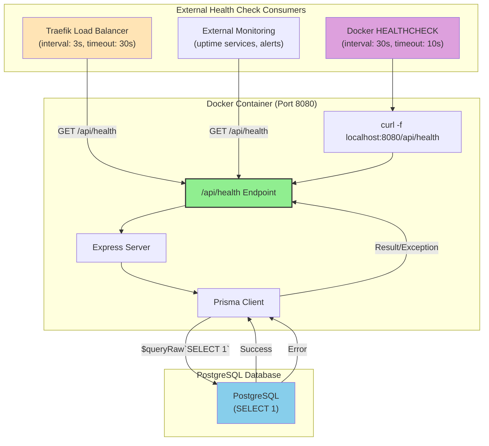
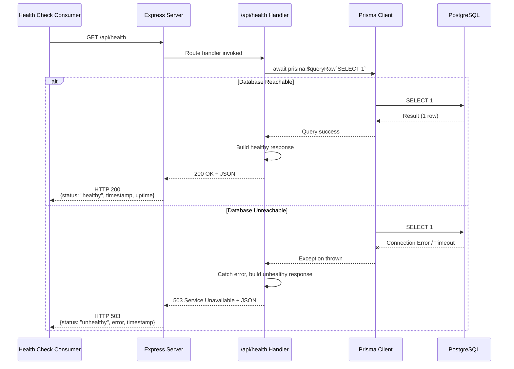
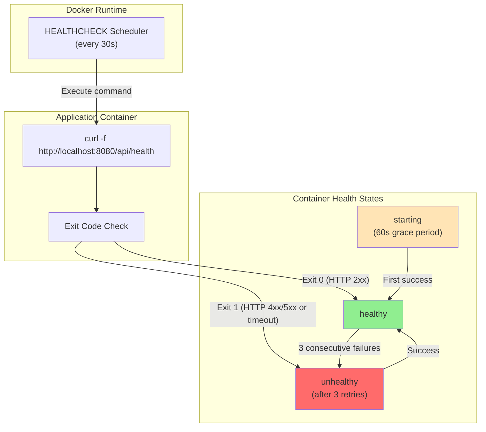

# DD-010: Health Monitoring Endpoint

## Document Information

| Attribute | Value |
|-----------|-------|
| Version | 1.1.0 |
| Status | Documented (Existing Implementation) |
| Created | 2026-01-23 |
| Last Updated | 2026-01-24 |
| Author | Architecture Documentation |
| Parent PRD | [health-monitoring-prd.md](../prd/health-monitoring-prd.md) |
| Dependencies | None |
| Complexity Level | Low |

---

## Agreement Checklist

| Agreement | Status | Reflected In |
|-----------|--------|--------------|
| Document current architecture only | Confirmed | Entire document |
| Do not propose changes | Confirmed | All sections descriptive only |
| Health endpoint at `/api/health` | Confirmed | Section 5: Endpoint Implementation |
| Database connectivity validation | Confirmed | Section 5.2: Database Health Check |
| HTTP 200/503 status codes | Confirmed | Section 6: Response Format |
| Support for Kamal/Docker health checks | Confirmed | Section 7: Orchestration Integration |
| No authentication required | Confirmed | Section 8: Security Considerations |

---

## 1. Overview

### 1.1 Purpose

This Design Document describes the current architecture of the Health Monitoring Endpoint component within the JustJeeps API backend. This component provides an HTTP endpoint for load balancer integration and container orchestration, validating database connectivity and providing operational metrics for zero-downtime deployments via Kamal and Docker.

### 1.2 Scope

**In Scope:**
- HTTP GET endpoint at `/api/health`
- Database connectivity validation via raw SQL query
- Health status response (healthy/unhealthy)
- HTTP status codes (200 OK / 503 Service Unavailable)
- ISO 8601 timestamp in response
- Process uptime metric (healthy state)
- Error description (unhealthy state)
- Docker HEALTHCHECK integration
- Kamal/Traefik health check integration

**Out of Scope:**
- Authentication on health endpoint
- Detailed metrics (CPU, memory, request queue)
- Database connection pool statistics
- External service health checks
- Health check history or persistence
- Prometheus/OpenTelemetry integration
- Custom business health logic

### 1.3 Complexity Rationale

**Complexity Level: Low**

Rationale:
1. **Requirements/ACs**: Single endpoint with 2 states (healthy/unhealthy), straightforward database check
2. **Constraints/Risks**:
   - Minimal logic: try database query, return appropriate response
   - No state management or complex conditionals
   - Single external dependency (database)
   - Well-defined response contracts

---

## 2. Existing Codebase Analysis

### 2.1 Implementation Path Mapping

| Component | File Path | Lines | Type |
|-----------|-----------|-------|------|
| Health Endpoint | `/Users/ricardotassio/DEV/TRABALHO/JUSTJEEPS/JustJeepsAPI-back-end/server.js` | 47-63 | Existing |
| Docker HEALTHCHECK | `/Users/ricardotassio/DEV/TRABALHO/JUSTJEEPS/JustJeepsAPI-back-end/Dockerfile.production` | 103-105 | Existing |
| Kamal Health Config | `/Users/ricardotassio/DEV/TRABALHO/JUSTJEEPS/JustJeepsAPI-back-end/config/deploy.yml` | 33-36 | Existing |
| Docker Compose | `/Users/ricardotassio/DEV/TRABALHO/JUSTJEEPS/JustJeepsAPI-back-end/docker-compose.yml` | 40-42 | Existing |

### 2.2 Similar Functionality Search Results

**Search Keywords Used**: health, healthcheck, status, ping, alive, ready

**Findings**:
- Health check is implemented as a single inline endpoint in `server.js`
- No duplicate health check implementations found
- The basic GET `/` endpoint at line 66-70 is not a health check (returns static message)
- No readiness or liveness probes beyond the main health endpoint

### 2.3 Integration Points with Existing Code

| Integration Point | Location | Coupling Level |
|-------------------|----------|----------------|
| Express Application | `server.js:3` | Route registration via `app.get()` |
| Prisma Client | `server.js:7-14` | Direct dependency for `$queryRaw` |
| Docker Container | `Dockerfile.production:104-105` | HEALTHCHECK instruction |
| Kamal Proxy | `config/deploy.yml:33-36` | Traefik health check configuration |

---

## 3. Architecture Diagram



---

## 4. Data Flow Diagrams

### 4.1 Health Check Request Flow



### 4.2 Docker HEALTHCHECK Integration



### 4.3 Kamal/Traefik Health Check Flow

```mermaid
flowchart TD
    subgraph Kamal["Kamal Deployment"]
        DEPLOY["kamal deploy"]
        NEW["New Container"]
        OLD["Old Container"]
    end

    subgraph Traefik["Traefik Reverse Proxy"]
        HC["Health Check Loop<br/>(interval: 3s)"]
        ROUTER["Request Router"]
    end

    subgraph HealthChecks["Health Status"]
        CHECK_NEW["Check /api/health<br/>(new container)"]
        CHECK_OLD["Check /api/health<br/>(old container)"]
    end

    subgraph Traffic["Traffic Routing"]
        USER["User Requests"]
        BACKENDS["Backend Pool"]
    end

    DEPLOY --> NEW
    HC --> CHECK_NEW
    HC --> CHECK_OLD

    CHECK_NEW -->|"200 OK"| BACKENDS
    CHECK_OLD -->|"200 OK"| BACKENDS
    CHECK_NEW -->|"503 / timeout"| |"Exclude from pool"|
    CHECK_OLD -->|"503 / timeout"| |"Exclude from pool"|

    USER --> ROUTER
    ROUTER --> BACKENDS

    style NEW fill:#90EE90
    style OLD fill:#87CEEB
```

---

## 5. Component Design

### 5.1 Health Endpoint Handler

**Location**: `server.js` lines 47-63

**Responsibilities:**
- Handle incoming HTTP GET requests at `/api/health`
- Execute database connectivity check
- Return appropriate HTTP status code and JSON response
- Handle database errors gracefully

**Implementation Pattern:**
```javascript
// Inline async route handler
app.get('/api/health', async (req, res) => {
  try {
    // Database check
    await prisma.$queryRaw`SELECT 1`;
    // Success response
    res.status(200).json({ /* healthy response */ });
  } catch (error) {
    // Error response
    res.status(503).json({ /* unhealthy response */ });
  }
});
```

### 5.2 Database Health Check

**Method**: Prisma `$queryRaw` with tagged template literal

**Query**: `SELECT 1`

**Rationale**:
- Minimal database operation
- Validates connection is alive
- Does not read application data
- Fast execution (typically < 10ms)

**Error Scenarios**:
| Error Type | Cause | Result |
|------------|-------|--------|
| Connection refused | Database server down | 503 unhealthy |
| Connection timeout | Network issues | 503 unhealthy |
| Authentication failure | Invalid credentials | 503 unhealthy |
| Database unavailable | Server overloaded | 503 unhealthy |

### 5.3 Response Generation

**Healthy Response (HTTP 200)**:
```javascript
res.status(200).json({
  status: 'healthy',
  timestamp: new Date().toISOString(),
  uptime: process.uptime(),
});
```

**Unhealthy Response (HTTP 503)**:
```javascript
res.status(503).json({
  status: 'unhealthy',
  error: 'Database connection failed',
  timestamp: new Date().toISOString(),
});
```

---

## 6. Public API Interface

### 6.1 GET /api/health - Health Status Check

**Location**: `server.js:47-63`

**Authentication**: None required

**Request**:
```http
GET /api/health HTTP/1.1
Host: localhost:8080
```

**Success Response (HTTP 200)**:
```typescript
interface HealthyResponse {
  status: "healthy";
  timestamp: string;  // ISO 8601 format
  uptime: number;     // Process uptime in seconds
}
```

**Example**:
```json
{
  "status": "healthy",
  "timestamp": "2026-01-23T15:30:00.000Z",
  "uptime": 86400.123
}
```

**Error Response (HTTP 503)**:
```typescript
interface UnhealthyResponse {
  status: "unhealthy";
  error: string;      // Human-readable error description
  timestamp: string;  // ISO 8601 format
}
```

**Example**:
```json
{
  "status": "unhealthy",
  "error": "Database connection failed",
  "timestamp": "2026-01-23T15:30:00.000Z"
}
```

**Response Status Codes**:
| Code | Condition | Meaning |
|------|-----------|---------|
| 200 | Database reachable | Service healthy, ready for traffic |
| 503 | Database unreachable | Service unhealthy, should not receive traffic |

---

## 7. Orchestration Integration

### 7.1 Docker HEALTHCHECK Configuration

**Location**: `Dockerfile.production` lines 103-105

```dockerfile
HEALTHCHECK --interval=30s --timeout=10s --start-period=60s --retries=3 \
    CMD curl -f http://localhost:8080/api/health || exit 1
```

**Parameters**:
| Parameter | Value | Purpose |
|-----------|-------|---------|
| `--interval` | 30s | Time between health checks |
| `--timeout` | 10s | Maximum time to wait for response |
| `--start-period` | 60s | Grace period during container startup |
| `--retries` | 3 | Consecutive failures before marking unhealthy |

**Command Explanation**:
- `curl -f`: Fail silently on HTTP errors (4xx, 5xx)
- `|| exit 1`: Exit with code 1 if curl fails
- Exit code 0 = healthy, Exit code 1 = unhealthy

### 7.2 Kamal/Traefik Health Check Configuration

**Location**: `config/deploy.yml` lines 29-36

```yaml
proxy:
  ssl: true
  host: orderapi.nunchisolucoes.com
  app_port: 8080
  healthcheck:
    path: /api/health
    interval: 3
    timeout: 30
```

**Parameters**:
| Parameter | Value | Purpose |
|-----------|-------|---------|
| `path` | `/api/health` | Endpoint path for health checks |
| `interval` | 3 (seconds) | Frequency of health checks |
| `timeout` | 30 (seconds) | Maximum wait time for response |

**Zero-Downtime Deployment Behavior**:
1. Kamal starts new container
2. Traefik polls `/api/health` on new container
3. Once healthy, new container added to load balancer pool
4. Old container removed from pool
5. Old container stopped after drain period

### 7.3 Docker Compose Database Health Check

**Location**: `docker-compose.yml` lines 19-23

```yaml
healthcheck:
  test: ["CMD-SHELL", "pg_isready -U ${POSTGRES_USER} -d ${POSTGRES_DB:-justjeeps}"]
  interval: 5s
  timeout: 5s
  retries: 5
```

**Note**: This is the PostgreSQL container health check, not the API health check. The API container depends on this via `depends_on: db: condition: service_healthy`.

---

## 8. Data Contracts

### 8.1 Health Response Contract

```yaml
Input:
  Type: HTTP GET request
  Preconditions: None (unauthenticated endpoint)
  Validation: None required

Output:
  Type: JSON response with HTTP status code
  Guarantees:
    - Response within timeout period (10-30s depending on consumer)
    - JSON body always contains "status" field
    - JSON body always contains "timestamp" field
    - HTTP 200 implies database is reachable
    - HTTP 503 implies database is unreachable
  On Error: HTTP 503 with error description

Invariants:
  - Status field is either "healthy" or "unhealthy"
  - Timestamp is always in ISO 8601 format
  - Uptime is only present when healthy
  - Error is only present when unhealthy
```

### 8.2 Database Query Contract

```yaml
Query: SELECT 1
Purpose: Validate database connection

Success:
  - Query executes successfully
  - Returns any result (value irrelevant)
  - No side effects on database

Failure:
  - Connection cannot be established
  - Query times out
  - Authentication fails
  - Database server unavailable
```

---

## 9. Integration Point Map

```yaml
Integration Point 1:
  Existing Component: Express Application (server.js)
  Integration Method: Inline route handler via app.get()
  Impact Level: Low (Isolated endpoint)
  Required Test Coverage: Route accessibility, response format

Integration Point 2:
  Existing Component: Prisma Client (global instance)
  Integration Method: Direct $queryRaw call
  Impact Level: Medium (Database dependency)
  Required Test Coverage: Success and failure scenarios

Integration Point 3:
  Existing Component: Docker Container (Dockerfile.production)
  Integration Method: HEALTHCHECK instruction with curl
  Impact Level: High (Container lifecycle management)
  Required Test Coverage: Container startup, health state transitions

Integration Point 4:
  Existing Component: Kamal/Traefik (config/deploy.yml)
  Integration Method: HTTP health check polling
  Impact Level: High (Production traffic routing)
  Required Test Coverage: Deployment health check validation
```

---

## 10. Integration Boundary Contracts

### 10.1 Express Route Boundary

```yaml
Boundary Name: Express Route Handler
  Input: HTTP GET request to /api/health
  Output: Synchronous HTTP response (200 or 503) with JSON body
  On Error: 503 response (errors handled internally)
```

### 10.2 Prisma Database Boundary

```yaml
Boundary Name: Prisma $queryRaw
  Input: SQL query template literal
  Output: Promise resolving to query result
  On Error: Promise rejects with PrismaClientKnownRequestError or connection error
```

### 10.3 Docker Health Check Boundary

```yaml
Boundary Name: Docker HEALTHCHECK
  Input: curl command output and exit code
  Output: Container health state (healthy/unhealthy)
  On Error: After 3 consecutive failures, container marked unhealthy
```

### 10.4 Traefik Load Balancer Boundary

```yaml
Boundary Name: Traefik Health Check
  Input: HTTP response status code
  Output: Backend pool membership (include/exclude)
  On Error: Container removed from load balancer pool
```

---

## 11. Change Impact Map

```yaml
Change Target: Health Monitoring Endpoint
Direct Impact:
  - /Users/ricardotassio/DEV/TRABALHO/JUSTJEEPS/JustJeepsAPI-back-end/server.js (lines 47-63)
  - /Users/ricardotassio/DEV/TRABALHO/JUSTJEEPS/JustJeepsAPI-back-end/Dockerfile.production (lines 103-105)
  - /Users/ricardotassio/DEV/TRABALHO/JUSTJEEPS/JustJeepsAPI-back-end/config/deploy.yml (lines 33-36)

Indirect Impact:
  - Kamal deployment process (relies on health check for zero-downtime)
  - Docker container lifecycle (restart decisions)
  - Traefik load balancing (traffic routing decisions)
  - External monitoring systems (alerting triggers)

No Ripple Effect:
  - All other API endpoints (no dependency on health endpoint)
  - Authentication middleware (health endpoint unauthenticated)
  - Database schema (no data model changes)
  - Frontend application (does not consume health endpoint)
  - Product, Order, Vendor routes (isolated functionality)
```

---

## 12. Current Behavior Characteristics

### 12.1 Performance Characteristics

| Metric | Typical Value | Maximum | Notes |
|--------|---------------|---------|-------|
| Response Time | 10-50ms | 10s (timeout) | Dominated by database latency |
| Database Query Time | 1-10ms | 100ms | Simple `SELECT 1` |
| Memory Usage | Negligible | N/A | No data buffering |
| CPU Usage | Negligible | N/A | Minimal computation |

### 12.2 Reliability Characteristics

| Characteristic | Value | Notes |
|----------------|-------|-------|
| Availability | Same as API | Inline with Express server |
| Single Point of Failure | Database | Only dependency |
| Error Recovery | Automatic | Each request independent |
| Statefulness | None | Stateless endpoint |

### 12.3 Health Check Timing

| Consumer | Interval | Timeout | Start Period | Retries |
|----------|----------|---------|--------------|---------|
| Traefik (Kamal) | 3s | 30s | N/A | N/A |
| Docker HEALTHCHECK | 30s | 10s | 60s | 3 |
| External Monitors | Varies | Varies | N/A | Varies |

### 12.4 Error Handling Pattern

```javascript
// Current implementation pattern
app.get('/api/health', async (req, res) => {
  try {
    await prisma.$queryRaw`SELECT 1`;
    res.status(200).json({ /* success */ });
  } catch (error) {
    // Error details not logged (silent failure)
    // Error message generic (no sensitive data exposure)
    res.status(503).json({ /* failure */ });
  }
});
```

**Notes**:
- Errors are not logged to console (silent catch)
- Error details not exposed in response
- Generic error message prevents information disclosure

---

## 13. Acceptance Criteria (Current Implementation)

### 13.1 Endpoint Accessibility

| ID | Criterion | Verification Method |
|----|-----------|---------------------|
| AC-01 | GET /api/health returns JSON response | HTTP request returns Content-Type: application/json |
| AC-02 | Endpoint requires no authentication | Request without Authorization header succeeds |
| AC-03 | Response time < 10 seconds | Measure response latency under normal conditions |

### 13.2 Healthy State Response

| ID | Criterion | Verification Method |
|----|-----------|---------------------|
| AC-04 | HTTP 200 returned when database reachable | Start database, call endpoint, verify status code |
| AC-05 | Response contains status: "healthy" | Parse JSON response, verify status field |
| AC-06 | Response contains ISO 8601 timestamp | Verify timestamp format matches pattern |
| AC-07 | Response contains numeric uptime | Verify uptime is positive number |

### 13.3 Unhealthy State Response

| ID | Criterion | Verification Method |
|----|-----------|---------------------|
| AC-08 | HTTP 503 returned when database unreachable | Stop database, call endpoint, verify status code |
| AC-09 | Response contains status: "unhealthy" | Parse JSON response, verify status field |
| AC-10 | Response contains error description | Verify error field present and non-empty |
| AC-11 | Response contains ISO 8601 timestamp | Verify timestamp format matches pattern |

### 13.4 Orchestration Integration

| ID | Criterion | Verification Method |
|----|-----------|---------------------|
| AC-12 | Docker HEALTHCHECK passes when healthy | Build container, verify health state |
| AC-13 | Docker HEALTHCHECK fails when unhealthy | Stop database, verify container unhealthy |
| AC-14 | Kamal deployment uses health check | Deploy via Kamal, verify health check logs |
| AC-15 | Container receives traffic only when healthy | Verify Traefik routing during deployment |

---

## 14. Security Considerations

### 14.1 No Authentication Required

**Rationale**: Health endpoints must be accessible without authentication for:
- Load balancers (no token management)
- Container orchestration (no credentials in HEALTHCHECK)
- External monitoring (simplified integration)

### 14.2 Information Disclosure

**Mitigations**:
- Generic error message ("Database connection failed")
- No stack traces in response
- No database connection details exposed
- No internal IP addresses revealed
- Uptime reveals server restart time (acceptable risk)

### 14.3 Denial of Service

**Considerations**:
- Endpoint is lightweight (minimal resource usage)
- No rate limiting applied (same as all endpoints)
- Database query is simple (low resource consumption)
- High-frequency polling by legitimate consumers is expected

---

## 15. Known Limitations

1. **Single Dependency Check**: Only validates PostgreSQL connectivity; does not check external APIs, file systems, or other services
2. **No Degraded State**: Binary healthy/unhealthy; cannot express partial health
3. **No Metrics Export**: Does not expose Prometheus-compatible metrics
4. **No Historical Data**: Does not track health history or trends (but see Axiom integration below)
5. ~~**Silent Error Handling**: Database errors not logged~~ - **RESOLVED**: Now logged via Axiom
6. **Fixed Error Message**: Generic error regardless of actual failure cause
7. **No Configurable Timeout**: Database query timeout relies on Prisma defaults
8. **Hardcoded Endpoint Path**: `/api/health` path configured in multiple locations

---

## 15.1 Axiom Logging Integration (Added 2026-01-24)

The health monitoring has been enhanced with centralized logging via Axiom:

**Related Documentation**: [DD-017: Axiom Logging & Error Monitoring](dd-017-axiom-logging.md)

**Improvements:**
- All HTTP requests are now logged to Axiom (except `/api/health` to reduce noise)
- Server errors are captured with full stack traces
- Graceful shutdown ensures logs are flushed before exit

**Health Check Exclusion:**
The `/api/health` endpoint is intentionally excluded from request logging:
```javascript
if (req.path !== '/api/health') {
  logger.request(req, res, duration);
}
```
This prevents log pollution from high-frequency health check polling (every 3s from Traefik).

---

## 16. Configuration

### 16.1 Environment Variables

| Variable | Used By | Purpose | Default |
|----------|---------|---------|---------|
| `DATABASE_URL` | Prisma Client | Database connection string | Required |
| `PORT` | Express Server | API listening port | 8080 |

### 16.2 Deployment Configuration Files

| File | Section | Purpose |
|------|---------|---------|
| `config/deploy.yml` | `proxy.healthcheck` | Kamal/Traefik health check settings |
| `Dockerfile.production` | `HEALTHCHECK` | Docker container health check |
| `docker-compose.yml` | `api.depends_on` | Development database dependency |

---

## 17. References

### Internal Documentation
- [Health Monitoring PRD](../prd/health-monitoring-prd.md)
- [CLAUDE.md](/Users/ricardotassio/DEV/TRABALHO/JUSTJEEPS/JustJeepsAPI-back-end/CLAUDE.md)

### External References
- [Docker HEALTHCHECK Reference](https://docs.docker.com/engine/reference/builder/#healthcheck)
- [Kamal Documentation](https://kamal-deploy.org/)
- [Traefik Health Check Documentation](https://doc.traefik.io/traefik/routing/services/#health-check)
- [Prisma Raw Database Access](https://www.prisma.io/docs/concepts/components/prisma-client/raw-database-access)
- [Express.js Routing](https://expressjs.com/en/guide/routing.html)

### Source Files
- `/Users/ricardotassio/DEV/TRABALHO/JUSTJEEPS/JustJeepsAPI-back-end/server.js` (lines 47-63)
- `/Users/ricardotassio/DEV/TRABALHO/JUSTJEEPS/JustJeepsAPI-back-end/Dockerfile.production` (lines 103-105)
- `/Users/ricardotassio/DEV/TRABALHO/JUSTJEEPS/JustJeepsAPI-back-end/config/deploy.yml` (lines 33-36)
- `/Users/ricardotassio/DEV/TRABALHO/JUSTJEEPS/JustJeepsAPI-back-end/docker-compose.yml`

---

## Change History

| Version | Date | Author | Changes |
|---------|------|--------|---------|
| 1.0.0 | 2026-01-23 | Architecture Documentation | Initial documentation of existing implementation |
| 1.1.0 | 2026-01-24 | Architecture Documentation | Added Axiom logging integration reference (Section 15.1) |
