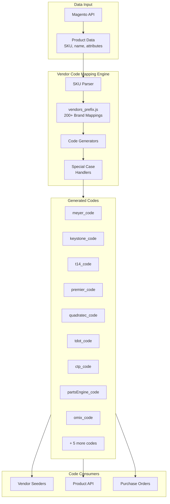
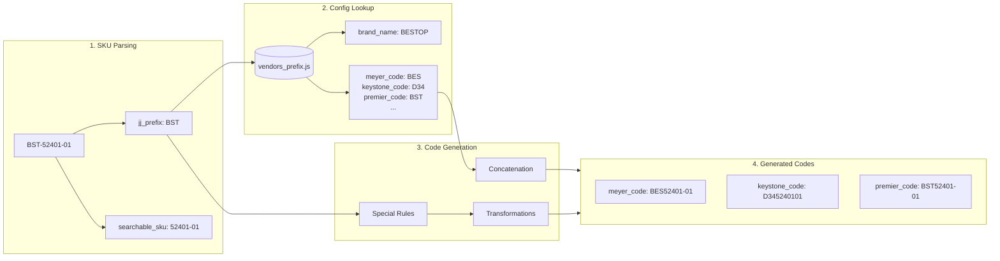
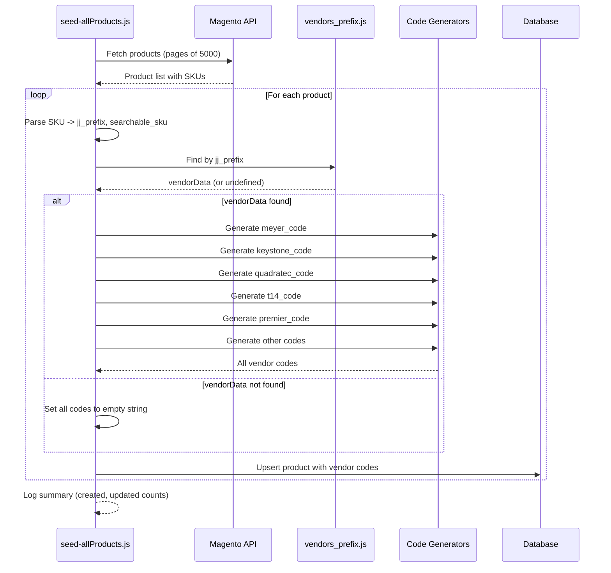

# DD-011: Vendor Code Mapping Engine - Design Document

**Version**: 1.0.0
**Status**: Accepted (Documentation of Existing Architecture)
**Created**: 2026-01-23
**Last Updated**: 2026-01-23
**Author**: System (Reverse-Engineered from Implementation)

---

## Overview

The Vendor Code Mapping Engine is a SKU transformation service that generates vendor-specific product codes from JustJeeps prefix-based SKUs. It implements brand-specific mapping rules for 200+ brands across 13+ vendors, enabling automated product lookup and order processing with external suppliers.

## Design Summary (Meta)

```yaml
design_type: "documentation"
risk_level: "low"
complexity_level: "high"

complexity_rationale:
  requirements_and_acs:
    - 200+ brand mappings with unique JJ prefix identifiers
    - 13+ vendor code generation patterns (Meyer, Keystone, Turn14, Premier, etc.)
    - Brand-specific special case handling (Bestop, Yukon, CargoGlide, Mickey Thompson, Omix-related)
    - Multiple output formats per product (URL generation, code concatenation, format transformations)

  constraints_and_risks:
    - Vendor code format requirements differ per supplier API/system
    - SKU format variations require brand-specific parsing rules
    - Magento sync dependency for product data
    - No validation against vendor systems (codes generated based on convention)

main_constraints:
  - "SKU format dependency: PREFIX-searchable_sku"
  - "Vendor code formats are vendor-defined, not modifiable"
  - "Brand mapping must be exhaustive for catalog coverage"

biggest_risks:
  - "Incorrect vendor code generation causes order lookup failures"
  - "New brand addition requires manual configuration update"
  - "Vendor format changes require code updates"

unknowns:
  - "Validation status of generated codes against vendor systems"
  - "Coverage percentage of vendor code mappings"
```

## Background and Context

### Prerequisite ADRs

- DD-002: Vendor Integration Framework (dependency for vendor code consumption)
- DD-003: Product Catalog Controller (dependency for product data model)

No formal ADRs documented for vendor code mapping decisions. The following common ADR topics should be considered:

- ADR-COMMON-001: SKU Format Standards (implicit: PREFIX-searchable_sku convention)
- ADR-COMMON-002: Vendor Code Generation Rules (brand-specific transformations)

### Agreement Checklist

This document captures the existing architecture. No changes are proposed.

- [x] **Scope**: Document current vendor code mapping implementation
- [x] **Non-scope**: No architectural changes or new mappings proposed
- [x] **Constraints**: Existing SKU format and vendor code conventions preserved
- [x] **Dependencies**: Product Catalog Management PRD, Multi-Vendor Integration PRD

### Problem Solved

The Vendor Code Mapping Engine solves the fundamental problem of translating internal JustJeeps product identifiers (SKUs) to vendor-specific codes required for:

1. **Vendor Catalog Lookup**: Finding products in vendor systems (APIs, FTP files, portals)
2. **Price and Inventory Matching**: Linking internal products to vendor cost/availability data
3. **Purchase Order Creation**: Generating correct part numbers for supplier orders
4. **Competitor Price Research**: Generating URLs for competitor price checking

### Current Challenges

1. **Brand Proliferation**: 200+ brands require individual mapping configurations
2. **Special Case Complexity**: Several brands require non-standard transformations
3. **Multi-Vendor Codes**: Single product may have 10+ vendor code fields
4. **Maintenance Burden**: Manual updates required when adding new brands

---

## Existing Codebase Analysis

### Implementation Path Mapping

| Type | Path | Description |
|------|------|-------------|
| Existing | `/prisma/seeds/hard-code_data/vendors_prefix.js` | Brand-to-vendor code mapping configuration (4800+ lines, 200+ brands) |
| Existing | `/prisma/seeds/seed-individual/seed-allProducts.js` (lines 32-200) | Vendor code generation logic during product sync |
| Existing | `/prisma/schema.prisma` (lines 70-114) | Product model with vendor code fields |

### Integration Points

| Integration Point | Location | Purpose |
|-------------------|----------|---------|
| Magento Sync | `seed-allProducts.js` | Source of product data with SKU |
| Product Model | `schema.prisma` | Storage of generated vendor codes |
| Vendor Seeders | `seed-*.js` (40+ files) | Consumers of vendor codes for matching |
| API Endpoints | `server.js` | Exposure of vendor codes in product responses |

### Similar Functionality Search Results

No duplicate vendor code generation patterns found. All vendor code logic is centralized in `seed-allProducts.js` with configuration in `vendors_prefix.js`.

---

## Architecture Overview

### System Context Diagram



### Data Flow Diagram



---

## Component Design

### Core Components

#### 1. SKU Parser

**Responsibility**: Extract JJ prefix and searchable SKU from product SKU

**Implementation** (seed-allProducts.js, lines 32-36):

```javascript
// Extract jj_prefix from sku by splitting at the first hyphen
const jjPrefix = item.sku.split("-")[0];

// Extract searchable_sku from sku by removing characters before the first hyphen
const searchable_sku = item.sku.slice(item.sku.indexOf("-") + 1);
```

**Data Contract**:

```yaml
Input:
  Type: string (SKU)
  Format: "{JJ_PREFIX}-{searchable_sku}"
  Examples: "BST-52401-01", "YUK-YG D44-411", "CGG-CG-1000-90"

Output:
  jj_prefix: string (2-4 uppercase characters)
  searchable_sku: string (remaining after first hyphen)

Error Handling:
  - Empty/undefined SKU: Returns empty strings
  - No hyphen: jj_prefix = entire SKU, searchable_sku = empty
```

#### 2. Vendor Prefix Configuration

**Responsibility**: Provide brand-to-vendor code mappings

**File**: `/prisma/seeds/hard-code_data/vendors_prefix.js`

**Structure** (per brand entry):

```javascript
{
  jj_prefix: "BST",              // JustJeeps prefix (2-4 chars)
  brand_name: "BESTOP",          // Display name
  vendors: "Meyer, Keystone, Quadratec",  // Available suppliers

  // Vendor-specific code prefixes
  meyer_code: "BES",             // Meyer Distributing prefix
  keystone_code: "D34",          // Keystone Automotive prefix
  quadratec_code: "Bestop",      // Quadratec brand name
  t14_code: "",                  // Turn14 prefix (if available)
  premier_code: "BST",           // Premier Performance prefix

  // Additional mappings
  tdot_code: "Bestop",           // Tire Discounter code
  ctp_code: "",                  // CTP code
  partsEngine_code: "-vp-bestop-15.aspx",  // PartsEngine URL suffix
  keystone_code_site: "BES",     // Keystone website search code
  keystone_ftp_brand: "",        // Keystone FTP brand name
  truck_parts_code: "Bestop",    // Truck parts code
  gentecdirect_code: "",         // Gentec Direct code
}
```

**Statistics**:
- Total entries: 200+ brands
- JJ prefix length: 2-4 characters
- Vendor coverage varies by brand

#### 3. Standard Code Generators

**Responsibility**: Generate vendor codes using standard concatenation rules

| Vendor | Generation Pattern | Example (BST-52401-01) |
|--------|-------------------|------------------------|
| Meyer | `{meyer_code}{searchable_sku}.toUpperCase()` | `BES52401-01` |
| Keystone | `{keystone_code}{sku_no_special_chars}` | `D345240101` |
| Quadratec | `{quadratec_code} {searchable_sku}` | `Bestop 52401-01` |
| Turn14 | `{t14_code}{searchable_sku}` | (no t14_code for BST) |
| Premier | `{premier_code}{searchable_sku}` | `BST52401-01` |
| TDot | `{tdot_code} {searchable_sku}` | `Bestop 52401-01` |
| CTP | `{ctp_code}{searchable_sku}` | (no ctp_code for BST) |
| PartsEngine | URL format (see special handling) | URL with suffix |

**Implementation** (seed-allProducts.js):

```javascript
// Meyer code generation (lines 50-53)
let meyerCode = vendorData && vendorData.meyer_code
  ? (vendorData.meyer_code + searchable_sku).toUpperCase()
  : "";

// Keystone code generation (lines 90-95)
let keystoneCode = vendorData && vendorData.keystone_code
  ? jjPrefix === "MKT"
    ? vendorData.keystone_code + searchable_sku.slice(-6)
    : vendorData.keystone_code + searchable_sku.replace(/[-./_]/g, "")
  : "";

// Quadratec code generation (lines 111-114)
const quadratecCode = vendorData && vendorData.quadratec_code
  ? vendorData.quadratec_code + searchable_sku
  : "";

// TDot code generation (lines 118-121)
const tdotCode = vendorData && vendorData.tdot_code
  ? vendorData.tdot_code + " " + searchable_sku
  : "";

// CTP code generation (lines 124-127)
const ctpCode = vendorData && vendorData.ctp_code
  ? vendorData.ctp_code + searchable_sku
  : "";

// Turn14 code generation (lines 188-191)
const t14Code = vendorData && vendorData.t14_code
  ? vendorData.t14_code + searchable_sku
  : "";

// Premier code generation (lines 194-198)
const premierCode = vendorData && vendorData.premier_code
  ? vendorData.premier_code + searchable_sku
  : "";
```

#### 4. Special Case Handlers

**Responsibility**: Apply brand-specific transformation rules

##### Bestop (BST) - Meyer Code Hyphen Insertion

```javascript
// Lines 57-66: Add hyphen after first 5 digits for Meyer code
if (jjPrefix === "BST") {
  if (searchable_sku === "5240711") {
    // Special case: no hyphen formatting
    meyerCode = vendorData.meyer_code + searchable_sku;
  } else {
    meyerCode = vendorData.meyer_code + searchable_sku.slice(0, 5) + "-" +
    searchable_sku.slice(5);
  }
}
// Example: BST-5240101 -> BES52401-01
```

##### Yukon (YUK) - Space Removal

```javascript
// Lines 68-73: Remove all spaces from Meyer code
if (jjPrefix === "YUK") {
  meyerCode = (vendorData.meyer_code + searchable_sku)
    .replace(/\s+/g, "") // removes all spaces
    .toUpperCase();
}
// Example: YUK-YG D44-411 -> YYGYG D44-411 -> YYGYGD44411 (no spaces)
```

##### Yukon (YUK) - Keystone Code Site Override

```javascript
// Lines 165-167: Use keystone_code for keystone_code_site
if (jjPrefix === "YUK") {
  keystoneCodeSite = keystoneCode || "";
}
```

##### CargoGlide (CGG) - Keystone Code Format

```javascript
// Lines 98-101: Special keystone_code format
if (jjPrefix === "CGG") {
  keystoneCode = "CG" + searchable_sku.replace(/-/g, "");
}
// Example: CGG-CG-1000-90 -> CG100090
```

##### Mickey Thompson (MKT) - Last 6 Characters

```javascript
// Lines 92-93: Use last 6 characters for Keystone
if (jjPrefix === "MKT") {
  keystoneCode = vendorData.keystone_code + searchable_sku.slice(-6);
}
// Example: MKT-90000024 -> [prefix]000024
```

##### Omix-Related Brands (OA, ALY, RR, HVC) - Direct SKU Use

```javascript
// Lines 362-365: Use searchable_sku directly as omix_code
omix_code: jjPrefix === "OA" || jjPrefix === "ALY" || jjPrefix === "RR" || jjPrefix === "HVC"
  ? searchable_sku
  : null
// Example: OA-16500.10 -> 16500.10
```

##### Bestop (BST) - PartsEngine Code Format

```javascript
// Lines 136-139: Insert hyphen before last 2 digits for PartsEngine
if (jjPrefix === "BST") {
  cleanedSearchableSku = cleanedSearchableSku.replace(/(\d+)(\d{2})$/, "$1-$2");
}
// Example: 5240101 -> 52401-01
```

#### 5. URL Code Generators

**Responsibility**: Generate vendor-specific URLs

##### PartsEngine Code

```javascript
// Lines 141-144
const partsEngineCode = vendorData && vendorData.partsEngine_code
  ? `https://www.partsengine.ca/${cleanedSearchableSku}${vendorData.partsEngine_code}`
  : "";
// Example: https://www.partsengine.ca/52401-01-vp-bestop-15.aspx
```

##### TDot URL

```javascript
// Lines 148-151
const tdotUrl = tdotCode && tdotCode.trim() !== ""
  ? `https://www.tdotperformance.ca/catalogsearch/result/?q=${searchable_sku}`
  : null;
// Example: https://www.tdotperformance.ca/catalogsearch/result/?q=52401-01
```

---

## Data Contracts

### Product Model Vendor Code Fields

```prisma
model Product {
  sku                String   @id @unique

  // SKU Components
  jj_prefix          String?  // Brand prefix (e.g., "BST", "YUK")
  searchable_sku     String?  // Part number after prefix
  searchableSku      String   // Legacy field (same value)

  // Vendor Codes
  meyer_code         String?  // Meyer Distributing code
  keystone_code      String?  // Keystone Automotive code
  keystone_code_site String?  // Keystone website search code
  keystone_ftp_brand String?  // Keystone FTP brand identifier
  quadratec_code     String?  // Quadratec wholesale code
  t14_code           String?  // Turn14 part number
  t14_id             String?  // Turn14 item ID (populated by T14 seeder)
  premier_code       String?  // Premier Performance code
  omix_code          String?  // Omix-ADA direct SKU
  rough_country_code String?  // Rough Country SKU
  tdot_code          String?  // Tire Discounter code
  tdot_url           String?  // TDot search URL
  ctp_code           String?  // CTP part number
  partsEngine_code   String?  // PartsEngine URL
  gentecdirect_code  String?  // Gentec Direct code

  // Brand Information
  brand_name         String?  // Full brand name
  vendors            String?  // Comma-separated vendor list
}
```

### Vendor Prefix Configuration Schema

```typescript
interface VendorPrefix {
  // Required
  jj_prefix: string;           // 2-4 character brand identifier
  brand_name: string;          // Display name for brand

  // Vendor Code Prefixes (optional per brand)
  vendors?: string;            // Available suppliers (informational)
  meyer_code?: string;         // Meyer Distributing prefix
  keystone_code?: string;      // Keystone Automotive prefix
  keystone_code_site?: string; // Keystone website code
  keystone_ftp_brand?: string; // Keystone FTP identifier
  quadratec_code?: string;     // Quadratec brand name
  t14_code?: string;           // Turn14 prefix
  premier_code?: string;       // Premier Performance prefix
  tdot_code?: string;          // Tire Discounter code
  ctp_code?: string;           // CTP code
  partsEngine_code?: string;   // PartsEngine URL suffix
  gentecdirect_code?: string;  // Gentec Direct prefix
  truck_parts_code?: string;   // Truck parts identifier
}
```

---

## Integration Boundary Contracts

### Magento Sync Integration

```yaml
Input from Magento:
  Type: Product item from API
  Required Fields: sku, name, price, status
  SKU Format: "{PREFIX}-{part_number}"

Output to Database:
  Type: Product record with vendor codes
  Generated Fields:
    - jj_prefix (extracted)
    - searchable_sku (extracted)
    - meyer_code, keystone_code, quadratec_code, etc. (generated)

Processing:
  - Sync: Async (batch processing)
  - On Error: Log and continue to next product
```

### Vendor Seeder Integration

```yaml
Code Lookup Pattern:
  Input: Product with vendor code field
  Matching: vendor_code == vendor_catalog_sku

Example - Meyer Seeder:
  Product.meyer_code -> Meyer API part lookup -> VendorProduct record

Example - Keystone Seeder:
  Product.keystone_code -> Keystone FTP file matching -> VendorProduct record
```

---

## Change Impact Map

This document describes existing architecture. No changes are proposed.

```yaml
Change Target: N/A (Documentation Only)

Direct Impact: None

Indirect Impact: None

No Ripple Effect:
  - vendors_prefix.js configuration
  - seed-allProducts.js generation logic
  - Product model schema
  - Vendor seeders
  - API endpoints
```

---

## Integration Point Map

```yaml
Integration Point 1:
  Existing Component: Magento API (magento-allProducts.js)
  Integration Method: Source of product SKU data
  Impact Level: High (Data source)
  Required Test Coverage: SKU format validation

Integration Point 2:
  Existing Component: Product model (schema.prisma)
  Integration Method: Storage of generated vendor codes
  Impact Level: High (Data persistence)
  Required Test Coverage: Field population verification

Integration Point 3:
  Existing Component: Vendor seeders (seed-*.js, 40+ files)
  Integration Method: Code-based product matching
  Impact Level: High (Business critical)
  Required Test Coverage: SKU matching accuracy

Integration Point 4:
  Existing Component: Product API endpoints (server.js)
  Integration Method: Vendor codes in product response
  Impact Level: Medium (Data exposure)
  Required Test Coverage: API response validation
```

---

## Vendor Code Matrix

### Vendor Coverage by Code Type

| Code Field | Generation Type | Vendors Using | Special Handling |
|------------|----------------|---------------|------------------|
| `meyer_code` | Prefix + SKU (uppercase) | Meyer | Bestop hyphen, Yukon space removal |
| `keystone_code` | Prefix + SKU (no special chars) | Keystone | MKT last 6 chars, CGG format |
| `keystone_code_site` | Site-specific code | Keystone Website | Yukon uses keystone_code |
| `keystone_ftp_brand` | Static brand identifier | Keystone FTP | None |
| `quadratec_code` | Brand name + SKU | Quadratec | None |
| `t14_code` | Prefix + SKU | Turn14 | None |
| `premier_code` | Prefix + SKU | Premier Performance | None |
| `tdot_code` | Code + space + SKU | Tire Discounter | None |
| `tdot_url` | Full search URL | TDot website | Conditional generation |
| `ctp_code` | Prefix + SKU | CTP | None |
| `partsEngine_code` | Full URL | PartsEngine | Bestop hyphen insertion |
| `omix_code` | Direct searchable_sku | Omix-ADA | Only OA, ALY, RR, HVC prefixes |

### Special Case Summary

| Brand | JJ Prefix | Special Rule | Affected Codes |
|-------|-----------|--------------|----------------|
| Bestop | BST | Hyphen after 5 digits | meyer_code |
| Bestop | BST | SKU 5240711 exception | meyer_code |
| Bestop | BST | Hyphen before last 2 digits | partsEngine_code |
| Yukon | YUK | Remove all spaces | meyer_code |
| Yukon | YUK | Use keystone_code | keystone_code_site |
| CargoGlide | CGG | CG + no hyphens | keystone_code |
| Mickey Thompson | MKT | Last 6 characters | keystone_code |
| Omix-ADA | OA | Direct SKU use | omix_code |
| Alloy USA | ALY | Direct SKU use | omix_code |
| Rugged Ridge | RR | Direct SKU use | omix_code |
| HVC | HVC | Direct SKU use | omix_code |

---

## Brand Mapping Statistics

### Overview

| Metric | Value |
|--------|-------|
| Total Brand Entries | 200+ |
| Unique JJ Prefixes | 200+ |
| Brands with meyer_code | ~120 |
| Brands with keystone_code | ~140 |
| Brands with quadratec_code | ~130 |
| Brands with t14_code | ~50 |
| Brands with premier_code | ~80 |
| Brands with partsEngine_code | ~150 |

### Sample Brand Mappings

| JJ Prefix | Brand | Meyer | Keystone | Quadratec | Turn14 | Premier |
|-----------|-------|-------|----------|-----------|--------|---------|
| AFE | aFe Power | AFE | A15 | aFe Power | afe | AFE |
| ARB | ARB | ARB | ARB | ARB | arb | ARB |
| BST | BESTOP | BES | D34 | Bestop | - | BST |
| MKT | Mickey Thompson | MKT | M56 | Mickey Thompson | mkt | - |
| RU | Rough Country | RCY | R45 | Rough Country | rcu | RGH |
| TF | TeraFlex | TFX | T27 | TeraFlex | ter | TFX |
| SB | Smittybilt | SMB | - | - | - | - |
| YUK | Yukon Gear | YYG | Y10 | Yukon | yuk | YUK |

---

## Test Strategy

### Unit Test Coverage (Not Currently Implemented)

| Test Area | Focus | Status |
|-----------|-------|--------|
| SKU Parsing | jj_prefix extraction, searchable_sku extraction | Not implemented |
| Config Lookup | vendors_prefix.js loading, brand matching | Not implemented |
| Standard Generation | Concatenation, case transformation | Not implemented |
| Special Cases | Bestop, Yukon, CGG, MKT rules | Not implemented |
| URL Generation | PartsEngine, TDot URL formats | Not implemented |

### Recommended Test Cases

1. **Standard SKU Parsing**
   - Input: `BST-52401-01`
   - Expected: `jj_prefix = "BST"`, `searchable_sku = "52401-01"`

2. **Meyer Code Generation (Standard)**
   - Input: `AFE-53-10001`
   - Expected: `meyer_code = "AFE53-10001"` (uppercase)

3. **Meyer Code Generation (Bestop Special)**
   - Input: `BST-5240101`
   - Expected: `meyer_code = "BES52401-01"` (hyphen after 5 digits)

4. **Meyer Code Generation (Bestop Exception)**
   - Input: `BST-5240711`
   - Expected: `meyer_code = "BES5240711"` (no hyphen)

5. **Meyer Code Generation (Yukon)**
   - Input: `YUK-YG D44-411`
   - Expected: `meyer_code = "YYGYGD44411"` (no spaces, uppercase)

6. **Keystone Code Generation (Standard)**
   - Input: `AFE-53-10001`
   - Expected: `keystone_code = "A155310001"` (no special chars)

7. **Keystone Code Generation (CargoGlide)**
   - Input: `CGG-CG-1000-90`
   - Expected: `keystone_code = "CG100090"`

8. **Keystone Code Generation (Mickey Thompson)**
   - Input: `MKT-90000024`
   - Expected: `keystone_code = "M56000024"` (last 6 chars)

9. **Omix Code Generation**
   - Input: `OA-16500.10`
   - Expected: `omix_code = "16500.10"` (direct searchable_sku)

---

## Error Handling

### Current Behavior

1. **Missing Vendor Configuration**
   - If no `vendorsPrefix` entry matches `jj_prefix`, all vendor codes are empty strings
   - No error logging for missing mappings

2. **Empty/Invalid SKU**
   - SKU check logs when undefined but continues processing
   - Empty strings produced for vendor codes

3. **Missing Vendor Code Prefix**
   - If brand entry exists but lacks specific vendor prefix (e.g., no `meyer_code`), empty string returned
   - Falsy check: `vendorData && vendorData.meyer_code`

### Pattern

```javascript
// Standard null-safe generation pattern
const vendorCode = vendorData && vendorData.vendor_prefix
  ? vendorData.vendor_prefix + searchable_sku
  : "";
```

---

## Performance Characteristics

### Execution Context

- **Trigger**: `npm run seed-all` (Magento product sync)
- **Frequency**: On-demand (typically daily or as needed)
- **Product Volume**: 20,000+ products processed per sync

### Processing Time

| Metric | Value |
|--------|-------|
| Config Loading | < 100ms (module require) |
| Per-Product Processing | < 1ms |
| Full Sync Duration | 5-15 minutes (includes Magento API calls) |

### Memory Usage

- `vendors_prefix.js`: ~200 KB in memory
- Per-product overhead: Minimal (string operations only)

---

## Non-Functional Requirements

### Maintainability

| Aspect | Current State | Notes |
|--------|---------------|-------|
| Configuration File | Single file, 4800+ lines | Consider splitting by vendor or brand category |
| Special Case Logic | Inline if statements | Could be extracted to dedicated handlers |
| Code Duplication | Some patterns repeated | Standard generator could be consolidated |

### Reliability

- **Deterministic**: Same input always produces same output
- **No External Dependencies**: Generation uses local config only
- **Fault Tolerance**: Empty string returned for missing mappings

### Security

- No sensitive data in vendor prefix configuration
- No external API calls during code generation

---

## Sequence Diagram

### Product Sync with Vendor Code Generation



---

## Future Considerations

### Potential Improvements (Not Proposed)

1. **Validation Framework**: Verify generated codes against vendor systems
2. **Configuration UI**: Admin interface for managing brand mappings
3. **Dynamic Rules**: Allow rule customization without code changes
4. **Error Reporting**: Dashboard for missing/invalid mappings
5. **Code Coverage Analysis**: Report on vendor code population rates

### Technical Debt

1. **Inline Special Cases**: Brand-specific rules embedded in main loop
2. **Single Large Config File**: 4800+ lines challenging to maintain
3. **No Automated Testing**: Code generation logic untested
4. **Duplicate Field**: `searchableSku` and `searchable_sku` both exist

---

## References

### Internal Documentation

- [product-catalog-management-prd.md](/docs/prd/product-catalog-management-prd.md) - Product catalog requirements
- [multi-vendor-integration-prd.md](/docs/prd/multi-vendor-integration-prd.md) - Vendor integration requirements
- [DD-002: Vendor Integration Framework](/docs/design/dd-002-vendor-integration-framework.md) - Related design document
- [CLAUDE.md](/CLAUDE.md) - Repository documentation

### Source Files

- `/prisma/seeds/hard-code_data/vendors_prefix.js` - Brand mapping configuration
- `/prisma/seeds/seed-individual/seed-allProducts.js` - Code generation implementation
- `/prisma/schema.prisma` - Product model definition

---

## Glossary

| Term | Definition |
|------|------------|
| **JJ Prefix** | 2-4 character brand identifier used in JustJeeps SKUs (e.g., BST for Bestop) |
| **Searchable SKU** | Manufacturer part number portion of SKU after the JJ prefix |
| **Vendor Code** | Vendor-specific product identifier used for catalog lookup and ordering |
| **Vendor Prefix** | Static code prepended to searchable_sku for vendor code generation |
| **Special Case Handler** | Brand-specific logic that modifies standard code generation |
| **Code Generation** | Process of creating vendor-specific codes from internal SKUs |
| **Magento Sync** | Batch process importing product data from Magento e-commerce platform |

---

## Update History

| Version | Date | Author | Changes |
|---------|------|--------|---------|
| 1.0.0 | 2026-01-23 | System | Initial design document (reverse-engineered from implementation) |
