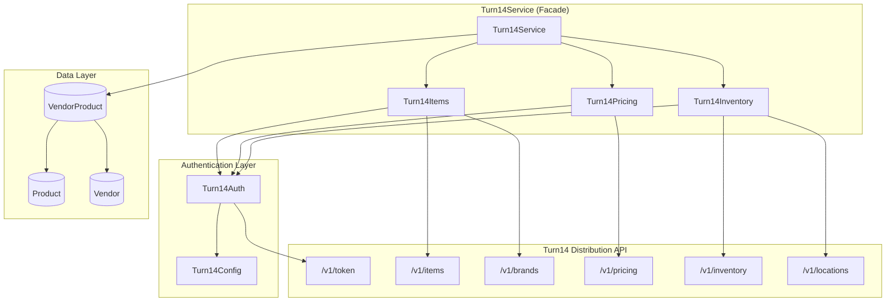
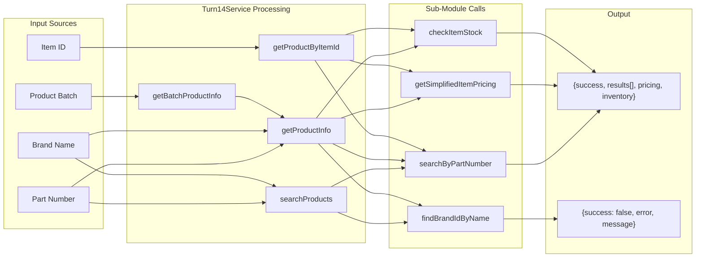
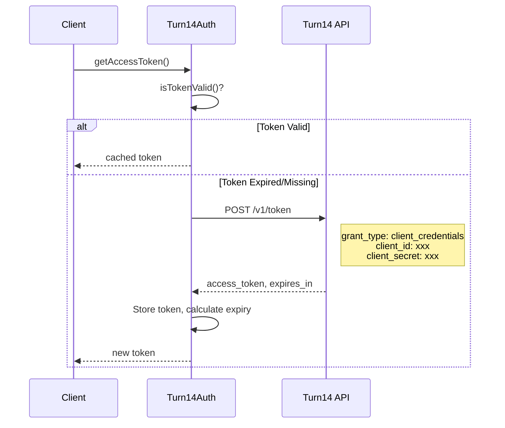
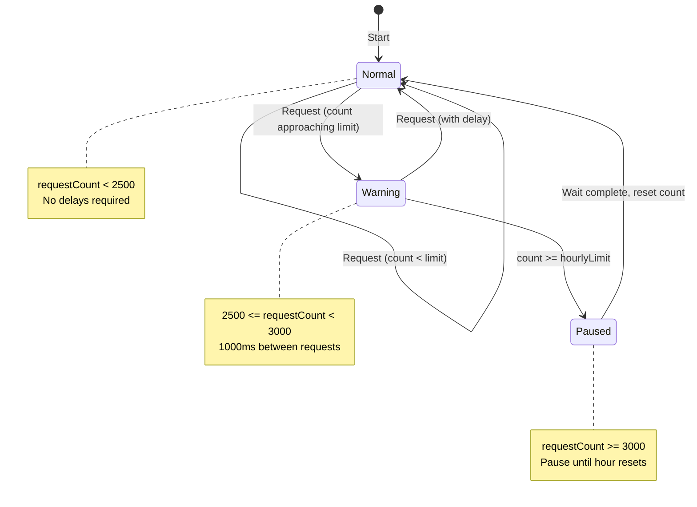
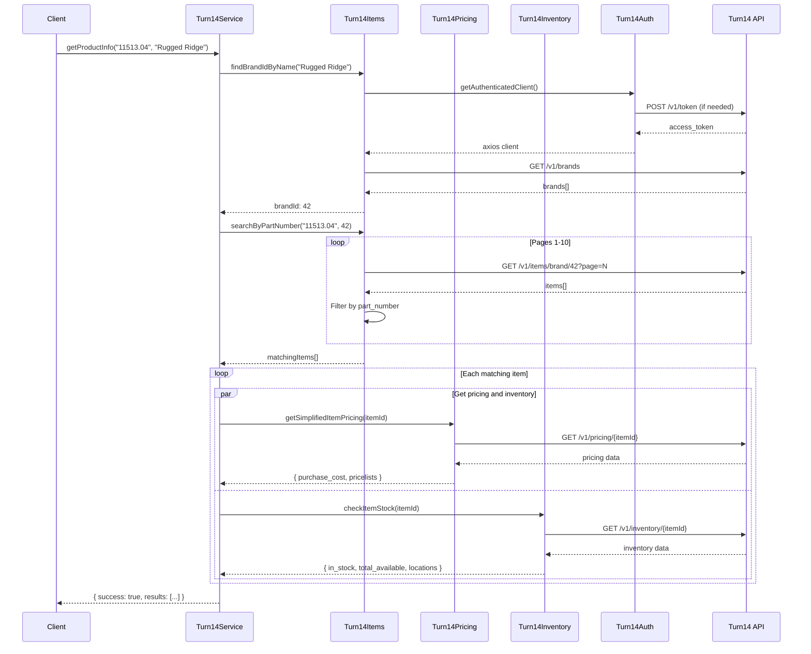
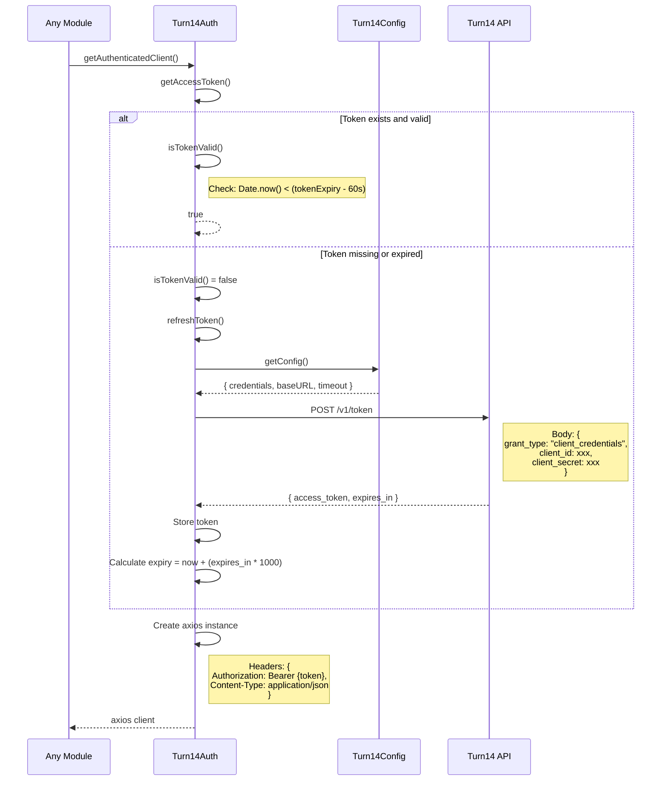

# DD-012: Turn14 Distribution Service - Design Document

**Version**: 1.0.0
**Status**: Accepted (Documentation of Existing Architecture)
**Created**: 2026-01-23
**Last Updated**: 2026-01-23
**Author**: System (Reverse-Engineered from Implementation)

---

## Agreement Checklist

This document captures the existing architecture. No new implementation is proposed.

- [x] **Scope**: Document current Turn14 Distribution API integration service
- [x] **Non-scope**: No architectural changes or new feature proposals
- [x] **Constraints**: Existing rate limits (5 req/sec, 5000/hour, 30000/day), OAuth2 authentication, API response formats preserved
- [x] **Dependencies**: DD-002 (Vendor Integration Framework), multi-vendor-integration-prd.md

---

## Prerequisite ADRs

None currently documented. The following common ADR topics are implicitly implemented:

- ADR-COMMON-001: Error Handling Strategy (fail-fast with continuation for batch operations)
- ADR-COMMON-002: Currency Conversion Approach (USD to CAD 1.5x multiplier)
- ADR-COMMON-003: Rate Limiting Patterns (token bucket with hourly pause)
- ADR-COMMON-004: Authentication Token Management (OAuth2 client credentials with 60-second expiry buffer)

---

## Executive Summary

The Turn14 Distribution Service is a comprehensive REST API integration component that provides OAuth2-authenticated access to Turn14's automotive parts distribution platform. The service manages item search, pricing retrieval, and inventory checking with strict rate limit compliance (5 requests/second, 5,000/hour, 30,000/day). It supports both individual product lookups and batch processing for large-scale product synchronization operations.

**Vendor ID**: 15 (Turn14 Distribution)

---

## Existing Codebase Analysis

### Implementation Path Mapping

| Component | File Path | Status | Lines |
|-----------|-----------|--------|-------|
| Turn14Service (Main Facade) | `/services/turn14/index.js` | Existing | 294 |
| Turn14Auth (Authentication) | `/services/turn14/auth.js` | Existing | 98 |
| Turn14Items (Item Catalog) | `/services/turn14/items.js` | Existing | 186 |
| Turn14Pricing (Pricing Data) | `/services/turn14/pricing.js` | Existing | 159 |
| Turn14Inventory (Stock Data) | `/services/turn14/inventory.js` | Existing | 260 |
| Turn14Config (Configuration) | `/services/turn14/config.js` | Existing | 135 |
| Production Seeder | `/prisma/seeds/seed-individual/seed-turn14-production.js` | Existing | 278 |

### Similar Functionality Search Results

**Found similar patterns in Premier Service** (`/services/premier/`):
- Both use modular service architecture (auth.js, config.js, pricing.js, inventory.js)
- Both implement token caching with expiry management
- Both support batch processing with rate limiting

**Decision**: No refactoring needed. The services are intentionally separate due to:
- Different authentication protocols (OAuth2 vs API Key + Session Token)
- Different API response formats (JSON:API vs standard JSON)
- Different rate limiting requirements
- Vendor-specific data transformation rules

---

## Architecture Overview

### Component Architecture Diagram



### Data Flow Diagram



---

## Component Design

### 1. Turn14Service (Main Facade)

**File**: `/services/turn14/index.js`

The main service class provides a unified interface for Turn14 API operations, orchestrating the sub-modules for common workflows.

**Class Structure**:

```javascript
class Turn14Service {
  constructor() {
    this.items = new Turn14Items();
    this.pricing = new Turn14Pricing();
    this.inventory = new Turn14Inventory();
  }

  // Public Interface Methods
  async getProductInfo(partNumber, brandName = null)
  async getBatchProductInfo(products)
  async getProductByItemId(itemId)
  async searchProducts(partNumber, brandName = null)
  async getBrands()
  async getWarehouses()
}
```

**Method Specifications**:

| Method | Parameters | Returns | Description |
|--------|------------|---------|-------------|
| `getProductInfo` | `partNumber: string`, `brandName?: string` | `ProductInfoResult` | Complete product lookup with pricing and inventory |
| `getBatchProductInfo` | `products: {partNumber, brandName}[]` | `ProductInfoResult[]` | Batch processing with 5-item batches and 1s delays |
| `getProductByItemId` | `itemId: string` | `ProductInfoResult` | Direct item lookup by Turn14 ID |
| `searchProducts` | `partNumber: string`, `brandName?: string` | `SearchResult` | Lightweight search without pricing/inventory |
| `getBrands` | none | `BrandsResult` | Retrieve all Turn14 brands |
| `getWarehouses` | none | `WarehousesResult` | Retrieve warehouse locations |

### 2. Turn14Auth (Authentication Module)

**File**: `/services/turn14/auth.js`

Manages OAuth2 client credentials authentication with intelligent token caching.

**Class Structure**:

```javascript
class Turn14Auth {
  constructor() {
    this.config = config.getConfig();
    this.baseURL = this.config.baseURL;
    this.tokenData = null;
    this.tokenExpiry = null;
  }

  async getAccessToken()           // Token retrieval with caching
  isTokenValid()                   // 60-second expiry buffer check
  async refreshToken()             // OAuth2 client credentials flow
  async getAuthenticatedClient()   // Configured axios instance
  validateConfig()                 // Environment variable validation
}
```

**Authentication Flow**:



**Token Caching Strategy**:

- Tokens cached in memory (not persisted)
- 60-second buffer before expiry (prevents edge-case failures)
- Automatic refresh on next request after expiry

### 3. Turn14Items (Item Catalog Module)

**File**: `/services/turn14/items.js`

Provides access to Turn14's product catalog with pagination and filtering capabilities.

**Class Structure**:

```javascript
class Turn14Items {
  constructor() {
    this.auth = new Turn14Auth();
  }

  // Pagination-based retrieval
  async getAllItems(page = 1)
  async getItem(itemId)
  async getBrandItems(brandId, page = 1)
  async getUpdatedItems(days = 1, page = 1)

  // Brand operations
  async getAllBrands()
  async getBrand(brandId)
  async findBrandIdByName(brandName)

  // Search operations
  async searchByPartNumber(partNumber, brandId = null)
}
```

**API Endpoints Used**:

| Endpoint | Method | Parameters | Response |
|----------|--------|------------|----------|
| `/v1/items` | GET | `page` | Paginated items list |
| `/v1/items/{itemId}` | GET | - | Single item details |
| `/v1/items/brand/{brandId}` | GET | `page` | Brand-filtered items |
| `/v1/items/updates` | GET | `page`, `days` | Recently updated items |
| `/v1/brands` | GET | - | All brands list |
| `/v1/brands/{brandId}` | GET | - | Single brand details |

**Part Number Search Algorithm**:

```javascript
async searchByPartNumber(partNumber, brandId = null) {
  const matchingItems = [];
  let page = 1;
  let hasMorePages = true;

  while (hasMorePages && page <= 10) {  // Max 10 pages to prevent excessive calls
    let itemsData;

    if (brandId) {
      itemsData = await this.getBrandItems(brandId, page);
    } else {
      itemsData = await this.getAllItems(page);
    }

    // Case-insensitive partial match on part_number attribute
    const matches = itemsData.data.filter(item =>
      item.attributes.part_number &&
      item.attributes.part_number.toLowerCase().includes(partNumber.toLowerCase())
    );
    matchingItems.push(...matches);

    hasMorePages = itemsData.meta && page < itemsData.meta.total_pages;
    page++;
  }

  return matchingItems;
}
```

**Brand Matching Strategy**:

1. Exact match (case-insensitive)
2. Partial match fallback (either contains the other)
3. Returns null if no match found

### 4. Turn14Pricing (Pricing Data Module)

**File**: `/services/turn14/pricing.js`

Retrieves and processes pricing information from Turn14 API.

**Class Structure**:

```javascript
class Turn14Pricing {
  constructor() {
    this.auth = new Turn14Auth();
  }

  // Pagination-based retrieval
  async getAllPricing(page = 1)
  async getItemPricing(itemId)
  async getBrandPricing(brandId, page = 1)
  async getPricegroupPricing(brandId, pricegroupId, page = 1)

  // Time-based retrieval
  async getPricingChanges(startDate, endDate)

  // Batch operations
  async getMultipleItemPricing(itemIds)

  // Data extraction
  extractPricingInfo(pricingData)
  async getSimplifiedItemPricing(itemId)
}
```

**API Endpoints Used**:

| Endpoint | Method | Parameters | Response |
|----------|--------|------------|----------|
| `/v1/pricing` | GET | `page` | Paginated pricing list |
| `/v1/pricing/{itemId}` | GET | - | Single item pricing |
| `/v1/pricing/brand/{brandId}` | GET | `page` | Brand pricing |
| `/v1/pricing/brand/{brandId}/pricegroup/{pricegroupId}` | GET | `page` | Pricegroup pricing |
| `/v1/pricing/changes` | GET | `start_date`, `end_date` | Pricing changes |

**Pricing Data Structure**:

```javascript
// extractPricingInfo output
{
  item_id: "12345",
  purchase_cost: 149.99,        // Dealer cost (USD)
  has_map: true,                // Has MAP restriction
  can_purchase: true,           // Purchasable flag
  pricelists: {
    msrp: 299.99,
    map: 249.99,
    jobber: 199.99
  }
}
```

### 5. Turn14Inventory (Stock Data Module)

**File**: `/services/turn14/inventory.js`

Manages inventory and stock level retrieval across Turn14 warehouses.

**Class Structure**:

```javascript
class Turn14Inventory {
  constructor() {
    this.auth = new Turn14Auth();
  }

  // Pagination-based retrieval
  async getAllInventory(page = 1)
  async getItemInventory(itemIds)           // Max 250 items
  async getBrandInventory(brandId, page = 1)
  async getPricegroupInventory(brandId, pricegroupId, page = 1)

  // Time-based retrieval
  async getUpdatedInventory(minutes = 60, page = 1)  // Valid: 15, 30, 60, 240, 480, 1440

  // Warehouse operations
  async getLocations()

  // Data extraction
  extractInventoryInfo(inventoryData)
  async getSimplifiedInventory(itemIds)

  // Stock status
  async checkItemStock(itemId)
  async checkMultipleItemsStock(itemIds)
}
```

**API Endpoints Used**:

| Endpoint | Method | Parameters | Response |
|----------|--------|------------|----------|
| `/v1/inventory` | GET | `page` | Paginated inventory list |
| `/v1/inventory/{itemIds}` | GET | comma-separated IDs (max 250) | Multiple items inventory |
| `/v1/inventory/brand/{brandId}` | GET | `page` | Brand inventory |
| `/v1/inventory/updates` | GET | `page`, `minutes` | Recently updated inventory |
| `/v1/locations` | GET | - | Warehouse locations |

**Inventory Data Structure**:

```javascript
// checkItemStock output
{
  item_id: "12345",
  in_stock: true,
  total_available: 45,
  locations: {
    "TX": 20,           // Texas warehouse
    "CA": 15,           // California warehouse
    "NV": 10            // Nevada warehouse
  },
  manufacturer_stock: {
    stock: 100          // Factory stock
  },
  eta: "2026-02-15"     // Expected arrival (if backordered)
}
```

**Batch Processing (250 item limit)**:

```javascript
async checkMultipleItemsStock(itemIds) {
  // Split into chunks of 250 (API limit)
  const chunks = [];
  for (let i = 0; i < itemIds.length; i += 250) {
    chunks.push(itemIds.slice(i, i + 250));
  }

  const allResults = [];
  for (const chunk of chunks) {
    const inventoryData = await this.getItemInventory(chunk);
    // Process and accumulate results
  }
  return allResults;
}
```

### 6. Turn14Config (Configuration Module)

**File**: `/services/turn14/config.js`

Centralized configuration management with environment variable validation.

**Class Structure**:

```javascript
class Turn14Config {
  constructor() {
    this.validateConfig();
  }

  getCredentials()           // OAuth2 credentials
  getBaseURL()               // API base URL (production vs testing)
  getTimeoutSettings()       // Request timeout configuration
  getRateLimitSettings()     // Rate limiting parameters
  getLoggingSettings()       // Logging configuration
  validateConfig()           // Required env var validation
  isProduction()             // Environment check
  getConfig()                // Complete configuration object
  printConfigSummary()       // Debug output (masks secrets)
}
```

**Configuration Parameters**:

| Parameter | Environment Variable | Default | Description |
|-----------|---------------------|---------|-------------|
| Client ID | `TURN14_CLIENT_ID` | Required | OAuth2 client ID |
| Client Secret | `TURN14_CLIENT_SECRET` | Required | OAuth2 client secret |
| Environment | `TURN14_ENVIRONMENT` | `testing` | `production` or `testing` |
| Request Timeout | `TURN14_REQUEST_TIMEOUT` | 30000ms | API request timeout |
| Retry Delay | `TURN14_RETRY_DELAY` | 1000ms | Delay between retries |
| Max Retries | `TURN14_MAX_RETRIES` | 3 | Maximum retry attempts |
| Rate Limit | `TURN14_RATE_LIMIT` | 10 req/sec | Request throttling (config value) |
| Batch Size | `TURN14_BATCH_SIZE` | 5 | Parallel request count |
| Batch Delay | `TURN14_BATCH_DELAY` | 1000ms | Delay between batches |
| Log Level | `TURN14_LOG_LEVEL` | `info` | Logging verbosity |
| Log Requests | `TURN14_LOG_REQUESTS` | `false` | Log outgoing requests |
| Log Responses | `TURN14_LOG_RESPONSES` | `false` | Log API responses |

**Base URL Selection**:

```javascript
getBaseURL() {
  const environment = process.env.TURN14_ENVIRONMENT || 'testing';
  return environment === 'production'
    ? 'https://api.turn14.com'
    : 'https://apitest.turn14.com';
}
```

---

## Data Contracts

### Input Contracts

**getProductInfo Parameters**:

```typescript
interface GetProductInfoParams {
  partNumber: string;     // Required: Part number to search (t14_code)
  brandName?: string;     // Optional: Brand name filter (t14_code)
}
```

**getBatchProductInfo Parameters**:

```typescript
interface BatchProduct {
  partNumber: string;     // Required: Part number
  brandName?: string;     // Optional: Brand name
}

type BatchProductInfoParams = BatchProduct[];
```

### Output Contracts

**ProductInfoResult**:

```typescript
interface ProductInfoResult {
  success: boolean;
  message: string;
  part_number: string;
  brand_name: string | null;
  total_matches?: number;
  results: ProductResult[];
  error?: string;
}

interface ProductResult {
  item_id: string;
  part_number: string;
  mfr_part_number: string;
  product_name: string;
  part_description: string;
  brand: string;
  brand_id: number;
  category: string;
  subcategory: string;
  active: boolean;
  regular_stock: boolean;
  pricing: PricingInfo | null;
  inventory: StockInfo;
  thumbnail: string;
  dimensions: DimensionsInfo;
  clearance_item: boolean;
  error?: string;               // Only on individual item failure
}
```

**PricingInfo**:

```typescript
interface PricingInfo {
  item_id: string;
  purchase_cost: number;        // USD dealer cost
  has_map: boolean;
  can_purchase: boolean;
  pricelists: {
    [key: string]: number;      // e.g., msrp, map, jobber
  };
}
```

**StockInfo**:

```typescript
interface StockInfo {
  item_id: string;
  in_stock: boolean;
  total_available: number;
  locations: {
    [warehouseCode: string]: number;
  };
  manufacturer_stock?: {
    stock: number;
  };
  eta?: string;                 // ISO date if backordered
  error?: string;               // Only on failure
}
```

---

## Integration Point Map

### Integration Points

```yaml
Integration Point 1:
  Existing Component: Product model (Product.t14_code)
  Integration Method: Part number lookup via searchByPartNumber()
  Impact Level: High (Data matching)
  Required Test Coverage: SKU matching accuracy

Integration Point 2:
  Existing Component: Product model (Product.t14_id)
  Integration Method: Direct item lookup via getItem(itemId)
  Impact Level: Medium (Cached ID usage)
  Required Test Coverage: ID-based retrieval

Integration Point 3:
  Existing Component: VendorProduct model (vendor_id=15)
  Integration Method: Upsert after pricing/inventory retrieval
  Impact Level: High (Data persistence)
  Required Test Coverage: Cost conversion, inventory aggregation

Integration Point 4:
  Existing Component: Seed scripts (seed-turn14-production.js)
  Integration Method: Direct service instantiation
  Impact Level: High (Batch data sync)
  Required Test Coverage: Full sync completion, rate limit compliance
```

### Integration Boundary Contracts

```yaml
Turn14Service.getProductInfo:
  Input: Part number (string), Brand name (optional string)
  Output: ProductInfoResult (async Promise)
  On Error: Return { success: false, error: message, results: [] }

Turn14Service.getBatchProductInfo:
  Input: Array of {partNumber, brandName} objects
  Output: Array of ProductInfoResult (async Promise)
  On Error: Propagate error (caller handles)

Turn14Auth.getAccessToken:
  Input: None
  Output: Access token string (async Promise)
  On Error: Throw Error with authentication failure message

Turn14Items.searchByPartNumber:
  Input: Part number (string), Brand ID (optional number)
  Output: Array of item objects (async Promise)
  On Error: Throw Error (propagates to caller)

Turn14Pricing.getSimplifiedItemPricing:
  Input: Item ID (string)
  Output: PricingInfo object or null (async Promise)
  On Error: Return null, log error

Turn14Inventory.checkItemStock:
  Input: Item ID (string)
  Output: StockInfo object (async Promise)
  On Error: Return { in_stock: false, total_available: 0, error: message }
```

---

## Change Impact Map

This document describes existing architecture. No changes are proposed.

```yaml
Change Target: N/A (Documentation Only)
Direct Impact: None
Indirect Impact: None
No Ripple Effect:
  - Turn14Service methods (unchanged)
  - Turn14Auth token management (unchanged)
  - Turn14Items catalog operations (unchanged)
  - Turn14Pricing data retrieval (unchanged)
  - Turn14Inventory stock checking (unchanged)
  - Turn14Config settings (unchanged)
  - Seed scripts (unchanged)
```

---

## Rate Limiting Strategy

### Turn14 API Rate Limits

| Limit Type | Value | Scope |
|------------|-------|-------|
| Per Second | 5 requests | Per client |
| Per Hour | 5,000 requests | Per client |
| Per Day | 30,000 requests | Per client |

### Implementation Strategy

**Batch Processing** (in `getBatchProductInfo`):

```javascript
async getBatchProductInfo(products) {
  const batchSize = 5;  // Process 5 products at a time

  for (let i = 0; i < products.length; i += batchSize) {
    const batch = products.slice(i, i + batchSize);

    // Process batch in parallel
    const batchResults = await Promise.all(
      batch.map(p => this.getProductInfo(p.partNumber, p.brandName))
    );
    results.push(...batchResults);

    // 1-second delay between batches
    if (i + batchSize < products.length) {
      await new Promise(resolve => setTimeout(resolve, 1000));
    }
  }
}
```

**Hourly Limit Management** (in seed script):

```javascript
// Rate limit tracking
let requestCount = 0;
const maxRequestsPerHour = 3000;  // Conservative limit (actual is 5000)
const startTime = Date.now();

// Check hourly rate limit before API calls
const elapsedHours = (Date.now() - startTime) / (1000 * 60 * 60);
if (requestCount >= maxRequestsPerHour && elapsedHours < 1) {
  const waitTime = (1 - elapsedHours) * 60;  // Minutes to wait
  console.log(`Approaching hourly limit (${requestCount}/${maxRequestsPerHour})`);
  console.log(`Pausing for ${Math.ceil(waitTime)} minutes...`);
  await new Promise(resolve => setTimeout(resolve, waitTime * 60 * 1000));
  requestCount = 0;  // Reset counter
}
```

### Rate Limit State Diagram



---

## Error Handling Strategy

### Error Categories

| Category | Handling | Example |
|----------|----------|---------|
| Authentication Failure | Fatal, throw error | Invalid credentials, token refresh failed |
| Rate Limit Exceeded | Pause and retry | 429 response, hourly limit reached |
| Item Not Found | Return empty result | 404 for non-existent item |
| Network Error | Log and continue (batch) | Timeout, connection reset |
| Validation Error | Throw error | Missing required config |

### Error Handling Patterns

**Individual Item Errors (Continue Processing)**:

```javascript
for (const item of matchingItems) {
  try {
    const [pricingInfo, inventoryInfo] = await Promise.all([
      this.pricing.getSimplifiedItemPricing(item.id),
      this.inventory.checkItemStock(item.id)
    ]);
    results.push({ ...item, pricing: pricingInfo, inventory: inventoryInfo });
  } catch (error) {
    console.error(`Error processing item ${item.id}:`, error.message);
    results.push({
      item_id: item.id,
      part_number: item.attributes.part_number,
      error: `Failed to get pricing/inventory: ${error.message}`
    });
  }
}
```

**Service-Level Errors (Return Error Object)**:

```javascript
async getProductInfo(partNumber, brandName = null) {
  try {
    // ... processing logic
    return { success: true, results: [...] };
  } catch (error) {
    console.error(`Error in Turn14 product lookup for ${partNumber}:`, error.message);
    return {
      success: false,
      message: `Error looking up part number: ${partNumber}`,
      part_number: partNumber,
      brand_name: brandName,
      error: error.message,
      results: []
    };
  }
}
```

---

## Production Seeding Process

### Seed Script Flow

**File**: `/prisma/seeds/seed-individual/seed-turn14-production.js`

```mermaid
flowchart TB
    Start[Start Seeding] --> Clean[Delete existing Turn14 records<br/>vendor_id=15]
    Clean --> LoadProducts[Fetch products with t14_code<br/>from database]
    LoadProducts --> BuildMap[Build lookup map<br/>t14_code -> product]

    BuildMap --> FetchPage[Fetch Turn14 items page]
    FetchPage --> FindMatches[Find matching products<br/>by part_number]

    FindMatches --> HasMatches{Matches<br/>found?}
    HasMatches -->|No| NextPage{More<br/>pages?}
    HasMatches -->|Yes| ProcessMatch[Process each match]

    ProcessMatch --> GetPricing[GET /v1/pricing/{itemId}]
    GetPricing --> Delay1[Wait 1000ms]
    Delay1 --> GetInventory[GET /v1/inventory/{itemId}]
    GetInventory --> Delay2[Wait 1000ms]

    Delay2 --> Upsert[Upsert VendorProduct<br/>cost * 1.5 USD->CAD]
    Upsert --> MoreMatches{More<br/>matches?}
    MoreMatches -->|Yes| ProcessMatch
    MoreMatches -->|No| NextPage

    NextPage -->|Yes| CheckLimit{Rate limit<br/>check}
    CheckLimit -->|OK| FetchPage
    CheckLimit -->|Exceeded| Pause[Pause until hour resets]
    Pause --> FetchPage

    NextPage -->|No| Complete[Print summary & exit]
```

### Currency Conversion

All USD prices are converted to CAD with a 1.5x multiplier:

```javascript
const vendorProductData = {
  product_sku: product.sku,
  vendor_id: 15,                              // Turn14 Distribution
  vendor_cost: vendorCost * 1.5,              // USD to CAD conversion
  vendor_inventory: vendorInventory
};
```

---

## Sequence Diagrams

### Complete Product Lookup Flow



### OAuth2 Token Refresh Flow



---

## Test Strategy

### Unit Test Coverage

| Component | Test Focus | Priority |
|-----------|------------|----------|
| Turn14Auth | Token caching, expiry buffer, refresh flow | High |
| Turn14Config | Validation, environment detection, defaults | Medium |
| Turn14Items | Part number search, brand matching | High |
| Turn14Pricing | Price extraction, pricelist parsing | Medium |
| Turn14Inventory | Stock calculation, warehouse aggregation | Medium |
| Turn14Service | Orchestration, error handling, batch processing | High |

### Test Scenarios

**Authentication Tests**:
- Valid credentials return access token
- Expired token triggers refresh
- Invalid credentials throw error
- 60-second buffer correctly invalidates near-expiry tokens

**Item Search Tests**:
- Exact part number match returns item
- Partial match returns multiple items
- Brand filter reduces results
- Non-existent part number returns empty array
- Max 10 pages processed

**Pricing Tests**:
- Valid item returns pricing info
- Pricelist extraction creates correct object
- Missing pricing returns null

**Inventory Tests**:
- In-stock item returns positive total
- Multi-warehouse aggregation correct
- 250-item batch limit enforced
- Out-of-stock returns zero total

**Integration Tests**:
- Full product lookup workflow
- Batch processing with delays
- Rate limit pause and resume
- Error continuation in batch operations

### E2E Verification Procedures

1. Run `npm run seed-turn14-production` with test credentials
2. Verify VendorProduct records created for vendor_id=15
3. Spot-check vendor_cost values (should be USD * 1.5)
4. Verify vendor_inventory populated for in-stock items
5. Check console logs for rate limit management messages
6. Confirm no authentication errors in logs

---

## Non-Functional Requirements

### Performance

| Metric | Target | Notes |
|--------|--------|-------|
| Token acquisition | < 2 seconds | OAuth2 token request |
| Single item lookup | < 5 seconds | Including pricing and inventory |
| Batch processing | 50 items/minute | With rate limit compliance |
| Full catalog sync | < 4 hours | All matching products |

### Reliability

| Aspect | Implementation |
|--------|----------------|
| Token caching | In-memory with 60s expiry buffer |
| Request timeout | 30 seconds (configurable) |
| Retry logic | 3 retries with 1s delay |
| Partial failure | Continue processing, log errors |
| Rate limit | Automatic pause when approaching limit |

### Security

| Aspect | Implementation |
|--------|----------------|
| Credential storage | Environment variables only |
| Token storage | In-memory (not persisted) |
| Secret logging | Masked in printConfigSummary() |
| HTTPS | All API calls use TLS |

---

## Complexity Assessment

```yaml
complexity_level: medium

complexity_rationale:
  requirements_and_acs:
    - OAuth2 client credentials authentication
    - Multi-module service architecture (5 modules)
    - Pagination handling across multiple endpoints
    - Rate limit compliance with hourly/daily limits
    - Batch processing with parallel requests
    - Currency conversion (USD to CAD)

  constraints_and_risks:
    - Strict rate limits (5/sec, 5000/hr, 30000/day)
    - No direct part number search API (requires pagination)
    - Token expiry management
    - Large catalog size requiring batch processing
    - API response format (JSON:API) requires parsing
```

---

## Acceptance Criteria

### Functional Acceptance Criteria

| ID | Criterion | Verification Method |
|----|-----------|---------------------|
| AC-01 | OAuth2 authentication completes successfully | Token retrieval returns valid access_token |
| AC-02 | Part number search returns matching items | Search for known t14_code returns expected item |
| AC-03 | Pricing data includes purchase_cost | getSimplifiedItemPricing returns non-null pricing |
| AC-04 | Inventory shows stock across warehouses | checkItemStock returns locations object |
| AC-05 | Batch processing respects rate limits | 1-second delays between batches observed |
| AC-06 | Currency conversion applies 1.5x | vendor_cost = USD price * 1.5 |
| AC-07 | Error in one item doesn't stop batch | Other items continue processing |

### Non-Functional Acceptance Criteria

| ID | Criterion | Target |
|----|-----------|--------|
| NFR-01 | Token refresh completes within timeout | < 30 seconds |
| NFR-02 | Single product lookup latency | < 5 seconds |
| NFR-03 | Full sync completes within window | < 4 hours |
| NFR-04 | No rate limit violations | Zero 429 responses |

---

## References

### Internal Documentation

- [multi-vendor-integration-prd.md](/docs/prd/multi-vendor-integration-prd.md) - Parent PRD
- [dd-002-vendor-integration-framework.md](/docs/design/dd-002-vendor-integration-framework.md) - Framework Design Doc
- [CLAUDE.md](/CLAUDE.md) - Repository documentation

### External API Documentation

- Turn14 API Documentation: https://api.turn14.com/documentation
- Turn14 OAuth2 Reference: https://api.turn14.com/documentation#authentication

### Related Files

| File | Purpose |
|------|---------|
| `/services/turn14/index.js` | Main service facade |
| `/services/turn14/auth.js` | OAuth2 authentication |
| `/services/turn14/items.js` | Item catalog operations |
| `/services/turn14/pricing.js` | Pricing data retrieval |
| `/services/turn14/inventory.js` | Inventory/stock checking |
| `/services/turn14/config.js` | Configuration management |
| `/prisma/seeds/seed-individual/seed-turn14-production.js` | Production seeder |

---

## Glossary

| Term | Definition |
|------|------------|
| **Turn14 Distribution** | Automotive parts distributor with REST API |
| **OAuth2 Client Credentials** | Authentication flow using client_id and client_secret |
| **JSON:API** | API specification used by Turn14 (data/attributes structure) |
| **t14_code** | Product field storing Turn14 part number |
| **t14_id** | Product field storing Turn14 item ID |
| **vendor_id=15** | Turn14's ID in the Vendor table |
| **purchase_cost** | Turn14's dealer cost (USD) |
| **pricelists** | Named price tiers (MSRP, MAP, Jobber, etc.) |
| **MAP** | Minimum Advertised Price |
| **Rate Limit** | API request throttling (5/sec, 5000/hr, 30000/day) |

---

## Change Log

| Version | Date | Author | Changes |
|---------|------|--------|---------|
| 1.0.0 | 2026-01-23 | System | Initial design document (reverse-engineered from implementation) |
