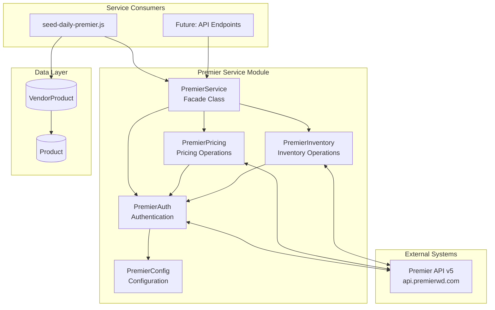
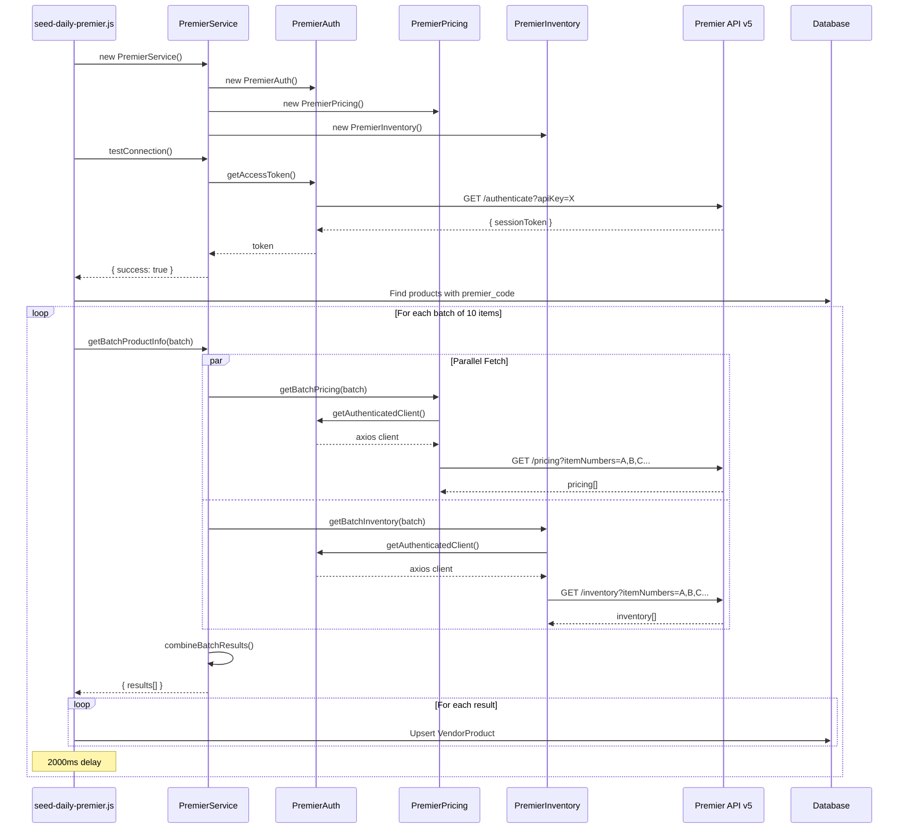

# DD-013: Premier Performance Service - Design Document

## Overview

The Premier Performance Service is a dedicated vendor integration module that provides real-time pricing and inventory data from Premier Performance's API v5. It implements API key authentication followed by session token management, supports batch processing with a 50-item limit, and aggregates multi-warehouse inventory data for JustJeeps' e-commerce operations.

## Design Summary (Meta)

```yaml
design_type: "documentation"
risk_level: "low"
complexity_level: "medium"
complexity_rationale:
  requirements_acs:
    - Dual-layer authentication (API key + session token)
    - Batch processing with 50-item API limit
    - Multi-warehouse inventory aggregation
    - USD to CAD currency conversion (1.5x)
    - Parallel API calls for pricing and inventory
  constraints_risks:
    - External API rate limits and availability
    - Session token 24-hour expiry management
    - Network latency affecting batch operations
main_constraints:
  - "Premier API batch limit: 50 items per request"
  - "Session token validity: 24 hours (23-hour cache for safety)"
  - "Rate limiting: 1-second delay between batches recommended"
  - "Currency: All prices in USD, converted to CAD at 1.5x"
biggest_risks:
  - "Premier API availability or changes could break integration"
  - "Invalid API key causes authentication failure"
  - "Large batch operations may timeout"
unknowns:
  - "Exact rate limits not formally documented by Premier"
  - "Warehouse code format may change"
```

## Background and Context

### Prerequisite ADRs

- **DD-002**: Vendor Integration Framework - Parent framework architecture defining integration patterns
- No specific ADRs for Premier service exist; follows patterns established in DD-002

Recommended future ADRs (not yet documented):
- ADR-COMMON-001: Error Handling Strategy
- ADR-COMMON-002: Currency Conversion Approach
- ADR-COMMON-003: Rate Limiting Patterns
- ADR-COMMON-004: Authentication Token Management

### Agreement Checklist

#### Scope
- [x] Document existing Premier Service architecture
- [x] Document PremierAuth, PremierPricing, PremierInventory sub-modules
- [x] Document public API interfaces
- [x] Document data contracts and integration points
- [x] Document daily seeding process

#### Non-Scope (Explicitly not changing)
- [x] No architectural changes proposed
- [x] No new feature additions
- [x] Existing authentication flow preserved
- [x] Existing batch processing logic preserved

#### Constraints
- [x] Parallel operation: Yes (pricing and inventory fetched concurrently)
- [x] Backward compatibility: Required (no changes proposed)
- [x] Performance measurement: Not required (documentation only)

### Problem to Solve

Premier Performance is a key vendor for JustJeeps, providing automotive parts and accessories. The Premier Service integrates with their API v5 to:
1. Authenticate using API key and manage session tokens
2. Fetch real-time product pricing (cost, jobber, MAP)
3. Retrieve multi-warehouse inventory levels
4. Support batch operations for efficient bulk data retrieval
5. Populate VendorProduct records for the daily sync process

### Current Challenges

- **Session Token Management**: Tokens expire after 24 hours, requiring proactive refresh
- **Batch Size Limits**: API enforces 50-item maximum per request
- **Multi-Warehouse Aggregation**: Inventory is distributed across multiple warehouses requiring summation
- **Rate Limiting**: No formal rate limit documentation; 1-second delays used preventatively
- **Error Handling**: Individual item failures should not abort entire batch operations

### Requirements

#### Functional Requirements

- FR1: Authenticate with Premier API using API key to obtain session token
- FR2: Cache session tokens for 23 hours (1-hour safety buffer before 24-hour expiry)
- FR3: Retrieve pricing data for single items (cost, jobber, MAP in USD)
- FR4: Retrieve inventory data for single items (aggregated across all warehouses)
- FR5: Support batch pricing requests (up to 50 items)
- FR6: Support batch inventory requests (up to 50 items)
- FR7: Combine pricing and inventory into unified product info response
- FR8: Provide connection testing endpoint
- FR9: Expose API status and capabilities endpoint

#### Non-Functional Requirements

- **Performance**: Single item lookup < 2 seconds; Batch of 50 items < 5 seconds
- **Scalability**: Process 1000+ items per seeding run via automatic batch splitting
- **Reliability**: Continue processing on individual item errors; log all failures
- **Maintainability**: Modular design with separate auth, pricing, inventory components

## Acceptance Criteria (AC) - EARS Format

### Authentication (FR1, FR2)

- [x] **When** PremierAuth.getAccessToken() is called with valid API key, the system shall return a session token from Premier API
- [x] **While** a valid cached token exists (within 23-hour window), the system shall return the cached token without API call
- [x] **If** API key is missing from environment, **then** the system shall throw an error on PremierAuth instantiation
- [x] **When** token is expired or near expiry, the system shall request a fresh token from Premier API

### Single Item Operations (FR3, FR4)

- [x] **When** getItemPricing(itemNumber) is called, the system shall return pricing data including cost, jobber, and MAP
- [x] **When** getItemInventory(itemNumber) is called, the system shall return inventory quantities per warehouse
- [x] **When** getSimplifiedItemPricing(itemNumber) is called, the system shall return extracted USD pricing values
- [x] **When** checkItemStock(itemNumber) is called, the system shall return aggregated inventory with inStock boolean

### Batch Operations (FR5, FR6, FR7)

- [x] **When** getBatchPricing(itemNumbers) is called with <= 50 items, the system shall return batch pricing data
- [x] **If** itemNumbers array exceeds 50 items, **then** getBatchPricing shall throw an error
- [x] **When** getBatchInventory(itemNumbers) is called with <= 50 items, the system shall return batch inventory data
- [x] **When** getBatchProductInfo(itemNumbers) is called, the system shall split into 50-item batches automatically
- [x] The system shall apply 1-second delay between consecutive batch API calls

### Combined Operations (FR7)

- [x] **When** getProductInfo(itemNumber) is called, the system shall fetch pricing and inventory in parallel
- [x] **When** getBatchProductInfo(itemNumbers) is called, the system shall combine pricing and inventory results per item
- [x] **If** either pricing or inventory fails for an item, **then** the system shall include partial data with error details

### Connection Testing (FR8, FR9)

- [x] **When** testConnection() is called, the system shall verify API connectivity by obtaining a token
- [x] **When** getAPIStatus() is called, the system shall return API capabilities including batch limits

## Existing Codebase Analysis

### Implementation Path Mapping

| Type | Path | Description |
|------|------|-------------|
| Existing | `/services/premier/index.js` | Main PremierService facade class |
| Existing | `/services/premier/auth.js` | PremierAuth authentication module |
| Existing | `/services/premier/pricing.js` | PremierPricing pricing operations module |
| Existing | `/services/premier/inventory.js` | PremierInventory inventory operations module |
| Existing | `/services/premier/config.js` | PremierConfig configuration singleton |
| Existing | `/prisma/seeds/seed-individual/seed-daily-premier.js` | Daily seeding script |

### Integration Points (Existing Implementation)

- **Integration Target**: Premier Performance API v5 (api.premierwd.com)
- **Invocation Method**: HTTP REST via axios with Bearer token authentication
- **Database Integration**: VendorProduct table via Prisma ORM
- **Product Matching**: Products with `premier_code` field populated

### Similar Functionality Search Results

The Premier Service follows the same patterns as Turn14 Service (see DD-002):
- Modular structure: auth, pricing, inventory sub-modules
- Token caching with expiry management
- Batch processing with rate limiting
- Combined product info facade method

No duplicate implementation found. Pattern reuse is intentional for consistency.

## Design

### Change Impact Map

```yaml
Change Target: N/A (Documentation Only)
Direct Impact:
  - None (no changes proposed)
Indirect Impact:
  - None (no changes proposed)
No Ripple Effect:
  - PremierService module (unchanged)
  - PremierAuth module (unchanged)
  - PremierPricing module (unchanged)
  - PremierInventory module (unchanged)
  - Daily seeding script (unchanged)
  - VendorProduct table (unchanged)
```

### Architecture Overview

The Premier Service follows a layered modular architecture within the vendor integration framework:



### Data Flow



### Integration Points List

| Integration Point | Location | Implementation | Data Flow | Notes |
|-------------------|----------|----------------|-----------|-------|
| Premier API Auth | PremierAuth.getAccessToken() | GET /authenticate | API Key -> Session Token | 23-hour token cache |
| Premier Pricing API | PremierPricing.getBatchPricing() | GET /pricing | itemNumbers -> pricing[] | Max 50 items |
| Premier Inventory API | PremierInventory.getBatchInventory() | GET /inventory | itemNumbers -> inventory[] | Max 50 items |
| Database Write | seed-daily-premier.js | Prisma upsert | result -> VendorProduct | CAD conversion |
| Product Lookup | seed-daily-premier.js | Prisma findMany | premier_code -> Product[] | SKU matching |

### Main Components

#### PremierService (Facade)

- **Responsibility**: High-level orchestration of Premier API operations; combines pricing and inventory data
- **Interface**:
  - `getProductInfo(itemNumber)` - Complete product info for single item
  - `getBatchProductInfo(itemNumbers)` - Complete product info for batch (auto-splits > 50)
  - `testConnection()` - API connectivity verification
  - `getAPIStatus()` - API capabilities and status
  - `combineBatchResults(itemNumbers, pricingResults, inventoryResults)` - Internal data merger
- **Dependencies**: PremierAuth, PremierPricing, PremierInventory

#### PremierAuth

- **Responsibility**: Authentication and token lifecycle management
- **Interface**:
  - `getAccessToken()` - Retrieve valid session token (cached or fresh)
  - `getAuthenticatedClient()` - Configured axios instance with Bearer token
  - `clearToken()` - Force re-authentication
- **Dependencies**: PremierConfig (for API key and base URL)

#### PremierPricing

- **Responsibility**: Product pricing data retrieval and extraction
- **Interface**:
  - `getItemPricing(itemNumber)` - Single item raw pricing
  - `getBatchPricing(itemNumbers)` - Batch raw pricing (max 50)
  - `getBatchPricingLarge(itemNumbers)` - Large batch with auto-split
  - `getSimplifiedItemPricing(itemNumber)` - Extracted USD cost, jobber, MAP
  - `extractCostPrice(pricingData)` - USD cost extraction
  - `extractJobberPrice(pricingData)` - USD jobber extraction
  - `extractMAPPrice(pricingData)` - USD MAP extraction
- **Dependencies**: PremierAuth

#### PremierInventory

- **Responsibility**: Product inventory data retrieval and warehouse aggregation
- **Interface**:
  - `getItemInventory(itemNumber)` - Single item raw inventory
  - `getBatchInventory(itemNumbers)` - Batch raw inventory (max 50)
  - `getBatchInventoryLarge(itemNumbers)` - Large batch with auto-split
  - `checkItemStock(itemNumber)` - Stock status with warehouse details
  - `getSimplifiedItemInventory(itemNumber)` - Aggregated quantity and inStock
  - `calculateTotalInventory(inventoryData)` - Sum all warehouses
  - `calculateUSInventory(inventoryData)` - Sum US warehouses only
  - `getBestWarehouse(inventoryData)` - Highest quantity warehouse
- **Dependencies**: PremierAuth

#### PremierConfig (Singleton)

- **Responsibility**: Environment configuration and validation
- **Interface**:
  - `getCredentials()` - API key and environment
  - `getBaseURL()` - Production or test URL
  - `getTimeoutSettings()` - Request timeout, retry delay, max retries
  - `getRateLimitSettings()` - Requests per second, batch size, batch delay
  - `getLoggingSettings()` - Log level and verbosity
  - `validateConfig()` - Environment variable validation
  - `isProduction()` - Environment check
  - `getConfig()` - Complete configuration object
  - `printConfigSummary()` - Debug output (masks sensitive data)
- **Dependencies**: Environment variables (process.env)

### Contract Definitions

#### PremierService Public Methods

```javascript
/**
 * Get complete product information for a single item
 * @param {string} itemNumber - Premier item number
 * @returns {Promise<ProductInfoResult>}
 */
async getProductInfo(itemNumber) -> ProductInfoResult

/**
 * Get complete product information for multiple items
 * @param {string[]} itemNumbers - Array of Premier item numbers
 * @returns {Promise<BatchProductInfoResult>}
 */
async getBatchProductInfo(itemNumbers) -> BatchProductInfoResult

/**
 * Test Premier API connection
 * @returns {Promise<ConnectionTestResult>}
 */
async testConnection() -> ConnectionTestResult

/**
 * Get Premier API status and capabilities
 * @returns {Promise<APIStatusResult>}
 */
async getAPIStatus() -> APIStatusResult
```

### Data Contract

#### ProductInfoResult

```yaml
Input:
  Type: string (itemNumber)
  Preconditions: Non-empty string, valid Premier item number format
  Validation: Checked by Premier API

Output:
  Type: ProductInfoResult
  Schema:
    success: boolean
    itemNumber: string
    pricing:
      cost: number (USD)
      jobber: number (USD)
      map: number (USD)
    inventory:
      quantity: number (aggregated across warehouses)
      inStock: boolean
    errors: string[]
  Guarantees: Always returns object, never throws
  On Error: success=false, errors array populated

Invariants:
  - pricing values default to 0 if not available
  - inventory.quantity >= 0
  - inventory.inStock = (quantity > 0)
```

#### BatchProductInfoResult

```yaml
Input:
  Type: string[] (itemNumbers)
  Preconditions: Non-empty array of strings
  Validation: Array type check, throws if empty

Output:
  Type: BatchProductInfoResult
  Schema:
    success: boolean
    results: ProductInfoResult[]
    totalItems: number
    successfulItems: number
    error?: string (only on complete failure)
  Guarantees: Processes all items, partial results on partial failure
  On Error: success=false at top level if complete failure

Invariants:
  - results.length <= totalItems
  - successfulItems = results.filter(r => r.success).length
```

#### Premier API Response Formats

```yaml
Authentication Response:
  Schema:
    sessionToken: string

Pricing Response (Single):
  Schema:
    itemNumber: string
    pricing:
      - currency: string ("USD"|"CAD")
        cost: number
        jobber: number
        map: number

Inventory Response (Single):
  Schema:
    itemNumber: string
    inventory:
      - warehouseCode: string (e.g., "WH-US-TX", "WH-US-CA")
        quantityAvailable: number
```

### Integration Boundary Contracts

```yaml
PremierAuth Boundary:
  Input: API Key (from environment)
  Output: Session Token (string, async)
  On Error: Throw Error with message

PremierPricing Boundary:
  Input: itemNumber (string) or itemNumbers (string[], max 50)
  Output: { success, data?, error? } (async)
  On Error: Return { success: false, error: message }

PremierInventory Boundary:
  Input: itemNumber (string) or itemNumbers (string[], max 50)
  Output: { success, data?, error? } (async)
  On Error: Return { success: false, error: message }

PremierService Boundary:
  Input: itemNumber (string) or itemNumbers (string[])
  Output: ProductInfoResult or BatchProductInfoResult (async)
  On Error: Return result with success=false, include error details

VendorProduct Upsert Boundary:
  Input: { product_sku, vendor_id, vendor_sku, vendor_cost, vendor_inventory }
  Output: Created or updated VendorProduct record
  On Error: Log and continue (partial failure handling)
```

### State Transitions and Invariants

```yaml
State Definition:
  - PremierAuth States:
    - NO_TOKEN: sessionToken=null, tokenExpiry=null
    - TOKEN_VALID: sessionToken!=null, Date.now() < tokenExpiry
    - TOKEN_EXPIRED: sessionToken!=null, Date.now() >= tokenExpiry

State Transitions:
  NO_TOKEN -> TOKEN_VALID: getAccessToken() success
  TOKEN_VALID -> TOKEN_VALID: getAccessToken() returns cached token
  TOKEN_VALID -> TOKEN_EXPIRED: Time passes beyond expiry
  TOKEN_EXPIRED -> TOKEN_VALID: getAccessToken() refreshes token
  TOKEN_VALID -> NO_TOKEN: clearToken() called

System Invariants:
  - tokenExpiry is always 23 hours after token acquisition
  - Authenticated requests always use Bearer token header
  - Batch requests never exceed 50 items
```

### Error Handling

| Error Type | Location | Handling Strategy |
|------------|----------|-------------------|
| Missing API Key | PremierAuth constructor | Throw Error immediately |
| Authentication Failure | PremierAuth.getAccessToken() | Throw Error with details |
| Invalid Item Number | Premier API | Return success=false with error message |
| Batch Size Exceeded | getBatchPricing/Inventory | Throw Error (caller must split) |
| Network Timeout | axios request | Caught, return success=false |
| Individual Item Failure | Processing loop | Log, skip item, continue batch |
| Complete Batch Failure | getBatchProductInfo | Return success=false at top level |

### Logging and Monitoring

**Log Points:**

| Event | Log Level | Message Pattern |
|-------|-----------|-----------------|
| Token Request | INFO | "Premier: Requesting new session token..." |
| Token Success | INFO | "Premier session token obtained successfully" |
| Token Cleared | INFO | "Premier session token cleared" |
| Auth Failure | ERROR | "Premier authentication failed: {message}" |
| Single Item Fetch | INFO | "Premier: Getting complete product info for {itemNumber}" |
| Batch Start | INFO | "Premier: Getting batch product info for {count} items" |
| Batch Progress | INFO | "Premier: Processing batch {n}/{total}" |
| Pricing Error | ERROR | "Premier pricing error for {itemNumber}: {message}" |
| Inventory Error | ERROR | "Premier inventory error for {itemNumber}: {message}" |
| Connection Test | INFO | "Premier: Testing API connection..." |

**Monitoring Recommendations:**
- Track authentication success/failure rate
- Monitor batch processing duration
- Alert on consecutive authentication failures
- Track API response times

## Implementation Plan

### Implementation Approach

**Selected Approach**: N/A - Documentation of existing implementation
**Selection Reason**: This document describes the existing architecture without proposing changes

### Technical Dependencies and Implementation Order

The Premier Service was implemented following this dependency order:

1. **PremierConfig** (Configuration Foundation)
   - Reason: Required by all other modules for environment configuration

2. **PremierAuth** (Authentication Layer)
   - Reason: Required by Pricing and Inventory for authenticated requests
   - Depends on: PremierConfig

3. **PremierPricing** (Pricing Operations)
   - Reason: Core pricing functionality
   - Depends on: PremierAuth

4. **PremierInventory** (Inventory Operations)
   - Reason: Core inventory functionality
   - Depends on: PremierAuth

5. **PremierService** (Facade)
   - Reason: Combines all sub-modules
   - Depends on: PremierAuth, PremierPricing, PremierInventory

6. **seed-daily-premier.js** (Consumer)
   - Reason: Data synchronization script
   - Depends on: PremierService, Prisma

### Integration Points

**Integration Point 1: Premier API Authentication**
- Components: PremierAuth -> Premier API /authenticate
- Verification: Token returned and cached, subsequent calls use cache

**Integration Point 2: Pricing Data Retrieval**
- Components: PremierPricing -> Premier API /pricing
- Verification: Pricing data returned with cost, jobber, MAP values

**Integration Point 3: Inventory Data Retrieval**
- Components: PremierInventory -> Premier API /inventory
- Verification: Inventory data returned with warehouse quantities

**Integration Point 4: Database Persistence**
- Components: seed-daily-premier.js -> VendorProduct table
- Verification: VendorProduct records created/updated with correct vendor_id=16

### Migration Strategy

N/A - Documentation only, no migration required.

## Test Strategy

### Basic Test Design Policy

Test cases derived from acceptance criteria:
- Authentication tests: Token acquisition, caching, expiry
- Single item tests: Pricing extraction, inventory aggregation
- Batch tests: Size limits, parallel processing, error handling
- Integration tests: End-to-end seeding verification

### Unit Tests

Current Status: Not implemented

**Recommended Unit Test Coverage:**

| Module | Test Focus | Priority |
|--------|------------|----------|
| PremierAuth | Token caching, expiry calculation | High |
| PremierPricing | Price extraction, USD filtering | High |
| PremierInventory | Warehouse aggregation, US filtering | High |
| PremierService | Result combination, batch splitting | Medium |
| PremierConfig | Environment validation | Low |

### Integration Tests

Current Status: Not implemented

**Recommended Integration Test Scenarios:**

1. **Authentication Flow**: Verify token acquisition with real/mock API
2. **Batch Pricing**: Verify 50-item batch processing
3. **Batch Inventory**: Verify multi-warehouse aggregation
4. **Combined Operations**: Verify parallel fetch and merge
5. **Error Recovery**: Verify partial failure handling

### E2E Tests

Current Status: Manual verification via seeding script

**E2E Verification Procedure:**

1. Run `npm run seed-daily-premier`
2. Verify Premier API connection test passes
3. Check VendorProduct record count for vendor_id=16
4. Spot-check vendor_cost values (USD * 1.5 = CAD)
5. Verify vendor_inventory population
6. Check error logs for failed items

### Performance Tests

Current Status: Not implemented

**Performance Benchmarks:**

| Operation | Target | Method |
|-----------|--------|--------|
| Single item fetch | < 2s | Time getProductInfo() |
| 50-item batch | < 5s | Time getBatchProductInfo(50) |
| Full daily sync | < 30min | Time complete seeding script |

## Security Considerations

- **API Key Storage**: Stored in `PREMIER_API_KEY` environment variable, never in code
- **Token Handling**: Session tokens stored in memory only, not persisted
- **Credential Logging**: API key masked in printConfigSummary() output
- **HTTPS**: All API calls use HTTPS (https://api.premierwd.com)
- **Timeout Protection**: 30-second request timeout prevents hanging connections

## Future Extensibility

- **Rate Limit Tracking**: Could add request counting like Turn14 service
- **Retry Logic**: Could add exponential backoff for transient failures
- **Webhook Support**: Could add real-time inventory update webhooks if Premier supports
- **Price History**: Could track historical prices for trend analysis
- **Canadian Warehouses**: Could add filtering for Canadian warehouse inventory

## Alternative Solutions

### Alternative 1: Single Item Processing Only

- **Overview**: Process items one at a time instead of batch
- **Advantages**: Simpler implementation, easier error isolation
- **Disadvantages**: Much slower (50x more API calls), higher rate limit risk
- **Reason for Rejection**: Batch API available and more efficient

### Alternative 2: Shared Auth Instance Across Services

- **Overview**: Share single PremierAuth instance between Pricing and Inventory
- **Advantages**: Fewer objects, guaranteed single token
- **Disadvantages**: Tighter coupling, harder to test independently
- **Reason for Rejection**: Current approach allows independent testing and clearer ownership

## Risks and Mitigation

| Risk | Impact | Probability | Mitigation |
|------|--------|-------------|------------|
| Premier API changes break integration | High | Medium | Monitor API responses, implement graceful degradation |
| API key expiration/revocation | High | Low | Monitor authentication failures, alert operations team |
| Rate limiting causes request rejection | Medium | Low | Conservative batch delays (2 seconds between batches) |
| Session token expiry during long sync | Medium | Low | 23-hour cache provides 1-hour safety buffer |
| Network timeouts on large batches | Medium | Medium | 30-second timeout, continue on individual failures |
| Invalid item numbers in database | Low | Medium | Log and skip, continue processing remaining items |

## References

### Internal Documentation

- [multi-vendor-integration-prd.md](/docs/prd/multi-vendor-integration-prd.md) - Parent PRD
- [DD-002: Vendor Integration Framework](/docs/design/dd-002-vendor-integration-framework.md) - Framework architecture
- [CLAUDE.md](/CLAUDE.md) - Repository documentation

### External API Documentation

- Premier Performance API v5 (internal documentation)
- Base URL: https://api.premierwd.com/api/v5

### Environment Variables

```env
# Required
PREMIER_API_KEY=your_api_key_here

# Optional
PREMIER_BASE_URL=https://api.premierwd.com/api/v5
PREMIER_ENVIRONMENT=production
PREMIER_REQUEST_TIMEOUT=30000
PREMIER_RETRY_DELAY=1000
PREMIER_MAX_RETRIES=3
PREMIER_RATE_LIMIT=10
PREMIER_BATCH_SIZE=50
PREMIER_BATCH_DELAY=1000
PREMIER_LOG_LEVEL=info
PREMIER_LOG_REQUESTS=false
PREMIER_LOG_RESPONSES=false
```

## Glossary

| Term | Definition |
|------|------------|
| **Session Token** | Time-limited authentication token issued by Premier API after API key validation |
| **API Key** | Static credential for Premier API authentication |
| **Batch Processing** | Processing multiple items in a single API request (max 50 for Premier) |
| **Jobber Price** | Wholesale price for jobber-level customers |
| **MAP** | Minimum Advertised Price set by manufacturer |
| **Cost Price** | Dealer cost price from Premier |
| **Warehouse Aggregation** | Summing inventory quantities across multiple warehouse locations |
| **US Warehouse** | Premier warehouses with codes containing "-US" |
| **VendorProduct** | Database junction table linking Product to Vendor with cost/inventory |
| **vendor_id=16** | Premier Performance's ID in the Vendor table |

## Update History

| Date | Version | Changes | Author |
|------|---------|---------|--------|
| 2026-01-23 | 1.0.0 | Initial design document (reverse-engineered from implementation) | System |
