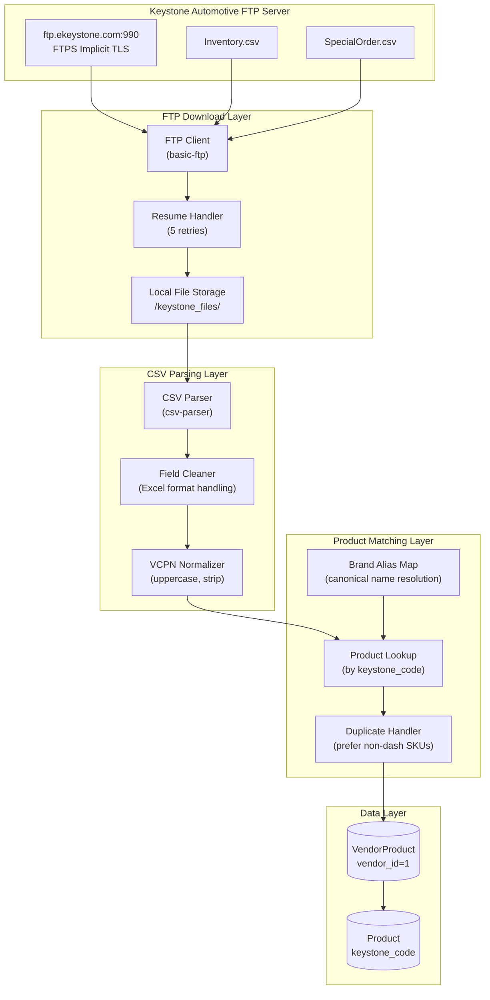
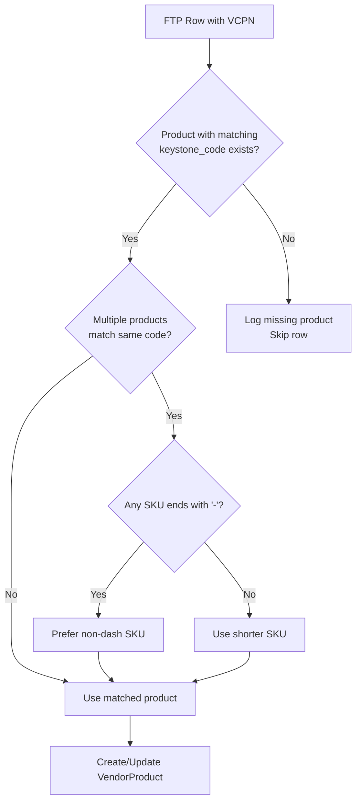
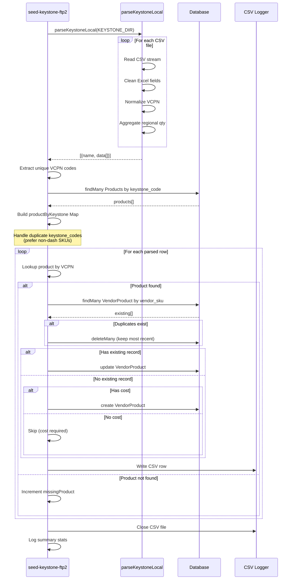

# DD-014: Keystone FTP Integration - Design Document

**Version**: 1.0.0
**Status**: Accepted (Documentation of Existing Architecture)
**Created**: 2026-01-23
**Last Updated**: 2026-01-23
**Author**: System (Reverse-Engineered from Implementation)
**Parent PRD**: [multi-vendor-integration-prd.md](/docs/prd/multi-vendor-integration-prd.md)

---

## Agreement Checklist

This document captures the existing architecture. No new implementation is proposed.

- [x] **Scope**: Document current Keystone FTP integration for price/inventory synchronization
- [x] **Non-scope**: No architectural changes or new feature proposals
- [x] **Constraints**: FTP connection parameters, CSV column mappings, existing keystone_code matching logic
- [x] **Dependencies**: DD-002 (Vendor Integration Framework), Product model with keystone_code field

---

## Prerequisite ADRs

References the general vendor integration decisions documented in:

- [DD-002: Vendor Integration Framework](/docs/design/dd-002-vendor-integration-framework.md)

Common ADR topics applicable to this component:

- ADR-COMMON-002: Currency Conversion Approach (USD to CAD 1.5x multiplier - not applied in Keystone as data is native CAD)
- ADR-COMMON-004: Error Handling with Continuation (partial failure handling)

---

## Executive Summary

The Keystone FTP Integration is a data synchronization component that connects to Keystone Automotive's FTP server (ftp.ekeystone.com:990) using implicit FTPS. It downloads two CSV files (Inventory.csv and SpecialOrder.csv), parses them with flexible column mapping, and creates/updates VendorProduct records by matching products using the `keystone_code` field. The implementation includes resume capability for interrupted downloads and sophisticated duplicate handling logic.

---

## Existing Codebase Analysis

### Implementation Path Mapping

| Component | File Path | Status | Responsibility |
|-----------|-----------|--------|----------------|
| FTP Download + Parse | `/prisma/seeds/api-calls/keystone-ftp.js` | Existing | Connect to FTP, download CSV, parse records |
| Local CSV Parser | `/prisma/seeds/api-calls/parse-keystone-local.js` | Existing | Parse local Keystone CSV files with column mapping |
| Keystone Code Fixer | `/prisma/seeds/api-calls/keystone-ftp-codes.js` | Existing | Update product.keystone_code from FTP data |
| Seed Script (v1) | `/prisma/seeds/seed-individual/seed-keystone-ftp.js` | Existing | Original FTP sync to VendorProduct |
| Seed Script (v2) | `/prisma/seeds/seed-individual/seed-keystone-ftp-2.js` | Existing | Enhanced local CSV sync with deduplication |
| Brand Configuration | `/prisma/seeds/hard-code_data/vendors_prefix.js` | Existing | Brand-to-keystone mapping with aliases |

### Similar Functionality Search Results

No duplicate FTP integration patterns found. This is the only FTP-based vendor integration in the system. The component is unique due to:

- FTP/FTPS protocol (other vendors use REST APIs or file imports)
- Resume capability for large file downloads
- VCPN-based product matching (Vendor Code Part Number)
- Regional inventory aggregation from multiple warehouse columns

---

## Architecture Overview

### Architecture Diagram



### Data Flow Diagram

```mermaid
flowchart LR
    subgraph Input["FTP Data Source"]
        FTP["Keystone FTP<br/>Port 990 FTPS"]
    end

    subgraph Download["Download Phase"]
        D1["1. Connect with retry"]
        D2["2. Resume from byte offset"]
        D3["3. Save to local file"]
    end

    subgraph Parse["Parsing Phase"]
        P1["4. Stream CSV"]
        P2["5. Clean Excel fields"]
        P3["6. Normalize VCPN"]
        P4["7. Extract cost/qty"]
    end

    subgraph Match["Matching Phase"]
        M1["8. Batch load products"]
        M2["9. Map keystone_code"]
        M3["10. Handle duplicates"]
    end

    subgraph Store["Storage Phase"]
        S1["11. Upsert VendorProduct"]
        S2["12. Log to CSV audit"]
    end

    FTP --> D1
    D1 --> D2
    D2 --> D3
    D3 --> P1
    P1 --> P2
    P2 --> P3
    P3 --> P4
    P4 --> M1
    M1 --> M2
    M2 --> M3
    M3 --> S1
    S1 --> S2
```



---

## Component Design

### 1. FTP Connection Module

**File**: `/prisma/seeds/api-calls/keystone-ftp.js`

**Connection Configuration**:

```javascript
{
  host: "ftp.ekeystone.com",
  port: 990,
  user: "S111945",
  password: "****",  // stored in code - should be in env
  secure: "implicit",
  secureOptions: { rejectUnauthorized: false },
  timeout: 180000  // 3 minutes
}
```

**FTP Client Settings**:

| Parameter | Value | Purpose |
|-----------|-------|---------|
| socketTimeout | 180000ms | 3-minute socket timeout |
| prepareTransfer | enterPassiveModeIPv4 | Force passive mode |
| verbose | true | Debug logging |

**Resume Capability Implementation**:

```javascript
// Check for partial file
let startAt = 0;
if (fs.existsSync(localPath)) {
  startAt = statSync(localPath).size;
  console.log(`Resuming from byte ${startAt}`);
}

// Download with offset
const writeStream = createWriteStream(localPath, {
  flags: startAt > 0 ? "a" : "w"  // append if resuming
});
await client.download(writeStream, remoteFile, startAt);
```

**Retry Logic**:

- Maximum 5 attempts per file
- Creates new FTP connection for each retry
- Resumes from last downloaded byte on retry

### 2. CSV Parsing Module

**File**: `/prisma/seeds/api-calls/parse-keystone-local.js`

**Files Processed**:

| File | Contents | Records (typical) |
|------|----------|-------------------|
| Inventory.csv | In-stock products with regional warehouse quantities | ~100,000+ |
| SpecialOrder.csv | Special order items with pricing | ~50,000+ |

**Column Mapping Strategy**:

The parser uses flexible column name matching to handle variations in Keystone's CSV headers:

```javascript
// VCPN extraction with aliases
vcPn = clean(get("vcPn", "VCPN", "VcPn", "KeystonePN", "KeystoneCode", "Keystone_Code"));

// Vendor information
vendorCode = clean(get("VendorCode", "Vendor Code", "Vendor", "VENDOR"));
vendorName = clean(get("VendorName", "Vendor Name", "Brand", "Manufacturer"));
partNumber = clean(get("PartNumber", "Part Number", "PARTNUMBER", "PartNo", "Part #", "PN"));
manufacturerPartNo = clean(get(
  "ManufacturerPartNo", "Manufacturer Part No", "ManufacturerPartNumber",
  "MfrPartNo", "Mfr Part #", "MPN"
));

// Pricing with aliases
cost = get("Cost", "cost", "CustomerPrice", "JobberPrice", "Price", "UnitPrice", "Your Cost");

// Quantity with regional fallback
totalQty = get("TotalQty", "totalQty", "Total Qty", "Qty", "Quantity", "QtyAvailable");
```

**Regional Inventory Aggregation**:

If TotalQty is not present, the parser sums regional warehouse columns:

```javascript
const regions = [
  "EastQty", "MidwestQty", "CaliforniaQty", "SoutheastQty",
  "PacificNWQty", "TexasQty", "GreatLakesQty", "FloridaQty"
];
let sum = 0;
for (const region of regions) {
  if (raw[region] !== undefined) {
    sum += parseInt(raw[region], 10);
  }
}
totalQty = sum;
```

**Field Cleaning Functions**:

```javascript
// Clean Excel-style quoted values: ="11317" -> 11317
function clean(s) {
  if (s == null) return "";
  let t = String(s).trim();
  if (/^=\s*".*"$/.test(t)) t = t.replace(/^=\s*"(.*)"$/, "$1");
  return t.replace(/^"+|"+$/g, "").trim();
}

// Normalize VCPN for database matching
function normalizeVcPnForDB(code) {
  if (code == null) return "";
  return String(code).trim().replace(/\s+/g, "").toUpperCase();
}
```

**VCPN Derivation Logic**:

If VCPN is not directly available in the CSV, it is derived:

```javascript
if (!vcPn && vendorCode && partNumber) {
  vcPn = normalizeVcPnForDB(`${vendorCode}${partNumber}`);
}
```

**Parser Output Structure**:

```javascript
{
  vcPn: "TER1254300",           // Keystone code (VCPN)
  vendorCode: "TER",            // e.g., TER for TeraFlex
  vendorName: "TERAFLEX",       // Manufacturer name
  partNumber: "1254300",        // Vendor's part number
  manufacturerPartNo: "1254300", // MPN
  cost: 149.99,                 // Price (Float)
  totalQty: 25                  // Inventory count (Integer)
}
```

### 3. Product Matching Module

**File**: `/prisma/seeds/seed-individual/seed-keystone-ftp-2.js`

**Batch Loading Strategy**:

```javascript
// 1. Extract unique VCPN codes from parsed rows
const uniqueCodes = [...new Set(rows.map(x => x.VCPN))];

// 2. Batch load products with matching keystone_code
const products = await prisma.product.findMany({
  where: { keystone_code: { in: uniqueCodes } },
  select: { keystone_code: true, sku: true }
});
```

**Duplicate Keystone Code Handling**:

When multiple products share the same keystone_code, the system prefers products whose SKU does NOT end with a hyphen:

```javascript
function pickPreferredProduct(a, b) {
  const aBad = a.sku.endsWith("-");
  const bBad = b.sku.endsWith("-");
  if (aBad !== bBad) return aBad ? b : a;
  return a.sku.length <= b.sku.length ? a : b;
}
```

**Matching Flow**:



### 4. VendorProduct Upsert Module

**Upsert Strategy (UPDATE_OR_CREATE_BY_VENDOR_SKU)**:

```javascript
// Find existing by vendor_sku + vendor_id
const existing = await prisma.vendorProduct.findMany({
  where: { vendor_sku: vendorSku, vendor: { is: { id: 1 } } },
  orderBy: { id: "desc" },
  select: { id: true }
});

if (existing.length > 0) {
  // Keep most recent, delete duplicates
  const keep = existing[0];
  const toDeleteIds = existing.slice(1).map(x => x.id);
  if (toDeleteIds.length) {
    await prisma.vendorProduct.deleteMany({ where: { id: { in: toDeleteIds } } });
  }
  // Update
  await prisma.vendorProduct.update({
    where: { id: keep.id },
    data: { vendor_cost, vendor_inventory, product: { connect: { sku } } }
  });
} else {
  // Create (requires vendor_cost)
  if (cost === null) return; // Skip if no cost
  await prisma.vendorProduct.create({
    data: {
      vendor_sku: VCPN,
      vendor_cost: cost,
      vendor_inventory: totalQty,
      vendor: { connect: { id: 1 } },
      product: { connect: { sku } }
    }
  });
}
```

**Deduplication Logic**:

When multiple VendorProduct records exist for the same vendor_sku + vendor_id:
1. Order by ID descending (most recent first)
2. Keep the first (most recent)
3. Delete all others
4. Update the kept record with new data

### 5. Keystone Code Update Module

**File**: `/prisma/seeds/api-calls/keystone-ftp-codes.js`

This module updates the `keystone_code` and `keystone_code_site` fields on Product records based on FTP data.

**Brand Alias Resolution**:

The module uses `vendors_prefix.js` to map FTP vendor names to canonical brand names:

```javascript
// vendors_prefix.js example entry
{
  jj_prefix: "TF",
  brand_name: "TeraFlex",
  keystone_ftp_brand: "TERAFLEX",
  keystone_ftp_brand_canonical: "TERAFLEX",
  keystone_ftp_brand_aliases: ["Teraflex", "TERA FLEX", "Tera-Flex"],
  keystone_code_site: "TRF"
}
```

**Matching Algorithm**:

```javascript
// Build join key from FTP data
const key = normalize(vendorNameCanon) + normalize(manufacturerPartNo);

// Build product index from database
const productKey = normalize(product.keystone_ftp_brand) + normalize(product.searchableSku);

// Match FTP records to products
const product = productIndex.get(key);
if (product && product.keystone_code !== data.vcPn) {
  // Update keystone_code
  await prisma.product.update({
    where: { sku: product.sku },
    data: { keystone_code: data.vcPn }
  });
}
```

**Site Code Generation**:

```javascript
// keystone_code_site = site_prefix + searchableSku
const sitePrefix = aliasToSitePrefix.get(normalize(vendorName));
const desiredSitePid = `${sitePrefix}${searchableSku}`;
```

---

## Data Contracts

### FTP CSV Input Format

**Inventory.csv Columns**:

| Column | Type | Required | Example |
|--------|------|----------|---------|
| VCPN | String | Yes | ="TER1254300" |
| VendorCode | String | Yes | TER |
| VendorName | String | Yes | TERAFLEX |
| PartNumber | String | Yes | 1254300 |
| ManufacturerPartNo | String | No | 1254300 |
| Cost | Decimal | Yes | 149.99 |
| TotalQty | Integer | No | 25 |
| EastQty | Integer | No | 5 |
| MidwestQty | Integer | No | 8 |
| CaliforniaQty | Integer | No | 12 |
| ...other regional columns | Integer | No | - |

### Parser Output Contract

```typescript
interface ParsedKeystoneRow {
  vcPn: string;               // Keystone code (normalized, uppercase)
  vendorCode: string;         // 3-letter vendor prefix
  vendorName: string;         // Full vendor/brand name
  partNumber: string;         // Vendor's part number
  manufacturerPartNo: string; // Manufacturer part number
  cost: number | null;        // Dealer cost
  totalQty: number;           // Total available inventory
}
```

### VendorProduct Output Contract

```typescript
interface VendorProductRecord {
  product_sku: string;        // FK to Product.sku
  vendor_id: 1;               // Always 1 for Keystone
  vendor_sku: string;         // VCPN code
  vendor_cost: number;        // Cost in CAD (Keystone is CAD-native)
  vendor_inventory: number;   // Total available quantity
}
```

---

## Integration Point Map

### Integration Points

```yaml
Integration Point 1:
  Existing Component: Product model (Product.keystone_code)
  Integration Method: Lookup by keystone_code to find product_sku
  Impact Level: High (Core matching logic)
  Required Test Coverage: VCPN-to-product matching accuracy

Integration Point 2:
  Existing Component: VendorProduct model (vendor_id=1)
  Integration Method: Upsert by vendor_sku + vendor_id
  Impact Level: High (Data storage)
  Required Test Coverage: Create/update/dedupe logic

Integration Point 3:
  Existing Component: vendors_prefix.js configuration
  Integration Method: Brand alias lookup for keystone_ftp_brand matching
  Impact Level: Medium (Brand resolution)
  Required Test Coverage: Alias canonicalization

Integration Point 4:
  Existing Component: Product.keystone_ftp_brand field
  Integration Method: Used for keystone-ftp-codes matching by brand+MPN
  Impact Level: Medium (Alternative matching path)
  Required Test Coverage: Brand+MPN join accuracy
```

### Integration Boundary Contracts

```yaml
FTP Download Boundary:
  Input: Remote file path (Inventory.csv, SpecialOrder.csv)
  Output: Local file path (async, may throw after 5 retries)
  On Error: Retry up to 5 times, resume from last byte

CSV Parse Boundary:
  Input: Local file path
  Output: ParsedKeystoneRow[] array (async)
  On Error: Log warning, return empty array

Product Match Boundary:
  Input: VCPN code (string)
  Output: Product SKU (string) or null
  On Error: Log warning, skip row

VendorProduct Upsert Boundary:
  Input: { product_sku, vendor_sku, vendor_cost, vendor_inventory }
  Output: Created or updated record (async)
  On Error: Log error, continue with next row
```

---

## Change Impact Map

This document describes existing architecture. No changes are proposed.

```yaml
Change Target: N/A (Documentation Only)
Direct Impact: None
Indirect Impact: None
No Ripple Effect:
  - keystone-ftp.js (unchanged)
  - parse-keystone-local.js (unchanged)
  - keystone-ftp-codes.js (unchanged)
  - seed-keystone-ftp-2.js (unchanged)
  - vendors_prefix.js (unchanged)
```

---

## Public Interfaces

### npm Scripts

| Script | Command | Description |
|--------|---------|-------------|
| seed-keystone-ftp | `npm run seed-keystone-ftp` | Original FTP sync (creates VendorProducts) |
| seed-keystone-ftp2 | `npm run seed-keystone-ftp2` | Enhanced local CSV sync with deduplication |
| seed-keystone-ftp-codes | `npm run seed-keystone-ftp-codes` | Update product.keystone_code from FTP |

### Module Exports

**keystone-ftp.js**:
```javascript
module.exports = downloadAndParse;
// Returns: Promise<Array<{file: string, data: ParsedKeystoneRow[]}>>
```

**parse-keystone-local.js**:
```javascript
module.exports = parseKeystoneLocal;
// Input: dirAbsolutePath (string)
// Returns: Promise<Array<{name: string, data: ParsedKeystoneRow[]}>>
```

---

## Configuration

### Runtime Configuration Options

Located in `/prisma/seeds/seed-individual/seed-keystone-ftp-2.js`:

| Option | Default | Description |
|--------|---------|-------------|
| KEYSTONE_DIR | `__dirname/../api-calls/keystone_files` | Local CSV directory |
| VENDOR_CONNECT | `{ id: 1 }` | Keystone vendor ID |
| CLEAR_OLD_FIRST | `false` | Delete existing before insert |
| UPDATE_OR_CREATE_BY_VENDOR_SKU | `true` | Enable upsert by vendor_sku |
| VERBOSE_ROW_LOGS | `true` | Log each create/update |
| PROGRESS_EVERY | 2000 | Progress log interval |
| LOG_TO_FILE | `true` | Write CSV audit log |
| LOG_DIR | `__dirname/../logs` | Audit log directory |

### FTP Connection Parameters

| Parameter | Value | Source |
|-----------|-------|--------|
| Host | ftp.ekeystone.com | Hardcoded |
| Port | 990 | Hardcoded |
| User | S111945 | Hardcoded (should be env) |
| Password | *** | Hardcoded (should be env) |
| Secure | implicit | TLS required |
| Timeout | 180000ms | 3 minutes |

---

## Error Handling Strategy

### Error Categories and Responses

| Error Type | Handling | Recovery |
|------------|----------|----------|
| FTP Connection Failed | Retry up to 5 times | Resume from last byte |
| FTP Timeout | Retry with new connection | Resume from last byte |
| File Not Found (local) | Log warning, return empty | Skip file, continue |
| Invalid CSV Row | Log warning, skip row | Continue processing |
| Missing VCPN | Skip row silently | Continue processing |
| Product Not Found | Log warning, increment counter | Continue processing |
| Missing Cost on Create | Log skip, continue | Skip row (cost required) |
| Database Error | Log error, continue | Partial success |

### Logging Output

```javascript
// Progress logging
console.log(`Processed ${processed} | Created ${created} | Updated ${updated} | Missing ${missing} | Deduped ${deduped}`);

// CSV audit log format
"action,vendor_sku,product_sku,keystone_code,vendor_cost,vendor_inventory"
"CREATE,TER1254300,TF-1254300,TER1254300,149.99,25"
"UPDATE,ADD12345,ADD-12345,ADD12345,89.50,12"
```

---

## Sequence Diagram

### Full Sync Flow



---

## Performance Characteristics

### Observed Metrics

| Metric | Typical Value | Notes |
|--------|---------------|-------|
| FTP Download Time | 2-5 minutes | Depends on file size, network |
| CSV Parse Time | 30-60 seconds | ~150K rows total |
| Product Matching | 5-10 seconds | Batch query for unique codes |
| VendorProduct Upserts | 10-30 minutes | Sequential, one at a time |
| Total Sync Duration | 15-40 minutes | Full sync |

### Resource Usage

- **Memory**: Loads all CSV rows into memory (~100MB for 150K rows)
- **Database Connections**: Single Prisma connection
- **Disk**: Local CSV files (~50-100MB each)

### Bottlenecks

1. **Sequential Upserts**: Each VendorProduct is processed one at a time
2. **Individual Queries**: No batch upsert, queries per row
3. **No Parallelization**: Single-threaded processing

---

## Test Strategy

### Unit Test Coverage

| Component | Test Focus | Status |
|-----------|------------|--------|
| clean() | Excel field cleaning | Not implemented |
| normalizeVcPnForDB() | VCPN normalization | Not implemented |
| toFloatOrNull() | Decimal parsing | Not implemented |
| toInt() | Integer parsing with defaults | Not implemented |
| pickPreferredProduct() | Duplicate SKU preference | Not implemented |
| Regional qty aggregation | Sum of warehouse columns | Not implemented |

### Integration Test Scenarios

1. **FTP Connection**: Verify connection with resume after disconnect
2. **CSV Parsing**: Test with various column name formats
3. **VCPN Derivation**: Test VendorCode + PartNumber concatenation
4. **Duplicate Handling**: Test SKU preference logic
5. **Upsert Logic**: Verify create/update/dedupe behavior

### E2E Verification Procedures

1. Run `npm run seed-keystone-ftp2`
2. Verify VendorProduct count for vendor_id=1
3. Spot-check vendor_cost values match CSV
4. Verify vendor_inventory population
5. Check CSV audit log for accuracy
6. Verify no orphaned VendorProduct records (all have valid product_sku)

---

## Non-Functional Requirements

### Reliability

| Requirement | Implementation |
|-------------|----------------|
| Resume on disconnect | FTP download resumes from last byte |
| Retry on failure | Up to 5 retry attempts per file |
| Partial failure handling | Individual row errors don't abort sync |
| Audit trail | CSV log of all create/update operations |

### Data Integrity

| Requirement | Implementation |
|-------------|----------------|
| Duplicate prevention | Dedupe existing vendor_sku records |
| Required field validation | Skip rows without VCPN or cost |
| Foreign key integrity | Connect to existing Product.sku only |

### Security Concerns

| Issue | Status | Recommendation |
|-------|--------|----------------|
| FTP credentials in code | Hardcoded | Move to environment variables |
| TLS certificate validation | Disabled | Enable in production |
| Audit logging | CSV files | Add retention policy |

---

## Complexity Assessment

```yaml
complexity_level: medium

complexity_rationale:
  requirements_and_acs:
    - FTP connection with resume capability
    - Flexible CSV column mapping
    - VCPN derivation when not present
    - Regional inventory aggregation
    - Duplicate keystone_code handling
    - VendorProduct deduplication

  constraints_and_risks:
    - FTP connection instability (mitigated by resume)
    - Large file sizes (~100MB CSV files)
    - Memory usage for full file loading
    - Sequential processing bottleneck
    - Hardcoded credentials (security risk)
    - No batch upsert (performance impact)
```

---

## Glossary

| Term | Definition |
|------|------------|
| **VCPN** | Vendor Code Part Number - Keystone's unique identifier combining vendor prefix and part number |
| **keystone_code** | Product field storing VCPN for Keystone matching |
| **keystone_code_site** | Site-specific product code format (prefix + searchable SKU) |
| **keystone_ftp_brand** | Product field for FTP brand name matching |
| **Implicit FTPS** | FTP over TLS on port 990 (connection encrypted from start) |
| **Resume capability** | Ability to continue interrupted downloads from last byte |
| **Regional inventory** | Warehouse-specific quantity columns (EastQty, CaliforniaQty, etc.) |
| **vendor_sku** | In VendorProduct, stores the VCPN code |
| **Excel format** | CSV values wrapped as `="value"` to preserve as string |

---

## References

### Internal Documentation

- [multi-vendor-integration-prd.md](/docs/prd/multi-vendor-integration-prd.md) - Parent PRD
- [DD-002: Vendor Integration Framework](/docs/design/dd-002-vendor-integration-framework.md) - Related design
- [CLAUDE.md](/CLAUDE.md) - Repository documentation

### External Libraries

- [basic-ftp](https://www.npmjs.com/package/basic-ftp) - FTP/FTPS client (v5.0.5)
- [csv-parser](https://www.npmjs.com/package/csv-parser) - CSV parsing (v3.2.0)

---

## Change Log

| Version | Date | Author | Changes |
|---------|------|--------|---------|
| 1.0.0 | 2026-01-23 | System | Initial design document (reverse-engineered from implementation) |
