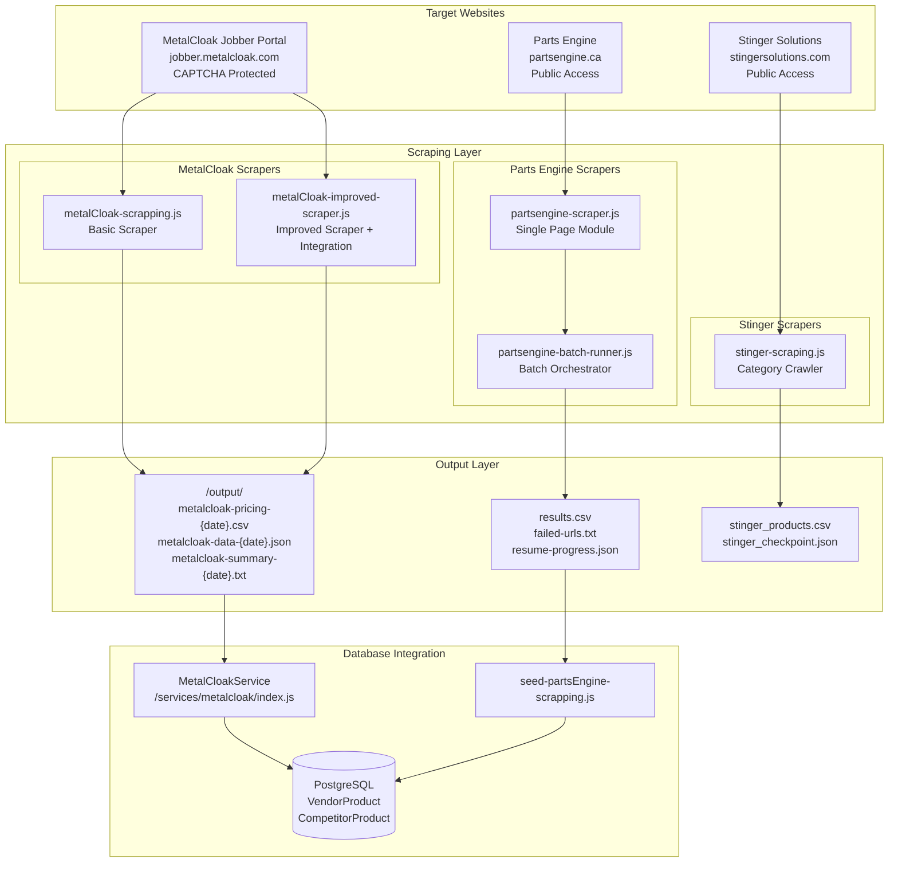
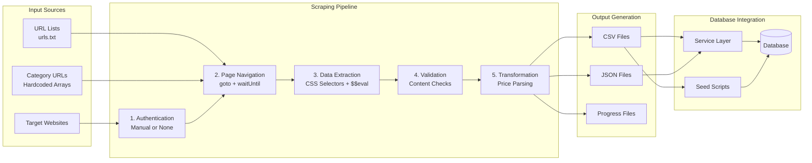
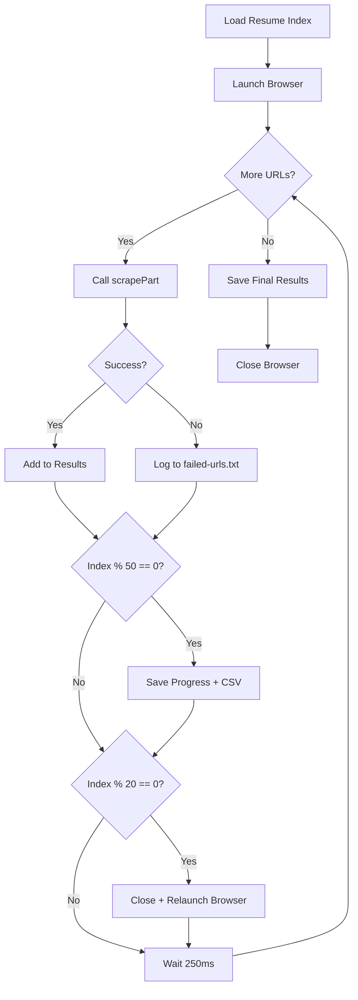
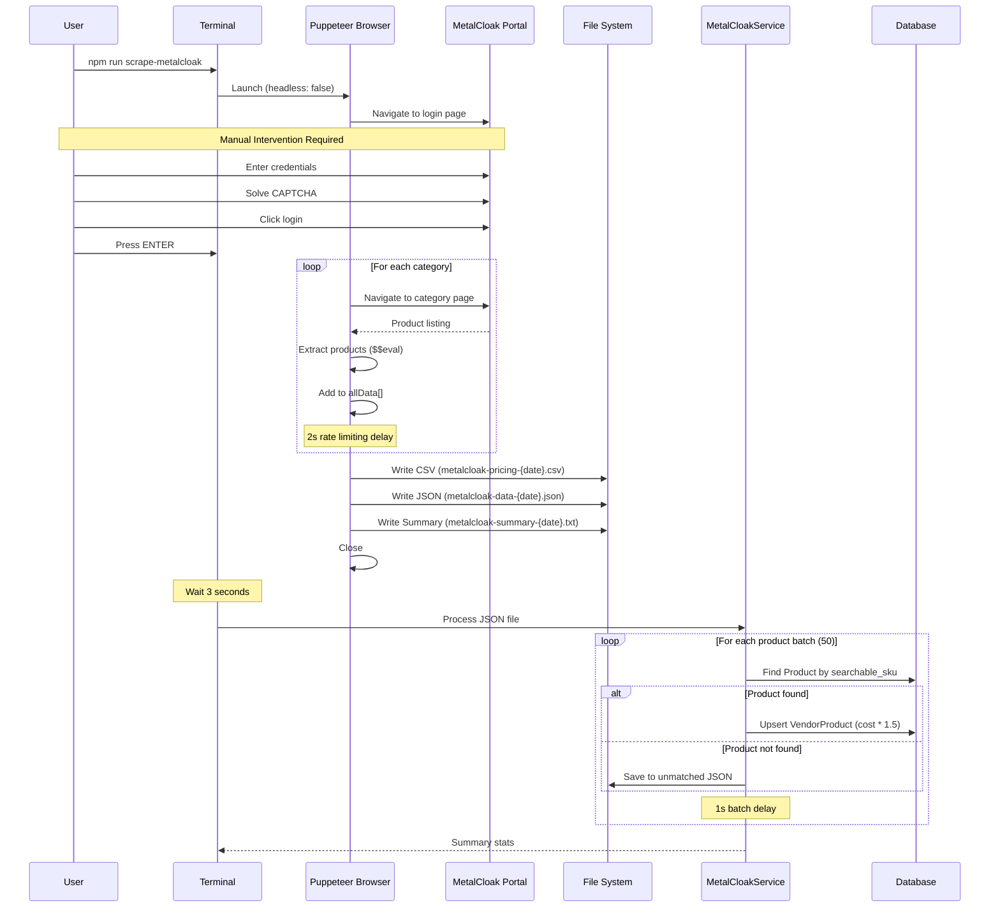
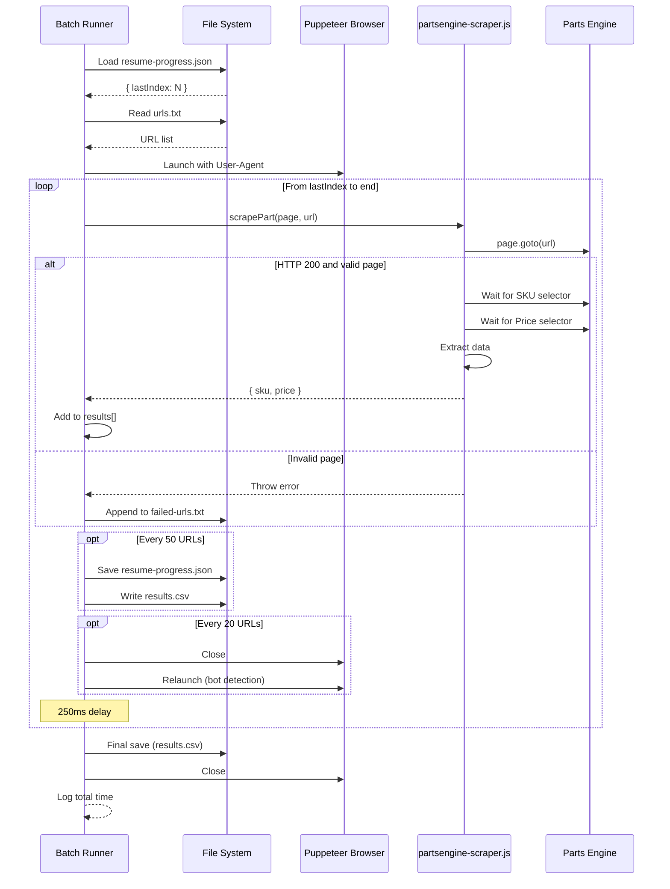
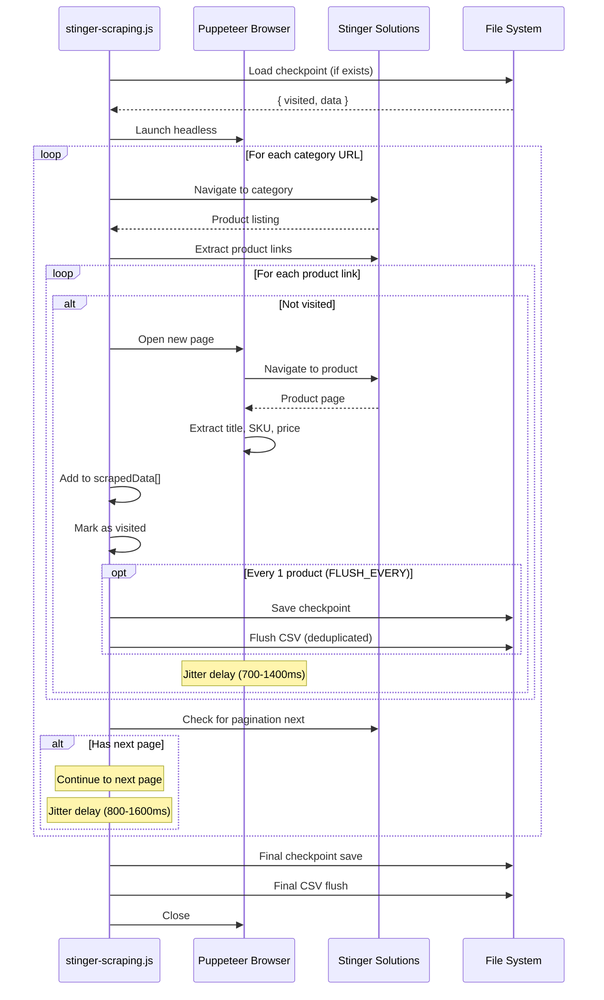

# DD-015: Web Scraping Infrastructure - Design Document

**Version**: 1.0.0
**Status**: Accepted (Documentation of Existing Architecture)
**Created**: 2026-01-23
**Last Updated**: 2026-01-23
**Author**: System (Reverse-Engineered from Implementation)

---

## Agreement Checklist

This document captures the existing architecture. No new implementation is proposed.

- [x] **Scope**: Document current web scraping infrastructure for MetalCloak, Parts Engine, and Stinger Solutions
- [x] **Non-scope**: No architectural changes or new feature proposals
- [x] **Constraints**: Existing CAPTCHA limitations, bot detection avoidance patterns, and manual intervention requirements preserved
- [x] **Dependencies**: DD-002 (Vendor Integration Framework), DD-006 (Competitor Price Tracking)
- [x] **Parent PRDs**: `/docs/prd/competitor-price-tracking-prd.md`, `/docs/prd/multi-vendor-integration-prd.md`

---

## Prerequisite ADRs

None currently documented. The following common ADR topics should be considered for future documentation:

- ADR-COMMON-005: Web Scraping Bot Detection Avoidance Patterns
- ADR-COMMON-007: Session Management for Manual Authentication
- ADR-COMMON-008: Batch Processing with Resume Capability Patterns

---

## Executive Summary

The Web Scraping Infrastructure is a Puppeteer-based system that extracts pricing and product data from vendor and competitor websites where API access is unavailable. The infrastructure supports three target websites with different scraping strategies:

1. **MetalCloak Jobber Portal**: Semi-automated scraping with manual CAPTCHA solving, extracting dealer pricing from authenticated sessions
2. **Parts Engine**: Fully automated batch scraping with resume capability, using stealth plugin for bot detection avoidance
3. **Stinger Solutions**: Fully automated category-based scraping with pagination support

The system generates CSV and JSON output files for downstream database integration via seeding scripts.

---

## Existing Codebase Analysis

### Implementation Path Mapping

| Component | File Path | Status |
|-----------|-----------|--------|
| MetalCloak Basic Scraper | `/prisma/seeds/scrapping/metalCloak/metalCloak-scrapping.js` | Existing |
| MetalCloak Improved Scraper | `/prisma/seeds/scrapping/metalCloak/metalCloak-improved-scraper.js` | Existing |
| MetalCloak Database Service | `/services/metalcloak/index.js` | Existing |
| Parts Engine Scraper | `/prisma/seeds/scrapping/partsEngine/partsengine-scraper.js` | Existing |
| Parts Engine Batch Runner | `/prisma/seeds/scrapping/partsEngine/partsengine-batch-runner.js` | Existing |
| Stinger Scraper | `/prisma/seeds/scrapping/stinger/stinger-scraping.js` | Existing |

### Similar Functionality Search Results

The three scraping implementations share common patterns but are implemented independently due to:
- Different target website structures requiring custom selectors
- Different authentication requirements (manual CAPTCHA vs none)
- Different output requirements (JSON+CSV vs CSV only)
- Different pagination/navigation patterns

Common patterns identified:
- Puppeteer browser automation
- CSV output generation using `csv-stringify`
- Progress tracking and resume capability
- Bot detection avoidance techniques

---

## Architecture Overview

### Architecture Diagram



### Data Flow Diagram



---

## Component Design

### 1. MetalCloak Scraper Architecture

MetalCloak requires manual login due to CAPTCHA protection on their jobber portal. The scraper operates in a semi-automated mode.

#### Basic Scraper (`metalCloak-scrapping.js`)

**Purpose**: Simple category-based scraper for initial data collection

**Configuration**:

```javascript
const BASE_URL = 'https://jobber.metalcloak.com';
const LOGIN_URL = `${BASE_URL}/customer/account/login`;

const CATEGORY_PATHS = [
  "/ford-bronco-6g.html",
  "/jeep-jt-gladiator-parts-accessories.html",
  "/jeep-jl-wrangler-parts-accessories.html",
  "/jeep-jk-wrangler-parts-accessories.html",
  "/jeep-tj-lj-wrangler-parts-accessories.html",
  "/jeep-yj-wrangler-parts-accessories.html",
  "/jeep-cj5-cj7-cj8-parts-accessories.html",
  "/metalcloak-adventure-rack-systems.html",
  "/builder-parts.html",
  "/tools-accessories.html",
  "/rocksport-shocks.html",
  "/toyota-suspension-accessories.html",
  "/dodge-ram-suspension-lift-kits.html",
  "/new-metalcloak-products.html",
  "/carbon-axles.html",
  "/ineos-grenadier-products.html",
  "/shock-absorbers.html"
];
```

**Browser Configuration**:

```javascript
{
  headless: false  // Visible browser for manual CAPTCHA solving
}
```

**Extraction Logic**:

```javascript
// CSS Selectors for MetalCloak product page
const SELECTORS = {
  productContainer: 'div.product.details.product-item-details',
  productTitle: 'a.product-item-link',
  productCode: '.productSku',
  yourPrice: '.special-price-simple .price',
  mapPrice: '.price-container.price-final_price .price',
  fallbackMapPrice: '[id^="old-price"] .price'
};

// Extracted Data Structure
{
  title: string,
  productCode: string,
  mapPrice: string,      // Minimum Advertised Price
  yourPrice: string      // Dealer/Jobber Price
}
```

**Manual Intervention Required**:

```
1. Browser opens to login page
2. User manually enters credentials
3. User solves CAPTCHA
4. User waits for dashboard (orange buttons visible)
5. User presses ENTER in terminal
6. Automated scraping begins
```

#### Improved Scraper (`metalCloak-improved-scraper.js`)

**Enhancements over Basic Scraper**:

1. **Organized Category Configuration**:

```javascript
const CATEGORY_CONFIG = {
  jeep: [
    { path: "/jeep-jt-gladiator-parts-accessories.html", name: "JT Gladiator" },
    { path: "/jeep-jl-wrangler-parts-accessories.html", name: "JL Wrangler" },
    // ... more categories
  ],
  other_vehicles: [
    { path: "/ford-bronco-6g.html", name: "Ford Bronco 6G" },
    { path: "/toyota-suspension-accessories.html", name: "Toyota" },
    // ... more categories
  ],
  products: [
    { path: "/metalcloak-adventure-rack-systems.html", name: "Adventure Rack Systems" },
    // ... more categories
  ]
};
```

2. **Enhanced Output Formats**:
   - CSV with timestamp: `metalcloak-pricing-YYYY-MM-DD.csv`
   - JSON with metadata: `metalcloak-data-YYYY-MM-DD.json`
   - Summary report: `metalcloak-summary-YYYY-MM-DD.txt`

3. **Scraping Statistics**:

```javascript
const scrapingStats = {
  startTime: new Date().toISOString(),
  categoriesProcessed: 0,
  productsFound: 0,
  errors: []
};
```

4. **Price Numeric Conversion**:

```javascript
const cleanPrice = (priceStr) => {
  if (!priceStr) return null;
  const cleaned = priceStr.replace(/[$,]/g, '').trim();
  const parsed = parseFloat(cleaned);
  return isNaN(parsed) ? null : parsed;
};
```

5. **Integrated Database Pipeline**:

```javascript
async function scrapeAndSeed() {
  // Step 1: Scrape MetalCloak data
  const jsonPath = await scrapeMetalCloakPrices();

  // Step 2: Wait before integration
  await new Promise(resolve => setTimeout(resolve, 3000));

  // Step 3: Run database integration
  await runIntegration();
}
```

**Output Directory Structure**:

```
/prisma/seeds/scrapping/metalCloak/
  output/
    metalcloak-pricing-2026-01-23.csv
    metalcloak-data-2026-01-23.json
    metalcloak-summary-2026-01-23.txt
```

### 2. Parts Engine Scraper Architecture

Parts Engine uses a fully automated, batch-processing approach with resume capability.

#### Scraper Module (`partsengine-scraper.js`)

**Technology Stack**:

```javascript
const puppeteer = require('puppeteer-extra');
const StealthPlugin = require('puppeteer-extra-plugin-stealth');
puppeteer.use(StealthPlugin());
```

**Page Validation Flow**:

```mermaid
flowchart TD
    START[Navigate to URL] --> STATUS{HTTP Status?}
    STATUS -->|200| SEARCH{Is Search Page?}
    STATUS -->|Other| FAIL[Throw Status Error]

    SEARCH -->|Yes| FAIL2[Throw Search Redirect Error]
    SEARCH -->|No| WAIT_SKU[Wait for SKU Element<br/>1.5s timeout]

    WAIT_SKU --> WAIT_PRICE[Wait for Price Element<br/>2s timeout]
    WAIT_PRICE --> EXTRACT[Extract SKU + Price]
    EXTRACT --> VALIDATE{Valid Data?}

    VALIDATE -->|Yes| RETURN[Return { sku, price }]
    VALIDATE -->|No| FAIL3[Throw Validation Error]
```

**CSS Selectors**:

```javascript
const SELECTORS = {
  sku: '#PDPTitleBoxV2 h1 b span:nth-of-type(2)',
  price: '#variantPrice'
};
```

**Search Page Detection**:

```javascript
// Fail fast on search result pages (redirects from invalid URLs)
const isSearchPage = await page.evaluate(() => {
  const h1 = document.querySelector("h1");
  return h1 && h1.textContent.includes("results for");
});
```

**Export Pattern**:

```javascript
module.exports = scrapePart;

// Usage:
const scrapePart = require("./partsengine-scraper");
const data = await scrapePart(page, url);
// Returns: { sku: string, price: string }
```

#### Batch Runner (`partsengine-batch-runner.js`)

**Configuration Constants**:

```javascript
const BACKUP_EVERY = 50;        // Save progress every N URLs
const RESTART_EVERY = 20;       // Restart browser every N URLs (bot detection)
const URLS_FILE = "urls.txt";   // Input URL list
const FAILED_FILE = "failed-urls.txt";
const RESUME_FILE = "resume-progress.json";
const OUTPUT_FILE = "results.csv";
```

**Browser Configuration**:

```javascript
{
  headless: false,
  executablePath: "/Applications/Google Chrome.app/Contents/MacOS/Google Chrome",
  args: ["--no-sandbox", "--disable-setuid-sandbox"]
}
```

**User Agent Spoofing**:

```javascript
await page.setUserAgent(
  "Mozilla/5.0 (Macintosh; Intel Mac OS X 10_15_7) " +
  "AppleWebKit/537.36 (KHTML, like Gecko) " +
  "Chrome/122.0.0.0 Safari/537.36"
);
```

**Resume Capability**:

```javascript
function loadResumeIndex() {
  if (fs.existsSync(RESUME_FILE)) {
    const saved = JSON.parse(fs.readFileSync(RESUME_FILE));
    return saved.lastIndex || 0;
  }
  return 0;
}

function saveProgress(index) {
  fs.writeFileSync(RESUME_FILE, JSON.stringify({ lastIndex: index }, null, 2));
}
```

**Processing Flow**:



**Error Handling for Invalid Pages**:

```javascript
try {
  data = { ...(await scrapePart(page, url)), url };
} catch (err) {
  if (err.message.includes("Waiting for selector")) {
    // Page not found - create placeholder entry
    data = {
      sku: "N/A",
      price: "N/A",
      title: "Page Not Found",
      url,
    };
  } else {
    throw err;  // Re-throw other errors
  }
}
```

### 3. Stinger Solutions Scraper Architecture

Stinger uses a category-based crawler with pagination support for Shopify-based store.

**Configuration Constants**:

```javascript
const NAV_TIMEOUT_MS = 60000;
const MAX_RETRIES = 4;
const PRODUCT_DELAY_MS = [700, 1400];   // Jitter range
const CATEGORY_DELAY_MS = [800, 1600];  // Jitter range
const FLUSH_EVERY = 1;                  // Flush CSV every product
const CHECKPOINT_FILE = "stinger_checkpoint.json";
const CSV_FILE = "stinger_products.csv";
```

**Category Configuration**:

```javascript
const CATEGORY_URLS = [
  "https://stingersolutions.com/collections/infotainment",
  "https://stingersolutions.com/collections/audio",
  "https://stingersolutions.com/collections/lighting",
  "https://stingersolutions.com/collections/remote-starters",
  "https://stingersolutions.com/collections/safety"
];
```

**User Agent Rotation**:

```javascript
const UAS = [
  "Mozilla/5.0 (Macintosh; Intel Mac OS X 10_15_7) AppleWebKit/537.36...",
  "Mozilla/5.0 (Windows NT 10.0; Win64; x64) AppleWebKit/537.36...",
  "Mozilla/5.0 (X11; Linux x86_64) AppleWebKit/537.36..."
];
```

**Resource Blocking (Performance Optimization)**:

```javascript
await page.setRequestInterception(true);
page.on("request", (req) => {
  const rtype = req.resourceType();
  if (["image", "media", "font", "stylesheet", "fetch"].includes(rtype)) {
    return req.abort();
  }
  req.continue();
});
```

**CSS Selectors (Shopify Theme)**:

```javascript
// Multiple fallback selectors for different Shopify themes
const selTitle = "h1.product__title, h1.product-meta__title, h1";
const selSku = ".product-meta__sku-number, [data-product-sku], .product__sku, .sku";
const selPrice = ".price [data-money], .price span:not(.visually-hidden), " +
                 ".price__regular .price-item--regular, .price__current";
```

**Pagination Handling**:

```javascript
async function getPaginationNext(catPage) {
  const next = await catPage.$("a.pagination__next.link, a[rel='next']");
  if (!next) return null;
  return await catPage.$eval("a.pagination__next.link, a[rel='next']", (el) => el.href);
}
```

**Graceful Shutdown Handler**:

```javascript
function gracefulExit(code = 0) {
  try {
    saveCheckpoint({ visited, data: scrapedData });
    flushCSV(scrapedData);
  } catch (_) {}
  process.exit(code);
}

process.on("SIGINT", () => {
  console.log("\n👋 Caught SIGINT (Ctrl+C) -- saving files before exit...");
  gracefulExit(0);
});
process.on("SIGTERM", () => {
  console.log("\n👋 Caught SIGTERM -- saving files before exit...");
  gracefulExit(0);
});
```

**Safe Navigation with Retry**:

```javascript
async function safeGoto(page, url, { retries = MAX_RETRIES, label = "page" } = {}) {
  const waitModes = ["networkidle2", "domcontentloaded"];
  for (let i = 0; i < retries; i++) {
    try {
      await page.goto(url, {
        waitUntil: waitModes[i % waitModes.length],
        timeout: NAV_TIMEOUT_MS
      });
      return true;
    } catch (err) {
      const backoff = 1000 * Math.pow(2, i);  // Exponential backoff
      console.warn(`Timeout ${url} retry ${i + 1}/${retries}; backoff ${backoff}ms`);
      await delay(backoff);
    }
  }
  return false;
}
```

**Deduplication in CSV Output**:

```javascript
function flushCSV(rows) {
  const seen = new Set();
  const deduped = [];
  for (const r of rows) {
    const key = (r.sku || "").trim();
    if (!key || seen.has(key)) continue;
    seen.add(key);
    deduped.push(r);
  }
  // ... write deduped to CSV
}
```

### 4. MetalCloak Database Service

The MetalCloak service processes scraped JSON data and updates the database.

**Class Structure**:

```
MetalCloakService
  ├── vendorId: 17
  ├── vendorName: 'MetalCloak'
  ├── prisma: PrismaClient
  │
  ├── processScrapedData(filePath)
  │   ├── Read and validate JSON
  │   ├── Process in batches of 50
  │   └── Return results summary
  │
  ├── processProduct(productData)
  │   ├── Validate required fields
  │   ├── Find matching product
  │   ├── Update or log unmatched
  │   └── Convert USD to CAD (1.5x)
  │
  ├── findMatchingProduct(metalCloakCode, title)
  │   └── Match by searchable_sku + brand_name = 'MetalCloak'
  │
  ├── updateProductPricing(productSku, pricingData)
  │   ├── Convert USD to CAD (1.5x)
  │   └── Upsert VendorProduct record
  │
  ├── saveUnmatchedProduct(productData)
  │   └── Write to unmatched/metalcloak-unmatched.json
  │
  ├── getMetalCloakStats()
  │   └── Return statistics for vendor_id: 17
  │
  └── close()
      └── Disconnect Prisma client
```

**Currency Conversion**:

```javascript
// USD to CAD conversion rate
const cadCost = usdCost * 1.50;
```

**Product Matching Strategy**:

```javascript
const product = await this.prisma.product.findFirst({
  where: {
    searchable_sku: metalCloakCode,
    brand_name: 'MetalCloak'
  }
});
```

---

## Data Contracts

### Scraped Data Structures

**MetalCloak Product Data**:

```typescript
interface MetalCloakProduct {
  title: string;
  productCode: string;         // MetalCloak SKU
  category: string;            // Category name
  mapPrice: string;            // "$299.99" format
  mapPriceNumeric: number;     // 299.99
  yourPrice: string;           // Dealer price
  yourPriceNumeric: number;
  productUrl: string;
  scrapedAt: string;           // ISO timestamp
}
```

**Parts Engine Product Data**:

```typescript
interface PartsEngineProduct {
  url: string;
  sku: string;
  price: string;               // "199.99" format (no currency symbol)
}
```

**Stinger Product Data**:

```typescript
interface StingerProduct {
  sku: string;
  title: string;
  price: string;
  url: string;
  category: string;            // Collection name (e.g., "lighting")
}
```

### Output File Formats

**MetalCloak CSV Columns**:

```csv
title,productCode,category,mapPrice,yourPrice,mapPriceNumeric,yourPriceNumeric,productUrl,scrapedAt
```

**MetalCloak JSON Structure**:

```json
{
  "metadata": {
    "startTime": "2026-01-23T10:00:00.000Z",
    "endTime": "2026-01-23T10:30:00.000Z",
    "categoriesProcessed": 17,
    "productsFound": 1250,
    "errors": [],
    "totalProducts": 1250,
    "vendor": "MetalCloak",
    "website": "https://jobber.metalcloak.com",
    "dataFormat": "pricing-catalog"
  },
  "products": [...]
}
```

**Parts Engine CSV Columns**:

```csv
URL,SKU,Price
```

**Stinger CSV Columns**:

```csv
sku,title,price,url,category
```

### Progress/Checkpoint Structures

**Parts Engine Resume File**:

```json
{
  "lastIndex": 547
}
```

**Stinger Checkpoint File**:

```json
{
  "visited": {
    "https://stingersolutions.com/products/abc": true,
    "https://stingersolutions.com/products/xyz": true
  },
  "data": [
    { "sku": "ABC123", "title": "...", "price": "...", "url": "...", "category": "..." }
  ]
}
```

---

## Integration Point Map

### Integration Points

```yaml
Integration Point 1:
  Existing Component: VendorProduct model
  Integration Method: MetalCloakService upserts via Prisma
  Impact Level: High (Data population)
  Required Test Coverage: USD to CAD conversion, upsert logic

Integration Point 2:
  Existing Component: CompetitorProduct model
  Integration Method: seed-partsEngine-scrapping.js creates/updates records
  Impact Level: High (Data population)
  Required Test Coverage: SKU matching, price parsing

Integration Point 3:
  Existing Component: Product model (searchable_sku)
  Integration Method: Product lookup for SKU matching
  Impact Level: Medium (Data lookup)
  Required Test Coverage: Match accuracy for MetalCloak products

Integration Point 4:
  Existing Component: Product model (partsEngine_code)
  Integration Method: URL-based product lookup for Parts Engine
  Impact Level: Medium (Data lookup)
  Required Test Coverage: URL matching accuracy

Integration Point 5:
  Existing Component: npm scripts (package.json)
  Integration Method: CLI commands for scraping execution
  Impact Level: Low (Process triggering)
  Required Test Coverage: Script execution paths
```

### Integration Boundary Contracts

```yaml
MetalCloak Scraper Boundary:
  Input: Manual login (browser), category paths
  Output: CSV + JSON files in /output directory
  On Error: Log to console, continue with next category

MetalCloak Service Boundary:
  Input: JSON file path from scraper output
  Output: Database records (VendorProduct)
  On Error: Log error, save to unmatched file, continue processing

Parts Engine Scraper Boundary:
  Input: Page object, URL string
  Output: { sku: string, price: string }
  On Error: Throw error with descriptive message

Parts Engine Batch Runner Boundary:
  Input: urls.txt file
  Output: results.csv, resume-progress.json, failed-urls.txt
  On Error: Log failed URL, continue processing

Stinger Scraper Boundary:
  Input: Category URL array (hardcoded)
  Output: stinger_products.csv, stinger_checkpoint.json
  On Error: Retry with exponential backoff, log warning, continue
```

---

## Change Impact Map

This document describes existing architecture. No changes are proposed.

```yaml
Change Target: N/A (Documentation Only)
Direct Impact: None
Indirect Impact: None
No Ripple Effect:
  - MetalCloak scrapers (unchanged)
  - Parts Engine scrapers (unchanged)
  - Stinger scraper (unchanged)
  - MetalCloakService (unchanged)
  - Database integration (unchanged)
  - npm scripts (unchanged)
```

---

## Sequence Diagrams

### MetalCloak Scraping Flow



### Parts Engine Batch Scraping Flow



### Stinger Category Crawling Flow



---

## Bot Detection Avoidance Strategies

### Summary Table

| Strategy | MetalCloak | Parts Engine | Stinger |
|----------|------------|--------------|---------|
| Stealth Plugin | No | Yes | No |
| Browser Restart | No | Every 20 URLs | No |
| User Agent Rotation | No | Fixed (Chrome) | Yes (3 UAs) |
| Resource Blocking | No | No | Yes (images, fonts, CSS) |
| Request Delays | 2s between categories | 250ms between URLs | 700-1400ms jitter |
| Headless Mode | No (visible) | No (visible) | Yes |
| Exponential Backoff | No | No | Yes (on timeout) |
| Manual CAPTCHA | Yes | No | No |

### Detailed Strategies

**1. Stealth Plugin (Parts Engine)**:

```javascript
const puppeteer = require('puppeteer-extra');
const StealthPlugin = require('puppeteer-extra-plugin-stealth');
puppeteer.use(StealthPlugin());

// Hides automation indicators:
// - navigator.webdriver
// - Chrome.runtime
// - Permission queries
// - Plugin enumeration
```

**2. Browser Session Rotation (Parts Engine)**:

```javascript
if ((i + 1) % RESTART_EVERY === 0) {
  await browser.close();
  console.log(`Restarting browser at SKU #${i + 1}...`);
  await launchBrowser();
}
```

**3. Request Jitter (Stinger)**:

```javascript
function jitter([min, max]) {
  return Math.floor(Math.random() * (max - min + 1)) + min;
}

await delay(jitter(PRODUCT_DELAY_MS));  // [700, 1400]
```

**4. Resource Blocking (Stinger)**:

```javascript
await page.setRequestInterception(true);
page.on("request", (req) => {
  const rtype = req.resourceType();
  if (["image", "media", "font", "stylesheet", "fetch"].includes(rtype)) {
    return req.abort();  // Reduce fingerprint and speed up
  }
  req.continue();
});
```

---

## Error Handling Strategy

### Error Categories and Handling

| Error Type | Scraper | Handling | Recovery |
|------------|---------|----------|----------|
| HTTP non-200 | Parts Engine | Throw error | Logged to failed-urls.txt |
| Search redirect | Parts Engine | Throw error | Logged to failed-urls.txt |
| Element timeout | Parts Engine | Throw error | Logged as "Page Not Found" |
| Navigation timeout | Stinger | Retry (4x) | Exponential backoff |
| Product not found | MetalCloak Service | Log warning | Saved to unmatched JSON |
| CAPTCHA | MetalCloak | Manual solving | User intervention required |
| Browser crash | All | Script fails | Re-run from resume point |

### Partial Failure Handling

All scrapers implement continue-on-error patterns:

```javascript
// MetalCloak Service pattern
for (const product of batch) {
  try {
    await this.processProduct(product);
    results.totalProcessed++;
  } catch (error) {
    results.errors.push({
      productCode: product.productCode,
      error: error.message
    });
    // Continue processing remaining products
  }
}
```

---

## npm Scripts Reference

| Script | Command | File | Description |
|--------|---------|------|-------------|
| scrape-metalcloak | `npm run scrape-metalcloak` | `metalCloak-improved-scraper.js` | Semi-automated MetalCloak scraping + integration |
| seed-metalcloak | `npm run seed-metalcloak` | `metalcloak-integration.js` | Process existing JSON file to database |
| process-metalcloak | `npm run process-metalcloak` | `metalcloak-integration.js` | Alias for seed-metalcloak |
| seed-stinger | `npm run seed-stinger` | `stinger-scraping.js` | Stinger category scraping |

**Note**: Parts Engine batch runner is executed directly with `node`:

```bash
cd prisma/seeds/scrapping/partsEngine/
node partsengine-batch-runner.js
```

---

## Test Strategy

### Unit Test Coverage

| Component | Test Focus | Status |
|-----------|------------|--------|
| Price parsing | Currency removal, float conversion | Not implemented |
| SKU extraction | Selector accuracy, null handling | Not implemented |
| Resume logic | Index loading, progress saving | Not implemented |
| CSV generation | Column headers, escaping | Not implemented |
| Deduplication | SKU-based uniqueness | Not implemented |

### Integration Test Scenarios

1. **MetalCloak Scraper**: Test category navigation and product extraction
2. **Parts Engine Scraper**: Test against known product URLs
3. **Stinger Scraper**: Test pagination handling
4. **MetalCloak Service**: Test USD to CAD conversion and upsert logic
5. **Resume Capability**: Test resume from interrupted state

### E2E Verification Procedures

**MetalCloak**:
1. Run `npm run scrape-metalcloak`
2. Complete manual login and CAPTCHA
3. Verify output files created in `/output` directory
4. Check `metalcloak-summary-{date}.txt` for error count
5. Verify database records via `npx prisma studio`

**Parts Engine**:
1. Create `urls.txt` with test URLs
2. Run `node partsengine-batch-runner.js`
3. Monitor console for progress
4. Verify `results.csv` contains expected data
5. Check `failed-urls.txt` for errors

**Stinger**:
1. Run `npm run seed-stinger`
2. Monitor console for category progress
3. Verify `stinger_products.csv` created
4. Check deduplication (unique SKUs only)
5. Test graceful shutdown (Ctrl+C)

---

## Non-Functional Requirements

### Performance

| Metric | Target | Current |
|--------|--------|---------|
| MetalCloak full scrape | < 30 min (17 categories) | ~15-20 min (manual timing) |
| Parts Engine throughput | 1000 URLs in 30 min | ~4 URLs/sec (250ms delay) |
| Stinger category scrape | 5 categories in 30 min | Variable (product count) |
| CSV write latency | < 1 second | Near-instant (sync write) |

### Reliability

- **Resume Support**: Parts Engine and Stinger save progress
- **Failed URL Tracking**: Parts Engine logs to separate file
- **Graceful Shutdown**: Stinger handles SIGINT/SIGTERM
- **Bot Detection Avoidance**: Multiple strategies per scraper
- **Unmatched Product Logging**: MetalCloak saves for review

### Security

- **No API Keys**: Web scraping requires no stored credentials
- **Manual Auth**: MetalCloak credentials entered manually
- **Local Storage Only**: Output files stored locally
- **No PII**: Scraped data is product pricing only

### Scalability

- **URL Volume**: Parts Engine handles unlimited URLs with resume
- **Category Addition**: All scrapers support adding new categories
- **Output Size**: CSV files handle 10,000+ rows

---

## Known Issues and Limitations

### Known Issues

1. **Hardcoded Chrome Path**: Parts Engine batch runner uses macOS Chrome path
   ```javascript
   executablePath: "/Applications/Google Chrome.app/Contents/MacOS/Google Chrome"
   ```
   - Not portable to Windows/Linux environments

2. **Stinger Category Subset**: Currently only scraping one category (lighting)
   ```javascript
   const CATEGORY_URLS = [
     // "https://stingersolutions.com/collections/infotainment",  // commented
     // "https://stingersolutions.com/collections/audio",         // commented
     "https://stingersolutions.com/collections/lighting",
     // "https://stingersolutions.com/collections/remote-starters", // commented
     // "https://stingersolutions.com/collections/safety"           // commented
   ];
   ```

3. **No Stinger Database Integration**: CSV output exists but no seeder script

4. **MetalCloak CAPTCHA Dependency**: Requires manual intervention for each scrape

### Limitations

- **Website Structure Changes**: CSS selector changes will break scrapers
- **Rate Limiting**: No adaptive throttling based on server responses
- **No Proxy Support**: All scrapers use direct connections
- **No Parallel Scraping**: Single-threaded processing
- **No Scheduled Execution**: Manual trigger required

---

## Complexity Assessment

```yaml
complexity_level: medium

complexity_rationale:
  requirements_and_acs:
    - Three distinct target websites with different structures
    - Manual CAPTCHA intervention for MetalCloak
    - Resume capability with checkpoint management
    - Multiple bot detection avoidance strategies
    - CSV and JSON output generation
    - Database integration pipeline
    - USD to CAD currency conversion

  constraints_and_risks:
    - CAPTCHA protection prevents full automation (MetalCloak)
    - Bot detection may block scrapers (mitigated with stealth)
    - Website structure changes break CSS selectors
    - macOS-specific Chrome path (portability issue)
    - No automated scheduling capability
    - Large URL volumes require resume capability
```

---

## References

### Internal Documentation

- [competitor-price-tracking-prd.md](/docs/prd/competitor-price-tracking-prd.md) - Competitor tracking PRD
- [multi-vendor-integration-prd.md](/docs/prd/multi-vendor-integration-prd.md) - Vendor integration PRD
- [DD-002: Vendor Integration Framework](/docs/design/dd-002-vendor-integration-framework.md) - Vendor architecture
- [DD-006: Competitor Price Tracking](/docs/design/dd-006-competitor-price-tracking.md) - Competitor architecture
- [CLAUDE.md](/CLAUDE.md) - Repository documentation

### External Documentation

- Puppeteer Documentation: https://pptr.dev/
- puppeteer-extra: https://github.com/berstend/puppeteer-extra
- puppeteer-extra-plugin-stealth: https://github.com/berstend/puppeteer-extra/tree/master/packages/puppeteer-extra-plugin-stealth
- csv-stringify Documentation: https://csv.js.org/stringify/

### Related Files Summary

| Category | File | Purpose |
|----------|------|---------|
| MetalCloak | `metalCloak-scrapping.js` | Basic category scraper |
| MetalCloak | `metalCloak-improved-scraper.js` | Enhanced scraper with integration |
| MetalCloak | `/services/metalcloak/index.js` | Database integration service |
| Parts Engine | `partsengine-scraper.js` | Single page extraction module |
| Parts Engine | `partsengine-batch-runner.js` | Batch orchestrator with resume |
| Stinger | `stinger-scraping.js` | Category crawler with pagination |

---

## Glossary

| Term | Definition |
|------|------------|
| **Puppeteer** | Node.js library for controlling Chrome/Chromium browsers |
| **Stealth Plugin** | Puppeteer extension to avoid bot detection |
| **CAPTCHA** | Challenge-response test to identify human users |
| **Jobber Portal** | Wholesale/dealer customer portal (MetalCloak) |
| **Headless Mode** | Browser operation without visible UI |
| **$$eval** | Puppeteer method to evaluate selectors and extract data |
| **CSS Selector** | Pattern to identify HTML elements for extraction |
| **Resume Capability** | Ability to continue processing from last saved state |
| **Checkpoint** | Saved state for resuming interrupted operations |
| **Rate Limiting** | Delays between requests to avoid detection/blocking |
| **User Agent** | Browser identification string sent with requests |
| **Jitter** | Random variation in timing to appear more human |
| **Deduplication** | Removing duplicate entries based on unique key |
| **MAP** | Minimum Advertised Price (dealer vs consumer price) |

---

## Change Log

| Version | Date | Author | Changes |
|---------|------|--------|---------|
| 1.0.0 | 2026-01-23 | System | Initial design document (reverse-engineered from implementation) |
