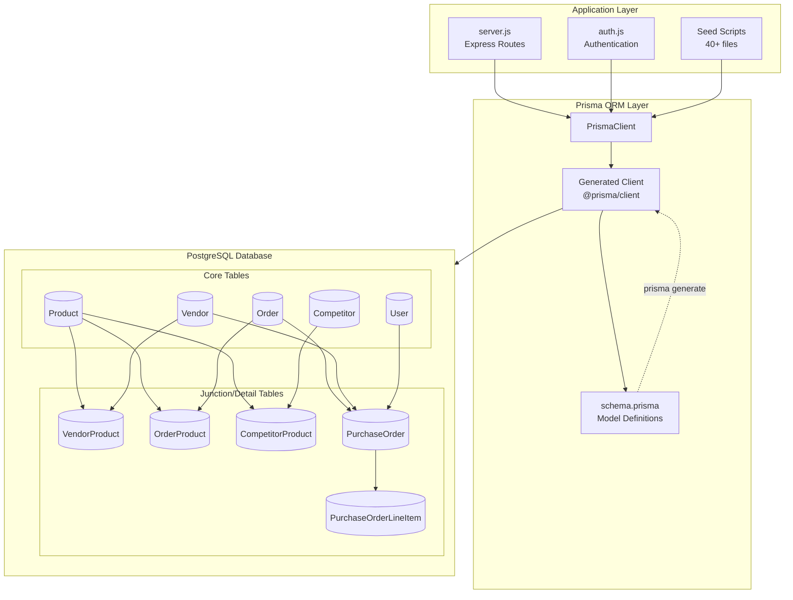
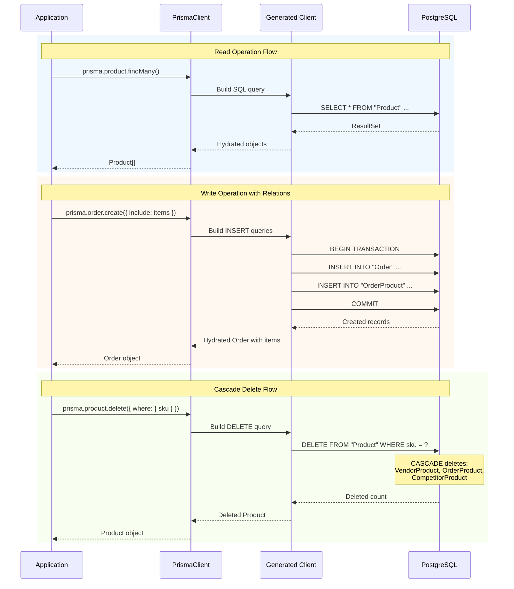
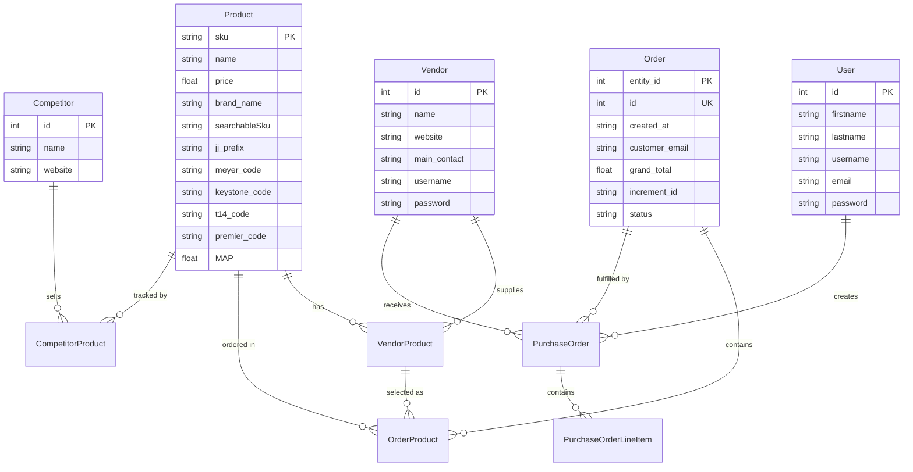

# DD-016: Database Model Layer (Prisma ORM) - Design Document

## Document Information

| Attribute | Value |
|-----------|-------|
| Version | 1.0.0 |
| Status | Documented (Existing Implementation) |
| Created | 2026-01-23 |
| Last Updated | 2026-01-23 |
| Author | Architecture Documentation |
| Parent PRDs | All PRDs (Product Catalog, Order Management, Multi-Vendor Integration, Purchase Order Management, User Authentication, Competitor Price Tracking) |
| Dependencies | PostgreSQL database, Prisma ORM |
| Complexity Level | Medium |

---

## Agreement Checklist

| Agreement | Status | Reflected In |
|-----------|--------|--------------|
| Document current architecture only | Confirmed | Entire document |
| Do not propose changes | Confirmed | All sections descriptive only |
| 9 core models with relationships | Confirmed | Section 5: Data Models |
| Cascade delete behaviors documented | Confirmed | Section 6: Relationship Definitions |
| Unique constraints documented | Confirmed | Section 5: Model Definitions |
| 50+ migrations tracked | Confirmed | Section 7: Schema Evolution |
| 20,000+ product catalog support | Confirmed | Section 8: Current Behavior |

---

## 1. Overview

### 1.1 Purpose

This Design Document describes the current architecture of the Database Model Layer component within the JustJeeps API backend. This component provides the PostgreSQL data access layer using Prisma ORM, defining the core data models, relationships, constraints, and migration history that support the entire application.

### 1.2 Scope

**In Scope:**
- 10 Prisma data models (Order, OrderProduct, Product, VendorProduct, Vendor, User, PurchaseOrder, PurchaseOrderLineItem, Competitor, CompetitorProduct)
- Foreign key relationships and cascade delete behaviors
- Unique constraints and primary key definitions
- Schema evolution through 57 migrations
- Prisma Client configuration and usage patterns

**Out of Scope:**
- Application-level business logic (covered in controller design docs)
- API endpoint definitions (covered in respective feature design docs)
- Data synchronization processes (covered in DD-009)
- Data seeding scripts (implementation details)

### 1.3 Complexity Rationale

**Complexity Level: Medium**

Rationale:
1. **Requirements/ACs**: 10 interconnected data models with multiple relationship types (1:N, N:1, junction tables)
2. **Constraints/Risks**:
   - Referential integrity with cascade deletes requires careful management
   - Large dataset (20,000+ products) with multiple vendor mappings
   - Schema evolution tracked across 57 migrations over 2+ years

---

## 2. Existing Codebase Analysis

### 2.1 Implementation Path Mapping

| Component | File Path | Lines | Type |
|-----------|-----------|-------|------|
| Prisma Schema | `/Users/ricardotassio/DEV/TRABALHO/JUSTJEEPS/JustJeepsAPI-back-end/schema.prisma` | 1-195 | Existing |
| Migration History | `/Users/ricardotassio/DEV/TRABALHO/JUSTJEEPS/JustJeepsAPI-back-end/prisma/migrations/` | 57 directories | Existing |
| Prisma Client Init | `/Users/ricardotassio/DEV/TRABALHO/JUSTJEEPS/JustJeepsAPI-back-end/server.js` | 7-14 | Existing |

### 2.2 Similar Functionality Search Results

**Search Keywords Used**: prisma, schema, model, database, migration

**Findings**:
- Single schema.prisma file at project root (standard Prisma convention)
- Prisma Client instantiated once in server.js and used throughout
- All models defined in single schema file (no schema splitting)
- No duplicate model definitions found

### 2.3 Integration Points with Existing Code

| Integration Point | Location | Coupling Level |
|-------------------|----------|----------------|
| Express Routes | `server.js` (entire file) | Direct dependency |
| Vendor Seed Scripts | `prisma/seeds/seed-individual/*.js` (40+ files) | Write operations |
| API Call Scripts | `prisma/seeds/api-calls/*.js` (30+ files) | Write operations |
| Authentication Middleware | `middleware/auth.js` | User model queries |

---

## 3. Architecture Diagram



---

## 4. Data Flow Diagram



---

## 5. Data Models

### 5.1 Entity Relationship Diagram



### 5.2 Model: Order

**Purpose**: Stores Magento order data synchronized from e-commerce platform

```prisma
model Order {
  entity_id             Int             @id          // Magento entity ID (PK)
  id                    Int             @unique @default(autoincrement())
  created_at            String                       // ISO date string
  customer_email        String
  coupon_code           String?
  customer_firstname    String?
  customer_lastname     String?
  grand_total           Float
  increment_id          String                       // Magento order number
  order_currency_code   String
  total_qty_ordered     Int
  status                String?
  base_total_due        Float?
  shipping_amount       Float?
  shipping_description  String?
  custom_po_number      String?
  weltpixel_fraud_score Float?
  city                  String?
  region                String?
  method_title          String?
  shipping_city         String?
  shipping_country_id   String?
  shipping_firstname    String?
  shipping_lastname     String?
  shipping_postcode     String?
  shipping_region       String?
  shipping_street1      String?
  shipping_street2      String?
  shipping_street3      String?
  shipping_telephone    String?
  shipping_company      String?

  // Relations
  items                 OrderProduct[]
  purchaseOrder         PurchaseOrder[]
}
```

**Constraints**:
- Primary Key: `entity_id` (Magento's entity ID)
- Unique: `id` (auto-increment for internal reference)

**Added Fields Over Time**: status, base_total_due, shipping_amount, shipping_description, custom_po_number, weltpixel_fraud_score, city, region, method_title, shipping_* fields

### 5.3 Model: OrderProduct

**Purpose**: Line items within orders, linking orders to products

```prisma
model OrderProduct {
  id                     Int            @id @default(autoincrement())
  name                   String
  sku                    String
  order_id               Int
  base_price             Float
  base_price_incl_tax    Float?
  discount_amount        Float
  discount_invoiced      Float
  discount_percent       Float
  original_price         Float
  price                  Float
  price_incl_tax         Float?
  product_id             Int?                        // Nullable (optional)
  qty_ordered            Int
  selected_supplier      String?                     // Selected vendor name
  selected_supplier_cost String?                     // Selected vendor cost
  vendor_product_id      Int?                        // FK to VendorProduct

  // Relations
  order                  Order          @relation(fields: [order_id], references: [entity_id], onDelete: Cascade)
  product                Product        @relation(fields: [sku], references: [sku], onDelete: Cascade)
  vendorProduct          VendorProduct? @relation(fields: [vendor_product_id], references: [id], onDelete: Cascade)
}
```

**Constraints**:
- Primary Key: `id` (auto-increment)
- Foreign Keys: `order_id` -> Order, `sku` -> Product, `vendor_product_id` -> VendorProduct

**Cascade Behavior**: Deleting Order cascades to OrderProduct; Deleting Product cascades to OrderProduct

### 5.4 Model: Product

**Purpose**: Central product catalog with multi-vendor code mappings

```prisma
model Product {
  sku                String              @id @unique
  status             Int?
  name               String
  price              Float
  searchableSku      String
  searchable_sku     String?
  jj_prefix          String?
  premier_code       String?
  t14_code           String?
  t14_id             String?
  meyer_code         String?
  keystone_code      String?
  omix_code          String?
  vendors            String?                          // Comma-separated vendor names
  brand_name         String?
  image              String?
  weight             Float?
  url_path           String?
  quadratec_code     String?
  rough_country_code String?
  gentecdirect_code  String?
  MAP                Float?                           // Minimum Advertised Price
  partStatus_meyer   String?
  black_friday_sale  String?
  height             Float?
  length             Float?
  width              Float?
  meyer_height       Float?
  meyer_length       Float?
  meyer_weight       Float?
  meyer_width        Float?
  tdot_code          String?
  shippingFreight    String?
  part               String?
  thumbnail          String?
  ctp_code           String?
  partsEngine_code   String?
  keystone_code_site String?
  tdot_url           String?
  keystone_ftp_brand String?

  // Relations
  competitorProducts CompetitorProduct[]
  orderProducts      OrderProduct[]
  vendorProducts     VendorProduct[]
}
```

**Constraints**:
- Primary Key: `sku`
- Unique: `sku` (redundant with PK but explicit)

**Vendor Code Fields**: meyer_code, keystone_code, quadratec_code, t14_code, premier_code, omix_code, tdot_code, ctp_code, partsEngine_code, gentecdirect_code, rough_country_code, keystone_code_site, keystone_ftp_brand, t14_id

### 5.5 Model: VendorProduct

**Purpose**: Junction table linking products to vendors with cost and inventory data

```prisma
model VendorProduct {
  id                      Int            @id @default(autoincrement())
  product_sku             String
  vendor_id               Int
  vendor_sku              String
  vendor_cost             Float
  vendor_inventory        Float?
  partStatus_meyer        String?
  vendor_inventory_string String?
  quadratec_sku           String?
  manufacturer_sku        String?

  // Relations
  orderProducts           OrderProduct[]
  product                 Product        @relation(fields: [product_sku], references: [sku], onDelete: Cascade)
  vendor                  Vendor         @relation(fields: [vendor_id], references: [id])
}
```

**Constraints**:
- Primary Key: `id` (auto-increment)
- Foreign Keys: `product_sku` -> Product (CASCADE), `vendor_id` -> Vendor

**Note**: Initially had unique constraint on `vendor_sku`, removed in migration 20230426160938

### 5.6 Model: Vendor

**Purpose**: Vendor registry storing credentials and contact information

```prisma
model Vendor {
  id             Int             @id @default(autoincrement())
  name           String
  website        String
  address        String?
  phone_number   String?
  main_contact   String
  username       String
  password       String

  // Relations
  purchaseOrders PurchaseOrder[]
  vendorProducts VendorProduct[]
}
```

**Constraints**:
- Primary Key: `id` (auto-increment)

**Security Note**: Stores vendor portal credentials in plain text (legacy design)

### 5.7 Model: User

**Purpose**: Application user authentication

```prisma
model User {
  id             Int             @id @default(autoincrement())
  firstname      String
  lastname       String
  username       String
  email          String
  password       String

  // Relations
  purchaseOrders PurchaseOrder[]
}
```

**Constraints**:
- Primary Key: `id` (auto-increment)

**Note**: Password stored as bcrypt hash when using auth routes

### 5.8 Model: PurchaseOrder

**Purpose**: Purchase orders sent to vendors for fulfillment

```prisma
model PurchaseOrder {
  id                     Int                     @id @default(autoincrement())
  created_at             DateTime                @default(now())
  user_id                Int
  order_id               Int
  vendor_id              Int

  // Relations
  order                  Order                   @relation(fields: [order_id], references: [entity_id])
  user                   User                    @relation(fields: [user_id], references: [id])
  vendor                 Vendor                  @relation(fields: [vendor_id], references: [id])
  purchaseOrderLineItems PurchaseOrderLineItem[]
}
```

**Constraints**:
- Primary Key: `id` (auto-increment)
- Foreign Keys: `order_id` -> Order, `user_id` -> User, `vendor_id` -> Vendor

### 5.9 Model: PurchaseOrderLineItem

**Purpose**: Line items within purchase orders

```prisma
model PurchaseOrderLineItem {
  id                 Int           @id @default(autoincrement())
  purchase_order_id  Int
  vendor_product_id  Int?                          // Nullable since migration 20230421151643
  quantity_purchased Int
  vendor_cost        Float?                        // Nullable
  product_sku        String?                       // Added in migration 20230421184514
  vendor_sku         String?                       // Added in migration 20230421184514

  // Relations
  purchaseOrder      PurchaseOrder @relation(fields: [purchase_order_id], references: [id])
}
```

**Constraints**:
- Primary Key: `id` (auto-increment)
- Foreign Keys: `purchase_order_id` -> PurchaseOrder

**Note**: `vendor_product_id` FK was dropped in migration 20230421184514, replaced with direct `product_sku` and `vendor_sku` fields

### 5.10 Model: Competitor

**Purpose**: Competitor registry for price tracking

```prisma
model Competitor {
  id                 Int                 @id @default(autoincrement())
  name               String
  website            String

  // Relations
  competitorProducts CompetitorProduct[]
}
```

**Constraints**:
- Primary Key: `id` (auto-increment)

### 5.11 Model: CompetitorProduct

**Purpose**: Tracks competitor pricing for products

```prisma
model CompetitorProduct {
  id               Int        @id @default(autoincrement())
  product_sku      String
  competitor_id    Int
  product_url      String?
  competitor_price Float
  competitor_sku   String?

  // Relations
  competitor       Competitor @relation(fields: [competitor_id], references: [id])
  product          Product    @relation(fields: [product_sku], references: [sku], onDelete: Cascade)
}
```

**Constraints**:
- Primary Key: `id` (auto-increment)
- Foreign Keys: `competitor_id` -> Competitor, `product_sku` -> Product (CASCADE)

---

## 6. Relationship Definitions

### 6.1 Cascade Delete Behavior

```yaml
Product -> VendorProduct:
  Type: One-to-Many
  On Delete: CASCADE
  Effect: Deleting Product deletes all VendorProduct records

Product -> OrderProduct:
  Type: One-to-Many
  On Delete: CASCADE
  Effect: Deleting Product deletes all OrderProduct records

Product -> CompetitorProduct:
  Type: One-to-Many
  On Delete: CASCADE
  Effect: Deleting Product deletes all CompetitorProduct records

Order -> OrderProduct:
  Type: One-to-Many
  On Delete: CASCADE
  Effect: Deleting Order deletes all OrderProduct records

VendorProduct -> OrderProduct:
  Type: One-to-Many
  On Delete: CASCADE
  Effect: Deleting VendorProduct deletes associated OrderProduct records
```

### 6.2 Non-Cascade Relationships

```yaml
Vendor -> VendorProduct:
  Type: One-to-Many
  On Delete: RESTRICT (default)
  Effect: Cannot delete Vendor with existing VendorProduct records

Vendor -> PurchaseOrder:
  Type: One-to-Many
  On Delete: RESTRICT (default)
  Effect: Cannot delete Vendor with existing PurchaseOrder records

User -> PurchaseOrder:
  Type: One-to-Many
  On Delete: RESTRICT (default)
  Effect: Cannot delete User with existing PurchaseOrder records

Order -> PurchaseOrder:
  Type: One-to-Many
  On Delete: RESTRICT (default)
  Effect: Cannot delete Order with existing PurchaseOrder records

Competitor -> CompetitorProduct:
  Type: One-to-Many
  On Delete: RESTRICT (default)
  Effect: Cannot delete Competitor with existing CompetitorProduct records

PurchaseOrder -> PurchaseOrderLineItem:
  Type: One-to-Many
  On Delete: RESTRICT (default)
  Effect: Cannot delete PurchaseOrder with existing line items
```

---

## 7. Schema Evolution (Migration History)

### 7.1 Migration Timeline Overview

| Period | Migration Count | Key Changes |
|--------|-----------------|-------------|
| Apr 2023 | 11 | Initial schema, cascade deletes, order status |
| May 2023 | 2 | Quadratec and Rough Country codes |
| Jun 2023 | 4 | Cascade for VendorProduct, CompetitorProduct, OrderProduct; MAP column |
| Nov 2023 | 2 | Parts status Meyer tracking |
| Mar 2024 | 5 | Product dimensions, Meyer dimensions, shipping freight |
| Jun 2024 | 6 | Order payment/shipping details, vendor inventory string, Quadratec SKU |
| Oct 2024 | 2 | TDot code, competitor SKU |
| Dec 2024 | 1 | VendorProduct on OrderProduct relation |
| Feb 2025 | 4 | Shipping freight type changes, vendor name experiments |
| Mar 2025 | 2 | Part category, thumbnail |
| Apr 2025 | 3 | Searchable SKU, CTP code, PartsEngine code |
| Jul 2025 | 2 | Keystone code site |
| Aug-Sep 2025 | 3 | Shipping address fields, TDot URL |
| Oct 2025 | 1 | Keystone FTP brand |
| Nov 2025 | 5 | T14 code, Premier code, Black Friday, T14 ID migration |

### 7.2 Key Migration Details

**Initial Migration (20230416015459)**:
- Created 10 core tables: Order, OrderProduct, Product, VendorProduct, Vendor, User, PurchaseOrder, PurchaseOrderLineItem, Competitor, CompetitorProduct
- Established foreign key relationships
- Created unique indices

**Cascade Delete Evolution**:
- `20230418132850`: Order -> OrderProduct CASCADE
- `20230615014156`: Product -> VendorProduct CASCADE
- `20230615014428`: Product -> CompetitorProduct CASCADE
- `20230615014747`: Product -> OrderProduct CASCADE

**Vendor Code Fields Added**:
- `20230511190708`: quadratec_code, rough_country_code
- `20230529173329`: gentecdirect_code
- `20241004141114`: tdot_code
- `20250414151858`: ctp_code
- `20250414152725`: partsEngine_code
- `20250709192921`: keystone_code_site
- `20250911133247`: tdot_url
- `20250924221412`: keystone_ftp_brand
- `20251028154631`: t14_code
- `20251112182443`: premier_code

**Schema Refinements**:
- `20230426160938`: Removed unique constraint from vendor_sku (allowing duplicate vendor SKUs)
- `20230421151643`: Made vendor_product_id optional in PurchaseOrderLineItem
- `20230421184514`: Added product_sku and vendor_sku to PurchaseOrderLineItem
- `20251120201628`: Moved t14_id from VendorProduct to Product

### 7.3 Total Migration Count

```
Total Migrations: 57
Active Schema Tables: 10
Period: April 2023 - November 2025 (2 years 8 months)
```

---

## 8. Integration Point Map

```yaml
Integration Point 1:
  Existing Component: Express API Routes (server.js)
  Integration Method: PrismaClient instance import
  Impact Level: High (All database operations)
  Required Test Coverage: Query correctness, transaction handling

Integration Point 2:
  Existing Component: Authentication Middleware (middleware/auth.js)
  Integration Method: User model queries for JWT validation
  Impact Level: Medium (Authentication flow)
  Required Test Coverage: User lookup, token validation

Integration Point 3:
  Existing Component: Seed Scripts (prisma/seeds/)
  Integration Method: Bulk upsert operations via PrismaClient
  Impact Level: High (Data population)
  Required Test Coverage: Upsert correctness, foreign key handling

Integration Point 4:
  Existing Component: Vendor Service Modules (services/)
  Integration Method: VendorProduct and Product updates
  Impact Level: Medium (Data synchronization)
  Required Test Coverage: Cost/inventory updates
```

---

## 9. Integration Boundary Contracts

### 9.1 Prisma Client Configuration

```yaml
Boundary Name: PrismaClient Initialization
  Input: Environment variable DATABASE_URL (PostgreSQL connection string)
  Output: PrismaClient instance with database connection
  On Error: Connection refused, authentication failed, or timeout throws
```

### 9.2 Query Operations

```yaml
Boundary Name: findMany/findUnique Operations
  Input: Prisma query objects with where, select, include, orderBy clauses
  Output: Promise resolving to model instance(s) or null
  On Error: PrismaClientKnownRequestError for constraint violations, PrismaClientUnknownRequestError for connection issues

Boundary Name: create/update/upsert Operations
  Input: Prisma mutation objects with data, where clauses
  Output: Promise resolving to created/updated model instance
  On Error: Unique constraint violation (P2002), Foreign key constraint violation (P2003), Record not found (P2025)

Boundary Name: delete Operations
  Input: Prisma delete query with where clause
  Output: Promise resolving to deleted model instance
  On Error: Foreign key constraint (P2003) if non-cascade relation has dependents
```

---

## 10. Change Impact Map

```yaml
Change Target: Database Model Layer (schema.prisma)
Direct Impact:
  - /Users/ricardotassio/DEV/TRABALHO/JUSTJEEPS/JustJeepsAPI-back-end/schema.prisma
  - /Users/ricardotassio/DEV/TRABALHO/JUSTJEEPS/JustJeepsAPI-back-end/prisma/migrations/

Indirect Impact:
  - server.js (all Prisma queries)
  - middleware/auth.js (User model queries)
  - routes/auth.js (User model operations)
  - services/turn14/ (VendorProduct updates)
  - services/premier/ (VendorProduct updates)
  - services/metalcloak/ (VendorProduct updates)
  - prisma/seeds/seed-individual/*.js (all seed scripts)
  - prisma/seeds/api-calls/*.js (all API integration scripts)

No Ripple Effect:
  - Frontend application (consumes API, not database directly)
  - External vendor APIs (data sources, not consumers)
  - Docker configuration (infrastructure, not schema)
```

---

## 11. Current Behavior Characteristics

### 11.1 Data Volume

| Model | Approximate Record Count | Growth Rate |
|-------|-------------------------|-------------|
| Product | 20,000+ | Moderate (Magento sync) |
| VendorProduct | 100,000+ | High (multi-vendor mappings) |
| Order | Variable | Daily (Magento sync) |
| OrderProduct | Variable | Daily (order items) |
| CompetitorProduct | 10,000+ | Periodic (scraping) |
| Vendor | ~20 | Stable |
| Competitor | ~10 | Stable |
| User | ~10 | Stable |
| PurchaseOrder | Variable | Daily |
| PurchaseOrderLineItem | Variable | Daily |

### 11.2 Query Patterns

| Operation Type | Frequency | Typical Models |
|---------------|-----------|----------------|
| findMany with includes | Very High | Product, Order, VendorProduct |
| findUnique by SKU | High | Product |
| findUnique by ID | High | Order, PurchaseOrder |
| aggregate (count, sum) | Medium | Order, OrderProduct, Product |
| groupBy | Medium | OrderProduct (top products) |
| upsert | High (sync) | Product, VendorProduct |
| create | Medium | PurchaseOrder, PurchaseOrderLineItem |
| update | Medium | Order, OrderProduct |
| delete | Low | Order (cascade) |

### 11.3 Prisma Client Configuration

```javascript
const { PrismaClient } = require('@prisma/client');
const prisma = new PrismaClient({
  datasources: {
    db: {
      url: process.env.DATABASE_URL,
    },
  },
});
```

**Binary Targets** (from generator config):
- `native`: Local development
- `debian-openssl-3.0.x`: Docker/production deployment

---

## 12. Acceptance Criteria (Current Implementation)

### 12.1 Model Structure Acceptance Criteria

| ID | Criterion | Verification Method |
|----|-----------|---------------------|
| AC-001 | Product model uses SKU as primary key | Schema inspection: `@id @unique` on sku field |
| AC-002 | Order model uses Magento entity_id as primary key | Schema inspection: `@id` on entity_id field |
| AC-003 | All junction tables have auto-increment integer primary keys | Schema inspection: `@id @default(autoincrement())` |
| AC-004 | VendorProduct links Product and Vendor | Schema inspection: foreign keys to both models |
| AC-005 | OrderProduct links Order and Product | Schema inspection: foreign keys to both models |
| AC-006 | CompetitorProduct links Product and Competitor | Schema inspection: foreign keys to both models |

### 12.2 Relationship Acceptance Criteria

| ID | Criterion | Verification Method |
|----|-----------|---------------------|
| AC-R01 | Deleting Product cascades to VendorProduct | Test: delete product, verify VendorProduct deleted |
| AC-R02 | Deleting Product cascades to OrderProduct | Test: delete product, verify OrderProduct deleted |
| AC-R03 | Deleting Product cascades to CompetitorProduct | Test: delete product, verify CompetitorProduct deleted |
| AC-R04 | Deleting Order cascades to OrderProduct | Test: delete order, verify OrderProduct deleted |
| AC-R05 | Cannot delete Vendor with existing VendorProducts | Test: attempt delete, verify error |
| AC-R06 | Cannot delete User with existing PurchaseOrders | Test: attempt delete, verify error |

### 12.3 Data Integrity Acceptance Criteria

| ID | Criterion | Verification Method |
|----|-----------|---------------------|
| AC-D01 | Product SKU must be unique | Test: attempt duplicate insert, verify error P2002 |
| AC-D02 | Order entity_id must be unique | Test: attempt duplicate insert, verify error P2002 |
| AC-D03 | VendorProduct.product_sku must reference existing Product | Test: insert invalid FK, verify error P2003 |
| AC-D04 | OrderProduct.order_id must reference existing Order | Test: insert invalid FK, verify error P2003 |

---

## 13. Known Limitations

1. **No Soft Deletes**: All deletes are hard deletes; no audit trail
2. **Credential Storage**: Vendor passwords stored in plain text (security concern)
3. **No Indexing Strategy**: No explicit indexes beyond primary keys and unique constraints
4. **No Connection Pooling Configuration**: Uses Prisma defaults
5. **Single Database**: No read replicas or sharding
6. **Timestamp Inconsistency**: Order.created_at is String, PurchaseOrder.created_at is DateTime
7. **Redundant Fields**: Both `searchableSku` and `searchable_sku` exist on Product
8. **Missing Constraints**: No unique constraint on (product_sku, vendor_id) in VendorProduct

---

## 14. Prisma Commands Reference

### Development Commands

```bash
# Generate Prisma Client after schema changes
npx prisma generate

# Create and apply migration in development
npx prisma migrate dev --name <migration_name>

# Apply pending migrations in production
npx prisma migrate deploy

# Reset database (destructive)
npx prisma migrate reset

# Open Prisma Studio (GUI)
npx prisma studio

# Validate schema
npx prisma validate

# Format schema file
npx prisma format
```

---

## 15. References

### Internal Documentation
- [Product Catalog Management PRD](../prd/product-catalog-management-prd.md)
- [Order Management PRD](../prd/order-management-prd.md)
- [Multi-Vendor Integration PRD](../prd/multi-vendor-integration-prd.md)
- [Purchase Order Management PRD](../prd/purchase-order-management-prd.md)
- [User Authentication PRD](../prd/user-authentication-prd.md)
- [Competitor Price Tracking PRD](../prd/competitor-price-tracking-prd.md)
- [DD-002 Vendor Integration Framework](dd-002-vendor-integration-framework.md)
- [DD-003 Product Catalog Controller](dd-003-product-catalog-controller.md)

### Source Files
- `/Users/ricardotassio/DEV/TRABALHO/JUSTJEEPS/JustJeepsAPI-back-end/schema.prisma`
- `/Users/ricardotassio/DEV/TRABALHO/JUSTJEEPS/JustJeepsAPI-back-end/prisma/migrations/`
- `/Users/ricardotassio/DEV/TRABALHO/JUSTJEEPS/JustJeepsAPI-back-end/server.js` (lines 7-14)

### External References
- [Prisma Documentation](https://www.prisma.io/docs)
- [PostgreSQL Documentation](https://www.postgresql.org/docs/)

---

## Change History

| Version | Date | Author | Changes |
|---------|------|--------|---------|
| 1.0.0 | 2026-01-23 | Architecture Documentation | Initial documentation of existing implementation |
