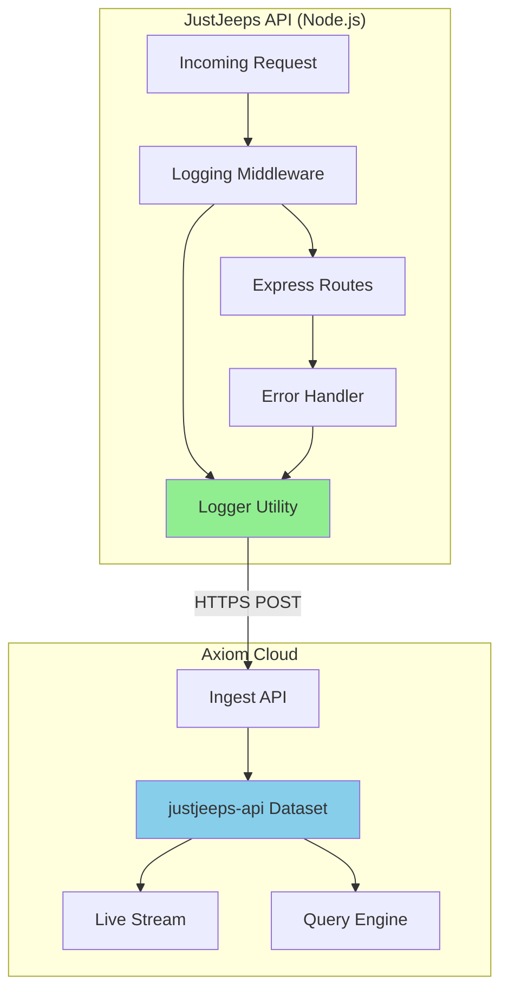
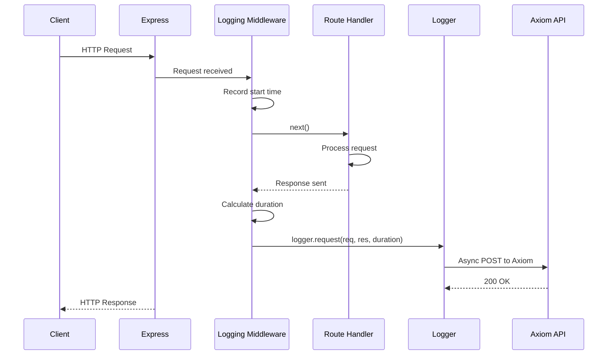

# DD-017: Axiom Logging & Error Monitoring

## Document Information

| Attribute | Value |
|-----------|-------|
| Version | 1.0.0 |
| Status | Implemented |
| Created | 2026-01-24 |
| Last Updated | 2026-01-24 |
| Author | Architecture Documentation |
| Parent PRD | [health-monitoring-prd.md](../prd/health-monitoring-prd.md) |
| Dependencies | Axiom Cloud Service |
| Complexity Level | Low |

---

## 1. Overview

### 1.1 Purpose

This Design Document describes the implementation of centralized logging and error monitoring using Axiom, a cloud-based log management and analytics platform. This integration provides real-time visibility into application behavior, error tracking, and request monitoring for the JustJeeps API backend.

### 1.2 Scope

**In Scope:**
- Centralized logging via Axiom cloud service
- HTTP request logging middleware
- API error tracking with stack traces
- Graceful shutdown with log flushing
- Environment-based log levels
- Request duration tracking

**Out of Scope:**
- Log file storage on server
- Log rotation or archival
- APM (Application Performance Monitoring)
- Distributed tracing
- Custom dashboards (use Axiom UI)

### 1.3 Why Axiom?

| Criteria | Axiom | Alternatives |
|----------|-------|--------------|
| Free Tier | 500 GB/month | Sentry: 5K errors, Logtail: 1GB |
| Setup Complexity | Low | Similar |
| Query Language | SQL-like (APL) | Varies |
| Retention | 30 days (free) | Varies |
| Real-time Streaming | Yes | Yes |

---

## 2. Architecture

### 2.1 Component Overview



### 2.2 Data Flow



---

## 3. Implementation Details

### 3.1 File Structure

```
JustJeepsAPI-back-end/
├── utils/
│   └── logger.js          # Axiom logger utility
├── server.js              # Express app with middleware
├── .env.production        # AXIOM_TOKEN, AXIOM_DATASET
├── .kamal/secrets         # Production secrets
└── config/deploy.yml      # Deployment configuration
```

### 3.2 Logger Utility

**Location**: `utils/logger.js`

**Features:**
- Singleton Axiom client initialization
- Multiple log levels (error, warn, info, debug)
- Request logging with metadata
- API error logging with stack traces
- Async log flushing on shutdown

**Log Levels:**
| Level | Console | Axiom | Use Case |
|-------|---------|-------|----------|
| error | Always | Always | Exceptions, failures |
| warn | Always | Always | Deprecations, near-failures |
| info | Always | Always | Important events |
| debug | Dev only | Always | Detailed debugging |

### 3.3 Request Logging Middleware

**Location**: `server.js` (lines 44-55)

**Captured Data:**
```javascript
{
  _time: "2026-01-24T12:00:00.000Z",
  level: "info",
  message: "GET /api/products 200 - 45ms",
  type: "http_request",
  method: "GET",
  path: "/api/products",
  statusCode: 200,
  duration: "45ms",
  userAgent: "Mozilla/5.0...",
  ip: "192.168.1.1",
  query: { limit: "10" },
  environment: "production",
  service: "justjeeps-api"
}
```

**Excluded Paths:**
- `/api/health` - High frequency, low value

### 3.4 Error Handler

**Location**: `server.js` (lines 1089-1097)

**Captured Data:**
```javascript
{
  _time: "2026-01-24T12:00:00.000Z",
  level: "error",
  message: "Cannot read property 'id' of undefined",
  type: "api_error",
  errorName: "TypeError",
  errorMessage: "Cannot read property 'id' of undefined",
  stack: "TypeError: Cannot read property...",
  method: "POST",
  path: "/api/orders",
  query: {},
  body: { sku: "ABC123" },
  userId: 42,
  environment: "production",
  service: "justjeeps-api"
}
```

### 3.5 Graceful Shutdown

**Location**: `server.js` (lines 1099-1110)

**Signals Handled:**
- `SIGTERM` - Kubernetes/Docker stop
- `SIGINT` - Ctrl+C

**Behavior:**
1. Log shutdown event
2. Flush pending logs to Axiom
3. Exit process

---

## 4. Configuration

### 4.1 Environment Variables

| Variable | Description | Required | Default |
|----------|-------------|----------|---------|
| `AXIOM_TOKEN` | API token for authentication | Yes | - |
| `AXIOM_DATASET` | Dataset name for log storage | Yes | `justjeeps-api` |
| `NODE_ENV` | Environment identifier | No | `development` |

### 4.2 Axiom Setup

1. **Create Account**: https://app.axiom.co/register
2. **Create Dataset**: `justjeeps-api` (Events type, 30 day retention)
3. **Create API Token**: Settings → API Tokens → New Token (Ingest permission)
4. **Configure Environment**: Add token to `.env.production`

### 4.3 Kamal Secrets

**File**: `.kamal/secrets`
```bash
AXIOM_TOKEN=$AXIOM_TOKEN
AXIOM_DATASET=$AXIOM_DATASET
```

**File**: `config/deploy.yml`
```yaml
env:
  secret:
    - AXIOM_TOKEN
    - AXIOM_DATASET
```

---

## 5. Usage

### 5.1 Manual Logging

```javascript
const logger = require('./utils/logger');

// Info level
logger.info('Order processed', { orderId: 12345 });

// Warning level
logger.warn('Deprecated API used', { endpoint: '/old-route' });

// Error level
logger.error('Payment failed', { orderId: 12345, reason: 'Card declined' });

// Debug level (only in development console)
logger.debug('Query executed', { sql: 'SELECT * FROM...' });

// API error with request context
logger.apiError(error, req);
```

### 5.2 Viewing Logs

1. **Axiom Dashboard**: https://app.axiom.co
2. **Navigate**: Datasets → `justjeeps-api`
3. **Live Stream**: Click "Stream" for real-time logs
4. **Query**: Use APL (Axiom Processing Language)

**Example Queries:**

```apl
// All errors in last hour
['justjeeps-api']
| where level == "error"
| where _time > ago(1h)

// Slow requests (>1000ms)
['justjeeps-api']
| where type == "http_request"
| where toint(replace(duration, "ms", "")) > 1000

// Errors by endpoint
['justjeeps-api']
| where level == "error"
| summarize count() by path
```

---

## 6. Integration Points

### 6.1 Dependencies

| Package | Version | Purpose |
|---------|---------|---------|
| `@axiomhq/js` | ^1.x | Official Axiom SDK |

### 6.2 Server Integration

```yaml
Integration Point 1:
  Component: Express Middleware
  Location: server.js (lines 44-55)
  Purpose: Request logging

Integration Point 2:
  Component: Global Error Handler
  Location: server.js (lines 1089-1097)
  Purpose: Error capture

Integration Point 3:
  Component: Process Signals
  Location: server.js (lines 1099-1110)
  Purpose: Graceful shutdown
```

---

## 7. Security Considerations

### 7.1 Token Security

- Token stored in environment variables (not in code)
- Token has Ingest-only permission (cannot read/delete)
- Token rotatable without code changes

### 7.2 Data Privacy

- Request bodies logged (may contain PII)
- IP addresses logged
- User IDs logged when authenticated
- Consider redacting sensitive fields if needed

### 7.3 Recommendations

1. **Do not log**: Passwords, API keys, credit card numbers
2. **Rotate tokens**: Periodically or on security incidents
3. **Review logs**: Ensure no sensitive data leakage

---

## 8. Monitoring & Alerts

### 8.1 Axiom Monitors (Recommended Setup)

| Monitor | Condition | Alert |
|---------|-----------|-------|
| Error Spike | >10 errors in 5 min | Email/Slack |
| High Latency | Avg duration >2s | Email/Slack |
| 5xx Errors | Any 500 status | Email/Slack |
| Service Down | No logs in 5 min | Email/Slack |

### 8.2 Creating Alerts

1. Axiom Dashboard → Monitors → New Monitor
2. Define query (e.g., `where level == "error"`)
3. Set threshold and window
4. Configure notification channel

---

## 9. Performance Impact

| Metric | Impact | Notes |
|--------|--------|-------|
| Latency | +1-5ms | Async, non-blocking |
| Memory | +5-10MB | Axiom SDK buffer |
| Network | Minimal | Batched requests |
| CPU | Negligible | Simple serialization |

---

## 10. Troubleshooting

### 10.1 Logs Not Appearing

1. **Check Token**: Verify `AXIOM_TOKEN` is set correctly
2. **Check Dataset**: Verify `AXIOM_DATASET` matches Axiom
3. **Check Network**: Ensure outbound HTTPS allowed
4. **Check Console**: Look for "Failed to send log to Axiom" errors

### 10.2 High Log Volume

- Exclude high-frequency endpoints (health checks)
- Reduce debug logging in production
- Use sampling for high-traffic routes

---

## 11. Change History

| Version | Date | Author | Changes |
|---------|------|--------|---------|
| 1.0.0 | 2026-01-24 | Architecture Documentation | Initial implementation |

---

## 12. References

### Internal
- [Health Monitoring Design Doc](dd-010-health-monitoring.md)
- [Health Monitoring PRD](../prd/health-monitoring-prd.md)

### External
- [Axiom Documentation](https://axiom.co/docs)
- [Axiom JS SDK](https://github.com/axiomhq/axiom-js)
- [APL Query Language](https://axiom.co/docs/apl/introduction)
