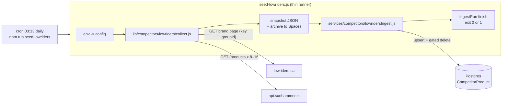
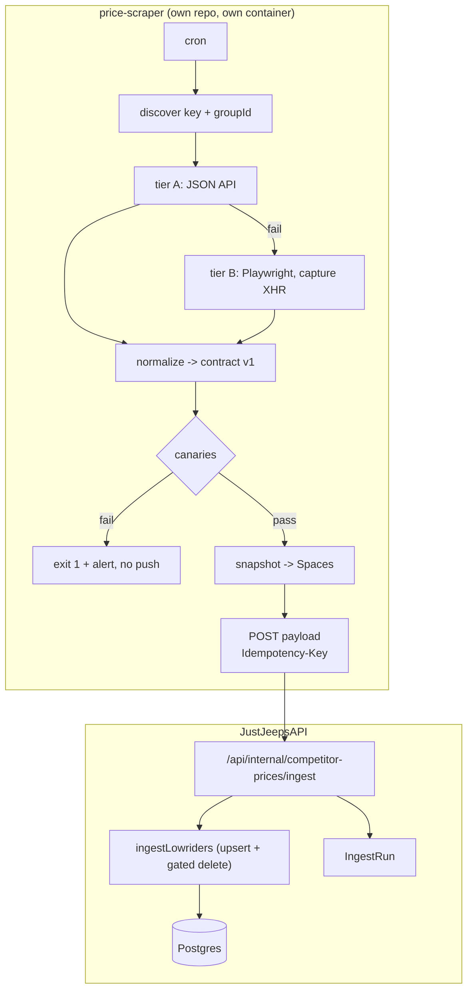

# DD-018: Lowriders Competitor Prices (Rough Country)

## Document Information

| Attribute | Value |
|-----------|-------|
| Version | 1.0.0 |
| Status | Proposed (spec, not implemented) |
| Created | 2026-09-17 |
| Last Updated | 2026-09-17 |
| Author | Ricardo Tassio, with Claude Code |
| Parent PRD | [competitor-price-tracking-prd.md](../prd/competitor-price-tracking-prd.md) |
| Related | [DD-006 Competitor Price Tracking](dd-006-competitor-price-tracking.md), [DD-015 Web Scraping](dd-015-web-scraping.md), [DD-018 research](dd-018-research-scraping-approaches.md) |
| Dependencies | lowriders.ca public listing, PartsLogic search API (api.sunhammer.io) |
| Complexity Level | Medium |

---

## 1. Overview

### 1.1 Purpose

Add **Lowriders** (https://www.lowriders.ca/) as a competitor and capture their prices for **Rough Country** SKUs, so the pricing screen and the Excel export show a Lowriders column next to the other competitors.

Request from Allison and Jacob (2026-09-17): add Lowriders to Prisma as a competitor, take their prices for Rough Country SKUs only, start from their Rough Country brand page (`https://www.lowriders.ca/b-90296-rough-country.html?facet-brands=90296`), the SKU is the first token of the product title, and when an item is discounted we must store the discounted price.

### 1.2 Scope

**In scope**
- Collector for the Lowriders Rough Country listing (all 7,700+ items).
- Matching Lowriders part numbers to our `RC-*` products.
- Writing `CompetitorProduct` rows for the competitor named `Lowriders`, with the effective (discounted) price.
- Deleting Lowriders rows for parts that disappeared from their listing, only after a healthy run.
- A migration adding `updated_at` and two indexes to `CompetitorProduct`.
- Daily cron job, run history, log and snapshot archive, failure e-mail.
- Tests with fixtures, no network, no database.
- Removal of the old ParseHub-based Lowriders fetch.

**Out of scope**
- Other brands on lowriders.ca (the collector takes a brand id, so it is a config change later).
- Price history table. A run snapshot is archived instead.
- A `competitor_regular_price` column. The regular price travels in the snapshot only.
- Any change to the look of existing screens. The optional front-end change is a link, nothing else.
- Fixing the other ParseHub scrapers or their shared key (flagged, not done here).
- Moving the scraper out of this repo. Section 12 prepares that discussion.

### 1.3 Summary of the decision

The product list on lowriders.ca is not in the HTML. It is rendered in the browser by a React widget that calls a JSON search API. The new scraper calls that same API over plain HTTP: 8 to 16 requests cover the whole Rough Country catalog, with prices already typed. No browser, no proxy, no paid service.

---

## 2. Target analysis (verified 2026-09-17)

### 2.1 The site

| Fact | Evidence |
|------|----------|
| Platform | `server: wsm` header (Web Shop Manager, automotive e-commerce platform) |
| Protection | None observed. No Cloudflare, Akamai, Sucuri or Imperva headers. Plain `curl` with a Chrome User-Agent gets HTTP 200 and 144 KB of HTML on the first try. |
| robots.txt | Disallows only `/cart.html`, `/checkout`, `/account.html`, `/account/`, `/wishlist`, `/search.html`, `/pl-search.html`. Brand pages (`/b-…`) and product pages (`/i-…`) are allowed. Sitemap index published. |
| Terms and Conditions | Cover returns and restocking only. No clause on automated access, robots or data mining. |
| Listing HTML | Zero `application/ld+json`, zero `PART #`, zero product rows. The container `#pl-search-page-container` is filled at runtime by `@partslogic/ui@1.6.2` (React 17 UMD from jsDelivr). |

This is why DOM-based scrapers fail on this site: they read an empty container and report "0 products" without any error. No anti-bot system is involved.

### 2.2 The API the widget uses

The brand page inlines the widget configuration:

```html
window.PartslogicUi.config({ API_KEY: "0353c503-…" });
window.ReactDOM.render(window.React.createElement(ProductListWrapper, {groupId: 61039}), …);
```

The widget bundle defines the endpoint and the auth header:

```js
API_URL: "https://api.sunhammer.io"
fetch(`${API_URL}/products?…`, { headers: { "sunhammer-api-key": API_KEY } })
```

Verified requests (all HTTP 200):

| Request | Result |
|---------|--------|
| `GET /products?brands=90296&limit=2&page=1` | `total: 7747`, every item `brand_name: "Rough Country"` |
| `…&limit=500&page=1` and `page=2` | 500 + 500 items, zero overlap of `id` |
| `…&limit=1000&page=1` | 1000 items, 640 KB, 1.6 s |
| `…&q=63470` | exact item first, then similar part numbers |
| `…&sku=63470` | `total: 0` (the `sku` param is not a lookup) |
| Same request without the key header | HTTP 404 `{"message":"The api key does not exist with that configuration"}` |
| Same request without `Origin`/`Referer` | 200 (no origin check) |

No rate-limit headers were returned. The API runs behind an AWS load balancer (`AWSALB*` cookies) with `access-control-allow-origin: *`.

Whole catalog: `ceil(7747 / 1000) = 8` requests at `limit=1000`, or 16 at `limit=500`.

### 2.3 Item shape

Fields per item: `id, availability, availability_remarks, brand_name, condition, dealerid, fitment_applicability, has_options, image_url, inventory, price, qty, rating_count, remarks, sale, sale_hidden, stockid, tag, title, url`.

| Field | Meaning | Notes |
|-------|---------|-------|
| `price` | Regular price, CAD, number | Never 0 in 1,000 sampled items |
| `sale` | Discounted price, number | `0` when there is no discount. 983 of 1,000 sampled items had a sale price |
| `stockid` | Retailer SKU, `RCS-<part>` | 100% of sampled Rough Country items carry the `RCS-` prefix. **This is the matching key** |
| `dealerid` | Manufacturer part number | Lossy: `"330.2"` where `stockid` is `RCS-330.20` and the title starts with `330.20`. Last-resort fallback only |
| `title` | `<part> | <description>` | Starts with the part number in 499 of 500 sampled items |
| `url` | `https://lowriders.ca/i-<id>?` | Product page, stored as `product_url` |
| `availability` | `Available` or `Inventory` | Kept in the snapshot, not written to the database |
| `inventory`, `qty` | Always 0 in samples | Not usable |

Check against the screenshots in the request (regular / discounted):

| Part | Screenshot | API `price` / `sale` |
|------|-----------|----------------------|
| 63470 | $939.95 / $846.65 | 939.95 / 846.65 |
| 28230RED | $829.95 / $745.61 | 829.95 / 745.61 |
| 52940 | $1,639.95 / $1,477.91 | 1639.95 / 1477.91 |
| 22932 | $2,449.95 / $2,210.20 | 2449.95 / 2210.2 |

Effective price rule: `sale > 0 ? sale : price`.

---

## 3. What exists today and what is reused

### 3.1 Existing scrapers (see DD-015 and the audit summary)

| Scraper | Technique | Problem for this target |
|---------|-----------|-------------------------|
| MetalCloak | Puppeteer, headful, human solves CAPTCHA | Cannot run unattended |
| Parts Engine | puppeteer-extra + stealth (plugin unmaintained since 2023), hardcoded macOS Chrome path | Cannot run in the Docker image; selectors would read an empty list here |
| Stinger | Puppeteer headless, good retry and jitter helpers, CSV only | No database integration |
| ParseHub feeds (TDOT, Parts Engine, Northridge, Lowriders, Omix) | Hosted scraping service, key hardcoded in five files | Paid third party, nobody maintains the projects, key in git |

Common to all: nothing is scheduled in `config/cron-jobs.js`, none records an `IngestRun`, "0 products" is a green run, no tests, and sale prices are handled wrongly or not at all.

The current Lowriders path is `prisma/seeds/api-calls/lowriders.js` (ParseHub) feeding `prisma/seeds/seed-individual/seed-lowriders.js` (`npm run seed-lowriders`). It already matches `Product { jj_prefix: "RC", searchable_sku }` and writes competitor id 5 row by row. It is commented out of `seed-all.js` and has no cron.

### 3.2 Reused as is

| Piece | Location | Use |
|-------|----------|-----|
| `withRetry(fn, label, { maxRetries, baseDelayMs })` | `lib/ingest/withRetry.js` | Retry each page request with quadratic backoff |
| `startRun(feed, { sourceKind, sourceRef, startedBy })` and `run.finish({ status, counts, error })` | `lib/ingest/ingestRun.js` | One `IngestRun` row per execution plus an Axiom `ingest_run` event |
| Batched upsert SQL with `jsonb_to_recordset` | `prisma/seeds/seed-individual/seed-tdot.js:136-192` | Template for the `CompetitorProduct` upsert |
| `createLogArchive().archiveFile({ filePath, command, startedAt, status, source, extension: 'json' })` | `services/logArchive/logArchiveService.js` | Archive the run snapshot to DO Spaces |
| Cron job definition pattern and `verify-cron` | `config/cron-jobs.js`, `scripts/verify-cron-scripts.js` | Schedule and validate the job |
| Command gate (defer, never drop) and cron notifications | `lib/cron/commandGate.js`, `server.js` cron runner | Overlap handling and failure e-mail |
| Prisma singleton | `lib/prisma.js` | Used only by the thin runner |
| Test conventions | `test/lib/**` | `node:test`, injected stubs, no network |

### 3.3 Replaced

- `prisma/seeds/api-calls/lowriders.js`: deleted (ParseHub, hardcoded key `t0UjHTnrieK_`, fetch at import time).
- `prisma/seeds/seed-individual/seed-lowriders.js`: rewritten as a thin runner. The npm script name stays.

---

## 4. Approaches considered

| # | Approach | Requests per run | Verdict |
|---|----------|------------------|---------|
| 1 | **PartsLogic JSON API** (what the widget itself calls) | 8 to 16 | **Chosen.** Typed data, no browser, no proxy, zero cost. Risk: undocumented third-party API and a key that can rotate. Mitigated by re-reading the key each run, canaries and a fallback tier. |
| 2 | Headless browser over the 388 listing pages | 388 page renders | Rejected. Slow, ~1 GB RAM, waits on React, breaks on any class rename. Same failure class as today. |
| 3 | Sitemap, then each `/i-…html` product page over HTTP | ~7,700 | Documented fallback if the API is ever closed. Unambiguously allowed by robots.txt, but 480 times more requests and HTML parsing per page. |

The research report (DD-018 research) presents both sides with sources: stealth browsers and paid unblockers make sense against Cloudflare, DataDome or Akamai. This site has none of them.

---

## 5. Architecture

Thin script, then service, then pure library. The library has no Prisma, reads no `process.env`, and uses the global `fetch` (Node 20). It can be moved to an external service unchanged.



### 5.1 Modules

| Path | Exports | Responsibility |
|------|---------|----------------|
| `lib/competitors/lowriders/discoverConfig.js` | `parseWidgetConfig(html)`, `discoverConfig({ fetch, brandPageUrl, fallbackApiKey, userAgent, timeoutMs, logger })` | Read `API_KEY` and `groupId` from the brand page each run. Returns `{ apiKey, groupId, source: 'page' \| 'env' }`. Throws `LOWRIDERS_CONFIG_NOT_FOUND` when neither the page nor the env provides a key. Never logs the key. |
| `lib/competitors/lowriders/partslogicClient.js` | `createPartslogicClient({ fetch, apiKey, baseUrl, userAgent, timeoutMs })` with `fetchPage({ brandId, page, limit })` | One page request with `sunhammer-api-key`, `AbortSignal.timeout`. Returns `{ list, total }`. HTTP 404 throws `LOWRIDERS_KEY_REJECTED`. Errors are described as `{ status, code, message, url }` with no header values. |
| `lib/competitors/lowriders/normalize.js` | `normalizeItem(raw)`, `dedupeItems(items)`, `buildPayload({...})` | Item to contract row (section 6). `competitorSku = stockid.replace(/^RCS-/i, '')`, fallback to the title prefix before ` | `, then `dealerid`. `effectivePrice = sale > 0 ? sale : price`. Duplicates keep the lowest effective price and are counted. |
| `lib/competitors/lowriders/canaries.js` | `checkCollection({ items, reportedTotal, invalidCount, duplicateCount, thresholds })`, `checkStaleFloor({ matched, existingCount, thresholds })` | Pure checks, section 7. |
| `lib/competitors/lowriders/collect.js` | `collectLowriders({ fetch, config, logger, sleep, now, withRetry })` | Orchestrates discover, paginate (concurrency 1, jitter), normalize, canaries, payload. Throws `LowridersCollectError` carrying `failures[]`. |
| `lib/competitors/skuMatch.js` | `canonicalPartNumber(s)`, `buildProductIndex(products)`, `matchPartNumber(index, partNumber)` | Brand-agnostic matcher, section 8. |
| `services/competitors/lowridersIngest.js` | `ingestLowriders({ prisma, payload, thresholds, logger, dryRun })` | Resolve competitor, load RC products, match, batched upsert, gated stale delete. Returns `{ competitorId, counts, matchRate, staleFloor, unmatchedSample, ambiguousCount }`. Prisma is injected, never required. |
| `prisma/seeds/seed-individual/seed-lowriders.js` | (script) | Build config from env, `startRun('lowriders', { sourceKind: 'api' })`, collect, write and archive the snapshot, ingest, `run.finish`, set `process.exitCode`. Supports `--dry-run`. |

### 5.2 Runner behaviour

1. Build `config` from env (section 9). Missing `SCRAPER_CONTACT_EMAIL` is a startup error.
2. `startRun('lowriders', { sourceKind: 'api', sourceRef: brandPageUrl, startedBy: process.env.INGEST_TRIGGER || 'cron' })`.
3. `collectLowriders(...)`. On `LowridersCollectError`: log every failure code, `run.finish({ status: 'failed', error })`, exit 1. Nothing is written.
4. Write the payload to `prisma/seeds/logs/lowriders/latest-snapshot.json` (overwritten each run) and `archiveFile` it to Spaces (best effort, a failed upload is a warning).
5. `ingestLowriders(...)`. With `--dry-run` it matches and reports but issues no writes.
6. `run.finish({ status: 'success', counts })`, exit 0.
7. Any other error: `run.finish({ status: 'failed', error })`, exit 1. `prisma.$disconnect()` in `finally`.

Network manners: concurrency 1, `LOWRIDERS_PAGE_DELAY_MS` plus 0 to 500 ms of random jitter between pages, request timeout 30 s, `User-Agent: JustJeepsPriceMonitor/1.0 (+<SCRAPER_CONTACT_EMAIL>)`. Each page goes through `withRetry` with 4 attempts and a 1 s base. A 404 on any page triggers exactly one re-discovery of the key; a second 404 fails the run.

---

## 6. Payload contract (v1)

This is what the collector produces, what the snapshot stores, and the exact body an external scraper would POST to the API later (section 12).

```json
{
  "schemaVersion": 1,
  "source": "lowriders",
  "competitor": { "name": "Lowriders", "website": "https://www.lowriders.ca/" },
  "brand": { "name": "Rough Country", "sourceBrandId": 90296 },
  "runId": 123,
  "capturedAt": "2026-09-18T07:13:00.000Z",
  "collection": {
    "reportedTotal": 7747, "pagesFetched": 16, "pageSize": 500,
    "configSource": "page", "invalidCount": 0, "duplicateCount": 0
  },
  "items": [
    {
      "sourceId": 23910051,
      "stockId": "RCS-63470",
      "competitorSku": "63470",
      "partNumber": "63470",
      "title": "63470 | 2.5 Inch Leveling Kit | Spacers | V2 | Jeep Gladiator JT 4WD (20-22)",
      "brandName": "Rough Country",
      "regularPrice": 939.95,
      "salePrice": 846.65,
      "effectivePrice": 846.65,
      "currency": "CAD",
      "url": "https://lowriders.ca/i-23910051?",
      "availability": "Available"
    }
  ]
}
```

Database mapping: `competitor_sku = competitorSku`, `competitor_price = effectivePrice`, `product_url = url`, `product_sku` from the matcher. `salePrice` is `null` when the API returns `sale: 0`.

---

## 7. Canaries and fail-loud rules

Hard canaries run inside `collectLowriders`, before any database write. Any failure makes the run `failed` with exit 1, and the cron failure e-mail goes out.

| Code | Condition | Default threshold |
|------|-----------|-------------------|
| `CONFIG_NOT_FOUND` | No key or `groupId` on the page and no env fallback | n/a |
| `TOTAL_MISMATCH` | Items collected below `reportedTotal * minCollectRatio` | 0.9 |
| `BELOW_MIN_ITEMS` | Items collected below `minItems` (guards a wrong `total`) | 5000 |
| `BRAND_IMPURE` | Items whose `brand_name` is not `Rough Country` above ratio | 0.5% |
| `PRICE_INVALID_RATIO` | Items dropped for `effectivePrice <= 0` or `> maxPrice` above ratio | 2%, `maxPrice` 20000 |
| `DUPLICATE_STOCKIDS` | Duplicate `competitorSku` after dedupe above ratio | 1% |

Pagination stops when `page * limit >= total` or a page comes back short, with a hard cap of `ceil(total / limit) + 1` pages.

Soft floor, evaluated in the ingest service, gates only the stale delete:

- `matched >= LOWRIDERS_MIN_MATCHED`, and
- no rows stored for this competitor yet, or `matched >= 80% of the rows already stored for it` (default `matchDropRatio`).

When the floor fails, upserts are still applied, the delete is skipped, `rowsMarkedStale` records how many stale rows were kept, and the log prints `[lowriders] STALE DELETE SKIPPED: <reason>`. The run still counts as `success`.

---

## 8. Matching Lowriders part numbers to our products

Candidate products: `Product` where `jj_prefix = 'RC'`, `searchable_sku` is not null, not empty and does not end with `-` (same exclusion as `partsengine-batch-runner.js`). Selected fields: `sku, searchable_sku, status`.

Our `searchable_sku` is the manufacturer part number (confirmed by `seed-roughCountry.js`, which matches the vendor feed's `sku` column to it). `Product.sku` is `RC-` plus that value.

Canonical form: `canonicalPartNumber(s) = String(s).trim().toUpperCase().replace(/[-_\s]/g, '')`. Dots are kept so `330.20` and `33020` never collide. `2620_RED` (ours), `2620-RED` (Parts Engine) and `28230RED` (Lowriders) all reach the same form.

`matchPartNumber` returns `{ status: 'matched' | 'unmatched' | 'ambiguous', sku, candidates }`. When more than one product shares a canonical form, the tie-break is deterministic: raw uppercase equality with `searchable_sku`, then `status === 1`, then the smallest `sku`. Ambiguous matches are written and logged with all candidates (first 50), and counted.

Unmatched items count as `skipped`; the first 25 are logged as `[lowriders] unmatched sample: …`. `matchRate = matched / items.length` is printed by every run and by `--dry-run`. The first dry run in production sets the `LOWRIDERS_MIN_MATCHED` baseline. The expected match rate is unknown until then.

The `dealerid` field is never used for matching.

---

## 9. Database and configuration

### 9.1 Migration

`prisma/migrations/20260918000000_competitor_product_updated_at_index/migration.sql`:

```sql
-- DD-018 Lowriders ingest: row freshness for the gated stale delete,
-- and the two lookups the competitor seeds make.
ALTER TABLE "CompetitorProduct"
  ADD COLUMN "updated_at" TIMESTAMP(3) NOT NULL DEFAULT CURRENT_TIMESTAMP;
CREATE INDEX "CompetitorProduct_product_sku_idx"
  ON "CompetitorProduct"("product_sku");
CREATE INDEX "CompetitorProduct_competitor_id_competitor_sku_idx"
  ON "CompetitorProduct"("competitor_id", "competitor_sku");
```

`prisma/schema.prisma`, model `CompetitorProduct`: add `updated_at DateTime @default(now()) @updatedAt`, `@@index([product_sku])`, `@@index([competitor_id, competitor_sku])`. Locally only `npx prisma validate && npx prisma generate`. Never `migrate dev`. The migration is applied in production by the container entrypoint.

No unique constraint yet. Legacy rows may contain duplicates; a unique constraint needs an audit first and is a separate change.

### 9.2 Upsert

Same two statements as `seed-tdot.js:136-192`, key `(competitor_id, competitor_sku)`, batches of 2000 rows inside `prisma.$transaction([update, insert])`. The UPDATE also sets `updated_at = CURRENT_TIMESTAMP`; the INSERT relies on the column default. The row counts returned by the two `$executeRawUnsafe` calls give `updated` and `inserted`.

Keying on the bare part number keeps the legacy Lowriders rows (the ParseHub seed also keyed on the part number) updating in place instead of duplicating them.

### 9.3 Stale delete

Single statement after all batches, only when the soft floor passed:

```sql
DELETE FROM "CompetitorProduct" cp
WHERE cp.competitor_id = $1
  AND NOT EXISTS (
    SELECT 1 FROM jsonb_array_elements_text($2::jsonb) s(sku)
    WHERE s.sku = cp.competitor_sku
  );
```

`$2` is the JSON array of every `competitor_sku` written in this run (matched items only, about 7,700 strings). Rows for parts that are listed but no longer match one of our products are removed too, because a row we cannot match is a row we cannot trust.

### 9.4 Competitor row

The service resolves the competitor by name: `findFirst({ where: { name: { equals: 'Lowriders', mode: 'insensitive' } } })`, and creates `{ name: 'Lowriders', website: 'https://www.lowriders.ca/' }` when missing. The id is never hardcoded. The name must stay exactly `Lowriders` because the front-end export (`Items.jsx`) and `scripts/export-all-products-excel.js` match on that string.

`prisma/seeds/hard-code_data/competitors_data.js` is backfilled with TDOT and Lowriders after Parts Engine, in that order, so a fresh environment reproduces the production ids (4 and 5). `seed-hard-code.js` currently has its competitor seeding disabled (the `competitorData` require is commented out), so the backfill documents the production ids for a fresh environment and is not applied automatically. Before re-enabling it, confirm the production names of ids 4 and 5, because `seed-hard-code` matches by name and a different spelling would create a duplicate row.

### 9.5 Cron and environment

Own cron job, not part of `seed-all` (independent failure e-mail, own log slice, and it is the piece that leaves the repo later).

`config/cron-jobs.js` (append only, the file has unrelated uncommitted edits):

```js
// Lowriders competitor prices (public JSON API, 8 to 16 requests): opt-in,
// off the orders-delta grid, hours before the 07:32 seed-all.
const lowridersSeedEnabled = process.env.CRON_SEED_LOWRIDERS_ENABLED === 'true';
const lowridersSeedSchedule = process.env.CRON_SEED_LOWRIDERS_SCHEDULE || '13 3 * * *';
```

Job entry: `{ enabled, schedule, command: 'seed-lowriders', jobName: 'Lowriders Competitor Prices', logPrefix: 'Lowriders competitor prices', reportLogFile: 'prisma/seeds/logs/seed-lowriders.log' }`, plus both constants re-exported in `config`.

`config/deploy.yml`: `CRON_SEED_LOWRIDERS_ENABLED: "false"` and `CRON_SEED_LOWRIDERS_SCHEDULE: "13 3 * * *"` in `env.clear`. `SCRAPER_CONTACT_EMAIL` (required) and `LOWRIDERS_PARTSLOGIC_API_KEY` (fallback, may be empty) in `env.secret`, and both lines must exist in `.env.production` before the next deploy, because Kamal aborts on a missing secret. `LOWRIDERS_MIN_MATCHED` in `env.clear`.

`.env.example` block:

| Variable | Default | Purpose |
|----------|---------|---------|
| `CRON_SEED_LOWRIDERS_ENABLED` | `false` | Turn the job on |
| `CRON_SEED_LOWRIDERS_SCHEDULE` | `13 3 * * *` | Cron expression |
| `LOWRIDERS_PARTSLOGIC_API_KEY` | empty | Fallback when the page no longer exposes the key |
| `SCRAPER_CONTACT_EMAIL` | required | Goes in the User-Agent |
| `LOWRIDERS_BRAND_PAGE_URL` | brand page URL | Where the key is read from |
| `LOWRIDERS_BRAND_ID` | `90296` | `brands=` filter |
| `LOWRIDERS_PAGE_SIZE` | `500` | `limit=` per request (1000 verified to work) |
| `LOWRIDERS_PAGE_DELAY_MS` | `750` | Base delay between pages |
| `LOWRIDERS_REQUEST_TIMEOUT_MS` | `30000` | Per request |
| `LOWRIDERS_MIN_COLLECT_RATIO` | `0.9` | `TOTAL_MISMATCH` |
| `LOWRIDERS_MIN_ITEMS` | `5000` | `BELOW_MIN_ITEMS` |
| `LOWRIDERS_MAX_PRICE` | `20000` | Price sanity cap |
| `LOWRIDERS_MIN_MATCHED` | `500` until measured | Stale delete floor |
| `LOWRIDERS_MATCH_DROP_RATIO` | `0.8` | Stale delete floor versus previous run |

No `config/feeds.js` entry: that registry is file-centric and "Run now" would try to materialize a file. Runs are visible at `GET /api/ingest/runs?feed=lowriders` and the job appears in the cron panel.

---

## 10. Observability

- `IngestRun` feed `lowriders`: `sourceRowCount = items.length`, `rowsInserted`, `rowsUpdated`, `rowsDeleted`, `rowsSkipped = unmatched + invalid`, `rowsMarkedStale = stale rows kept when the floor failed`, `error` on failure. A `--dry-run` records its own `IngestRun` with `startedBy = 'dry-run'` and zero counts, since nothing is written.
- Log lines, one per step, prefixed with the ISO timestamp and `[lowriders]`:
  - `step=collect pages=16 items=7712 reportedTotal=7747 configSource=page`
  - `step=match matched=… unmatched=… ambiguous=… matchRate=0.87`
  - `step=upsert inserted=… updated=…`
  - `step=stale deleted=… floor=passed` or `step=stale deleted=0 floor=skipped STALE DELETE SKIPPED: <reason> (<n> rows kept)`
  - `CANARY FAILED code=… detail=…`
- Snapshot archive key: `logs/cron/seed-lowriders/YYYY/MM/DD/<stamp>-<status>.json` in DO Spaces. The `.log` slice is archived by the cron runner as for every job.
- Failure alert: exit 1 reaches the existing cron notification e-mail.

---

## 11. Tests

Fixtures in `test/lib/competitors/fixtures/`:
- `brand-page.html`: the two inline script snippets with a fake key and `groupId`.
- `products-page.json`: five items: a regular item, a sale item, the `330.2` / `RCS-330.20` case, `28230RED`, and one with `price: 0`.

| Suite | Covers |
|-------|--------|
| `discoverConfig.test.js` | Key and `groupId` parsed; page without config falls back to env; neither throws `LOWRIDERS_CONFIG_NOT_FOUND`; the key never appears in error messages |
| `normalize.test.js` | Effective price rule, `RCS-` strip, `330.20` preserved, dedupe keeps the lowest price, invalid price returns null with a reason |
| `canaries.test.js` | Every code fires just past its threshold and passes just under it; `checkStaleFloor` with and without a previous run |
| `skuMatch.test.js` | `2620_RED`, `2620-RED`, `28230RED` style variants match; `330.20` and `33020` do not; tie-break order; `-` suffixed products excluded |
| `collect.test.js` | Fetch stub serving two pages; total mismatch aborts before payload; a 404 triggers one re-discovery then fails; `sleep` and `withRetry` injected as no-ops |
| `lowridersIngest.test.js` | Prisma stub records `$transaction` and `$executeRawUnsafe`: batch sizes, `updated_at` present in the UPDATE SQL, competitor created when missing, delete issued only when the floor passes, `dryRun` issues no writes, counts returned |

`npm test` must stay green, including `verify-cron` with the new job in `package.json` and `config/deploy.yml`.

---

## 12. Later: moving the scraper out of the API

This section prepares the discussion. It records options and a recommendation, not a decision.

**What stays in the API repo**
- `services/competitors/lowridersIngest.js`, the migration, the `IngestRun` bookkeeping.
- A future route `POST /api/internal/competitor-prices/ingest` that validates `schemaVersion`, checks an `Idempotency-Key` header (store key and result in `SyncState` or a small table), calls `ingestLowriders({ prisma, payload })`, and answers 422 on an unknown schema version.

**What moves**
- `lib/competitors/lowriders/*` and `lib/competitors/skuMatch.js` as written: no Prisma, no env reads, global `fetch`. The external worker runs the collector and POSTs the section 6 payload with `Idempotency-Key = sha256(payload)`.
- The seed script and the cron entry are then deleted.

**Hosting options**

| Option | Pros | Cons |
|--------|------|------|
| DigitalOcean App Platform Job on a cron schedule | Billed only while running, fails independently of the API, no Chromium in the API image ever again | New deploy target, cloud IP reputation matters for future targets that check it |
| Second Kamal container on the existing droplet | Same tooling as today | Shares the host with the API; a wedged scraper still competes for RAM |
| GitHub Actions scheduled workflow | Zero infrastructure | Azure IP ranges are the most flagged; secrets in CI; not for a future Cloudflare target |

**Fallback tiers to keep documented**: (A) JSON API, (B) Playwright loading the brand page and capturing the `api.sunhammer.io/products` network responses (never the DOM), (C) a managed unblocker only if a future competitor sits behind a JS challenge. The research report has the cost comparison.



---

## 13. Risks and open questions

| Risk or question | Handling |
|------------------|----------|
| The widget key rotates or the widget is upgraded past `@partslogic/ui@1.6.2` and the inline config changes shape | Key re-read every run; env fallback; `CONFIG_NOT_FOUND` fails loudly; the regexes are tested against a fixture |
| `api.sunhammer.io` starts rate limiting or blocks the droplet IP | Unknown, untested on purpose. Volume is 8 to 16 requests a day with jitter; failure is loud; tier B exists |
| `total` drifts between pages during a run | `TOTAL_MISMATCH` tolerates 10% |
| Unknown match rate between Lowriders part numbers and our RC catalog | `--dry-run` first in production; `LOWRIDERS_MIN_MATCHED` set from the measurement |
| Legacy Lowriders rows with a wrong `product_sku` | Self-heal on the first UPDATE; rows for parts no longer listed are removed on the first run that passes the floor |
| PartsLogic terms for API consumers were not located | Re-check periodically; keep volume trivial; identify honestly in the User-Agent |
| TDOT website string for the `competitors_data.js` backfill | Not in the repo. Confirm the production `Competitor` row before writing it |
| Front-end deep link | Optional one-line branch in `ProductTable.jsx`: `else if (competitorName.includes('lowriders') && competitorProduct.product_url) link = competitorProduct.product_url;`. No restyle |
| Regular price is not stored | Lives in the snapshot; a `competitor_regular_price` column is a later decision |
| ParseHub key: the deleted `lowriders.js` was the last file carrying it in the tree | Rotate the key anyway because it lived in git history |

---

## 14. Build order

1. Fixtures under `test/lib/competitors/fixtures/`.
2. `normalize.js` with its test.
3. `discoverConfig.js` with its test.
4. `skuMatch.js` with its test.
5. `canaries.js` with its test.
6. `partslogicClient.js` and `collect.js` with `collect.test.js`.
7. Migration folder and `schema.prisma` edit; `npx prisma validate && npx prisma generate`.
8. `services/competitors/lowridersIngest.js` with its test.
9. Rewrite `seed-lowriders.js`; delete `prisma/seeds/api-calls/lowriders.js`.
10. `config/cron-jobs.js`, `config/deploy.yml`, `.env.example`; `npm test`.
11. `competitors_data.js` backfill.
12. `SCRAPER_CONTACT_EMAIL` and `LOWRIDERS_PARTSLOGIC_API_KEY` must exist in `.env.production` before the next deploy, because Kamal aborts on a missing secret. Deploy (migration applies). Run `npm run seed-lowriders -- --dry-run` in production. Set `LOWRIDERS_MIN_MATCHED`. Enable the cron.
13. Optional front-end link branch, deployed by hand as usual.

---

## 15. Change History

| Version | Date | Change |
|---------|------|--------|
| 1.0.0 | 2026-09-17 | Initial spec |
| 1.0.2 | 2026-09-19 | The upsert only rewrites a row whose price, link or product changed, and the run reports how many matched rows were left untouched. The first nightly run showed all 7763 collected items identical to the previous day while every one of the 7000 matched rows was rewritten. |
| 1.0.1 | 2026-09-18 | First production dry-run failed TOTAL_MISMATCH and DUPLICATE_STOCKIDS: the default "Recommended" order is not stable between pages (7763 raw, 6134 unique). Every page request now sends `sort=id:asc` (7763 of 7763 unique). |

## 16. References

- Request thread (WhatsApp, 2026-09-17) and screenshots of the Lowriders listing.
- [DD-018 research: web scraping approaches](dd-018-research-scraping-approaches.md).
- `docs/design/dd-015-web-scraping.md`, `docs/design/dd-006-competitor-price-tracking.md`.
- `lib/ingest/withRetry.js`, `lib/ingest/ingestRun.js`, `prisma/seeds/seed-individual/seed-tdot.js`, `services/logArchive/logArchiveService.js`.
