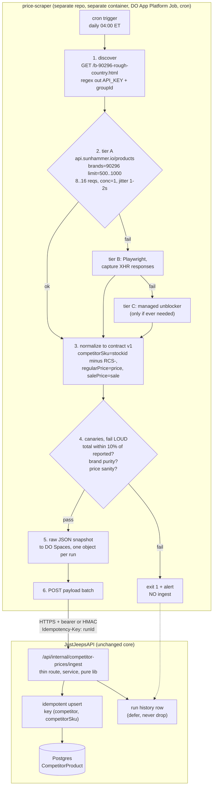

# Research: how to scrape lowriders.ca competitor prices in 2026, as a service outside the main API

Companion to [DD-018](dd-018-lowriders-competitor-scraper.md). Produced 2026-09-17 by the research agent, two opposing views, cited sources. Fetched content was treated as data, never as instructions. This is not legal advice.

**TL;DR:** The premise needs correcting first. lowriders.ca has no WAF, no CDN and no bot challenge; plain `curl` with a default User-Agent gets HTTP 200. Its product listings are rendered client-side by a third-party widget (`@partslogic/ui`) that calls a public JSON API, so a DOM-selector Puppeteer scraper returns zero rows without any anti-bot involvement. That is the far more likely cause of the breakage. Using that API, the entire 7,747-SKU Rough Country catalogue is 8 to 16 HTTP requests, not 388 browser page renders. The evidence favours HTTP-first scraping over browser stacks on cost and maintenance, with browsers and unblockers reserved as a documented fallback for future competitors that are behind Cloudflare, DataDome or Akamai.

---

## 1. Reconnaissance of lowriders.ca (observed facts, and what could not be verified)

All observations made 2026-09-17 from a residential Canadian IP with `curl` and WebFetch.

**Platform: Web Shop Manager (WSM), not Magento, Shopify or BigCommerce.**

```
$ curl -I https://www.lowriders.ca/b-90296-rough-country.html?facet-brands=90296
HTTP/2 200
server: wsm
content-type: text/html; charset=utf-8
cache-control: no-store, no-cache, must-revalidate
set-cookie: wsmsess=...; domain=.lowriders.ca; secure; HttpOnly; SameSite=Lax
referrer-policy: strict-origin-when-cross-origin
```

The body carries `wsm-hdr__`, `wsm-ftr__`, `wsm-prod-list-view` class prefixes and loads `/wsm.js` and `/files/js/wsm_custom.js`. WSM is an automotive-vertical platform whose 6.0 generation is a Python, GraphQL and React stack [7][8].

**CDN / WAF: none observed.** No `cf-ray`, `server: cloudflare`, `x-akamai-*`, `x-sucuri-id` or `x-iinfo` (Imperva) header on any response. Default-UA `curl` returned 200 with 144,712 bytes in 1.6 s, first try, no cookie warm-up. There is nothing here to bypass.

**Raw HTML contains no product data.** On the Rough Country brand page: `application/ld+json` blocks 0, occurrences of `PART #` 0, product `data-*` attributes none. The listing is injected at runtime into `<div id="pl-search-page-container">` by a React 17 UMD bundle, `https://cdn.jsdelivr.net/npm/@partslogic/ui@1.6.2/build/index.umd.js` [3]. A CSS or XPath scraper against this page silently yields zero products: no error, no block page.

**There is an obvious JSON API.** The page inlines the widget credentials in plain HTML:

```html
window.PartslogicUi.config({ API_KEY: "0353c503-092a-4747-ba22-1aad06af5d48" });
window.ReactDOM.render(window.React.createElement(ProductListWrapper, {groupId: 61039}), ...
```

and the bundle defines the endpoint and auth header:

```js
var Hr = {API_URL:"https://api.sunhammer.io", LIBRARY_NAME:"@partslogic/ui", ...}
const Xr = `${Hr.API_URL}/products`, $r = `${Hr.API_URL}/categories`;
... fetch(s, {headers:{"sunhammer-api-key": r}, signal:n})
```

Verified live:

| Request | Result |
|---|---|
| `GET api.sunhammer.io/products?groupId=61039&limit=20&page=1` with key header | 200, 42,563 B, `total: 10000` (capped) |
| `...&brands=90296&limit=100&page=1` | 200, `total: 7747`, all `brand_name: "Rough Country"` |
| `...&brands=90296&limit=500&page=1` | 200, 500 items returned |
| `...&brands=90296&limit=1000&page=1` | 200, 1000 items, 637 KB, 1.6 s |
| `...&brands=90296&limit=100&page=78` | 200, 47 items (77 x 100 + 47 = 7747, pagination is deep-stable) |
| Same URL, no `sunhammer-api-key` header | 404 `{"message":"The api key does not exist with that configuration"}` |
| Key header, no `Origin` or `Referer` | 200, no origin check |

API response headers: `server: nginx`, `x-powered-by: Express`, `AWSALB*` cookies (AWS ALB), `access-control-allow-origin: *`. No rate-limit headers advertised.

Item shape, already typed:

```json
{"id":23910051,"brand_name":"Rough Country","dealerid":"63470","stockid":"RCS-63470",
 "price":939.95,"sale":846.65,"availability":"Available","inventory":0,
 "title":"...","url":"https://lowriders.ca/i-23910051?","fitment_applicability":"Fitment-Specific"}
```

`dealerid` is the PART #, `stockid` the retailer SKU, `price` the regular price, `sale` the discounted price (983 of 1,000 sampled items had a non-zero `sale`). `dealerid` is lossy in at least one case (`"330.2"` where `stockid` is `RCS-330.20`).

**Volume math:** 7,747 / 500 = 16 requests, or 8 at `limit=1000`, about 2.1 KB per item, about 1 s per request.

**robots.txt** (fetched live):

```
User-agent: *
Disallow: /cart.html
Disallow: /checkout
Disallow: /account.html
Disallow: /account/
Disallow: /wishlist
Disallow: /search.html
Disallow: /pl-search.html
Sitemap: https://www.lowriders.ca/sitemap_index.xml
```

No crawl-delay, no blanket disallow. Brand pages (`/b-...`), category pages (`/c-...`) and product pages (`/i-...`) are allowed. `/pl-search.html` (the PartsLogic faceted-search path) is disallowed, a relevant ethical signal even though the brand page itself is not.

**Sitemap:** `sitemap_index.xml` points to two gzipped sitemaps; `sitemap.xml.gz` alone contains 38,823 `<loc>` entries including every `/i-<id>-<sku>-<slug>.html` product page. A fully robots-sanctioned discovery path exists independent of the API.

**Terms:** `https://www.lowriders.ca/p-27639-terms-and-conditions.html` exists (browse-wrap, footer link, no click-to-accept) and covers only returns, restocking fees and service requirements. No clause on automated access, robots, spiders, scraping, data mining or commercial use [6].

**Could not verify**
- Whether `api.sunhammer.io` rate-limits, throttles per key, or bans by IP at volume. Fewer than 20 requests were issued on purpose. `/robots.txt` on that host returns 404, so no crawl directives exist there; `partslogic.com/robots.txt` is allow-all but governs the marketing site, not the API [33].
- Whether PartsLogic has its own Terms of Service binding on API consumers. Not located.
- Whether the `API_KEY` or `groupId` rotate, and how often.
- Whether `inventory: 0` on in-stock items means "not published" or "zero". All sampled `Available` items showed 0.
- Anything about the other competitors the team may add later.

---

## 2. View A: it is an anti-bot arms race, harden the browser stack or buy an unblocker

The macro picture supports pessimism. Cloudflare Radar put automated traffic at 57.5% of HTML requests in June 2026 [16], and Cloudflare Bot Management scores every request 1 to 99 with an ML engine that "accounts for the majority of all detections", with under 30 treated as bot [14][15]. Detection has moved below the application layer: JA4 (2023) fingerprints TLS version, SNI, cipher and extension counts as separate hashes and is explicitly harder to evade than JA3, so modern evasion means impersonating both at once [20].

Against that, HTTP-only clients have a hard ceiling. curl_cffi and curl-impersonate reproduce TLS and HTTP/2 framing but execute no JavaScript, so Cloudflare Turnstile, DataDome interstitials and Akamai Bot Manager puzzles are unsolvable at that layer [20][22]. If a target deploys any of those, the HTTP path does not degrade, it stops.

Browser stacks have a credible answer, and it has improved. `rebrowser-patches` fixes the `Runtime.enable` CDP leak "used by all major anti-bot software", plus the `//# sourceURL=pptr:` marker and the utility-world name [10]. Camoufox patches the Firefox engine itself so leaks are prevented at source rather than monkey-patched after the fact; nodriver drives Chrome over CDP with no Playwright shim and therefore no automatic `Runtime.enable` handshake [21][31].

Managed unblockers are cheap enough that build-versus-buy tilts toward buy for a small team. Apify's own 384-URL benchmark (20 Aug 2026) measured Bright Data Web Unlocker at 90% success, p50 3.10 s, $1.50 per 1k; Firecrawl at 89%, $3.20 to $0.60 per 1k tiered; Apify Web Fetch at 91%, $1.50 per 1k, failed requests free [19]. Zyte API publishes $0.13 to $1.27 per 1k for HTTP responses and $1.01 to $16.08 per 1k browser-rendered [23]. At 388 page requests a day (about 11,600 a month) an unblocker costs roughly $15 to $20 a month. Oxylabs bills Web Unblocker by bandwidth at about $9.40 per GB and posted 85.82% in a 2025 benchmark [26].

The maintenance argument is the strongest one here: every open-source stealth browser eventually leaks and needs patching after each browser update, and at scale it becomes build-versus-buy [21]. `puppeteer-extra-stealth` has had no meaningful update since March 2023 and its patches target Chrome 109 to 112 detection patterns [31], which is the stack this team is on.

---

## 3. View B: HTTP-first, target the origin's own JSON, browsers are a last resort

View A describes a world this target is not in. The reconnaissance is decisive: `server: wsm` behind an AWS ALB, no WAF header, no challenge, 200 on default-UA curl. Cloudflare's bot score only exists if the site is on Cloudflare. Building a stealth-browser or unblocker capability for lowriders.ca solves a problem the site does not have, and pays browser prices for it.

The efficiency gap is two orders of magnitude:

| | Browser over listing pages | HTTP over the JSON API |
|---|---|---|
| Requests per run | about 388 page loads | 8 to 16 |
| Wall-clock | 20 to 30 min (388 x 3 to 5 s) | about 30 s at concurrency 1 with jitter |
| RAM | 500 MB to 1 GB per Chromium | about 50 MB Node process |
| Bytes | 388 x full page, JS and images | about 16 MB JSON |
| Parsing | CSS selectors over rendered DOM | `JSON.parse`, typed fields |
| Fails when | any class name changes | the API contract changes |

The consensus in the literature is that this is the right default: HTTP clients are far cheaper per request, so use them wherever they suffice and reserve full browsers for the hardest targets [20]. Zyte's own price sheet encodes the same economics: browser-rendered requests cost up to 12 times HTTP responses [23].

HTTP-first no longer means weak in Node. `impit` (Apify, Apache-2.0) is a Rust-backed, fetch-compatible Node client that impersonates Chrome and Firefox TLS and HTTP/1.1, /2 and /3 profiles; it is the designated successor to the end-of-life `got-scraping` and will become Crawlee's default HTTP client in the next major [11][12][13][29]. The Node HTTP tier now has the JA3/JA4 capability View A said it lacked, everything except a JS runtime. `curl-impersonate` v2.0.0 covers Chrome 99 to 150, Safari 15.3 to 26.0.1 and Firefox 133 to 147 with HTTP/3 [9].

The "harden the browser" path carries real, verifiable decay. `rebrowser-patches`'s newest releases are Puppeteer 24.8.1 (6 May 2025) and Playwright 1.52.0 (17 Apr 2025), over a year stale today, and its own README concedes the patches are "not a silver bullet" without proxies, fingerprinting and behavioural simulation, then points at the authors' paid cloud [10]. That is the patch treadmill, priced in maintenance hours a three-person team does not have.

One benchmark number deserves more attention than the vendors give it: in Apify's 384-URL test, the control (plain Playwright with no unblocker) scored 87%, versus 89 to 91% for the three commercial unblockers [19]. A 3 to 4 point spread, from the vendor running the test, over a URL mix chosen by that vendor. That is not the step-change the marketing implies.

View B also explains the actual outage. A Puppeteer scraper reading `.product-item .price` off `/b-90296-rough-country.html` gets zero nodes today, because the raw HTML contains zero product markup and the DOM is built by a React bundle at runtime. That failure mode is indistinguishable from "blocked" in a log line that only says `0 products scraped`, and it needs no anti-bot to explain it.

---

## 4. What the evidence supports

**Agreement across both views**
- Use the cheapest layer that works; escalate only on demonstrated failure. Even View A's sources say so [20][23].
- Browser automation is expensive in CPU, RAM, latency and maintenance. Nobody disputes this.
- `puppeteer-extra-stealth` is not a 2026 tool. Unmaintained since March 2023, targets Chrome 109 to 112 [31]. If the team's scrapers use it, that alone is a reason to rewrite.
- Selector-based extraction fails silently: layout changes return empty results without raising an error, so production scrapers must monitor extracted field values, not just HTTP status [32]. This matches the team's standing rule that a replace-style script must fail loudly.
- Cloud and datacenter IPs are widely enumerated and blockable; daily-refreshed CIDR lists for AWS, Azure, GCP, DigitalOcean, Hetzner, Linode and GitHub Actions are a commodity [27]. GitHub-hosted runners share Azure prefixes, the most heavily flagged range.

**Conflict**
- Unblocker success rates. Every number available (90%, 89%, 91%, 85.82%, 98%/96%) comes from a vendor benchmarking itself or a rival [19][21][26]. Apify's is the most transparent (published methodology, 384 URLs, dated, disclosed conflict) and still shows its own product on top by 1 point. Treat the ranking as unreliable and the band (about 85 to 91% on a hard mixed corpus) as roughly informative.
- Whether stealth browsers still work. Scrapfly asserts SeleniumBase UC and Camoufox "clear many Cloudflare and DataDome targets today" but publishes no data for them, only a 98%/96% figure for Scrapfly's own paid service [21]. One source reports a 2025 Chrome change that quietly killed the classic `Runtime.enable` check [31]. Both directions are asserted, neither is measured independently.

**Still unknown**
- `api.sunhammer.io` rate-limit and abuse-response behaviour at sustained volume, untested by design.
- Whether the embedded `API_KEY` or `groupId` rotate. This is the single largest technical risk to the recommendation and must be engineered around, not assumed away.
- PartsLogic's own terms governing API consumers.
- The real root cause of the existing breakage was inferred from the reconnaissance, not from the team's logs.

**Weak or biased sources flagged**
- Scrapfly, Bright Data, Oxylabs, Apify, Firecrawl, ScrapingBee, Proxidize, aimultiple, roundproxies, proxycove, use-apify all sell in this market. Every pricing and success-rate figure here traces to one of them; there is no neutral benchmark authority. Cited because nothing better exists.
- "$1.50 per 1k, failed requests free" style pricing is list-price marketing; real cost depends on retry rate and per-site multipliers the vendors control.
- "96% of the web covered, p95 3.4 s" (Firecrawl) [23] is unauditable; "the web" is undefined.
- The legal sources are law-firm commentary, not rulings. Rulings are cited where available [17][25].

---

## 5. Recommendation and trade-off

**Scrape the PartsLogic JSON API over HTTP from a small Node worker. Do not use a browser, a proxy, or an unblocker for this target.** Budget: 8 to 16 requests a day, about 16 MB a day, about 30 s wall-clock, about 50 MB RAM, $0 in third-party services.

1. **Runtime.** Today: a thin seed in the API repo on the existing cron (DD-018). Later: a separate Node service in its own repo and container. Two viable homes: a DigitalOcean App Platform Job on a cron schedule ($5 a month shared 1 vCPU / 512 MiB is ample; jobs are billed only when they run) [18], or a second Kamal-deployed container on the existing droplet. Prefer the App Platform Job: it fails independently of the API, and a wedged scraper cannot take the API down with it.
2. **HTTP client.** Plain `fetch` (undici) works today. `impit` is a drop-in fetch API that becomes Crawlee's default; it means competitor number two behind Cloudflare costs a config flag rather than a rewrite [11][12][13]. Add it only when needed.
3. **Never hardcode the API key.** Each run: `GET` the brand page, regex `API_KEY:\s*"([0-9a-f-]{36})"` and `groupId:\s*(\d+)` out of the HTML, then call the API with what was just found. A credential or group-id rotation becomes a self-healing event instead of a 3 a.m. page. This is the highest-leverage line of code in the design.
4. **Three-tier fallback, each tier logged:** (a) JSON API; (b) Playwright loading the brand page and capturing the `api.sunhammer.io/products` network responses (not the DOM, never parse that DOM); (c) a managed unblocker, only if a future competitor warrants it. Tier (b) is about 40 lines and exists purely so that tier (a) failing is a degradation, not an outage.
5. **Politeness.** Concurrency 1, 1 to 2 s jitter between requests, hard per-domain daily budget. Set a descriptive User-Agent naming JustJeeps with a contact address. Trade-off, stated plainly: this is the defensible good-neighbour posture and it makes the scraper trivially blockable. At 8 to 16 requests a day the load is negligible; a single human browsing the site generates more.
6. **Proxies: none.** Residential proxies run $1.75 to $12 per GB depending on tier versus about $0.60 per GB datacenter [24][28][30]. At 16 MB a day even premium residential would be about $2 a month, but it buys nothing against a site with no IP reputation checks, and it adds a failure mode. Revisit only if a target actually blocks the droplet IP.
7. **Rewrite, do not repair.** Move scrapers out of the API container regardless of target. Cron inside the API means a Chromium OOM takes production down, a failure mode this team has already lived through once.

**When this recommendation flips:** the moment a competitor sits behind Cloudflare, DataDome or Akamai with a JS challenge. Then buy an unblocker ($15 to $20 a month at this volume [19][23]) rather than building a stealth stack; the patch treadmill is not affordable for a three-person team, and the evidence that self-hosted stealth reliably beats a managed service in 2026 does not exist in any non-vendor form.

**Honest weakness:** the recommendation depends on an undocumented third-party API that PartsLogic can change or lock down without notice. The mitigations are step 3 (re-derive credentials), step 4 (fallback tiers) and loud canaries. It is a managed dependency risk, not an eliminated one, and still materially lower than a 388-page Chromium crawl whose selectors break every time the retailer's designer touches a stylesheet.

---

## 6. Suggested external-service architecture



The worker is the only thing that talks to the competitor; the API is the only thing that talks to the database, which keeps the scraper away from the shared production Postgres by network boundary rather than by discipline. Step 1 re-derives the API key and `groupId` from live HTML every run. Step 3 pins a versioned wire contract (`schemaVersion`, `source`, `runId`, `capturedAt`, `items[]`) so the scraper and API can be deployed independently; the API rejects an unknown `schemaVersion` with a 422. Step 4 is the part most teams skip: a scraper that returns 12 products instead of 7,747 must exit non-zero and ingest nothing, because a silent partial write poisons a pricing table far worse than a missing run does. Step 5 archives the raw JSON per run, reusing the existing run-log archive pipeline; that snapshot is what lets you diff "did the site change, or did we break?" without re-scraping, and doubles as a fixture corpus for tests. Step 6 posts the payload with an `Idempotency-Key`, so a retried batch converges rather than duplicating. Observability rides the existing cron-history mechanism, including its defer-not-drop semantics.

---

## 7. Legal and ethical posture in Canada (factual, not legal advice)

**Copyright.** Canadian law does not protect facts, and a price is a fact. It protects compilations where selection or arrangement required skill and judgment, and the creative container (product photography, marketing descriptions). In *Toronto Real Estate Board v. Mongohouse.com* (Federal Court, 2019) the court upheld copyright in website content against scrapers, but the defendants were also accused of bypassing technological protection measures [34]. The operative distinction: pull the raw facts, not the creative container. Ingesting part number, price and sale price into an internal pricing dashboard is on the safe side of that line; mirroring titles, descriptions and images publicly is not.

**Contract / browse-wrap.** *Century 21 Canada LP v. Rogers Communications Inc.*, 2011 BCSC 1196 is the controlling Canadian authority and it went against the scraper: Zoocasa was liable for breach of the browse-wrap Terms of Use and for copyright infringement [25][35]. The reasoning turned on facts absent here: Century 21's Terms expressly prohibited scraping; Rogers had asked permission, been refused, then scraped anyway; the defendants were sophisticated commercial parties with actual notice. On lowriders.ca the Terms contain no clause about automated access [6]. There is, on the observed facts, no term to breach. Re-check the Terms periodically and stop if one appears.

**Criminal Code s. 342.1 (unauthorized use of a computer).** Aimed at circumventing access controls [34]. The recommended approach circumvents nothing: no login, no paywall, no CAPTCHA, no rate-limit evasion, no IP rotation. The API key is published in clear text in the page HTML served to every anonymous visitor and the API answers with `access-control-allow-origin: *`. Undocumented is not the same as protected, but this is exactly the distinction a plaintiff would contest, and it has not been tested on these facts in a Canadian court.

**US analogues.** *hiQ v. LinkedIn* (9th Cir., 2022) held that scraping publicly available data cannot trigger CFAA liability [17]. Persuasive framing only: the CFAA has no Canadian equivalent, and the case settled with a $500,000 judgment against hiQ and an injunction barring future scraping, with no precedential value [36]. Anyone citing hiQ as "scraping public data is legal" is overreading it.

**PIPEDA.** Governs personal information. Part numbers and prices are not personal information.

**robots.txt.** Not law in Canada, but evidence of the operator's wishes. Here it permits `/b-`, `/c-` and `/i-` paths and publishes a sitemap; it disallows `/search.html` and `/pl-search.html`. Recommended posture: stay off both disallowed paths, keep volume trivially low, identify honestly with a contact address. The JSON API lives on a third-party host (`api.sunhammer.io`) with no robots.txt, so robots.txt neither grants nor withholds permission there. The clean alternative if that ambiguity is unwelcome: crawl the ~7,700 `/i-...html` product pages from the sitemap instead, unambiguously sanctioned, at the cost of about 7,700 requests instead of 16.

**Competition law.** Collecting a competitor's publicly posted prices for internal pricing decisions is ordinary competitive intelligence. The Competition Act concern is the opposite pattern, exchanging or signalling prices with a competitor. Keep it unilateral and internal.

---

## 8. Sources

1. lowriders.ca robots.txt, https://www.lowriders.ca/robots.txt (observed 2026-09-17) [primary]
2. lowriders.ca Rough Country brand page, raw HTTP response and body, https://www.lowriders.ca/b-90296-rough-country.html?facet-brands=90296 (observed 2026-09-17) [primary]
3. `@partslogic/ui` v1.6.2 UMD bundle, https://cdn.jsdelivr.net/npm/@partslogic/ui@1.6.2/build/index.umd.js (observed 2026-09-17) [primary]
4. PartsLogic products API live responses, https://api.sunhammer.io/products (observed 2026-09-17) [primary]
5. lowriders.ca sitemap index and gzipped sitemap, https://www.lowriders.ca/sitemap_index.xml (observed 2026-09-17) [primary]
6. lowriders.ca Terms and Conditions, https://www.lowriders.ca/p-27639-terms-and-conditions.html (observed 2026-09-17) [primary]
7. What APIs are available in WSM?, https://help.webshopmanager.com/what-apis-are-available-in-wsm [primary, vendor doc]
8. WSM 6.0: A New Foundation for Modern Automotive Ecommerce, https://webshopmanager.com/modern-automotive-ecommerce-foundation/ [primary, vendor]
9. curl-impersonate (lexiforest fork) v2.0.0, https://github.com/lexiforest/curl-impersonate (2026) [primary]
10. rebrowser-patches, https://github.com/rebrowser/rebrowser-patches (latest releases Apr to May 2025) [primary]
11. apify/impit, https://github.com/apify/impit (v0.14.5, 2026-09-07) [primary]
12. Impit HTTP Client, Crawlee for JavaScript docs, https://crawlee.dev/js/docs/guides/impit-http-client (2026) [primary]
13. IMPIT: browser impersonation made simple, https://blog.apify.com/impit-browser-impersonation-made-simple/ (2026) [secondary, vendor]
14. Bot Management, Cloudflare docs, https://developers.cloudflare.com/bots/get-started/bot-management/ (2026) [primary]
15. Monitoring machine learning models for bot detection, Cloudflare Blog, https://blog.cloudflare.com/monitoring-machine-learning-models-for-bot-detection/ [primary]
16. Evolving our machine learning to stop mobile bots, Cloudflare Blog, https://blog.cloudflare.com/machine-learning-mobile-traffic-bots/ (June 2026 Radar figure) [primary]
17. hiQ Labs, Inc. v. LinkedIn Corp., No. 17-16783 (9th Cir., 18 Apr 2022), https://law.justia.com/cases/federal/appellate-courts/ca9/17-16783/17-16783-2022-04-18.html [primary]
18. DigitalOcean App Platform pricing, https://docs.digitalocean.com/products/app-platform/details/pricing/ (2026) [primary]
19. Web unblocker benchmark: 4 tools, 384 URLs tested, https://blog.apify.com/web-unblocker-benchmark/ (8 Sep 2026) [secondary, vendor-run, conflict disclosed]
20. JA3/JA4 TLS Fingerprinting: Guide to Detection and Evasion, https://scrapfly.io/blog/posts/ja3-ja4-tls-fingerprinting-guide-to-detection-and-evasion [secondary, vendor]
21. Best Stealth Browsers for Web Scraping in 2026, https://scrapfly.io/blog/posts/best-stealth-browsers (31 Aug 2026) [secondary, vendor, no independent data]
22. How to Bypass Cloudflare When Web Scraping in 2026, https://scrapfly.io/blog/posts/how-to-bypass-cloudflare-anti-scraping [secondary, vendor]
23. Web Scraping Pricing 2026: 9 Platforms Compared, https://use-apify.com/blog/web-scraping-pricing-guide-all-platforms (2026) [secondary, vendor]
24. Residential Proxy Pricing in 2026, https://proxidize.com/blog/residential-proxy-pricing/ (2026) [secondary, vendor]
25. Century 21 Canada LP v. Rogers Communications Inc., 2011 BCSC 1196, case summary, https://canliiconnects.org/en/summaries/31571 [primary, case report]
26. Top 5 Website Unblockers Benchmarked and Compared, https://aimultiple.com/web-unblockers (2025 to 2026) [secondary]
27. public-cloud-provider-ip-ranges, https://github.com/tobilg/public-cloud-provider-ip-ranges [primary]
28. Proxy Cost Calculator, https://aimultiple.com/proxy-pricing (2026) [secondary]
29. got-scraping (npm, superseded by impit), https://www.npmjs.com/package/got-scraping [primary]
30. Bright Data vs. Zyte pricing comparison, https://brightdata.com/blog/comparison/bright-data-vs-zyte (2026) [secondary, vendor, self-favouring]
31. CDP detection in 2026, https://usefoil.com/learn/cdp-detection (2026) [secondary, vendor]
32. Scrapy vs. Crawlee, https://crawlee.dev/blog/scrapy-vs-crawlee and https://crawlee.dev/js/docs/guides/parallel-scraping [secondary/primary, vendor docs]
33. partslogic.com robots.txt, https://partslogic.com/robots.txt (observed 2026-09-17) [primary]
34. Legality of Data Scraping in Canada, https://www.torkin.com/insights/publication/legality-of-data-scraping-using-ai-revisiting-in-canada [secondary, law firm]
35. BC Supreme Court enforces website terms of use (Century 21 v Zoocasa analysis), https://stikeman.com/en-ca/kh/canadian-technology-ip-law/that-a-wrap-bc-supreme-court-enforces-website-terms-of-use-and-validates-browse-wrap-agreements-in-century-21-v-zoocasa (2011) [secondary, law firm]
36. hiQ and LinkedIn Reach Proposed Settlement, https://www.proskauer.com/blog/hiq-and-linkedin-reach-proposed-settlement-in-landmark-scraping-case (Dec 2022) [secondary, law firm]
