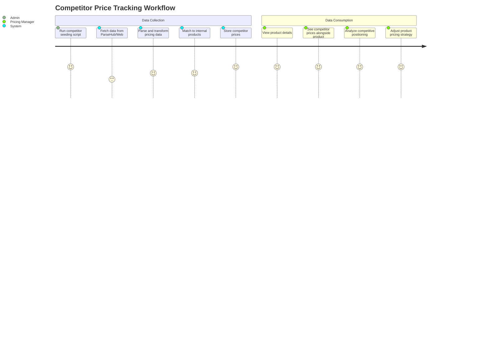
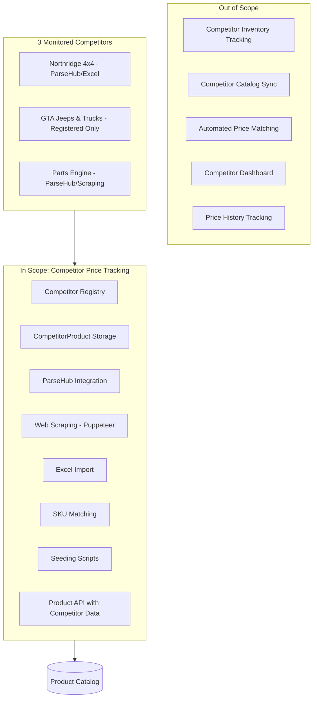
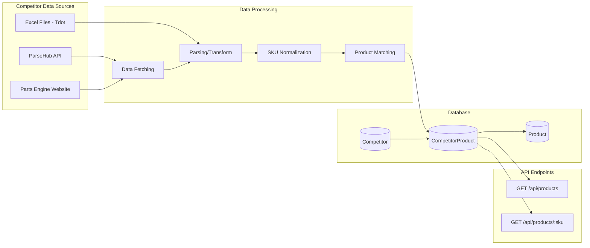
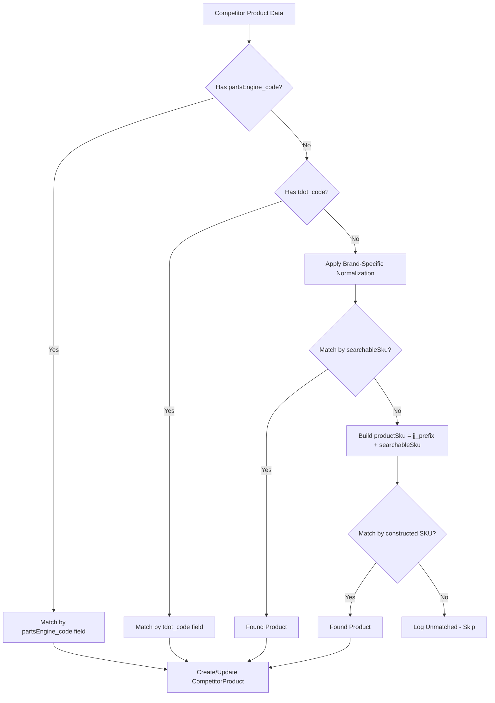

# PRD: Competitor Price Tracking

## Overview

### One-line Summary
A competitor price monitoring system that tracks and links pricing data from three Canadian automotive parts competitors (Northridge 4x4, GTA Jeeps & Trucks, Parts Engine) to internal products for competitive analysis and pricing strategy decisions.

### Background
JustJeeps operates in a competitive Canadian market for Jeep and off-road vehicle parts. Understanding competitor pricing is essential for:
- Setting competitive retail prices
- Identifying market opportunities where JustJeeps can offer better value
- Monitoring competitor pricing changes over time
- Making informed decisions about promotions and price adjustments

This feature enables the operations team to view competitor prices alongside internal product data, facilitating quick competitive analysis without manually visiting competitor websites.

## User Stories

### Primary Users
1. **E-commerce/Pricing Manager**: Personnel responsible for setting and adjusting product prices
2. **Operations Team**: Staff monitoring market conditions and competitive landscape
3. **System Administrators**: Technical staff running data collection scripts and maintaining integrations

### User Stories

```
As a pricing manager
I want to see competitor prices for my products
So that I can set competitive retail prices based on market data
```

```
As an operations team member
I want to compare my product prices against competitors
So that I can identify products where we are priced too high or too low
```

```
As a system administrator
I want to run competitor price collection scripts
So that I can keep competitor pricing data current
```

```
As a pricing manager
I want to see which products have competitor pricing data
So that I can prioritize competitive analysis for high-value items
```

### Use Cases

1. **Price Comparison Analysis**: Staff views a product detail page showing JustJeeps price alongside all available competitor prices to assess market positioning
2. **Competitive Gap Identification**: Staff queries products to identify where competitor prices differ significantly from JustJeeps prices (either higher or lower)
3. **Data Refresh Operations**: Administrator runs seeding scripts to update competitor pricing data from various sources (ParseHub API, Excel files, web scraping)
4. **Product Linking**: System automatically links competitor products to internal catalog based on SKU matching algorithms

## Functional Requirements

### Must Have (MVP)

- [x] **Competitor Registry**: Maintain a registry of monitored competitors with website information
  - AC: Competitor table stores 3 competitors (Northridge 4x4, GTA Jeeps & Trucks, Parts Engine) with name and website URL

- [x] **CompetitorProduct Data Model**: Store competitor pricing data linked to internal products
  - AC: CompetitorProduct table contains product_sku, competitor_id, competitor_price, product_url, and competitor_sku fields with proper foreign key relationships

- [x] **Product-Competitor Relationship**: Link competitor products to internal product catalog
  - AC: Each CompetitorProduct is linked to a Product via product_sku and to a Competitor via competitor_id; cascading delete removes competitor products when parent product is deleted

- [x] **Competitor Data via Products API**: Expose competitor pricing data through product endpoints
  - AC: GET /api/products and GET /api/products/:sku endpoints return competitorProducts array including competitor_price, product_url, and competitor name

- [x] **ParseHub Integration for Northridge**: Collect Northridge 4x4 competitor data via ParseHub web scraping service
  - AC: northridge-api.js fetches scraped data from ParseHub project API returning product links and pricing

- [x] **ParseHub Integration for Parts Engine**: Collect Parts Engine competitor data via ParseHub web scraping service
  - AC: partsEngine-api.js fetches scraped data from ParseHub project API returning SKU, price, and product links

- [x] **Excel Import for Northridge/Tdot**: Support Excel file import for competitor pricing data
  - AC: tdot-excel.js parses Excel file extracting tdot_price and tdot_code columns for price matching

- [x] **Web Scraping for Parts Engine**: Direct web scraping capability using Puppeteer for Parts Engine
  - AC: partsengine-scraper.js extracts SKU and price from Parts Engine product pages; partsengine-batch-runner.js processes URL lists with resume capability and CSV output

- [x] **SKU Matching Algorithms**: Match competitor products to internal products using multiple matching strategies
  - AC: Matching supports multiple strategies: searchableSku lookup, jj_prefix + searchableSku construction, tdot_code matching, and partsEngine_code matching

- [x] **Competitor Seeding Scripts**: Provide scripts for updating competitor pricing data
  - AC: seed-northridge.js (Tdot/Northridge), seed-partsEngine.js (Parts Engine via ParseHub), seed-partsEngine-scrapping.js (Parts Engine via web scraping) are functional

### Should Have

- [x] **Brand-Specific SKU Normalization**: Handle different SKU formats across brands for accurate matching
  - AC: Parts Engine seeder applies brand-specific SKU transformations for Omix, Rugged Ridge, Rough Country, Z Automotive, AirBedz, Chemical Guys, DV8 Offroad, and Bestop products

- [x] **URL-Based Product Matching**: Support matching via stored product URLs
  - AC: partsEngine_code field on Product model stores competitor URLs enabling direct lookup without SKU transformation

- [x] **Upsert Logic**: Create or update competitor products to maintain current pricing
  - AC: All seeders check for existing CompetitorProduct records and update if found, create if not; logging shows created vs updated counts

- [x] **Batch Processing with Resume**: Support interrupted scraping operations with progress saving
  - AC: partsengine-batch-runner.js saves progress every 50 URLs, tracks failed URLs separately, and supports resume from last completed index

### Could Have

- [ ] **GTA Jeeps & Trucks Integration**: Active data collection for GTA Jeeps competitor
  - Note: Competitor is registered but no active scraping/API integration exists

- [ ] **Competitor Price History**: Track historical pricing changes over time
  - Note: Current implementation overwrites existing prices; no history table

- [ ] **Automated Scheduling**: Cron-based automatic execution of competitor data collection
  - Note: Scripts are manually triggered; no automated scheduling

- [ ] **Price Difference Alerts**: Notifications when competitor prices change significantly
  - Note: Not currently implemented

- [ ] **Dedicated Competitor API Endpoints**: RESTful endpoints specifically for competitor data queries
  - Note: Competitor data only exposed through product endpoints; no GET /api/competitors or GET /api/competitor_products endpoints

### Out of Scope

- **Competitor Inventory Tracking**: Monitoring stock availability at competitors
- **Competitor Product Catalog Sync**: Importing competitor's full product catalog
- **Automated Price Matching**: Automatically adjusting JustJeeps prices based on competitor data
- **Competitor Monitoring Dashboard**: Dedicated UI for competitor analysis
- **Multiple Currency Support**: All competitor prices assumed to be in CAD

## Non-Functional Requirements

### Performance
- **Scraping Duration**: Parts Engine batch scraping should process 1000+ URLs within 30 minutes with resume capability
- **API Response Time**: Product queries including competitor data should return within 500ms
- **Seeding Operations**: Individual competitor seeding scripts should complete within 15 minutes

### Reliability
- **Resume Capability**: Web scraping operations support resume after interruption with progress saved every 50 items
- **Failed URL Tracking**: Failed scraping attempts logged to separate file for retry
- **Partial Failure Handling**: Seeding continues processing remaining items after individual item errors

### Security
- **API Keys in Code**: ParseHub API keys currently hardcoded (Note: Should be moved to environment variables)
- **Bot Detection Avoidance**: Puppeteer uses stealth plugin and browser restarts every 20 URLs to avoid blocking

### Scalability
- **Product Volume**: System handles 20,000+ products with potential competitor links
- **Competitor Addition**: Architecture supports adding new competitors without schema changes

## Success Criteria

### Quantitative Metrics
1. **Data Coverage**: At least 30% of active products have at least one competitor price record
2. **Data Freshness**: Competitor pricing data updated within 7 days of last collection run
3. **Match Rate**: 80%+ success rate for SKU matching during seeding operations
4. **Scraping Reliability**: 95%+ success rate for Parts Engine page scraping

### Qualitative Metrics
1. **Decision Support**: Pricing managers can identify competitive positioning for products without visiting competitor sites
2. **Data Accuracy**: Competitor prices in system match actual competitor website prices
3. **Operational Efficiency**: Data collection can be performed by any team member running documented scripts

## Technical Considerations

### Dependencies

**Internal Systems**:
- PostgreSQL database with Prisma ORM
- Express.js server (monolithic architecture in server.js)
- Product model with competitor code fields (partsEngine_code, tdot_code)

**External Services**:
- ParseHub API (parsehub.com) for Northridge and Parts Engine data
- Parts Engine website (partsengine.ca) for direct web scraping
- Northridge 4x4 website (northridge4x4.ca) indirectly via Excel exports

**Libraries**:
- axios: HTTP client for ParseHub API calls
- puppeteer-extra: Enhanced Puppeteer with stealth plugin for web scraping
- puppeteer-extra-plugin-stealth: Bot detection avoidance
- xlsx: Excel file parsing for Tdot/Northridge data
- csv-parser: CSV file parsing for scraped results

### Constraints

- **ParseHub Rate Limits**: ParseHub free tier has limited run frequency and data volume
- **Bot Detection**: Parts Engine website may block automated scraping; requires stealth techniques
- **Manual Data Collection**: Some competitor data (Tdot Excel) requires manual file acquisition
- **SKU Format Variations**: Different brands use inconsistent SKU formats requiring normalization logic

### Assumptions

- [x] Competitors maintain relatively stable website structures for scraping
- [x] ParseHub projects are configured and maintained for data extraction
- [x] Internal products already exist in catalog before competitor linking (no product creation)
- [x] Competitor IDs are stable: Northridge=1 (but Tdot uses 4), GTA=2, Parts Engine=3

### Risks and Mitigation

| Risk | Impact | Probability | Mitigation |
|------|--------|-------------|------------|
| Competitor website structure changes break scraping | High | Medium | Monitor for failures; maintain scraper code with CSS selector updates |
| ParseHub project runs fail or timeout | Medium | Medium | Implement error handling; support fallback to direct scraping |
| Bot detection blocks web scraping | High | Medium | Use stealth plugin; implement delays; rotate browser sessions |
| SKU matching fails for new product formats | Medium | Medium | Log unmatched products; periodic review of matching algorithms |
| Data becomes stale without scheduled updates | Medium | High | Document manual update procedures; consider future automation |

## User Journey Diagram



## Scope Boundary Diagram



## Competitor Integration Matrix

| Competitor | ID | Website | Integration Methods | Data Fields | Seed Scripts | Status |
|------------|----|---------|--------------------|-------------|--------------|--------|
| Northridge 4x4 | 1 | northridge4x4.ca | ParseHub API | price, product link | seed-northridge.js | Partial (uses Tdot ID 4) |
| GTA Jeeps & Trucks | 2 | gtajeeps.ca | None | N/A | N/A | Registered Only |
| Parts Engine | 3 | partsengine.ca | ParseHub API, Puppeteer Scraping | price, SKU, product URL | seed-partsEngine.js, seed-partsEngine-scrapping.js | Active |
| Tdot (Northridge alt) | 4 | N/A | Excel Import | price, tdot_code | seed-northridge.js | Active |

## Data Flow Diagram



## SKU Matching Strategy Diagram



## Appendix

### References
- ParseHub Documentation: https://www.parsehub.com/docs
- Puppeteer Documentation: https://pptr.dev/
- Related PRD: Multi-Vendor Product Integration PRD (for VendorProduct comparison)

### Glossary
- **Competitor**: A business selling similar products in the same market that JustJeeps monitors for pricing intelligence
- **CompetitorProduct**: A record linking a competitor's pricing for a specific product to JustJeeps internal product catalog
- **ParseHub**: A web scraping service that provides visual scraping tools and API access to scraped data
- **SKU Normalization**: The process of transforming competitor SKU formats to match internal product identifiers
- **Seeding**: The process of importing/updating competitor data into the database
- **Stealth Plugin**: Puppeteer extension that helps avoid bot detection by websites

### Database Schema Reference

**Competitor Model**:
```prisma
model Competitor {
  id                 Int                 @id @default(autoincrement())
  name               String
  website            String
  competitorProducts CompetitorProduct[]
}
```

**CompetitorProduct Model**:
```prisma
model CompetitorProduct {
  id               Int        @id @default(autoincrement())
  product_sku      String
  competitor_id    Int
  product_url      String?
  competitor_price Float
  competitor_sku   String?
  competitor       Competitor @relation(fields: [competitor_id], references: [id])
  product          Product    @relation(fields: [product_sku], references: [sku], onDelete: Cascade)
}
```

**Product Competitor-Related Fields**:
- `partsEngine_code`: Parts Engine product URL for direct matching
- `tdot_code`: Tdot/Northridge product code for Excel-based matching
- `competitorProducts`: Relation to all competitor pricing records for the product

### Seed Scripts Reference

| Script | Location | Competitor ID | Data Source |
|--------|----------|---------------|-------------|
| seed-northridge.js | prisma/seeds/seed-individual/ | 4 (Tdot) | tdot-excel.js (Excel) |
| seed-partsEngine.js | prisma/seeds/seed-individual/ | 3 | partsEngine-api.js (ParseHub) |
| seed-partsEngine-scrapping.js | prisma/seeds/scrapping/partsEngine/ | 3 | partsengine-scraper.js (Puppeteer) |
| partsengine-batch-runner.js | prisma/seeds/scrapping/partsEngine/ | 3 | urls.txt + partsengine-scraper.js |

### API Response Example

**GET /api/products/:sku Response (Competitor Data Section)**:
```json
{
  "sku": "ABC-12345",
  "name": "Example Product",
  "price": 199.99,
  "competitorProducts": [
    {
      "competitor_price": 189.99,
      "product_url": "https://www.partsengine.ca/example-product",
      "competitor": {
        "name": "Parts Engine"
      }
    },
    {
      "competitor_price": 205.00,
      "product_url": null,
      "competitor": {
        "name": "Northridge 4x4"
      }
    }
  ]
}
```

### Undetermined Items

- [ ] **Competitor ID Consistency**: Northridge 4x4 registered as ID 1 but seed-northridge.js uses competitor_id: 4 (Tdot). Clarify intended relationship.
- [ ] **GTA Jeeps & Trucks Integration**: Competitor registered but no data collection mechanism exists. Determine if integration is planned.
- [ ] **ParseHub API Key Management**: API keys are hardcoded in source files. Should these be moved to environment variables?

---

**Document Version**: 1.0
**Created**: 2026-01-23
**Status**: Final (Reverse-Engineered from Implementation)
