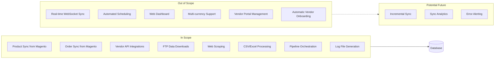
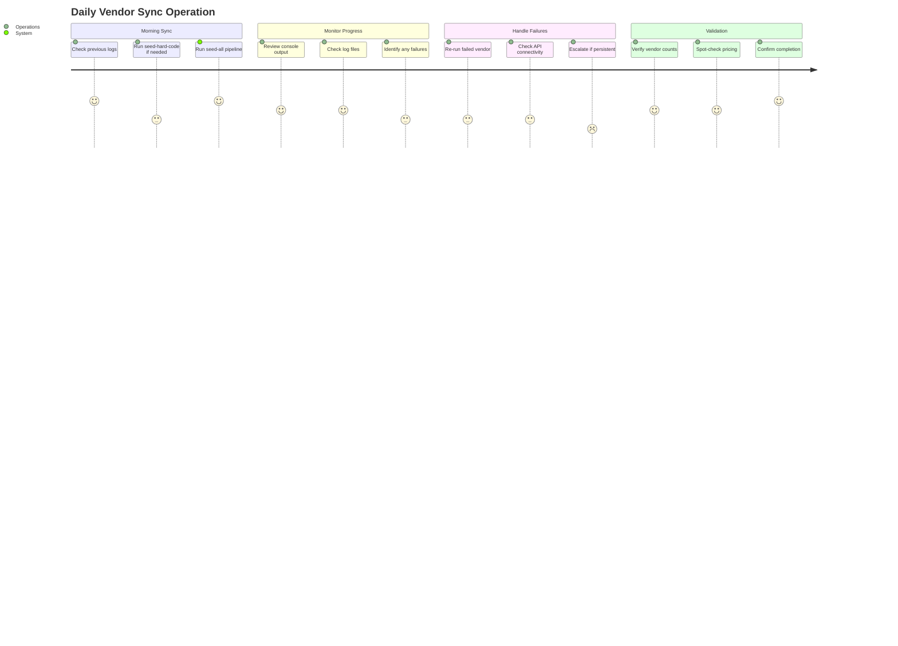
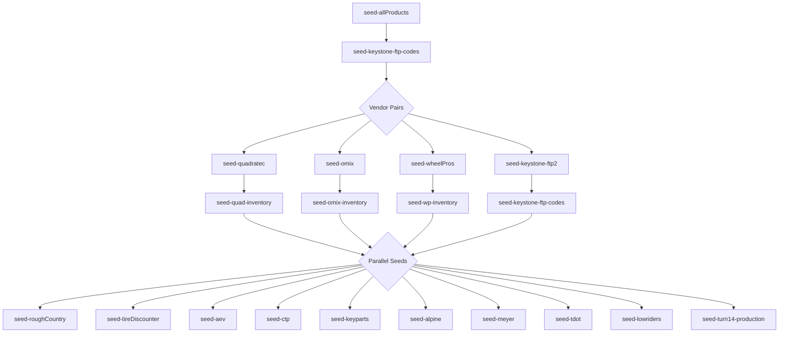

# PRD: Data Synchronization & Seeding

**Version**: 1.0.0
**Status**: Accepted (Reverse-Engineered)
**Created**: 2026-01-23
**Last Updated**: 2026-01-23

---

## Overview

### One-line Summary
A comprehensive batch processing system that synchronizes product data, pricing, inventory, and orders from 15+ external vendors/sources into the JustJeeps database through APIs, FTP downloads, CSV imports, and web scraping.

### Background
JustJeeps operates as a multi-vendor e-commerce platform selling Jeep parts and accessories. The business sources products from numerous vendors (distributors) who each provide data in different formats and through different channels. This synchronization system maintains up-to-date product catalogs, pricing, and inventory levels across all vendor sources, enabling:

- Accurate cost calculations for purchasing decisions
- Real-time inventory availability across vendors
- Automated order data capture from Magento
- Product catalog synchronization with the primary Magento storefront

---

## User Stories

### Primary Users
1. **Operations Team**: Manages daily vendor data updates and monitors sync status
2. **Purchasing Team**: Uses synchronized vendor pricing/inventory for procurement decisions
3. **System Administrators**: Configures and maintains sync schedules
4. **Developers**: Adds new vendor integrations and maintains existing ones

### User Stories

```
As an Operations Manager
I want vendor pricing and inventory to be automatically updated daily
So that our purchasing decisions are based on current data
```

```
As a Developer
I want to run individual vendor sync scripts independently
So that I can troubleshoot and update specific vendor data without affecting others
```

```
As a System Administrator
I want comprehensive logging of all sync operations
So that I can identify and resolve sync failures quickly
```

```
As a Purchasing Team Member
I want products to show all available vendor sources with costs
So that I can select the most cost-effective supplier for each order
```

### Use Cases

1. **Daily Vendor Sync Pipeline**: Operations runs `seed-all` to update all vendor pricing/inventory in sequence with proper dependency management
2. **Magento Order Import**: System fetches recent orders from Magento API and synchronizes to local database for processing
3. **New Vendor Onboarding**: Developer creates new seed script using established patterns (API, CSV, FTP, or scraping)
4. **MetalCloak Semi-Automated Scraping**: User manually logs in to bypass CAPTCHA, then automated scraping extracts pricing data
5. **Keystone FTP Data Processing**: System downloads CSV files via FTP, parses, and matches to existing products by vendor codes

---

## Functional Requirements

### Must Have (MVP)

- [x] **FR-001**: Magento Product Synchronization
  - Fetch all products from Magento API
  - Map vendor codes based on SKU prefix (vendors_prefix.js)
  - Generate vendor-specific codes: `meyer_code`, `keystone_code`, `quadratec_code`, `t14_code`, `premier_code`, etc.
  - Create/update Product records in database
  - AC: Products sync successfully with all vendor codes populated based on prefix mapping

- [x] **FR-002**: Magento Order Synchronization
  - Fetch recent orders from Magento API (configurable count, default 400)
  - Extract order details including shipping info, payment method, fraud score
  - Create Order and OrderProduct records with proper relationships
  - Support upsert logic (create new, update existing)
  - AC: Orders sync with all custom attributes (custom_po_number, shipping details, weltpixel_fraud_score)

- [x] **FR-003**: Vendor API Integrations
  - **Turn14 Distribution**: API-based sync with rate limiting (5 req/sec, 5000/hour, 30000/day)
  - **Premier Performance**: Batch API with batch size of 10, 2-second delays
  - **Quadratec**: Excel file processing for wholesale pricing
  - **Omix**: API integration with inventory endpoints
  - AC: Each vendor API correctly creates/updates VendorProduct records with cost (1.5x USD-to-CAD conversion) and inventory

- [x] **FR-004**: FTP-Based Data Sync (Keystone)
  - Connect to Keystone FTP server
  - Download CSV price/inventory files
  - Parse CSV data with column mapping (VCPN = vendor code)
  - Match products by keystone_code
  - Handle duplicate records (prefer non-dash-ending SKUs)
  - AC: Keystone vendor products seeded with cost and inventory from FTP files

- [x] **FR-005**: CSV/Excel File Processing
  - Support multiple file formats: CSV, Excel (xlsx)
  - Parse vendor-specific data structures
  - Map columns to VendorProduct fields
  - AC: File-based vendors (Meyer, Rough Country, AEV, Alpine, etc.) import successfully

- [x] **FR-006**: Web Scraping Integrations
  - **MetalCloak**: Semi-automated Puppeteer scraping (manual CAPTCHA login required)
  - **Stinger**: Automated Puppeteer scraping with retry logic
  - Extract product codes, pricing, and inventory from vendor portals
  - Generate CSV/JSON output files for review
  - AC: Scraped data generates valid output files and integrates into database

- [x] **FR-007**: Hard-coded Data Seeding
  - Seed essential reference data: Users, Vendors, Competitors
  - Provide vendor prefix mappings for code generation
  - Support idempotent seeding (skip existing records)
  - AC: `seed-hard-code` creates all reference data without duplicates

- [x] **FR-008**: Orchestrated Pipeline Execution
  - Sequential execution for dependent vendors (e.g., Quadratec before Quad-inventory)
  - Parallel execution for independent vendors
  - Comprehensive logging to files (prisma/seeds/logs/)
  - AC: `seed-all` runs complete pipeline in correct dependency order with logs

### Nice to Have

- [ ] **FR-009**: Automated Scheduling via Cron
  - Schedule daily vendor syncs automatically
  - AC: Sync runs unattended at configured times

- [ ] **FR-010**: Sync Dashboard/Reporting
  - Track sync success/failure rates
  - Monitor record counts per vendor
  - AC: Visual dashboard shows sync status for all vendors

- [ ] **FR-011**: Incremental Sync Support
  - Only sync changed records instead of full refresh
  - AC: Sync time reduced for partial updates

### Out of Scope

- **Real-time WebSocket sync**: Current implementation uses scheduled batch processing
- **Vendor portal authentication management**: Credentials stored in environment variables
- **Multi-currency support**: All costs converted to CAD at fixed 1.5x rate
- **Automatic vendor onboarding**: New vendors require developer implementation

---

## Non-Functional Requirements

### Performance

- **Full Product Sync**: Complete in under 30 minutes for 20,000+ products
- **Turn14 Sync**: Process all pages respecting rate limits (may take hours for full catalog)
- **Premier Batch Processing**: 10 items per batch with 2-second delays
- **Parallel Execution**: Multiple independent vendors processed concurrently

### Reliability

- **Error Handling**: Individual record failures do not abort entire sync
- **Retry Logic**: Web scrapers retry failed requests up to 3 times
- **Rate Limiting**: Automatic pausing when API limits approached
- **Logging**: All operations logged to files for debugging

### Security

- **Credential Management**: API keys and passwords stored in environment variables
- **FTP Encryption**: Secure connection to vendor FTP servers
- **No Plaintext Secrets**: Sensitive data excluded from logs

### Scalability

- **Modular Design**: Each vendor has independent seed script
- **Batch Processing**: Large datasets processed in configurable batch sizes
- **Memory Efficiency**: Stream processing for large CSV files

---

## Success Criteria

### Quantitative Metrics

1. **Data Freshness**: Vendor pricing/inventory updated within 24 hours of source changes
2. **Sync Success Rate**: 95%+ of sync operations complete without errors
3. **Product Coverage**: 100% of active products have at least one vendor mapping
4. **Processing Time**: Full vendor sync completes within 4 hours including rate-limited APIs

### Qualitative Metrics

1. **Data Accuracy**: Vendor costs and inventory match source systems
2. **Operational Simplicity**: Single command runs complete sync pipeline
3. **Debuggability**: Clear logs enable quick issue identification and resolution

---

## Technical Considerations

### Dependencies

**Internal Dependencies**:
- Prisma ORM and PostgreSQL database
- Product table with vendor-specific code columns
- Vendor table with vendor IDs and credentials
- VendorProduct junction table

**External Dependencies**:
- Magento REST API (products, orders)
- Turn14 Distribution API (items, pricing, inventory)
- Premier Performance API (product info, pricing)
- Keystone FTP Server (CSV files)
- MetalCloak Jobber Portal (web scraping)
- Stinger Solutions Website (web scraping)
- Various vendor Excel/CSV file sources

### Constraints

- **Turn14 Rate Limits**: 5 requests/second, 5,000/hour, 30,000/day
- **Premier Batch Limit**: Maximum 10 items per API batch request
- **MetalCloak CAPTCHA**: Requires manual login before automated scraping
- **Single-threaded Execution**: Scripts run one at a time within same vendor
- **Fixed Exchange Rate**: USD to CAD conversion at 1.5x (hardcoded)

### Assumptions

- Magento API availability during sync windows
- Vendor API credentials remain valid
- FTP server accessible from deployment environment
- Browser automation possible (for scraping scripts)

### Risks and Mitigation

| Risk | Impact | Probability | Mitigation |
|------|--------|-------------|------------|
| Vendor API changes/breaks | High | Medium | Version-specific service wrappers, monitoring, alerts |
| Rate limit exceeded | Medium | Medium | Conservative rate limiting, hourly pause logic |
| Scraping detection/blocking | Medium | Medium | Polite delays, User-Agent spoofing, manual CAPTCHA handling |
| Large data volume growth | Medium | Low | Batch processing, pagination, memory-efficient streaming |
| Credential rotation | Low | Medium | Environment variable management, documentation |

---

## System Architecture

### Data Flow Diagram

```mermaid
flowchart TB
    subgraph External["External Data Sources"]
        MAG[Magento API]
        T14[Turn14 API]
        PRM[Premier API]
        KFT[Keystone FTP]
        MCL[MetalCloak Portal]
        STG[Stinger Website]
        CSV[Vendor CSV/Excel Files]
    end

    subgraph Seeders["Sync Scripts"]
        SP[seed-allProducts]
        SO[seed-orders]
        ST[seed-turn14-production]
        SDT[seed-daily-turn14-production]
        SDP[seed-daily-premier]
        SKF[seed-keystone-ftp2]
        SMC[scrape-metalcloak]
        SST[seed-stinger]
        SQ[seed-quadratec]
        SM[seed-meyer]
        SRC[seed-roughCountry]
        SA[seed-all]
    end

    subgraph Database["PostgreSQL Database"]
        PRD[Product]
        VP[VendorProduct]
        VND[Vendor]
        ORD[Order]
        OP[OrderProduct]
    end

    MAG --> SP
    MAG --> SO
    T14 --> ST
    T14 --> SDT
    PRM --> SDP
    KFT --> SKF
    MCL --> SMC
    STG --> SST
    CSV --> SQ
    CSV --> SM
    CSV --> SRC

    SP --> PRD
    SO --> ORD
    SO --> OP
    ST --> VP
    SDT --> VP
    SDP --> VP
    SKF --> VP
    SMC --> VP
    SST --> VP
    SQ --> VP
    SM --> VP
    SRC --> VP

    SA --> SP
    SA --> SKF
    SA --> SQ
    SA --> SM
    SA --> SRC
    SA --> ST
```



### Scope Boundary Diagram



### User Journey Diagram



---

## Vendor Integration Matrix

| Vendor | ID | Integration Type | Rate Limits | Script | Currency |
|--------|------|------------------|-------------|--------|----------|
| Keystone | 1 | FTP + CSV | None | seed-keystone-ftp2 | CAD (native) |
| Meyer | 2 | Excel/CSV | None | seed-meyer | CAD (1.5x) |
| Omix-ADA | 3 | API | Moderate | seed-omix | CAD (1.5x) |
| Quadratec | 4 | Excel | None | seed-quadratec | CAD (1.5x) |
| Rough Country | 5 | CSV | None | seed-roughCountry | CAD (1.5x) |
| WheelPros | 6 | API | Moderate | seed-wheelPros | CAD (1.5x) |
| AEV | 7 | CSV | None | seed-aev | CAD (1.5x) |
| Alpine | 8 | CSV | None | seed-alpine | CAD (1.5x) |
| CTP | 9 | CSV | None | seed-ctp | CAD (1.5x) |
| KeyParts | 10 | CSV | None | seed-keyparts | CAD (1.5x) |
| TDot | 11 | CSV | None | seed-tdot | CAD (native) |
| Lowriders | 12 | CSV | None | seed-lowriders | CAD (1.5x) |
| Tire Discounter | 13 | API | Low | seed-tireDiscounter | CAD (1.5x) |
| MetalCloak | 14 | Web Scrape | Manual CAPTCHA | scrape-metalcloak | CAD (1.5x) |
| Turn14 | 15 | API | 5/sec, 5000/hr | seed-turn14-production | CAD (1.5x) |
| Premier | 16 | API | Batch of 10 | seed-daily-premier | CAD (1.5x) |
| Stinger | - | Web Scrape | Polite delays | seed-stinger | CAD (1.5x) |

---

## Entry Points Reference

### NPM Scripts

| Script | Command | Description |
|--------|---------|-------------|
| seed-hard-code | `npm run seed-hard-code` | Seed reference data (vendors, users, competitors) |
| seed-all | `npm run seed-all` | Run complete vendor sync pipeline |
| seed-allProducts | `npm run seed-allProducts` | Sync products from Magento |
| seed-orders | `npm run seed-orders` | Sync recent orders from Magento |
| seed-turn14-production | `npm run seed-turn14-production` | Full Turn14 sync |
| seed-daily-turn14-production | `npm run seed-daily-turn14-production` | Daily Turn14 updates |
| seed-daily-premier | `npm run seed-daily-premier` | Daily Premier updates |
| seed-keystone-ftp2 | `npm run seed-keystone-ftp2` | Keystone FTP sync |
| scrape-metalcloak | `npm run scrape-metalcloak` | MetalCloak web scraping |
| seed-metalcloak | `npm run seed-metalcloak` | Process scraped MetalCloak data |

### Execution Dependencies



---

## Appendix

### References

- [CLAUDE.md](/Users/ricardotassio/DEV/TRABALHO/JUSTJEEPS/JustJeepsAPI-back-end/CLAUDE.md) - Repository documentation
- [Prisma Schema](/Users/ricardotassio/DEV/TRABALHO/JUSTJEEPS/JustJeepsAPI-back-end/prisma/schema.prisma) - Database models
- [Multi-Vendor Integration PRD](/Users/ricardotassio/DEV/TRABALHO/JUSTJEEPS/JustJeepsAPI-back-end/docs/prd/multi-vendor-integration-prd.md) - Related feature

### Glossary

- **VendorProduct**: Junction record linking a Product to a Vendor with cost/inventory
- **vendor_sku**: The vendor's internal part number for a product
- **product_sku**: JustJeeps internal SKU (format: PREFIX-partNumber)
- **jj_prefix**: Two or three letter brand prefix in JustJeeps SKUs (e.g., "OA" for Omix-ADA)
- **FTP Sync**: File Transfer Protocol download of vendor data files
- **Rate Limiting**: API throttling to avoid exceeding vendor request quotas
- **Upsert**: Create if not exists, otherwise update existing record
- **Seeding**: Batch process of populating database with external data

### Change Log

| Version | Date | Author | Changes |
|---------|------|--------|---------|
| 1.0.0 | 2026-01-23 | System (Reverse-engineered) | Initial PRD from existing implementation |
