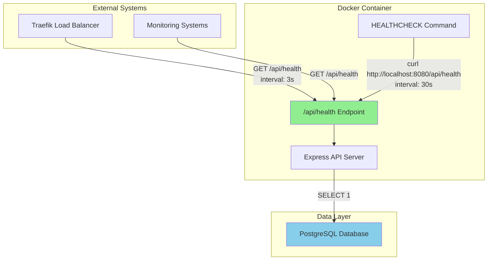
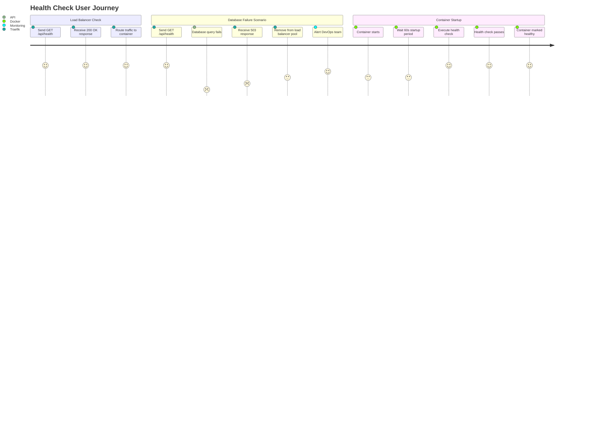

# PRD: Health & Monitoring

## Document Information

| Attribute | Value |
|-----------|-------|
| Version | 1.1.0 |
| Status | Accepted |
| Created | 2026-01-23 |
| Author | Reverse-engineered from implementation |
| Confidence Level | Verified: 95% |

---

## Overview

### One-line Summary
API health check endpoint that enables load balancer integration and container orchestration for zero-downtime deployments via Kamal.

### Background
The JustJeeps API requires automated health monitoring to support production deployment infrastructure. The system uses Kamal (formerly MRSK) for Docker-based deployments with Traefik as a reverse proxy and load balancer. Health checks are essential for:

1. **Load balancer routing**: Traefik uses health endpoints to determine which containers can receive traffic
2. **Container orchestration**: Docker monitors container health and can restart unhealthy instances
3. **Zero-downtime deployments**: New containers must pass health checks before receiving traffic, ensuring seamless updates
4. **Operational visibility**: Provides basic telemetry (uptime, status) for monitoring systems

---

## User Stories

### Primary Users

| User Type | Description |
|-----------|-------------|
| Load Balancer (Traefik) | Automated system that routes incoming requests to healthy API instances |
| Container Runtime (Docker) | Orchestration layer that manages container lifecycle based on health status |
| DevOps Engineer | Human operator who monitors system health and investigates issues |
| Monitoring Systems | External tools (uptime monitors, alerting systems) that track API availability |

### User Stories

```
As a Load Balancer (Traefik)
I want to query the API health status at regular intervals
So that I can route traffic only to healthy instances and remove unhealthy ones from the pool
```

```
As a Container Runtime (Docker)
I want to verify the application is responding and database is connected
So that I can restart containers that become unresponsive
```

```
As a DevOps Engineer
I want to see the current health status including database connectivity and uptime
So that I can quickly diagnose production issues
```

```
As a Monitoring System
I want to receive standardized HTTP responses indicating health status
So that I can trigger alerts when the API becomes unavailable
```

### Use Cases

1. **Normal operation**: Load balancer polls `/api/health` every 3 seconds; receives 200 OK with healthy status; continues routing traffic to instance
2. **Database failure**: Database connection drops; health endpoint returns 503 Service Unavailable; load balancer stops routing traffic; alerts fire
3. **Container startup**: New container starts; Docker waits for health check to pass (60s startup period); container becomes eligible for traffic
4. **Zero-downtime deployment**: Kamal deploys new version; new containers pass health checks; old containers drain; deployment completes without user impact

---

## Functional Requirements

### Must Have (MVP)

- [x] **FR-001**: Health endpoint at `/api/health` accessible via GET request
  - AC: Given the API is running, when a GET request is made to `/api/health`, then a JSON response is returned within 10 seconds

- [x] **FR-002**: Database connectivity validation using raw SQL query
  - AC: Given the health endpoint is called, when database is reachable, then execute `SELECT 1` query successfully; when database is unreachable, then return unhealthy status

- [x] **FR-003**: Return HTTP 200 status code when healthy
  - AC: Given all dependencies (database) are healthy, when health check is performed, then HTTP status code 200 is returned

- [x] **FR-004**: Return HTTP 503 status code when unhealthy
  - AC: Given database connection fails, when health check is performed, then HTTP status code 503 is returned

- [x] **FR-005**: Response body includes health status indicator
  - AC: Response JSON contains `status` field with value `healthy` or `unhealthy`

- [x] **FR-006**: Response body includes current timestamp
  - AC: Response JSON contains `timestamp` field in ISO 8601 format

- [x] **FR-007**: Response body includes process uptime (healthy state only)
  - AC: Given health check passes, when response is generated, then `uptime` field contains process uptime in seconds

- [x] **FR-008**: Response body includes error description (unhealthy state only)
  - AC: Given health check fails, when response is generated, then `error` field contains human-readable error description

### Nice to Have

- [ ] Memory usage metrics in health response
- [ ] CPU usage metrics in health response
- [ ] Request queue depth
- [ ] Database connection pool statistics
- [ ] Detailed dependency health breakdown (multiple databases, external services)

### Out of Scope

- **Authentication on health endpoint**: Health checks must be accessible without authentication for load balancer integration
- **Detailed application metrics**: Prometheus/OpenTelemetry integration is separate from basic health checks
- **Custom health check logic**: Business-specific health validations are not included in infrastructure health
- **Health check history**: Historical health data is not stored or returned

---

## Non-Functional Requirements

### Performance

| Metric | Target | Rationale |
|--------|--------|-----------|
| Response Time | < 1 second (typical) | Health checks must be fast to not block deployment |
| Timeout | 10 seconds (max) | Kamal configuration allows 30s, Docker 10s |
| Database Query Time | < 100ms | Simple `SELECT 1` should complete quickly |

### Reliability

| Metric | Target | Rationale |
|--------|--------|-----------|
| Availability | 99.9% (matches API SLA) | Health endpoint must be as reliable as the API itself |
| Error Rate | < 0.1% false negatives | Avoid incorrectly marking healthy containers as unhealthy |

### Security

- **No authentication required**: Health endpoint is intentionally unauthenticated for load balancer access
- **Minimal information disclosure**: Error messages do not expose sensitive system details
- **No sensitive data in response**: Health response contains only operational metrics

### Scalability

- **Stateless design**: Each health check is independent; no shared state between checks
- **Minimal resource usage**: Health checks do not significantly impact API capacity
- **Concurrent access**: Multiple health checks can run simultaneously without interference

---

## Technical Considerations

### Integration Architecture



### Response Format

**Healthy Response (HTTP 200)**
```json
{
  "status": "healthy",
  "timestamp": "2026-01-23T10:30:00.000Z",
  "uptime": 86400.123
}
```

**Unhealthy Response (HTTP 503)**
```json
{
  "status": "unhealthy",
  "error": "Database connection failed",
  "timestamp": "2026-01-23T10:30:00.000Z"
}
```

### Dependencies

| Dependency | Type | Purpose |
|------------|------|---------|
| PostgreSQL Database | Required | Primary data store; connectivity is checked |
| Prisma ORM | Internal | Database client used for health query |
| Express.js | Internal | HTTP framework handling the endpoint |
| curl (in container) | Runtime | Used by Docker HEALTHCHECK command |

### Constraints

| Constraint | Description |
|------------|-------------|
| Single database check | Only PostgreSQL connectivity is validated; external APIs are not checked |
| Synchronous execution | Health check blocks until database responds or times out |
| Fixed endpoint path | `/api/health` path is configured in multiple places (Kamal, Docker) |

### Assumptions

- PostgreSQL database is the only critical dependency for API functionality
- Network latency to database is minimal (same VPC/network)
- Container has curl available for Docker HEALTHCHECK

---

## Deployment Configuration

### Kamal Configuration (deploy.yml)

| Setting | Value | Description |
|---------|-------|-------------|
| Health Path | `/api/health` | Endpoint path for health checks |
| Interval | 3 seconds | Frequency of health checks |
| Timeout | 30 seconds | Maximum wait time for response |

### Docker Configuration (Dockerfile.production)

| Setting | Value | Description |
|---------|-------|-------------|
| Interval | 30 seconds | Frequency of container health checks |
| Timeout | 10 seconds | Maximum wait time for response |
| Start Period | 60 seconds | Grace period during container startup |
| Retries | 3 | Failed checks before marking unhealthy |
| Command | `curl -f http://localhost:8080/api/health` | Health check command |

---

## User Journey Diagram



---

## Scope Boundary Diagram

```mermaid
flowchart TB
    subgraph InScope["In Scope"]
        direction TB
        A["HTTP GET /api/health endpoint"]
        B["Database connectivity check"]
        C["Health status response (healthy/unhealthy)"]
        D["HTTP status codes (200/503)"]
        E["Timestamp in response"]
        F["Uptime metric"]
        G["Error message for failures"]
    end

    subgraph OutOfScope["Out of Scope"]
        direction TB
        H["Authentication on health endpoint"]
        I["Detailed metrics (CPU, memory)"]
        J["External service health checks"]
        K["Health check history storage"]
        L["Custom business health logic"]
        M["Prometheus/metrics integration"]
    end

    subgraph FutureConsideration["Future Consideration"]
        direction TB
        N["Connection pool metrics"]
        O["Dependency breakdown"]
        P["Degraded state support"]
    end

    style InScope fill:#90EE90
    style OutOfScope fill:#FFB6C1
    style FutureConsideration fill:#FFFACD
```



---

## Success Criteria

### Quantitative Metrics

| Metric | Target | Measurement Method |
|--------|--------|-------------------|
| Health check response time | p95 < 500ms | Load balancer logs |
| False negative rate | < 0.1% | Container restart frequency analysis |
| Deployment success rate | 100% with health check passing | Kamal deployment logs |
| Container health check pass rate | > 99.9% during normal operation | Docker health status logs |

### Qualitative Metrics

| Metric | Target | Measurement Method |
|--------|--------|-------------------|
| Operational confidence | DevOps team trusts health endpoint accuracy | Team feedback |
| Debugging effectiveness | Health status aids in rapid issue identification | Incident post-mortems |

---

## Risks and Mitigation

| Risk | Impact | Probability | Mitigation |
|------|--------|-------------|------------|
| Database query timeout causes false unhealthy status | Medium | Low | Short timeout on SELECT 1; database should respond in <100ms |
| Health endpoint becomes unavailable while app works | High | Low | Health endpoint has minimal dependencies; uses same Express instance |
| Too frequent health checks impact database | Low | Low | SELECT 1 is lightweight; interval of 3s is reasonable |
| Health check passes but API is functionally broken | Medium | Medium | Consider adding basic functional checks in future |

---

## Related Files

| File | Purpose |
|------|---------|
| `/Users/ricardotassio/DEV/TRABALHO/JUSTJEEPS/JustJeepsAPI-back-end/server.js` (lines 47-63) | Health endpoint implementation |
| `/Users/ricardotassio/DEV/TRABALHO/JUSTJEEPS/JustJeepsAPI-back-end/Dockerfile.production` (lines 103-105) | Docker HEALTHCHECK configuration |
| `/Users/ricardotassio/DEV/TRABALHO/JUSTJEEPS/JustJeepsAPI-back-end/config/deploy.yml` (lines 33-36) | Kamal proxy health check configuration |
| `/Users/ricardotassio/DEV/TRABALHO/JUSTJEEPS/JustJeepsAPI-back-end/docker-compose.yml` | Local development service dependencies |
| `/Users/ricardotassio/DEV/TRABALHO/JUSTJEEPS/JustJeepsAPI-back-end/utils/logger.js` | Axiom logging utility |

---

## Related Documentation

| Document | Purpose |
|----------|---------|
| [DD-010: Health Monitoring Endpoint](../design/dd-010-health-monitoring.md) | Technical design document |
| [DD-017: Axiom Logging & Error Monitoring](../design/dd-017-axiom-logging.md) | Centralized logging integration |

---

## Enhancement: Axiom Logging Integration (2026-01-24)

The health monitoring system has been enhanced with centralized logging via **Axiom**:

### New Capabilities

- **Centralized Error Logging**: All API errors are captured with full stack traces and request context
- **Request Tracking**: HTTP requests logged with method, path, status code, and duration
- **Graceful Shutdown**: Logs are flushed before process termination

### Configuration

| Variable | Purpose |
|----------|---------|
| `AXIOM_TOKEN` | API authentication token |
| `AXIOM_DATASET` | Dataset name (`justjeeps-api`) |

### Viewing Logs

1. Access Axiom Dashboard: https://app.axiom.co
2. Navigate to Datasets → `justjeeps-api`
3. Use Stream for real-time logs or Query for analysis

### Note on Health Checks

The `/api/health` endpoint is excluded from request logging to prevent log pollution from high-frequency polling (every 3s from Traefik).

---

## Appendix

### Implementation Reference

```javascript
// Health check endpoint (server.js lines 47-63)
app.get('/api/health', async (req, res) => {
  try {
    // Verify database connection
    await prisma.$queryRaw`SELECT 1`;
    res.status(200).json({
      status: 'healthy',
      timestamp: new Date().toISOString(),
      uptime: process.uptime(),
    });
  } catch (error) {
    res.status(503).json({
      status: 'unhealthy',
      error: 'Database connection failed',
      timestamp: new Date().toISOString(),
    });
  }
});
```

### Glossary

| Term | Definition |
|------|------------|
| **Health Check** | Automated test to verify a service is operational and ready to handle requests |
| **Load Balancer** | System that distributes incoming network traffic across multiple servers |
| **Kamal** | Ruby-based deployment tool for containerized applications (successor to MRSK) |
| **Traefik** | Modern reverse proxy and load balancer with automatic service discovery |
| **HEALTHCHECK** | Docker instruction that defines how to test container health |
| **Zero-downtime deployment** | Deployment strategy that ensures continuous availability during updates |
| **SLA** | Service Level Agreement; commitment to service availability |

### References

- [Kamal Documentation](https://kamal-deploy.org/)
- [Docker HEALTHCHECK Reference](https://docs.docker.com/engine/reference/builder/#healthcheck)
- [Traefik Health Check Documentation](https://doc.traefik.io/traefik/routing/services/#health-check)
- [Express.js Best Practices](https://expressjs.com/en/advanced/best-practice-performance.html)

---

## Change History

| Version | Date | Author | Changes |
|---------|------|--------|---------|
| 1.0.0 | 2026-01-23 | Reverse-engineered | Initial PRD created from existing implementation |
| 1.1.0 | 2026-01-24 | Architecture Documentation | Added Axiom logging integration enhancement section |
