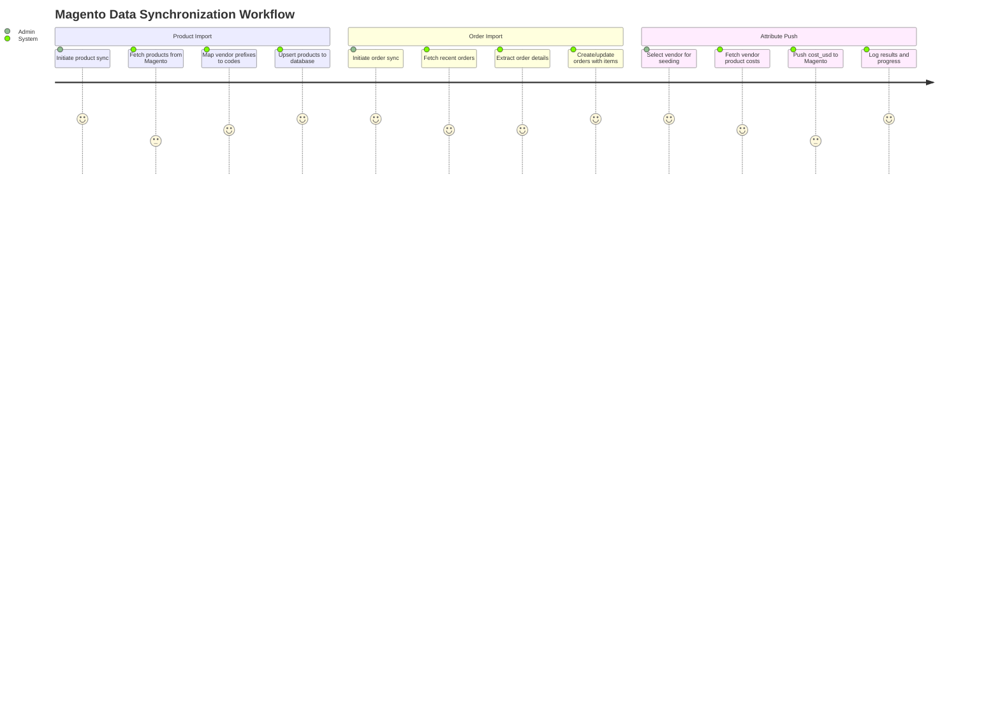
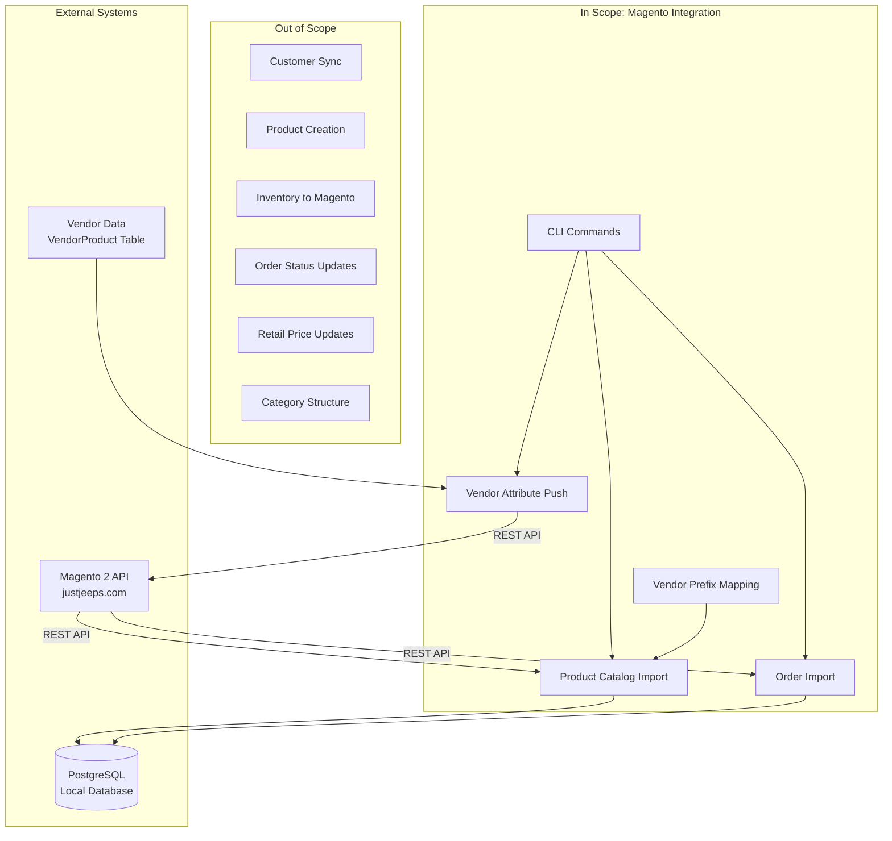

# PRD: Magento Integration

## Overview

### One-line Summary
An integration layer that synchronizes product catalog, order data, and vendor-specific attributes between the JustJeeps internal API system and the Magento 2 e-commerce storefront (justjeeps.com).

### Background
JustJeeps operates a Magento 2 e-commerce storefront at justjeeps.com, which serves as the customer-facing platform for selling Jeep and off-road vehicle parts. The internal JustJeepsAPI system manages vendor relationships, cost tracking, and inventory data from 17+ vendors.

This integration layer serves two critical purposes:
1. **Inbound Sync**: Pull product catalog and order data from Magento to populate the internal database for vendor cost comparison, purchase order creation, and operational management
2. **Outbound Sync**: Push vendor cost and inventory data back to Magento custom product attributes for internal reference and potential price optimization

The integration enables the operations team to work with a unified view of products and orders while maintaining accurate vendor data on the e-commerce platform.

## User Stories

### Primary Users
1. **Operations/Purchasing Team**: Staff who need synchronized product and order data to create purchase orders and manage vendor relationships
2. **E-commerce Manager**: Personnel who need accurate vendor cost data reflected on products in Magento for margin analysis
3. **System Administrator**: Technical staff responsible for running data synchronization scripts

### User Stories

```
As an operations team member
I want Magento products synced to the internal database
So that I can view products with vendor cost comparisons in one system
```

```
As a purchasing team member
I want recent orders imported from Magento
So that I can create purchase orders to fulfill customer orders
```

```
As an e-commerce manager
I want vendor USD costs pushed to Magento product attributes
So that I can see actual vendor costs while managing the storefront
```

```
As a system administrator
I want CLI commands to run specific attribute seeding operations
So that I can update specific vendors without affecting others
```

### Use Cases

1. **Initial Product Catalog Sync**: When setting up the system or after major catalog changes, run full product sync to import all Magento products with their attributes, prices, and media into the local database
2. **Order Processing Workflow**: Import recent orders from Magento to enable purchase order creation, vendor selection, and fulfillment tracking
3. **Vendor Cost Attribution**: After updating vendor costs from supplier data, push cost_usd and inventory_vendor attributes back to Magento products for each vendor
4. **New Product Onboarding**: When products are added to Magento, sync them to the internal system to enable vendor SKU mapping and cost tracking

## Functional Requirements

### Must Have (MVP)

- [x] **Product Catalog Import**: Fetch all products from Magento REST API with pagination support
  - AC: Products are fetched from `https://www.justjeeps.com/rest/V1/products` with configurable page size (default 5000) and max pages (default 19)
  - AC: Product data includes: sku, status, name, price, weight, media_gallery_entries, and custom_attributes

- [x] **Product Attribute Mapping**: Extract and map Magento custom attributes to database fields
  - AC: The following attributes are extracted: searchable_sku, url_path, url_key, length, width, height, shipping_freight, part, thumbnail, black_friday_sale_attribute

- [x] **Product Upsert Logic**: Create or update products in the local database based on SKU
  - AC: Products with existing SKU are updated; new SKUs create new product records
  - AC: Vendor-specific codes (meyer_code, keystone_code, t14_code, premier_code, etc.) are computed from vendor prefix mappings

- [x] **Order Import**: Fetch recent orders from Magento REST API
  - AC: Orders fetched from `https://www.justjeeps.com/rest/V1/orders/` with configurable quantity parameter
  - AC: Order data includes: created_at, status, customer info, grand_total, increment_id, items, shipping details, payment info

- [x] **Order Detail Extraction**: Parse extension_attributes for additional order data
  - AC: Extract custom_po_number from amasty_order_attributes
  - AC: Extract weltpixel_fraud_score for fraud detection
  - AC: Extract full shipping address from shipping_assignments
  - AC: Extract payment method_title from payment_additional_info

- [x] **Order Upsert with Items**: Create or update orders with their line items
  - AC: Orders are matched by entity_id; existing orders are updated with refreshed items
  - AC: OrderProduct records are deleted and recreated on order updates

- [x] **Magento Attribute Push**: Update Magento products with vendor cost and inventory attributes
  - AC: Push cost_usd (vendor_cost / 1.50) and inventory_vendor to Magento via PUT/POST to `/rest/default/V1/products/{sku}`
  - AC: Support both PUT (standard) and POST (fallback for 405 errors) methods

- [x] **Multi-Vendor Seeding**: Process multiple vendors in sequence or individually
  - AC: Priority vendors defined: Omix, AEV, Rough Country, MetalCloak, KeyParts with configured batch sizes and concurrency
  - AC: Individual vendor seeding supported via command line

- [x] **Parallel Processing**: Update Magento products in parallel chunks
  - AC: Configurable concurrency (default 10) with chunk-based processing
  - AC: Rate limiting with 1-second pause between chunks and 2-second pause between batches

### Should Have

- [x] **Detailed Logging**: Comprehensive progress and error logging during sync operations
  - AC: Log success/failure counts, throughput rates, batch progress, and estimated time remaining

- [x] **Error Resilience**: Continue processing on individual item failures
  - AC: Errors on specific products/orders do not halt the entire sync operation

- [x] **CLI Interface**: User-friendly command-line interface for seeding operations
  - AC: Commands: list, priority, all, vendor "<name>", test [vendor] [size]

- [x] **Vendor Discovery**: List available vendors and their product counts
  - AC: `list` command shows all vendors with products having valid costs

### Could Have

- [ ] **Incremental Product Sync**: Fetch only products modified since last sync
  - Note: Current implementation fetches all products on each run

- [ ] **Order Date Filtering**: Import orders from specific date range
  - Note: Current implementation uses fixed quantity parameter

- [ ] **Webhook-Based Sync**: Real-time sync triggered by Magento webhooks
  - Note: Not currently implemented; relies on manual/scheduled script execution

- [ ] **Category Sync**: Import Magento category structure
  - Note: Not currently implemented

### Out of Scope

- **Customer Data Sync**: Customer accounts are not synced to the internal system
- **Magento Product Creation**: New products are created in Magento admin, not via API
- **Inventory Sync to Magento**: Aggregated inventory from all vendors is not pushed to Magento stock levels
- **Order Status Updates**: Order fulfillment status is not pushed back to Magento
- **Price Updates to Magento**: Retail prices are not modified via this integration

## Non-Functional Requirements

### Performance
- **Product Sync Duration**: Full catalog sync (20,000+ products) should complete within 15-20 minutes
- **Order Sync Duration**: Import of 400 orders should complete within 5 minutes
- **Attribute Push Throughput**: 5-10 products per second with parallel processing
- **API Timeout**: 60-second timeout for product API requests to handle large payloads

### Reliability
- **Pagination Handling**: Gracefully handle partial pages and empty responses
- **Error Recovery**: Continue processing after individual item failures
- **Rate Limiting**: Respect Magento API limits with configurable delays
- **Connection Timeout**: Handle network timeouts with descriptive error messages

### Security
- **Bearer Token Authentication**: Use Magento integration token stored in environment variables (MAGENTO_KEY)
- **Token Rotation**: Support for updating tokens without code changes
- **HTTPS**: All API communication over encrypted connections

### Scalability
- **Catalog Growth**: Support product catalogs up to 100,000 SKUs
- **Vendor Scaling**: Architecture supports adding new vendor configurations
- **Batch Processing**: Configurable batch sizes to balance throughput and API limits

## Success Criteria

### Quantitative Metrics
1. **Product Sync Coverage**: 100% of active Magento products imported to local database
2. **Order Import Accuracy**: All order fields including extension attributes correctly mapped
3. **Attribute Push Success Rate**: 95%+ success rate when pushing attributes to Magento
4. **Sync Performance**: Full product sync under 20 minutes; attribute push under 2 products/second per vendor

### Qualitative Metrics
1. **Data Consistency**: Product data in local database matches Magento storefront
2. **Operational Efficiency**: Operations team can access all product/order data without logging into Magento admin
3. **Vendor Cost Visibility**: E-commerce manager can see USD vendor costs on Magento products

## Technical Considerations

### Dependencies

**Internal Systems**:
- PostgreSQL database with Prisma ORM
- Express.js server (server.js)
- Vendor and VendorProduct models for cost data
- Product model with vendor-specific code fields

**External Services**:
- Magento 2 REST API (justjeeps.com/rest/V1/)
  - Products endpoint: /rest/V1/products
  - Orders endpoint: /rest/V1/orders
  - Product update endpoint: /rest/default/V1/products/{sku}

**Libraries**:
- axios: HTTP client for Magento API calls
- @prisma/client: Database operations

### Constraints

- **API Rate Limits**: Magento imposes rate limits; 1-second delays between chunks mitigate this
- **Payload Size**: Large product lists require pagination (5000 items per page)
- **Token Expiration**: Magento tokens must be refreshed periodically
- **Attribute Limitations**: Can only update custom_attributes that exist in Magento schema

### Assumptions

- [x] Magento REST API v1 endpoints remain stable
- [x] Bearer token authentication continues to be supported
- [x] Products exist in Magento before sync (no product creation via API)
- [x] Vendor products exist in local database before attribute push
- [x] USD to CAD conversion factor of 1.5x is used for cost_usd calculation

### Risks and Mitigation

| Risk | Impact | Probability | Mitigation |
|------|--------|-------------|------------|
| Magento API changes break integration | High | Low | Pin to API v1; monitor Magento release notes |
| Token expiration during long sync | Medium | Medium | Check token validity; implement refresh logic |
| Rate limiting causes sync failures | High | Medium | Conservative chunk delays; exponential backoff |
| Large catalog causes timeout | Medium | Low | Pagination with early-stop heuristics; configurable limits |
| Network instability | Medium | Medium | Retry logic; resume capability for batch operations |
| Vendor data mismatch with Magento SKUs | Medium | Medium | SKU validation before push; log unmatched products |

## User Journey Diagram



## Scope Boundary Diagram



## Data Flow Diagram

```mermaid
flowchart LR
    subgraph MagentoAPI["Magento 2 REST API"]
        PROD_EP[/rest/V1/products]
        ORD_EP[/rest/V1/orders]
        UPD_EP[/rest/default/V1/products/sku]
    end

    subgraph Processing["Data Processing"]
        PAGINATE[Pagination Handler]
        ATTR_EXTRACT[Attribute Extractor]
        PREFIX_MAP[Vendor Prefix Mapper]
        COST_CONVERT[USD Cost Converter<br>cost / 1.50]
    end

    subgraph LocalDB["Local Database"]
        P[(Product)]
        O[(Order)]
        OP[(OrderProduct)]
        VP[(VendorProduct)]
    end

    subgraph Scripts["Seeding Scripts"]
        SEED_PROD[seed-allProducts.js]
        SEED_ORD[seed-orders.js]
        SEED_ATTR[seed-attribute-magento.js]
    end

    PROD_EP --> PAGINATE
    PAGINATE --> ATTR_EXTRACT
    ATTR_EXTRACT --> PREFIX_MAP
    PREFIX_MAP --> P

    ORD_EP --> ATTR_EXTRACT
    ATTR_EXTRACT --> O
    ATTR_EXTRACT --> OP

    VP --> COST_CONVERT
    COST_CONVERT --> UPD_EP

    SEED_PROD --> PROD_EP
    SEED_ORD --> ORD_EP
    SEED_ATTR --> VP
    SEED_ATTR --> UPD_EP
```

## API Integration Details

### Product Fetch API

**Endpoint**: `GET https://www.justjeeps.com/rest/V1/products`

**Query Parameters**:
```
fields=items[sku,created_at,status,name,price,weight,media_gallery_entries[file],
  custom_attributes[searchable_sku,url_path,url_key,length,width,height,
  shipping_freight,part,thumbnail,black_friday_sale_attribute]]
searchCriteria[pageSize]=5000
searchCriteria[currentPage]=1
```

**Authentication**: Bearer token via MAGENTO_KEY environment variable

**Response Fields Mapped**:
| Magento Field | Database Field | Transform |
|---------------|----------------|-----------|
| sku | sku | Direct |
| status | status | Direct |
| name | name | Direct |
| price | price | Direct |
| weight | weight | Direct |
| media_gallery_entries[0].file | image | Prepend CDN URL |
| custom_attributes.url_key | url_path | Append .html |
| custom_attributes.length | length | parseFloat |
| custom_attributes.width | width | parseFloat |
| custom_attributes.height | height | parseFloat |
| custom_attributes.shipping_freight | shippingFreight | Direct |
| custom_attributes.thumbnail | thumbnail | Direct |
| custom_attributes.black_friday_sale_attribute | black_friday_sale | Map to discount tier |

### Order Fetch API

**Endpoint**: `GET https://www.justjeeps.com/rest/V1/orders/`

**Query Parameters**:
```
searchCriteria[sortOrders][0][field]=created_at
searchCriteria[pageSize]=400
fields=items[created_at,status,customer_email,customer_firstname,customer_lastname,
  entity_id,grand_total,increment_id,order_currency_code,total_qty_ordered,
  base_total_due,coupon_code,shipping_description,shipping_amount,
  items[name,sku,order_id,base_price,discount_amount,...],
  extension_attributes[amasty_order_attributes,weltpixel_fraud_score,
  shipping_assignments,payment_additional_info]]
```

### Product Attribute Push API

**Endpoint**: `PUT/POST https://www.justjeeps.com/rest/default/V1/products/{sku}?storeId=1`

**Payload**:
```json
{
  "product": {
    "sku": "ABC-12345",
    "custom_attributes": [
      {
        "attribute_code": "cost_usd",
        "value": "49.99"
      },
      {
        "attribute_code": "inventory_vendor",
        "value": "25"
      }
    ]
  }
}
```

## CLI Commands Reference

| Command | Script | Description |
|---------|--------|-------------|
| `npm run seed-allProducts` | seed-allProducts.js | Import all products from Magento |
| `npm run seed-orders` | seed-orders.js | Import recent orders from Magento |
| `npm run magento-attributes` | seed-attribute-magento.js | Show help and available commands |
| `npm run magento-attributes-list` | seed-attribute-magento.js list | List vendors with product counts |
| `npm run magento-attributes-priority` | seed-attribute-magento.js priority | Seed priority vendors |
| `npm run magento-attributes-all` | seed-attribute-magento.js all | Seed all configured vendors |
| `npm run magento-attributes-aev` | seed-attribute-magento.js vendor "AEV" | Seed specific vendor |

## Vendor Priority Configuration

| Vendor | Batch Size | Concurrency |
|--------|-----------|-------------|
| Omix | 100 | 10 |
| AEV | 75 | 8 |
| Rough Country | 100 | 10 |
| MetalCloak | 75 | 8 |
| KeyParts | 50 | 8 |

## Appendix

### References
- Magento 2 REST API Documentation: https://developer.adobe.com/commerce/webapi/rest/
- Prisma ORM Documentation: https://www.prisma.io/docs
- Multi-Vendor Integration PRD: /docs/prd/multi-vendor-integration-prd.md

### Glossary
- **Magento 2**: Adobe Commerce platform powering the justjeeps.com storefront
- **Bearer Token**: Authentication token for Magento REST API access
- **Custom Attributes**: Magento product extension attributes for vendor-specific data
- **Entity ID**: Magento's internal order identifier
- **Increment ID**: Customer-facing order number (e.g., #100012345)
- **JJ Prefix**: JustJeeps SKU prefix identifying the brand/vendor (e.g., "AEV", "RC")
- **cost_usd**: Magento custom attribute storing vendor cost in USD
- **inventory_vendor**: Magento custom attribute storing vendor inventory level

### Environment Variables Required

```env
# Magento API
MAGENTO_KEY=<bearer_token>

# Optional: Pagination control
PAGE_SIZE=5000
MAX_PAGES=19
```

### Database Schema Reference

**Product Model** (Magento-sourced fields):
```prisma
model Product {
  sku                String    @id @unique
  status             Int?
  name               String
  price              Float
  weight             Float?
  searchableSku      String
  searchable_sku     String?
  jj_prefix          String?
  image              String?
  url_path           String?
  length             Float?
  width              Float?
  height             Float?
  shippingFreight    String?
  part               String?
  thumbnail          String?
  black_friday_sale  String?
  // Vendor code mappings computed from jj_prefix
  meyer_code         String?
  keystone_code      String?
  t14_code           String?
  premier_code       String?
  quadratec_code     String?
  // ... additional vendor codes
}
```

**Order Model**:
```prisma
model Order {
  entity_id             Int             @id
  created_at            String
  customer_email        String
  customer_firstname    String?
  customer_lastname     String?
  grand_total           Float
  increment_id          String
  order_currency_code   String
  total_qty_ordered     Int
  status                String?
  base_total_due        Float?
  shipping_amount       Float?
  shipping_description  String?
  custom_po_number      String?
  weltpixel_fraud_score Float?
  // Shipping address fields
  shipping_firstname    String?
  shipping_lastname     String?
  shipping_postcode     String?
  shipping_street1      String?
  shipping_city         String?
  shipping_region       String?
  shipping_country_id   String?
  // Relations
  items                 OrderProduct[]
}
```

---

**Document Version**: 1.0
**Created**: 2026-01-23
**Status**: Final (Reverse-Engineered from Implementation)
