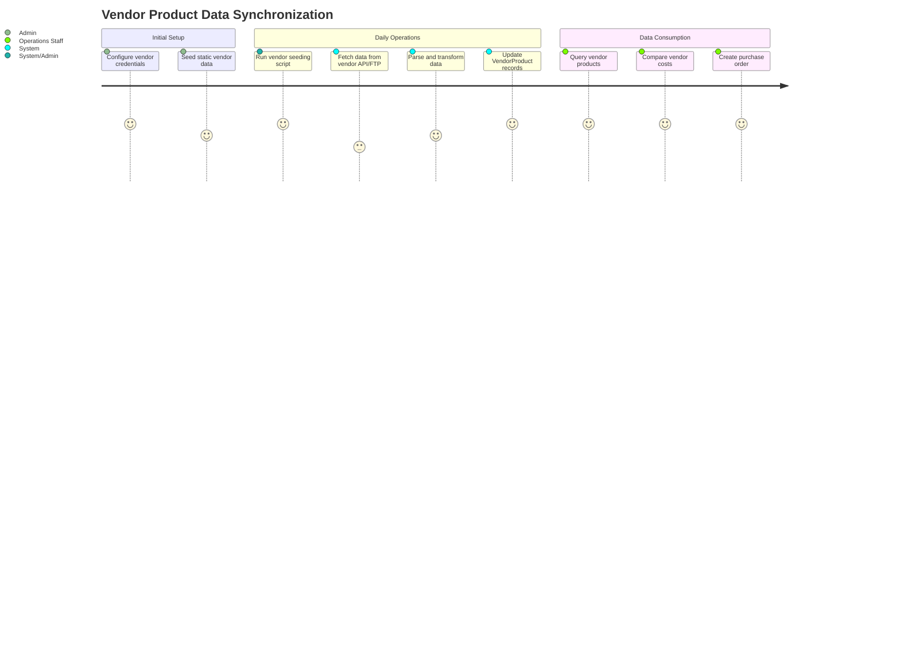
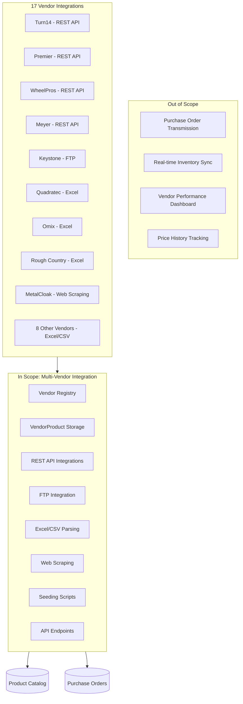
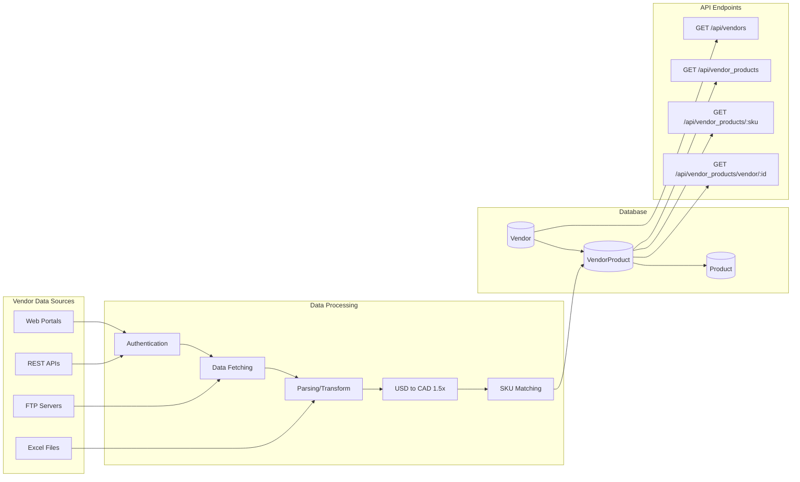

# PRD: Multi-Vendor Product Integration

## Overview

### One-line Summary
A comprehensive vendor integration system that synchronizes product cost, inventory, and SKU mapping data from 17 automotive parts vendors using multiple integration methods (REST APIs, FTP downloads, Excel/CSV parsing, and web scraping).

### Background
JustJeeps operates as an e-commerce retailer for Jeep and off-road vehicle parts, sourcing products from multiple distributors and manufacturers. Each vendor has different systems for providing pricing and inventory data, requiring a flexible integration architecture that can:
- Handle diverse data formats (XML, JSON, CSV, Excel)
- Support various connectivity protocols (REST API, FTP, web scraping)
- Convert USD pricing to CAD (1.5x exchange rate factor)
- Map vendor-specific SKUs to internal product catalog

This feature enables automated cost tracking, real-time inventory visibility, and streamlined purchase order creation by maintaining current vendor product data in the system.

## User Stories

### Primary Users
1. **Purchasing/Operations Team**: Staff responsible for creating purchase orders and managing vendor relationships
2. **E-commerce Manager**: Personnel monitoring product pricing and availability
3. **System Administrators**: Technical staff maintaining integrations and troubleshooting issues

### User Stories

```
As a purchasing team member
I want to see current vendor costs and inventory for products
So that I can select the optimal vendor for each purchase order
```

```
As an e-commerce manager
I want automatic synchronization of vendor pricing data
So that I can maintain accurate margins without manual data entry
```

```
As a system administrator
I want individual seeding scripts for each vendor
So that I can update specific vendor data without affecting others
```

```
As a purchasing team member
I want to query vendor products by SKU
So that I can quickly compare pricing across multiple suppliers
```

### Use Cases

1. **Daily Pricing Updates**: System automatically fetches latest cost data from API-enabled vendors (Turn14, Premier, WheelPros, Meyer) to keep pricing current
2. **Inventory Visibility**: Operations staff checks vendor inventory levels before creating purchase orders to ensure product availability
3. **New Product Onboarding**: When adding products to the catalog, staff can link them to vendor SKUs for automatic cost/inventory tracking
4. **Vendor Comparison**: Staff queries vendor products by SKU to compare costs across multiple suppliers for optimal purchasing decisions
5. **Manual Data Import**: For vendors without APIs, staff triggers Excel/CSV import after receiving updated pricing sheets from vendors

## Functional Requirements

### Must Have (MVP)

- [x] **Vendor Registry**: Maintain a registry of 17 vendors with contact information and credentials
  - AC: All 17 vendors are stored in the Vendor table with name, website, and authentication details

- [x] **VendorProduct Data Model**: Store vendor-specific product data including cost, inventory, and SKU mappings
  - AC: VendorProduct table contains product_sku, vendor_id, vendor_sku, vendor_cost, vendor_inventory, and vendor_inventory_string fields

- [x] **REST API Integration**: Support OAuth2/token-based REST API integration for vendors
  - AC: Turn14 (OAuth2 client credentials), Premier (API key + session token), and WheelPros (username/password auth) integrations are functional

- [x] **FTP Integration**: Download and parse CSV files from vendor FTP servers
  - AC: Keystone FTP integration downloads Inventory.csv and SpecialOrder.csv with resume capability on connection failures

- [x] **Excel/CSV Parsing**: Import vendor data from Excel and CSV files
  - AC: Quadratec, Omix, Rough Country, AEV, and other vendors can be seeded from local Excel files

- [x] **Web Scraping**: Extract pricing data from vendor portals requiring manual login
  - AC: MetalCloak scraper with Puppeteer extracts pricing from jobber portal after manual CAPTCHA solving

- [x] **USD to CAD Conversion**: Apply currency conversion factor to USD pricing
  - AC: All USD prices are multiplied by 1.5 before storing as vendor_cost

- [x] **Vendor Product API Endpoints**: Expose RESTful endpoints for querying vendor product data
  - AC: GET /api/vendors, GET /api/vendor_products, GET /api/vendor_products/:sku, GET /api/vendor_products/vendor/:id endpoints are functional

- [x] **Individual Seeding Scripts**: Provide per-vendor npm scripts for targeted data updates
  - AC: npm run seed-{vendor} commands exist for all 17 vendors (e.g., seed-meyer, seed-keystone, seed-quadratec, seed-turn14-production, seed-daily-premier)

### Should Have

- [x] **Batch Processing**: Process API requests in configurable batch sizes with rate limiting
  - AC: Turn14 uses 5-item batches with 1-second delays; Premier uses 10-item batches with 50-item API limit; WheelPros uses 50-SKU chunks

- [x] **Error Handling and Logging**: Comprehensive error handling with detailed console logging
  - AC: Each seeder logs created/updated counts, skipped items, and error details

- [x] **Rate Limit Management**: Respect vendor API rate limits to avoid throttling
  - AC: Turn14 tracks 3000 requests/hour limit; Premier includes 2-second delays between batches; Meyer uses 100ms delays between requests

- [x] **Manufacturer SKU Mapping**: Support multiple vendor SKU formats per product
  - AC: Product model includes vendor-specific code fields (meyer_code, keystone_code, t14_code, premier_code, quadratec_code, rough_country_code)

### Could Have

- [ ] **Scheduled Automation**: Cron-based automatic execution of seeding scripts
  - Note: node-cron dependency exists but automated scheduling not implemented

- [ ] **Webhook Notifications**: Real-time notifications when vendor data changes
  - Note: Not currently implemented

- [ ] **Historical Price Tracking**: Store price history for trend analysis
  - Note: Current implementation overwrites existing prices; no history table

- [ ] **Vendor Performance Metrics**: Dashboard for tracking integration success rates
  - Note: Not currently implemented

### Out of Scope

- **Order Transmission**: Sending purchase orders to vendors via API (handled by separate purchase order feature)
- **Real-time Inventory Sync**: Live inventory updates on customer-facing site (data is batch-processed)
- **Multi-currency Support**: Support for currencies other than USD and CAD
- **Vendor Onboarding Wizard**: Self-service tool for adding new vendors

## Non-Functional Requirements

### Performance
- **Seeding Duration**: Individual vendor seeding should complete within 30 minutes for full catalog
- **API Response Time**: Vendor product queries should return within 500ms
- **Batch Processing**: API integrations should process minimum 50 SKUs per minute while respecting rate limits

### Reliability
- **Resume Capability**: FTP downloads should support resume on connection failure
- **Retry Logic**: API calls should retry up to 3 times on transient failures
- **Partial Failure Handling**: Seeding should continue processing remaining items after individual item errors

### Security
- **Credential Storage**: Vendor credentials stored in environment variables, not in code
- **Token Caching**: OAuth tokens cached and refreshed before expiry (60-second buffer for Turn14, 23-hour cache for Premier)

### Scalability
- **Product Volume**: System handles 20,000+ product SKUs with multiple vendor mappings per product
- **Vendor Addition**: Architecture supports adding new vendors without modifying existing integrations

## Success Criteria

### Quantitative Metrics
1. **Data Coverage**: 95%+ of active products have at least one vendor cost record
2. **Data Freshness**: API-enabled vendor data updated within 24 hours of vendor changes
3. **Integration Reliability**: 99% success rate for scheduled seeding operations
4. **Processing Throughput**: Complete full vendor sync for all 17 vendors within 4 hours

### Qualitative Metrics
1. **Staff Efficiency**: Purchasing team can identify optimal vendor without manual lookups
2. **Data Accuracy**: Vendor costs match actual vendor invoices (accounting for conversion factor)
3. **System Maintainability**: New vendor integrations can be added within 1-2 development days

## Technical Considerations

### Dependencies

**Internal Systems**:
- PostgreSQL database with Prisma ORM
- Express.js server (monolithic architecture in server.js)
- Product model with vendor-specific code fields

**External Services**:
- Turn14 REST API (api.turn14.com)
- Premier Performance REST API (api.premierwd.com/api/v5)
- WheelPros REST API (api.wheelpros.com)
- Meyer API (meyerapi.meyerdistributing.com)
- Keystone FTP server (ftp.ekeystone.com, port 990)
- Omix inventory API
- Quadratec inventory API

**Libraries**:
- axios: HTTP client for API calls
- basic-ftp: FTP client for Keystone
- xlsx: Excel file parsing
- csv-parser: CSV file parsing
- puppeteer: Web scraping for MetalCloak

### Constraints

- **Rate Limits**: Turn14 (5 req/sec, 5000/hour, 30000/day), Premier (50 items/batch), Meyer (100ms between requests)
- **Authentication Methods**: Multiple auth flows (OAuth2, API Key, Username/Password) must be supported
- **Data Formats**: Must handle JSON, XML, CSV, and Excel formats
- **Manual Login Required**: MetalCloak requires manual CAPTCHA solving before scraping

### Assumptions

- [x] Vendor APIs remain stable and maintain backward compatibility
- [x] USD to CAD conversion rate of 1.5x is appropriate for business purposes
- [x] Products already exist in catalog before vendor data is seeded (no product creation)
- [x] Environment variables are configured correctly before running seeders

### Risks and Mitigation

| Risk | Impact | Probability | Mitigation |
|------|--------|-------------|------------|
| Vendor API changes break integration | High | Medium | Monitor vendor changelogs; implement graceful degradation |
| Rate limit exceeded causes API blocking | High | Medium | Conservative rate limiting; exponential backoff |
| FTP connection instability | Medium | Medium | Resume capability; retry logic with delay |
| Credential expiration | High | Low | Token caching with automatic refresh; monitoring |
| Data format changes in Excel files | Medium | Medium | Validate expected columns; log warnings for missing fields |
| MetalCloak CAPTCHA becomes unbreakable | Low | Low | Alternative: vendor provides direct data feed |

## User Journey Diagram



## Scope Boundary Diagram



## Vendor Integration Matrix

| Vendor | Vendor ID | Integration Method | Data Provided | Currency | Seed Script |
|--------|-----------|-------------------|---------------|----------|-------------|
| Keystone | 1 | FTP (CSV) | Cost, Inventory | USD | seed-keystone-ftp |
| Meyer | 2 | REST API | Cost, Inventory, Dimensions | USD | seed-meyer |
| Omix | 3 | Excel + API | Cost, Inventory | USD | seed-omix, seed-omix-inventory |
| Quadratec | 4 | Excel + API | Cost, Inventory | USD | seed-quadratec, seed-quad-inventory |
| WheelPros | 5 | REST API | Cost (MSRP, MAP, NIP) | CAD | seed-wheelPros, seed-wp-inventory |
| Dirty Dog 4x4 | 6 | Excel | Cost | USD | seed-dirtyDog |
| Tire Discounter | 7 | REST API | Cost, Inventory | CAD | seed-tireDiscounter |
| AEV | 8 | Excel | Cost | USD | seed-aev |
| Rough Country | 9 | Excel | Cost, Inventory, MAP | USD | seed-roughCountry |
| Downsview | 10 | Excel | Cost | USD | - |
| KeyParts | 11 | Excel | Cost | USD | seed-keyparts |
| CTP | 12 | Excel | Cost | USD | seed-ctp |
| Alpine | 13 | Excel | Cost | USD | seed-alpine |
| Curt | 14 | Excel | Cost | USD | seed-curt |
| Turn14 (T14) | 15 | REST API (OAuth2) | Cost, Inventory | USD | seed-turn14-production, seed-daily-turn14-production |
| Premier Performance | 16 | REST API | Cost, Inventory | USD | seed-daily-premier |
| MetalCloak | 17 | Web Scraping | Cost | USD | scrape-metalcloak, seed-metalcloak |

## Data Flow Diagram



## Appendix

### References
- Turn14 API Documentation: https://api.turn14.com/documentation
- Premier Performance API v5
- Prisma ORM Documentation: https://www.prisma.io/docs

### Glossary
- **Vendor**: A supplier or distributor from which JustJeeps purchases products
- **VendorProduct**: A mapping record linking a product to a specific vendor with cost and inventory data
- **SKU Mapping**: The association between JustJeeps internal product SKU and vendor-specific part numbers
- **Seeding**: The process of importing/updating vendor data into the database
- **FTP**: File Transfer Protocol, used by Keystone for data exchange
- **OAuth2**: Authentication protocol used by Turn14 API
- **Jobber Portal**: Wholesale customer portal (e.g., MetalCloak's jobber.metalcloak.com)
- **MAP**: Minimum Advertised Price set by manufacturers

### Database Schema Reference

**Vendor Model**:
```prisma
model Vendor {
  id             Int             @id @default(autoincrement())
  name           String
  website        String
  address        String?
  phone_number   String?
  main_contact   String
  username       String
  password       String
  purchaseOrders PurchaseOrder[]
  vendorProducts VendorProduct[]
}
```

**VendorProduct Model**:
```prisma
model VendorProduct {
  id                      Int            @id @default(autoincrement())
  product_sku             String
  vendor_id               Int
  vendor_sku              String
  vendor_cost             Float
  vendor_inventory        Float?
  partStatus_meyer        String?
  vendor_inventory_string String?
  quadratec_sku           String?
  manufacturer_sku        String?
  orderProducts           OrderProduct[]
  product                 Product        @relation(fields: [product_sku], references: [sku], onDelete: Cascade)
  vendor                  Vendor         @relation(fields: [vendor_id], references: [id])
}
```

**Product Vendor Code Fields**:
- `meyer_code`: Meyer Distributing part number
- `keystone_code`: Keystone Automotive part number
- `t14_code`: Turn14 part number
- `premier_code`: Premier Performance item number
- `quadratec_code`: Quadratec wholesale part number
- `rough_country_code`: Rough Country SKU
- `gentecdirect_code`: Gentec Direct code
- `tdot_code`: Tire Discounter code
- `ctp_code`: CTP part number
- `partsEngine_code`: PartsEngine code

### Environment Variables Required

```env
# Turn14 API
TURN14_CLIENT_ID=
TURN14_CLIENT_SECRET=
TURN14_ENVIRONMENT=production

# Premier Performance API
PREMIER_API_KEY=
PREMIER_BASE_URL=https://api.premierwd.com/api/v5

# WheelPros API
WHEELPROS_USER=
WHEELPROS_PASS=

# Meyer API
MEYER_USERNAME=
MEYER_PASSWORD=
MEYER_KEY=

# Keystone FTP (credentials in code - should be moved to env)
# FTP_HOST=ftp.ekeystone.com
# FTP_USER=
# FTP_PASS=
```

---

**Document Version**: 1.0
**Created**: 2026-01-23
**Status**: Final (Reverse-Engineered from Implementation)
