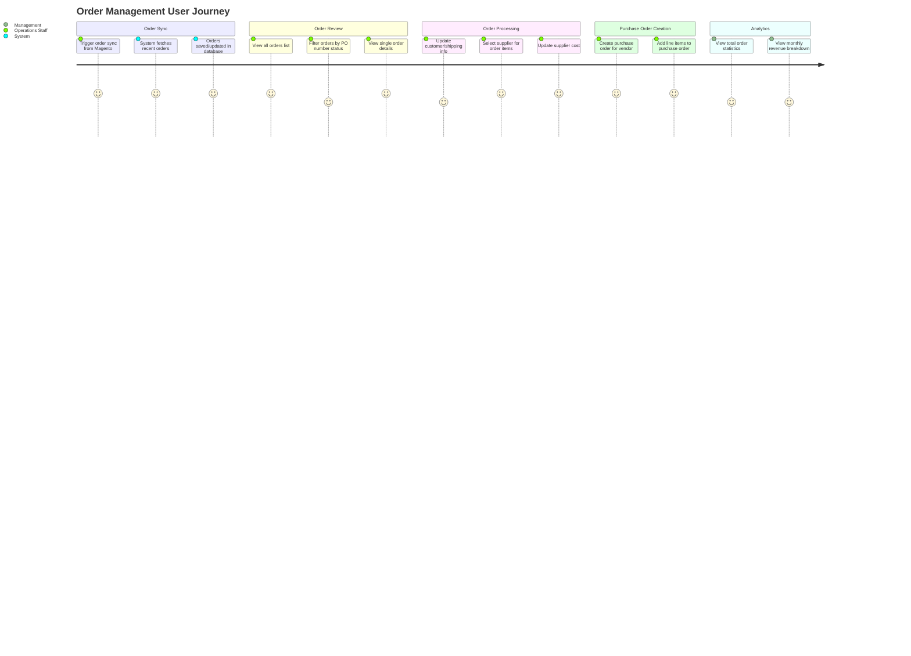
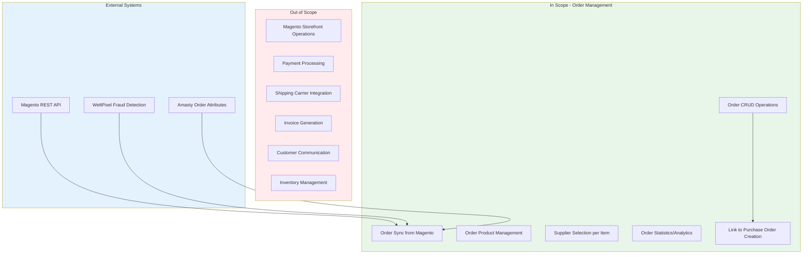

# PRD: Order Management

**Version**: 1.0.0
**Status**: Verified (Reverse-Engineered)
**Created**: 2026-01-23
**Last Updated**: 2026-01-23

---

## Overview

### One-line Summary

Order lifecycle management system that synchronizes orders from Magento storefront, tracks customer and shipping information, manages order items with pricing/discounts, and enables purchase order creation workflow for vendor fulfillment.

### Background

JustJeeps operates an e-commerce storefront powered by Magento for selling Jeep parts and accessories. The internal operations team requires a centralized system to:

1. View and manage orders placed through the Magento storefront
2. Track complete customer and shipping information
3. Monitor fraud risk scores (via WeltPixel integration)
4. Manage custom PO numbers for B2B customers
5. Select suppliers for order items and track supplier costs
6. Create purchase orders to vendors for order fulfillment
7. Analyze order statistics and revenue trends

This feature bridges the gap between the customer-facing Magento storefront and internal operations, enabling efficient order processing and vendor management.

---

## User Journey Diagram



---

## Scope Boundary Diagram



---

## User Stories

### Primary Users

| User Type | Role Description | Primary Goals |
|-----------|------------------|---------------|
| Operations Staff | Processes orders, selects suppliers, creates POs | Efficient order processing, accurate supplier selection |
| Management | Monitors sales performance and trends | Revenue visibility, order volume tracking |
| System Administrator | Maintains data synchronization | Reliable Magento sync, data integrity |

### User Stories

**US-1: Order Synchronization**
```
As an Operations Staff member
I want to sync orders from Magento storefront
So that I can process orders without manually entering data
```

**US-2: Order Review**
```
As an Operations Staff member
I want to view all orders with their items sorted by creation date
So that I can prioritize processing recent orders
```

**US-3: Order Details Update**
```
As an Operations Staff member
I want to update customer and shipping information on orders
So that I can correct errors or update delivery addresses
```

**US-4: Supplier Selection**
```
As an Operations Staff member
I want to select a supplier for each order item and record supplier cost
So that I can create accurate purchase orders to vendors
```

**US-5: Order Statistics**
```
As a Manager
I want to view total revenue, order count, and monthly breakdowns
So that I can monitor business performance
```

**US-6: Custom PO Number Tracking**
```
As an Operations Staff member
I want to see custom PO numbers from B2B customers
So that I can reference them in vendor communications
```

### Use Cases

1. **Daily Order Processing**: Staff triggers order sync, reviews new orders, selects suppliers for each item based on availability and cost, then creates purchase orders to fulfill customer orders.

2. **Address Correction**: Customer contacts support to update shipping address; staff locates order and updates shipping details.

3. **Fraud Review**: Staff reviews orders with high WeltPixel fraud scores before processing to minimize chargebacks.

4. **Monthly Reporting**: Management reviews monthly revenue totals and order counts to assess business performance.

5. **Supplier Cost Analysis**: Staff compares order item prices against supplier costs to ensure profitability before creating purchase orders.

---

## Functional Requirements

### Must Have (MVP)

- [x] **FR-1**: Synchronize orders from Magento API
  - AC: Given a sync request, when the system calls Magento API, then up to 400 recent orders are fetched and stored/updated in the database
  - AC: Existing orders are updated; new orders are created with all associated order products

- [x] **FR-2**: Store complete order information including:
  - Customer details (email, first name, last name)
  - Order totals (grand total, base total due, shipping amount)
  - Order metadata (increment ID, currency code, status, coupon code)
  - Shipping address (full address with street lines 1-3, city, region, postal code, country, phone, company)
  - Custom attributes (custom PO number, payment method title)
  - Fraud score (WeltPixel fraud score)
  - AC: All listed fields are persisted and retrievable via API

- [x] **FR-3**: List all orders with associated items
  - AC: GET /api/orders returns all orders sorted by created_at descending
  - AC: Each order includes items with base_price > 0 and associated product information

- [x] **FR-4**: Retrieve single order details
  - AC: GET /api/orders/:id returns order by entity_id with all fields

- [x] **FR-5**: Update order information
  - AC: POST /api/orders/:id/edit updates customer info, totals, and shipping address
  - AC: Updated order is returned in response

- [x] **FR-6**: Delete order
  - AC: POST /api/orders/:id/delete removes order from database
  - AC: Cascade delete removes associated order products (via database constraint)

- [x] **FR-7**: Manage order products (line items)
  - AC: GET /api/order_products returns all order products with order and product relations
  - AC: POST /order_products creates new order product with pricing details
  - AC: POST /order_products/:id/edit updates order product including supplier selection
  - AC: DELETE /order_products/:id/delete removes order product and returns updated orders list

- [x] **FR-8**: Select supplier for order items
  - AC: POST /order_products/:id/edit/selected_supplier updates selected_supplier and selected_supplier_cost fields

- [x] **FR-9**: Get order statistics
  - AC: GET /totalOrderInfo returns sum of grand_total, count of orders, average order value, and total quantity ordered

- [x] **FR-10**: Get monthly revenue breakdown
  - AC: GET /totalGrandTotalByMonth returns orders grouped by YYYY-MM, current month total, and last month total

### Nice to Have

- [ ] **FR-11**: Filter orders by custom_po_number status (commented code exists for "Not set" filter)
- [ ] **FR-12**: Paginated order list for performance with large datasets
- [ ] **FR-13**: Order search by customer email, increment ID, or PO number

### Out of Scope

- **Order Creation**: Orders are only created via Magento sync, not through this API
  - Reason: Customer orders originate from the Magento storefront
- **Payment Processing**: No payment capture or refund functionality
  - Reason: Handled by Magento/payment gateway
- **Shipping Label Generation**: No carrier integration
  - Reason: Separate shipping workflow
- **Email Notifications**: No customer communication features
  - Reason: Handled by Magento
- **Order Status Synchronization**: Status updates are not pushed back to Magento
  - Reason: One-way sync from Magento only

---

## Non-Functional Requirements

### Performance

| Metric | Current Implementation | Target |
|--------|----------------------|--------|
| Order List Response | No pagination, full dataset | < 2 seconds for up to 1000 orders |
| Single Order Fetch | Direct lookup by entity_id | < 200ms |
| Order Sync (400 orders) | Sequential processing | < 60 seconds |
| Monthly Stats | Fetches all orders, in-memory aggregation | < 3 seconds |

### Reliability

| Metric | Current State | Notes |
|--------|--------------|-------|
| Sync Error Handling | Per-order try/catch with continue | Individual order failures do not halt sync |
| Database Cascade | ON DELETE CASCADE for order products | Data integrity maintained |
| Duplicate Prevention | Check existing by entity_id | Upsert pattern prevents duplicates |

### Data Integrity

- Order products reference orders via foreign key with cascade delete
- Order products reference products via SKU with cascade delete
- Unique constraint on order entity_id

### Security

- CORS restricted to localhost:5173 and production frontend domain
- Authentication middleware available (ENABLE_AUTH feature flag)
- Magento API key stored in environment variable (MAGENTO_KEY)

### Scalability

| Consideration | Current State | Limitation |
|--------------|---------------|------------|
| Order Volume | 400 orders per sync | Configurable parameter in sync function |
| Database | PostgreSQL with Prisma ORM | Horizontally scalable |
| API | Express.js monolith | Single instance |

---

## Data Model

### Order Entity

```
Order
  - entity_id: Int (Primary Key, from Magento)
  - id: Int (Auto-increment, unique)
  - created_at: String (ISO timestamp)
  - increment_id: String (Magento order number)
  - status: String? (Order status)
  - grand_total: Float
  - base_total_due: Float?
  - shipping_amount: Float?
  - shipping_description: String?
  - order_currency_code: String
  - total_qty_ordered: Int
  - coupon_code: String?
  - custom_po_number: String? (from Amasty extension)
  - weltpixel_fraud_score: Float? (from WeltPixel extension)
  - method_title: String? (Payment method)
  - Customer Info:
    - customer_email: String
    - customer_firstname: String?
    - customer_lastname: String?
  - Billing Location:
    - city: String?
    - region: String?
  - Shipping Address:
    - shipping_firstname: String?
    - shipping_lastname: String?
    - shipping_company: String?
    - shipping_street1: String?
    - shipping_street2: String?
    - shipping_street3: String?
    - shipping_city: String?
    - shipping_region: String?
    - shipping_postcode: String?
    - shipping_country_id: String?
    - shipping_telephone: String?
  - Relations:
    - items: OrderProduct[]
    - purchaseOrder: PurchaseOrder[]
```

### OrderProduct Entity

```
OrderProduct
  - id: Int (Primary Key, auto-increment)
  - order_id: Int (FK to Order.entity_id)
  - product_id: Int?
  - sku: String (FK to Product.sku)
  - name: String
  - Pricing:
    - base_price: Float
    - base_price_incl_tax: Float?
    - original_price: Float
    - price: Float
    - price_incl_tax: Float?
  - Discounts:
    - discount_amount: Float
    - discount_invoiced: Float
    - discount_percent: Float
  - Quantity:
    - qty_ordered: Int
  - Supplier Selection:
    - selected_supplier: String?
    - selected_supplier_cost: String?
    - vendor_product_id: Int? (FK to VendorProduct)
  - Relations:
    - order: Order
    - product: Product
    - vendorProduct: VendorProduct?
```

---

## API Specification

### Order Endpoints

| Method | Endpoint | Description | Request Body | Response |
|--------|----------|-------------|--------------|----------|
| GET | /api/orders | List all orders with items | - | Order[] with items (base_price > 0) |
| GET | /api/orders/:id | Get single order | - | Order |
| POST | /api/orders/:id/edit | Update order | customer_email, names, totals, shipping fields | Updated Order |
| POST | /api/orders/:id/delete | Delete order | - | Deleted Order |
| GET | /api/seed-orders | Trigger Magento sync | - | "Orders seeded successfully" |

### Order Product Endpoints

| Method | Endpoint | Description | Request Body | Response |
|--------|----------|-------------|--------------|----------|
| GET | /api/order_products | Get all order products | - | OrderProduct[] with order & product |
| POST | /order_products | Create order product | order_id, name, sku, pricing fields, qty_ordered | Created OrderProduct |
| POST | /order_products/:id/edit | Update order product | All fields including selected_supplier | Updated OrderProduct |
| POST | /order_products/:id/edit/selected_supplier | Update supplier selection | All fields | Updated OrderProduct |
| DELETE | /order_products/:id/delete | Delete order product | - | Order[] (refreshed list) |

### Analytics Endpoints

| Method | Endpoint | Description | Response |
|--------|----------|-------------|----------|
| GET | /totalOrderInfo | Order statistics | { totalSum, count, avg, totalQty } |
| GET | /totalGrandTotalByMonth | Monthly totals | { orders, total_by_month, total_this_month, total_last_month } |

---

## Integration Points

### Magento REST API Integration

**Endpoint**: `https://www.justjeeps.com/rest/V1/orders/`

**Authentication**: Bearer token via MAGENTO_KEY environment variable

**Data Retrieved**:
- Core order fields (entity_id, created_at, status, totals, customer info)
- Order items with pricing details
- Extension attributes:
  - `amasty_order_attributes` for custom_po_number
  - `weltpixel_fraud_score` for fraud detection
  - `shipping_assignments` for shipping address
  - `payment_additional_info` for payment method

**Sync Behavior**:
- Fetches up to 400 most recent orders (configurable)
- Creates new orders with all items
- Updates existing orders and refreshes all items (delete + recreate)
- Errors on individual orders do not halt the sync process

### Purchase Order Integration

Orders link to PurchaseOrder entities via:
- `Order.purchaseOrder[]` relation
- `PurchaseOrder.order_id` foreign key to `Order.entity_id`

This enables the workflow of selecting suppliers for order items, then creating purchase orders to vendors.

---

## Success Criteria

### Quantitative Metrics

| Metric | Measurement | Target |
|--------|-------------|--------|
| Order Sync Success Rate | (Successful syncs / Total syncs) x 100 | > 99% |
| Data Accuracy | Orders matching Magento source | 100% field parity |
| API Response Time | 95th percentile latency | < 500ms for list operations |
| System Uptime | Monthly availability | > 99.5% |

### Qualitative Metrics

| Metric | Assessment Method |
|--------|------------------|
| User Efficiency | Reduced time to process orders vs manual Magento review |
| Data Accessibility | All order information available in single interface |
| Workflow Integration | Seamless transition from order review to purchase order creation |

---

## Technical Considerations

### Dependencies

| Dependency | Type | Purpose |
|------------|------|---------|
| Magento REST API | External | Order data source |
| PostgreSQL | Database | Order storage |
| Prisma ORM | Internal | Database access |
| Express.js | Internal | API framework |
| date-fns | Internal | Date formatting for monthly aggregation |
| axios | Internal | Magento API calls |

### Constraints

1. **One-way Sync**: Data flows from Magento to this system only; no write-back
2. **Entity ID Dependency**: Orders use Magento's entity_id as primary key
3. **SKU Requirement**: Order products require matching product SKU in Products table
4. **No Real-time Sync**: Manual trigger required to sync orders

### Assumptions

- [VERIFIED] Magento API is available and returns data in expected format
- [VERIFIED] Products exist in database before order items can be synced (SKU foreign key)
- [VERIFIED] WeltPixel fraud detection extension is installed on Magento
- [VERIFIED] Amasty order attributes extension provides custom_po_number field

### Risks and Mitigation

| Risk | Impact | Probability | Mitigation |
|------|--------|-------------|------------|
| Magento API unavailable | High | Low | Error handling with retry, graceful degradation |
| SKU mismatch (product not in DB) | Medium | Medium | Pre-sync product catalog; error logging per item |
| Large order volume exceeds sync capacity | Medium | Low | Configurable page size; potential pagination |
| Data format changes in Magento API | High | Low | Defensive parsing; field existence checks |

---

## Appendix

### References

- Magento REST API Documentation
- WeltPixel Fraud Detection Extension
- Amasty Order Attributes Extension
- Prisma ORM Documentation

### Glossary

| Term | Definition |
|------|------------|
| entity_id | Magento's unique identifier for orders |
| increment_id | Human-readable order number (e.g., "100001234") |
| custom_po_number | Purchase order number provided by B2B customers |
| WeltPixel Fraud Score | Numeric risk score from fraud detection extension |
| base_price | Item price before tax |
| grand_total | Total order amount including tax and shipping |
| selected_supplier | Vendor chosen to fulfill specific order item |

### Related Files

| File | Description |
|------|-------------|
| `/server.js` (lines 329-647) | Order and OrderProduct API endpoints |
| `/schema.prisma` | Order and OrderProduct data models |
| `/prisma/seeds/seed-individual/seed-orders.js` | Magento sync logic |
| `/prisma/seeds/api-calls/magento-recentOrders.js` | Magento API client |
