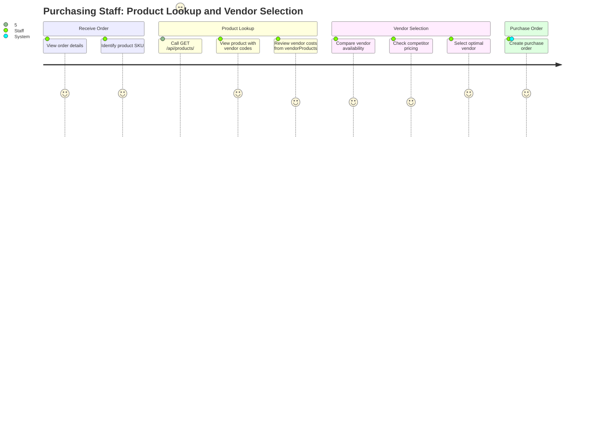
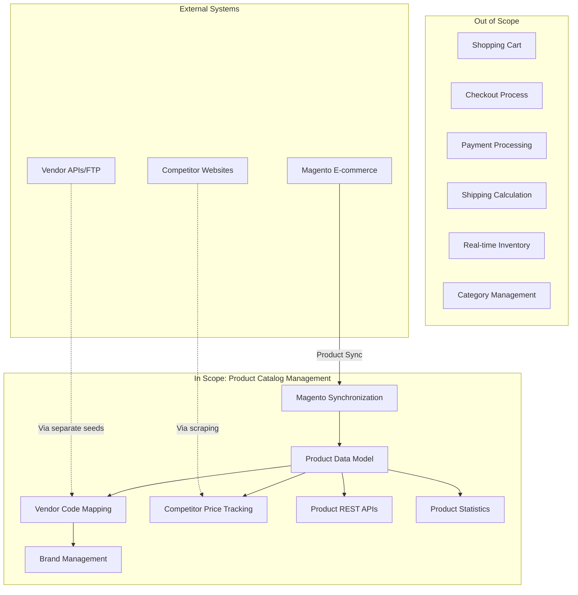

# PRD: Product Catalog Management

## Document Information

| Attribute | Value |
|-----------|-------|
| Version | 1.0.0 |
| Status | Verified (Reverse-Engineered) |
| Created | 2026-01-23 |
| Last Updated | 2026-01-23 |
| Author | Reverse-engineered from existing implementation |

---

## Overview

### One-line Summary
Core product catalog system managing 20,000+ automotive aftermarket SKUs with multi-vendor support, vendor-specific code mappings, brand management, and competitive pricing integration.

### Background
JustJeeps operates an e-commerce platform specializing in Jeep and off-road vehicle aftermarket parts and accessories. The Product Catalog Management system is the foundational data layer that:

1. Maintains a centralized product database synchronized from Magento e-commerce platform
2. Maps JustJeeps internal SKUs to multiple vendor-specific codes (Meyer, Keystone, Turn14, Premier, etc.)
3. Supports competitive pricing analysis by linking products to competitor pricing data
4. Enables efficient vendor sourcing by maintaining cost and inventory data from 13+ vendors
5. Provides product analytics for business decision-making

The system supports the core business workflow: receive customer orders, identify optimal vendor sources based on cost/availability, and create purchase orders.

---

## User Stories

### Primary Users

| User Type | Description |
|-----------|-------------|
| Purchasing Staff | Staff who select vendors and create purchase orders for customer orders |
| Operations Manager | Oversees inventory, pricing strategy, and vendor relationships |
| System Administrators | Maintain data synchronization and system integrations |
| Frontend Application | Internal tools dashboard consuming product data via API |

### User Stories

**Purchasing Staff**
```
As a purchasing staff member
I want to view product details with all vendor-specific codes and costs
So that I can quickly identify the best vendor to source each product from
```

```
As a purchasing staff member
I want to see competitor pricing alongside our product pricing
So that I can ensure our pricing remains competitive
```

**Operations Manager**
```
As an operations manager
I want to see top-selling products and total product counts
So that I can make informed inventory and purchasing decisions
```

```
As an operations manager
I want to view all products by brand
So that I can analyze our catalog composition and brand partnerships
```

**System Administrator**
```
As a system administrator
I want product data to be automatically synchronized from Magento
So that the catalog stays current without manual intervention
```

### Use Cases

1. **Vendor SKU Lookup**: Purchasing staff receives an order, looks up the product SKU, identifies available vendor codes (Meyer, Keystone, Turn14), compares costs, and selects optimal supplier.

2. **Competitive Price Monitoring**: Operations reviews product with competitor pricing data to ensure MAP compliance and competitive positioning.

3. **Catalog Synchronization**: System fetches product data from Magento API in paginated batches, transforms SKU formats, generates vendor codes, and upserts into database.

4. **Popular Products Analysis**: Management reviews top 10 best-selling products to inform purchasing and stocking decisions.

5. **Brand Catalog Review**: Staff filters products by brand to evaluate vendor performance and catalog coverage.

---

## Functional Requirements

### Must Have (MVP)

- [x] **FR-001**: Product data model with unique SKU as primary identifier
  - AC: Products are uniquely identified by `sku` field (primary key)
  - AC: SKU format follows pattern: `{JJ_PREFIX}-{searchable_sku}` (e.g., "BST-52401-01")
  - Verified: `schema.prisma` lines 70-114

- [x] **FR-002**: Multi-vendor code mapping per product
  - AC: Each product stores vendor-specific codes for: Meyer, Keystone, Quadratec, Turn14, Premier, Omix, TDot, CTP, PartsEngine
  - AC: Vendor codes are auto-generated based on JJ prefix mapping rules during sync
  - Verified: `seed-allProducts.js` lines 44-198

- [x] **FR-003**: Vendor product relationship with cost and inventory
  - AC: Products link to VendorProduct records containing vendor_sku, vendor_cost, vendor_inventory
  - AC: VendorProduct includes partStatus_meyer and quadratec_sku for vendor-specific tracking
  - Verified: `schema.prisma` lines 116-130

- [x] **FR-004**: List all products with vendor and competitor information
  - AC: `GET /api/products` returns all products with nested vendorProducts and competitorProducts
  - AC: Response includes: sku, name, price, MAP, brand_name, status, image, dimensions, all vendor codes
  - Verified: `server.js` lines 170-240

- [x] **FR-005**: Retrieve single product by SKU
  - AC: `GET /api/products/:sku` returns complete product with all vendor and competitor data
  - AC: Returns 500 error with message if product fetch fails
  - Verified: `server.js` lines 243-311

- [x] **FR-006**: Get product brand by SKU
  - AC: `GET /api/products/:sku/brand` returns `{ brand: "<brand_name>" }` or `{ brand: null }`
  - Verified: `server.js` lines 154-166

- [x] **FR-007**: List all product SKUs
  - AC: `GET /api/products_sku` returns array of objects with `sku` field only
  - AC: Limits to 20,001 records maximum
  - Verified: `server.js` lines 140-152

- [x] **FR-008**: Get unique brand names
  - AC: `GET /brands` returns array of distinct `brand_name` values from products
  - Verified: `server.js` lines 313-327

- [x] **FR-009**: Product count statistics
  - AC: `GET /productinfo` returns `{ numProduct: <count>, totalSold: <sum_qty_ordered> }`
  - Verified: `server.js` lines 1013-1033

- [x] **FR-010**: Top popular products
  - AC: `GET /toppopularproduct` returns top 10 products by total qty_ordered
  - AC: Response includes full product details merged with qty_ordered sum
  - Verified: `server.js` lines 1036-1073

- [x] **FR-011**: Top 5 SKUs by quantity ordered
  - AC: `GET /top5skus` returns top 10 products grouped by SKU with qty_ordered sum
  - AC: Includes full product details for each SKU
  - Verified: `server.js` lines 103-137

- [x] **FR-012**: Competitor product tracking
  - AC: Products have one-to-many relationship with CompetitorProduct
  - AC: CompetitorProduct stores: competitor_price, product_url, competitor reference
  - Verified: `schema.prisma` lines 185-194

- [x] **FR-013**: Magento synchronization
  - AC: Sync fetches products from Magento REST API in pages of 5,000 items
  - AC: Supports up to 19 pages (95,000 products maximum)
  - AC: Handles rate limiting with 400ms delay between pages
  - Verified: `magento-allProducts.js` lines 1-87

- [x] **FR-014**: SKU transformation and vendor code generation
  - AC: JJ prefix extracted from first segment before hyphen
  - AC: Searchable SKU extracted after first hyphen
  - AC: Vendor codes generated per brand-specific rules (e.g., Bestop adds hyphen after 5 digits)
  - Verified: `seed-allProducts.js` lines 32-200

- [x] **FR-015**: Product attributes from Magento custom attributes
  - AC: Extracts: searchable_sku, url_path, length, width, height, shipping_freight, part, thumbnail, black_friday_sale_attribute
  - AC: Dimensions stored as Float, nullable
  - Verified: `seed-allProducts.js` lines 216-290

### Nice to Have

- [ ] **FR-016**: Batch product update API
  - Description: Ability to update multiple products in single request
  - Not currently implemented

- [ ] **FR-017**: Product search/filter API
  - Description: Search products by name, brand, or partial SKU
  - Not currently implemented

- [ ] **FR-018**: Pagination for product listing
  - Description: Paginated product list to handle large datasets efficiently
  - Not currently implemented (returns all products)

### Out of Scope

- **Product creation via API**: Products are synced from Magento, not created through API
- **Product deletion**: No delete endpoint exists; products managed via Magento
- **Image management**: Images referenced by URL from Magento CDN
- **Category management**: Categories not part of current data model
- **Product variants/options**: Flat product structure without variant support

---

## Non-Functional Requirements

### Performance

| Metric | Current Behavior | Notes |
|--------|------------------|-------|
| Full catalog load | Returns 20,000+ products in single response | No pagination implemented |
| Magento sync duration | Measured and logged in minutes | Typically 5-15 minutes for full sync |
| API timeout | 60 seconds for Magento API calls | Configurable via axios |
| Page delay | 400ms between Magento API pages | Rate limiting protection |

### Reliability

| Metric | Specification |
|--------|---------------|
| Sync failure handling | Stops on HTTP error, logs diagnostics |
| Empty page detection | Stops early if page returns fewer items than pageSize |
| Data validation | SKU undefined check with logging |

### Security

- Database credentials via environment variable `DATABASE_URL`
- Magento API authentication via `MAGENTO_KEY` bearer token
- CORS restricted to specific origins (localhost:5173, production frontend)
- Optional JWT authentication via `ENABLE_AUTH` flag

### Scalability

- Current design handles 20,000+ products
- Pagination configuration supports up to 95,000 products (19 pages x 5,000)
- PostgreSQL with Prisma ORM for database operations
- No caching layer implemented

---

## Success Criteria

### Quantitative Metrics

| Metric | Target | Current Status |
|--------|--------|----------------|
| Product count supported | 20,000+ SKUs | Achieved |
| Vendor integrations | 13+ vendors | Achieved (Meyer, Keystone, Quadratec, Turn14, Premier, Omix, TDot, CTP, PartsEngine, Gentecdirect, AEV, WheelPros, MetalCloak) |
| Brand mapping coverage | 200+ brands | Achieved (vendors_prefix.js contains 200+ brand mappings) |
| API availability | 99.9% uptime | Health check endpoint available |

### Qualitative Metrics

1. **Data Accuracy**: Vendor codes correctly generated based on brand-specific rules
2. **Synchronization Reliability**: Magento sync completes successfully with diagnostic logging
3. **Ease of Integration**: RESTful API design enables frontend consumption

---

## Technical Considerations

### Dependencies

| Dependency | Purpose |
|------------|---------|
| Magento 2 REST API | Source of truth for product data |
| PostgreSQL | Primary database |
| Prisma ORM | Database access layer |
| Express.js | API framework |
| axios | HTTP client for Magento API |

### Constraints

- **Magento as source of truth**: All product creation/updates originate in Magento
- **Sync required for updates**: Changes in Magento require running seed script
- **Single database**: All product data in one PostgreSQL instance
- **No real-time sync**: Batch synchronization process, not event-driven

### Assumptions

- Magento API remains available and maintains current response format
- JJ prefix mapping in `vendors_prefix.js` is complete for all brands
- Vendor code generation rules are correct per vendor specifications
- Product SKU format remains consistent: `{PREFIX}-{searchable_sku}`

### Risks and Mitigation

| Risk | Impact | Probability | Mitigation |
|------|--------|-------------|------------|
| Magento API changes | High | Low | Version-specific API URL, response validation |
| SKU format changes | High | Low | Centralized SKU parsing logic |
| Vendor code rule changes | Medium | Medium | Brand-specific rules documented in seed script |
| Large dataset performance | Medium | Medium | Consider pagination for production scale |
| Sync interruption | Medium | Low | Upsert logic allows resume; counters track progress |

---

## Data Model

### Core Entities

```
Product (Primary Entity)
├── sku (PK, unique)
├── name, status, price
├── searchableSku, searchable_sku, jj_prefix
├── brand_name, vendors
├── Dimensions: weight, height, length, width
├── Meyer dimensions: meyer_weight, meyer_height, meyer_length, meyer_width
├── Vendor codes: meyer_code, keystone_code, quadratec_code, t14_code, premier_code, etc.
├── URLs: url_path, image, thumbnail, partsEngine_code, tdot_url
├── Pricing: price, MAP
├── Shipping: shippingFreight
├── Promotions: black_friday_sale
├── VendorProducts[] (1:N)
└── CompetitorProducts[] (1:N)

VendorProduct
├── id (PK)
├── product_sku (FK → Product)
├── vendor_id (FK → Vendor)
├── vendor_sku, vendor_cost, vendor_inventory
├── vendor_inventory_string, partStatus_meyer
├── quadratec_sku, manufacturer_sku
└── Vendor (N:1)

CompetitorProduct
├── id (PK)
├── product_sku (FK → Product)
├── competitor_id (FK → Competitor)
├── competitor_price, product_url
├── competitor_sku
└── Competitor (N:1)
```

---

## User Journey Diagram



---

## Scope Boundary Diagram



---

## API Endpoints Summary

| Endpoint | Method | Description |
|----------|--------|-------------|
| `/api/products` | GET | List all products with vendor/competitor data |
| `/api/products/:sku` | GET | Get single product by SKU |
| `/api/products/:sku/brand` | GET | Get product brand name |
| `/api/products_sku` | GET | Get all product SKUs only |
| `/brands` | GET | Get unique brand names |
| `/productinfo` | GET | Get product count and total sold |
| `/toppopularproduct` | GET | Get top 10 products by sales |
| `/top5skus` | GET | Get top 10 SKUs by quantity ordered |

---

## Vendor Code Generation Rules

The system generates vendor-specific codes based on JJ prefix and brand-specific transformation rules:

| Vendor | Field | Format Example |
|--------|-------|----------------|
| Meyer | meyer_code | `{meyer_prefix}{searchable_sku}` (uppercase) |
| Keystone | keystone_code | `{keystone_prefix}{sku_no_special_chars}` |
| Quadratec | quadratec_code | `{brand_name} {searchable_sku}` |
| Turn14 | t14_code | `{t14_prefix}{searchable_sku}` |
| Premier | premier_code | `{premier_prefix}{searchable_sku}` |
| PartsEngine | partsEngine_code | `https://partsengine.ca/{sku}{suffix}` |
| TDot | tdot_url | `https://tdotperformance.ca/catalogsearch/result/?q={sku}` |

**Brand-Specific Exceptions**:
- **Bestop (BST)**: Meyer code adds hyphen after first 5 digits; PartsEngine adds hyphen before last 2 digits
- **Yukon (YUK)**: Meyer code removes all spaces; keystone_code_site uses keystone_code
- **CargoGlide (CGG)**: Keystone code format `CG{sku_no_hyphens}`
- **Mickey Thompson (MKT)**: Keystone code uses last 6 characters of SKU
- **Omix-related (OA, ALY, RR, HVC)**: omix_code equals searchable_sku

---

## Appendix

### References

- `/Users/ricardotassio/DEV/TRABALHO/JUSTJEEPS/JustJeepsAPI-back-end/server.js` - API endpoints (lines 103-327, 1013-1073)
- `/Users/ricardotassio/DEV/TRABALHO/JUSTJEEPS/JustJeepsAPI-back-end/schema.prisma` - Data model (lines 70-194)
- `/Users/ricardotassio/DEV/TRABALHO/JUSTJEEPS/JustJeepsAPI-back-end/prisma/seeds/seed-individual/seed-allProducts.js` - Sync logic
- `/Users/ricardotassio/DEV/TRABALHO/JUSTJEEPS/JustJeepsAPI-back-end/prisma/seeds/api-calls/magento-allProducts.js` - Magento API client
- `/Users/ricardotassio/DEV/TRABALHO/JUSTJEEPS/JustJeepsAPI-back-end/prisma/seeds/hard-code_data/vendors_prefix.js` - Brand mapping configuration

### Glossary

| Term | Definition |
|------|------------|
| **SKU** | Stock Keeping Unit - unique product identifier |
| **JJ Prefix** | JustJeeps internal brand code (e.g., BST for Bestop) |
| **Searchable SKU** | Manufacturer part number portion of SKU (after first hyphen) |
| **Vendor Code** | Vendor-specific product identifier used for ordering |
| **MAP** | Minimum Advertised Price - manufacturer pricing constraint |
| **VendorProduct** | Junction entity linking Product to Vendor with cost/inventory |
| **CompetitorProduct** | Entity tracking competitor pricing for a product |
| **Upsert** | Database operation that updates if exists, inserts if not |

---

## Change History

| Version | Date | Author | Changes |
|---------|------|--------|---------|
| 1.0.0 | 2026-01-23 | Reverse-engineered | Initial reverse-engineered PRD from existing implementation |
