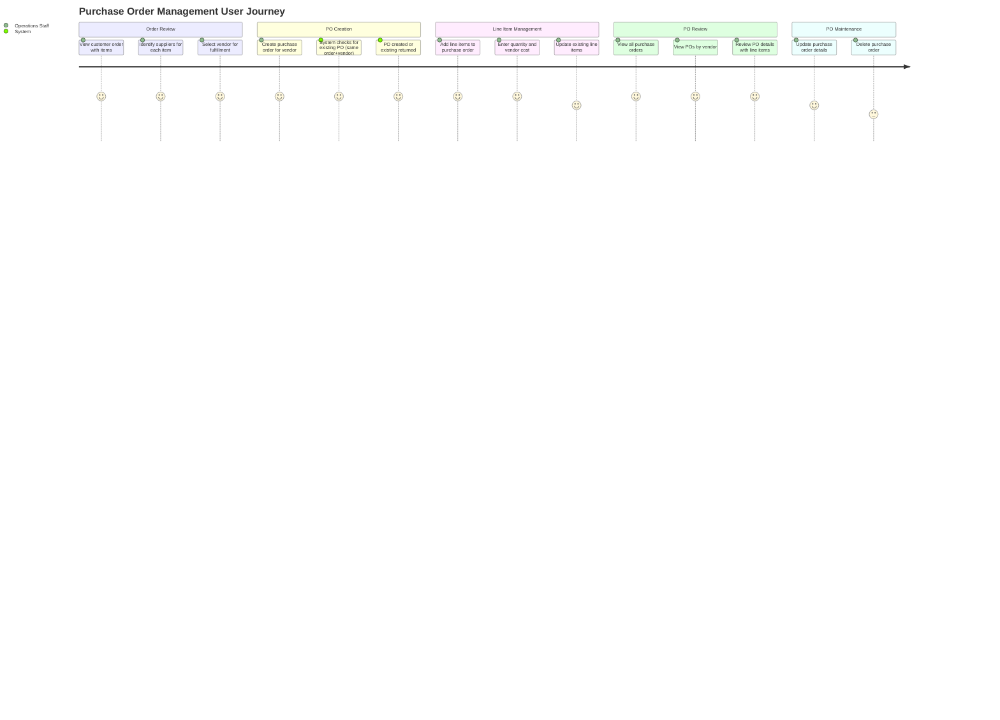
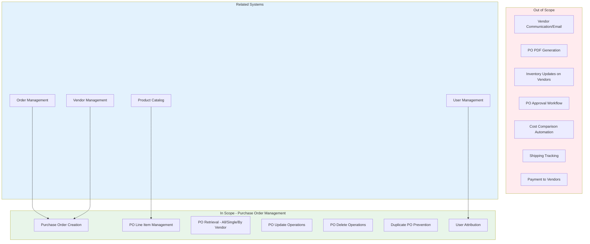
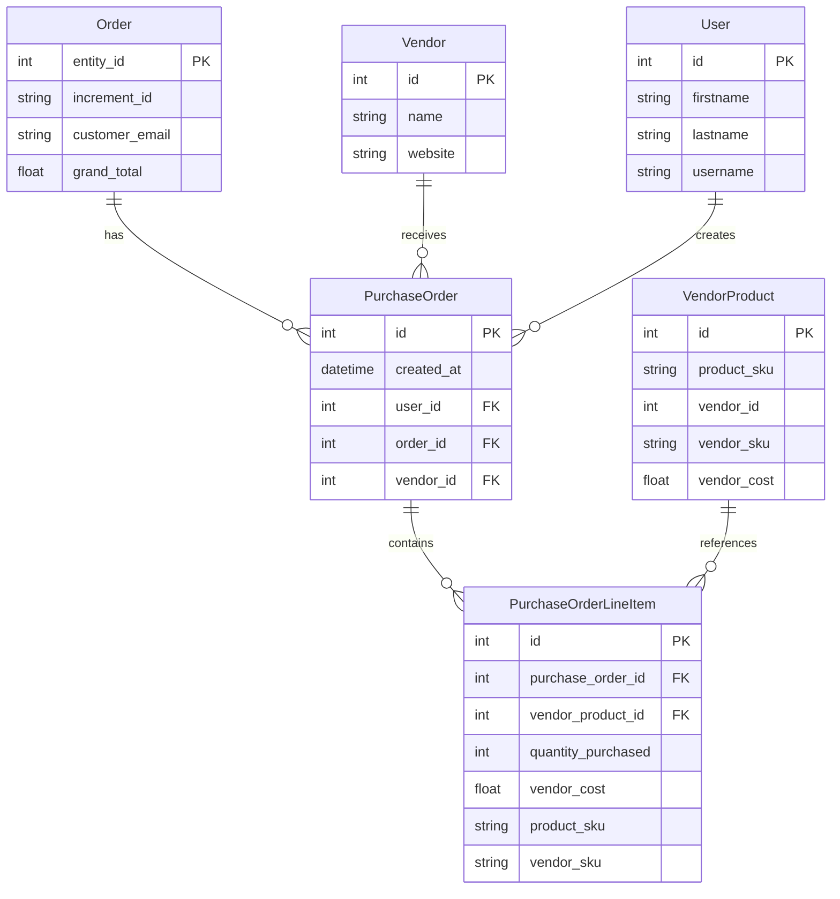

# PRD: Purchase Order Management

**Version**: 1.0.0
**Status**: Verified (Reverse-Engineered)
**Created**: 2026-01-23
**Last Updated**: 2026-01-23

---

## Overview

### One-line Summary

Purchase order management system that creates vendor-specific purchase orders from customer orders, tracks line items with quantities and costs, and manages the complete procurement workflow from order receipt to vendor fulfillment.

### Background

JustJeeps operates a multi-vendor procurement model where customer orders from the Magento storefront are fulfilled by sourcing products from various vendors (Meyer, Keystone, Omix-ADA, Turn14, Premier, etc.). The operations team requires a system to:

1. Create purchase orders to vendors for items in customer orders
2. Track which vendor fulfills each product in a customer order
3. Manage line items with product SKUs, quantities, and vendor costs
4. Support multiple purchase orders per customer order (one per vendor)
5. Associate purchase orders with the user who created them
6. View purchase order history by vendor for relationship management

This feature bridges the gap between customer order receipt and vendor procurement, enabling efficient multi-vendor fulfillment operations.

---

## User Journey Diagram



---

## Scope Boundary Diagram



---

## User Stories

### Primary Users

| User Type | Role Description | Primary Goals |
|-----------|------------------|---------------|
| Operations Staff | Creates POs for vendors, manages line items | Efficient vendor procurement, accurate cost tracking |
| Purchasing Manager | Reviews vendor orders, monitors costs | Vendor relationship management, cost control |
| System Administrator | Maintains PO data integrity | Data accuracy, system reliability |

### User Stories

**US-1: Purchase Order Creation**
```
As an Operations Staff member
I want to create purchase orders for specific vendors from customer orders
So that I can procure products to fulfill customer orders
```

**US-2: Duplicate Prevention**
```
As an Operations Staff member
I want the system to return an existing PO if one already exists for the same order and vendor
So that I avoid creating duplicate purchase orders
```

**US-3: Line Item Management**
```
As an Operations Staff member
I want to add and update line items on purchase orders with SKU, quantity, and cost
So that I can track exactly what needs to be ordered from each vendor
```

**US-4: Vendor PO History**
```
As a Purchasing Manager
I want to view the latest purchase orders for a specific vendor
So that I can review our ordering history and relationship with that vendor
```

**US-5: PO Detail Review**
```
As an Operations Staff member
I want to view complete purchase order details including vendor info and all line items
So that I can verify order accuracy before sending to vendor
```

**US-6: PO Modification**
```
As an Operations Staff member
I want to update or delete purchase orders
So that I can correct errors or cancel orders that are no longer needed
```

### Use Cases

1. **Multi-Vendor Order Fulfillment**: Customer order contains items from 3 different vendors. Operations staff creates one PO per vendor, each containing only the items sourced from that vendor.

2. **Line Item Addition**: Staff opens existing PO, adds a new line item with product SKU, vendor SKU, quantity, and cost. System checks if product already exists on PO and updates quantity if so.

3. **Vendor Order Review**: Purchasing manager opens vendor-specific view to review last 10 POs sent to Meyer Distributing, checking costs and volumes.

4. **PO Correction**: Staff discovers incorrect quantity on line item, opens PO, updates the line item with correct quantity and cost.

5. **Order Cancellation**: Customer cancels order; staff deletes associated POs to remove from procurement queue.

---

## Functional Requirements

### Must Have (MVP)

- [x] **FR-1**: Create purchase order linked to customer order and vendor
  - AC: POST /api/purchase_orders accepts vendor_id, user_id, order_id
  - AC: Created PO includes created_at timestamp (auto-generated)
  - AC: Response includes full PO with vendor, user, order, and line items relations

- [x] **FR-2**: Prevent duplicate purchase orders
  - AC: When creating PO, system checks for existing PO with same vendor_id AND order_id
  - AC: If existing PO found, return existing PO instead of creating duplicate
  - AC: Only one PO can exist per vendor-order combination

- [x] **FR-3**: List all purchase orders
  - AC: GET /api/purchase_orders returns all POs
  - AC: Each PO includes associated purchaseOrderLineItems

- [x] **FR-4**: Retrieve single purchase order with full details
  - AC: GET /api/purchase_orders/:id returns PO by ID
  - AC: Response includes vendor, user, order, and line items with vendorProduct relations

- [x] **FR-5**: List purchase orders by vendor
  - AC: GET /api/purchase_orders/vendor/:id returns POs for specified vendor_id
  - AC: Results ordered by created_at descending (most recent first)
  - AC: Limited to 10 most recent POs per vendor
  - AC: Includes full relations (vendor, user, order with items, line items)

- [x] **FR-6**: Update purchase order
  - AC: POST /api/purchase_orders/:id/update accepts vendor_id, user_id, order_id
  - AC: Response includes updated PO with all relations

- [x] **FR-7**: Delete purchase order
  - AC: POST /api/purchase_orders/:id/delete removes PO from database
  - AC: Response returns deleted PO record

- [x] **FR-8**: Create or update purchase order line item
  - AC: POST /purchaseOrderLineItem accepts purchaseOrderId, vendorProductId, quantityPurchased, vendorCost, product_sku, vendor_sku
  - AC: System checks for existing line item with same purchase_order_id AND product_sku
  - AC: If exists, updates quantity_purchased and vendor_cost
  - AC: If not exists, creates new line item
  - AC: Returns 201 status with created/updated line item

### Nice to Have

- [ ] **FR-9**: Delete individual line items from purchase order
- [ ] **FR-10**: Bulk line item creation from order items
- [ ] **FR-11**: PO total calculation (sum of line item costs x quantities)
- [ ] **FR-12**: PO status tracking (Draft, Submitted, Confirmed, Received)
- [ ] **FR-13**: PO search by order increment_id or vendor name

### Out of Scope

- **Vendor Communication**: No email/fax sending to vendors
  - Reason: Vendor communication handled through external systems
- **PDF Generation**: No purchase order document export
  - Reason: Manual export to vendor portals currently used
- **Approval Workflow**: No multi-level PO approval
  - Reason: Current process does not require approval gates
- **Automatic Cost Lookup**: No auto-population of vendor costs from VendorProduct
  - Reason: Costs may vary; manual entry ensures accuracy
- **Receiving/Fulfillment Tracking**: No tracking of PO receipt status
  - Reason: Separate fulfillment workflow

---

## Non-Functional Requirements

### Performance

| Metric | Current Implementation | Target |
|--------|----------------------|--------|
| All POs List Response | No pagination, includes line items | < 1 second for up to 500 POs |
| Single PO Fetch | Direct lookup with full relations | < 200ms |
| Vendor PO List | Limited to 10, with relations | < 300ms |
| Line Item Create/Update | Single record operation | < 100ms |

### Reliability

| Metric | Current State | Notes |
|--------|--------------|-------|
| Error Handling | Try/catch with 500 response | Generic error messages returned |
| Duplicate Prevention | findFirst check before create | Race condition possible (not locked) |
| Referential Integrity | FK constraints in database | Cascade not configured on PO delete |

### Data Integrity

- PurchaseOrder references Order via order_id foreign key (to Order.entity_id)
- PurchaseOrder references Vendor via vendor_id foreign key
- PurchaseOrder references User via user_id foreign key
- PurchaseOrderLineItem references PurchaseOrder via purchase_order_id foreign key
- Line items track product_sku and vendor_sku (string fields, not foreign keys)
- vendor_product_id is optional relation to VendorProduct

### Security

- CORS restricted to authorized frontend domains
- Authentication middleware available (ENABLE_AUTH feature flag)
- User attribution tracked via user_id on PO creation

### Scalability

| Consideration | Current State | Limitation |
|--------------|---------------|------------|
| PO Volume | Unlimited | No archival strategy |
| Line Items | Unlimited per PO | No pagination |
| Vendor Query | Limited to 10 results | May miss older POs |
| Database | PostgreSQL with Prisma | Horizontally scalable |

---

## Data Model

### PurchaseOrder Entity

```
PurchaseOrder
  - id: Int (Primary Key, auto-increment)
  - created_at: DateTime (default: now())
  - user_id: Int (FK to User.id) - Staff who created the PO
  - order_id: Int (FK to Order.entity_id) - Customer order being fulfilled
  - vendor_id: Int (FK to Vendor.id) - Vendor receiving the PO
  - Relations:
    - order: Order
    - user: User
    - vendor: Vendor
    - purchaseOrderLineItems: PurchaseOrderLineItem[]
```

### PurchaseOrderLineItem Entity

```
PurchaseOrderLineItem
  - id: Int (Primary Key, auto-increment)
  - purchase_order_id: Int (FK to PurchaseOrder.id)
  - vendor_product_id: Int? (Optional FK to VendorProduct.id)
  - quantity_purchased: Int
  - vendor_cost: Float?
  - product_sku: String? (Product SKU for reference)
  - vendor_sku: String? (Vendor-specific SKU)
  - Relations:
    - purchaseOrder: PurchaseOrder
    - vendorProduct: VendorProduct? (optional)
```

### Entity Relationship Diagram



---

## API Specification

### Purchase Order Endpoints

| Method | Endpoint | Description | Request Body | Response |
|--------|----------|-------------|--------------|----------|
| GET | /api/purchase_orders | List all POs | - | PurchaseOrder[] with lineItems |
| GET | /api/purchase_orders/:id | Get single PO | - | PurchaseOrder with vendor, user, order, lineItems |
| GET | /api/purchase_orders/vendor/:id | Get POs by vendor | - | PurchaseOrder[] (latest 10, desc by created_at) |
| POST | /api/purchase_orders | Create PO | vendor_id, user_id, order_id | PurchaseOrder (new or existing) |
| POST | /api/purchase_orders/:id/update | Update PO | vendor_id, user_id, order_id | Updated PurchaseOrder |
| POST | /api/purchase_orders/:id/delete | Delete PO | - | Deleted PurchaseOrder |

### Line Item Endpoints

| Method | Endpoint | Description | Request Body | Response |
|--------|----------|-------------|--------------|----------|
| POST | /purchaseOrderLineItem | Create/Update line item | purchaseOrderId, vendorProductId, quantityPurchased, vendorCost, product_sku, vendor_sku | PurchaseOrderLineItem (201) |

### Request/Response Examples

**Create Purchase Order**
```json
// POST /api/purchase_orders
// Request:
{
  "vendor_id": 1,
  "user_id": 2,
  "order_id": 82123
}

// Response:
{
  "id": 12,
  "created_at": "2026-01-23T18:26:15.382Z",
  "user_id": 2,
  "order_id": 82123,
  "vendor_id": 1,
  "vendor": { "id": 1, "name": "Meyer Distributing", ... },
  "user": { "id": 2, "firstname": "John", ... },
  "order": { "entity_id": 82123, ... },
  "purchaseOrderLineItems": []
}
```

**Create/Update Line Item**
```json
// POST /purchaseOrderLineItem
// Request:
{
  "purchaseOrderId": 12,
  "vendorProductId": null,
  "quantityPurchased": 2,
  "vendorCost": 134.14,
  "product_sku": "BST-52584-35",
  "vendor_sku": "52584-35"
}

// Response (201):
{
  "id": 16,
  "purchase_order_id": 12,
  "vendor_product_id": null,
  "quantity_purchased": 2,
  "vendor_cost": 134.14,
  "product_sku": "BST-52584-35",
  "vendor_sku": "52584-35"
}
```

---

## Integration Points

### Order Management Integration

**Linkage**: PurchaseOrder.order_id references Order.entity_id

**Workflow**:
1. Customer order synced from Magento to Order table
2. Staff reviews order items and selects suppliers
3. For each vendor, a PurchaseOrder is created referencing the Order
4. Line items added to PO with product details and costs

### Vendor Management Integration

**Linkage**: PurchaseOrder.vendor_id references Vendor.id

**Data Used**:
- Vendor name for display
- Vendor details for context (website, contact info)

**Query Pattern**: GET /api/purchase_orders/vendor/:id for vendor-specific PO history

### User Management Integration

**Linkage**: PurchaseOrder.user_id references User.id

**Purpose**: Attribution tracking - which staff member created each PO

**Data Used**: User firstname/lastname for audit trail

### Product Catalog Integration

**Indirect Linkage**: Line items store product_sku and vendor_sku as strings

**Optional Linkage**: vendor_product_id can reference VendorProduct for cost lookup

**Note**: Product/vendor data not enforced via foreign key - allows flexibility for products not in catalog

---

## Success Criteria

### Quantitative Metrics

| Metric | Measurement | Target |
|--------|-------------|--------|
| PO Creation Time | Time from order review to PO creation | < 30 seconds per PO |
| Line Item Accuracy | Line items matching intended products | 100% accuracy |
| API Response Time | 95th percentile latency | < 500ms for all endpoints |
| System Uptime | Monthly availability | > 99.5% |

### Qualitative Metrics

| Metric | Assessment Method |
|--------|------------------|
| User Efficiency | Reduced time vs manual vendor portal entry |
| Data Traceability | Clear linkage from customer order to vendor PO |
| Cost Visibility | All vendor costs captured for margin analysis |

---

## Technical Considerations

### Dependencies

| Dependency | Type | Purpose |
|------------|------|---------|
| Order Management | Feature | Provides order_id for PO creation |
| Vendor Management | Feature | Provides vendor_id for PO creation |
| User Management | Feature | Provides user_id for attribution |
| PostgreSQL | Database | PO and line item storage |
| Prisma ORM | Internal | Database access |
| Express.js | Internal | API framework |

### Constraints

1. **Order Existence**: PO can only be created for existing orders (FK constraint)
2. **Vendor Existence**: PO can only be created for existing vendors (FK constraint)
3. **User Existence**: PO can only be created with existing user (FK constraint)
4. **No Cascade Delete**: Deleting PO does not automatically delete line items (manual cleanup required)
5. **Line Item Lookup**: Duplicate detection uses purchase_order_id + product_sku combination

### Assumptions

- [VERIFIED] Orders are synced from Magento before PO creation is attempted
- [VERIFIED] Vendors are seeded in database before PO creation
- [VERIFIED] Users are seeded in database before PO creation
- [VERIFIED] product_sku values match Product.sku format (but not enforced by FK)

### Risks and Mitigation

| Risk | Impact | Probability | Mitigation |
|------|--------|-------------|------------|
| Orphaned line items on PO delete | Medium | Medium | Add cascade delete or line item cleanup endpoint |
| Race condition on duplicate check | Low | Low | Use database unique constraint on (vendor_id, order_id) |
| Line item without matching product | Low | Low | product_sku is string field - validation is manual |
| No error details on 500 responses | Medium | Medium | Enhance error logging and response messages |

---

## Appendix

### References

- Order Management PRD: `/docs/prd/order-management-prd.md`
- Multi-Vendor Integration PRD: `/docs/prd/multi-vendor-integration-prd.md`
- Prisma ORM Documentation

### Glossary

| Term | Definition |
|------|------------|
| PO (Purchase Order) | Document sent to vendor to procure products |
| Line Item | Individual product entry on a purchase order |
| vendor_id | Internal identifier for vendor in JustJeeps system |
| order_id | Magento entity_id linking to customer order |
| product_sku | JustJeeps SKU identifying the product |
| vendor_sku | Vendor-specific SKU for the same product |
| vendor_cost | Price charged by vendor for the product |
| entity_id | Magento's unique identifier for orders |

### Related Files

| File | Description |
|------|-------------|
| `/server.js` (lines 719-956) | Purchase Order and Line Item API endpoints |
| `/schema.prisma` | PurchaseOrder and PurchaseOrderLineItem data models |
| `/prisma/seeds/seed-individual/seed-po.js` | Purchase order seed data |

### Seed Data Reference

The seed file contains example PO data demonstrating:
- Multiple vendors (vendor_id 1, 2, 3)
- Multiple users (user_id 2, 3, 4, 5)
- Single and multiple line items per PO
- Varied vendor costs ($2.19 to $1,616.87)
- Various quantity purchases (1 to 2 items)
