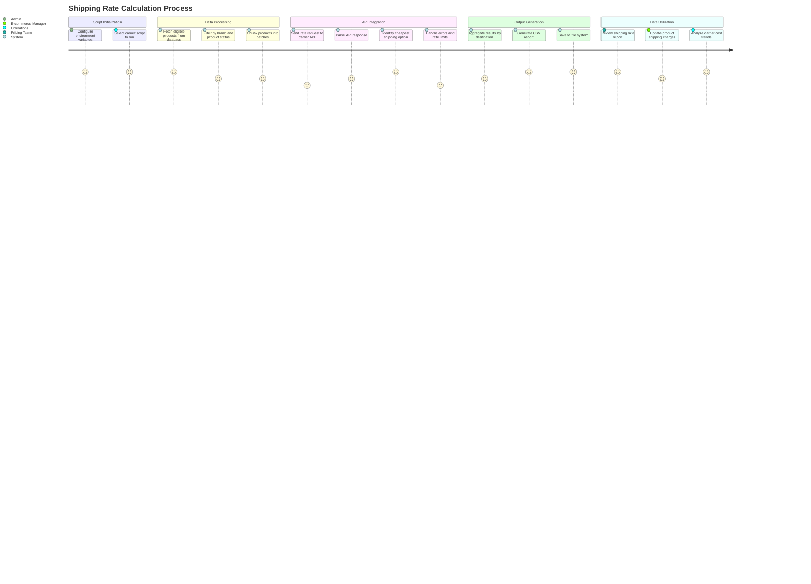
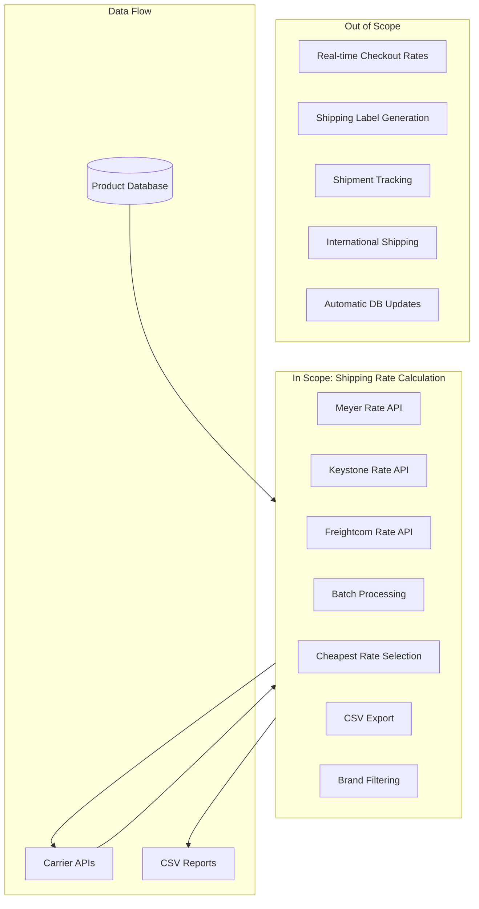

# PRD: Shipping Rate Calculation

## Overview

### One-line Summary
A batch processing system that calculates shipping rates for products from multiple carrier APIs (Meyer, Keystone, Freightcom) across Canadian destinations, generating CSV reports with the cheapest shipping options per product and region.

### Background
JustJeeps sources products from multiple distributors across North America. Shipping costs significantly impact product profitability and pricing decisions, especially for heavy automotive parts like suspension kits, bumpers, and accessories. The business requires visibility into:
- Actual shipping costs from different carriers to major Canadian markets
- Comparison of freight rates vs. parcel rates for heavier items
- Data to support shippingFreight field population on products

This feature enables data-driven shipping cost analysis by querying carrier APIs for each product in the catalog and generating comparative shipping cost reports across four major Canadian metropolitan areas.

## User Stories

### Primary Users
1. **Pricing/Operations Team**: Staff responsible for setting product prices and shipping charges
2. **Purchasing Team**: Personnel analyzing total landed cost including freight
3. **E-commerce Manager**: Personnel configuring shipping rules and rates on the website

### User Stories

```
As a pricing team member
I want to see shipping costs for each product to major Canadian cities
So that I can set accurate shipping charges and maintain profitability
```

```
As a purchasing team member
I want to compare shipping rates from different carriers
So that I can select the most cost-effective shipping method for each product
```

```
As an e-commerce manager
I want shipping cost data exported to CSV format
So that I can analyze rates in spreadsheets and update the shippingFreight field in bulk
```

```
As an operations team member
I want automatic selection of the cheapest shipping option
So that I can quickly identify the best carrier for each product
```

### Use Cases

1. **Periodic Rate Analysis**: Operations runs shipping rate scripts monthly to capture current carrier pricing and identify rate changes
2. **New Product Setup**: When adding products to the catalog, staff runs shipping calculations to determine appropriate shipping charges
3. **Carrier Comparison**: Purchasing team compares rates between Meyer, Keystone, and Freightcom to negotiate better carrier agreements
4. **Freight Classification**: For heavy/oversized items, Freightcom integration determines whether package or pallet (LTL) shipping is more cost-effective
5. **Regional Pricing Strategy**: E-commerce manager analyzes shipping costs by region (Ontario, BC, Quebec, Alberta) to set zone-based shipping rates

## Functional Requirements

### Must Have (MVP)

- [x] **Meyer Shipping Rate Integration**: Query Meyer API for shipping quotes using product SKU
  - AC: Given a product with meyer_code, when meyer-shipping script runs, then return shipping options with costs for all four destinations

- [x] **Keystone Shipping Rate Integration**: Query Keystone SOAP API for shipping quotes using product SKU
  - AC: Given a product with keystone_code, when keystone-shipping script runs, then return shipping rates parsed from XML response

- [x] **Freightcom Shipping Rate Integration**: Query Freightcom REST API for freight quotes using product dimensions and weight
  - AC: Given a product with weight data, when freightcom script runs, then return both package and pallet shipping options

- [x] **Multi-Destination Support**: Calculate rates to four major Canadian cities
  - AC: Rates are calculated for Toronto (M8V 1X9), Vancouver (V5N 1X6), Gatineau (J8Y 1X9), and Calgary (T2Y 2W3)

- [x] **Cheapest Rate Selection**: Automatically identify the lowest-cost shipping option
  - AC: For each product-destination pair, the system selects and reports the cheapest available carrier rate

- [x] **CSV Export**: Generate shipping rate reports in CSV format
  - AC: CSV includes SKU, brand, current shippingFreight value, price, and cheapest rate for each destination

- [x] **Brand Filtering**: Process only products from specific approved brands
  - AC: Scripts filter products by a predefined list of 200+ brand names eligible for rate calculation

- [x] **Rate Limiting**: Respect carrier API rate limits
  - AC: Meyer uses 90ms delay between requests; Keystone uses 100-second batch delays; Freightcom uses 3-second polling delay

### Should Have

- [x] **Batch Processing**: Process products in configurable chunk sizes
  - AC: Meyer processes 100 SKUs per chunk; Keystone processes 30 SKUs per batch; Freightcom processes sequentially

- [x] **Error Handling**: Continue processing after individual API failures
  - AC: Failed SKUs are logged as "Error" or "N/A" in output while remaining products are processed

- [x] **Execution Time Tracking**: Log total script execution time
  - AC: Console output includes "Execution Time" measurement

- [x] **Freight Class Calculation**: Automatically determine freight class for LTL shipments
  - AC: Freightcom script calculates freight class (50-500) based on product density (weight/volume)

- [x] **Package vs Pallet Comparison**: Compare parcel and pallet shipping rates
  - AC: Freightcom queries both package and pallet modes, selecting the cheaper option

### Could Have

- [x] **Weight-Only Products**: Handle products with weight but missing dimensions
  - AC: Freightcom uses estimated package sizes based on weight ranges when dimensions are unavailable

- [x] **Partial Save on Interrupt**: Save partial results if script is interrupted
  - AC: Freightcom script handles SIGINT to save partial CSV before exiting

- [ ] **Database Updates**: Automatically update product shippingFreight field with calculated rates
  - Note: Current implementation exports to CSV only; manual database update required

- [ ] **Historical Rate Storage**: Store shipping quotes in database for trend analysis
  - Note: Not currently implemented

### Out of Scope

- **Real-time Rate Calculation**: Live shipping quotes during customer checkout (batch processing only)
- **Shipping Label Generation**: Creating and printing carrier labels
- **Shipment Tracking**: Monitoring package delivery status
- **US Destination Support**: Currently limited to Canadian destinations only
- **International Shipping**: No cross-border rate calculations

## Non-Functional Requirements

### Performance
- **API Response Handling**: Individual carrier API calls should complete within 30 seconds
- **Batch Throughput**: Process minimum 500 SKUs per hour for Meyer/Keystone
- **Memory Usage**: Handle 20,000+ product catalog without memory exhaustion

### Reliability
- **API Availability**: Gracefully handle carrier API downtime with error logging
- **Resume Capability**: Freightcom supports partial save; Meyer/Keystone process sequentially with logging
- **Rate Limit Compliance**: Stay within carrier API limits to avoid blocking

### Security
- **Credential Storage**: API keys stored in environment variables (MEYER_KEY, KEYSTONE_KEY_DS, KEYSTONE_ACCOUNT_DS, FREIGHTCOM_API_KEY)
- **No PII Transmission**: Only product/shipping data sent to carriers; no customer information

### Scalability
- **Product Volume**: System handles catalog of 20,000+ products
- **Carrier Addition**: Architecture supports adding new carrier integrations

## Success Criteria

### Quantitative Metrics
1. **Coverage**: 80%+ of active products have shipping rates calculated for all four destinations
2. **Accuracy**: Calculated rates match actual carrier invoices within 5% variance
3. **Completion Rate**: 95%+ of API requests complete successfully (non-error status)
4. **Execution Time**: Full catalog rate calculation completes within 8 hours per carrier

### Qualitative Metrics
1. **Data Usability**: CSV output can be directly imported into spreadsheet applications for analysis
2. **Rate Transparency**: Staff can identify most cost-effective carrier for any product-destination combination
3. **Decision Support**: Data supports informed decisions on shipping charge configuration

## Technical Considerations

### Dependencies

**Internal Systems**:
- PostgreSQL database with Prisma ORM
- Product model with meyer_code, keystone_code, weight, length, width, height fields
- shippingFreight field on Product for storing calculated rates

**External Services**:
- Meyer API (meyerapi.meyerdistributing.com/http/default/ProdAPI/v2/ShippingRateQuote)
- Keystone SOAP API (order.ekeystone.com/wselectronicorder/electronicorder.asmx)
- Freightcom REST API (customer-external-api.ssd-test.freightcom.com/rate)

**Libraries**:
- axios: HTTP client for REST API calls
- fast-xml-parser: XML parsing for Keystone SOAP responses
- json2csv: CSV generation
- fs: File system operations for CSV output

### Constraints

- **Rate Limits**: Meyer requires 90ms+ between requests; Keystone batches require 100-second delays; Freightcom requires 3-second polling intervals
- **API Authentication**: Meyer uses Espresso header token; Keystone uses SOAP with account credentials; Freightcom uses bearer token
- **Product Data Requirements**: Meyer requires meyer_code; Keystone requires keystone_code; Freightcom requires weight (dimensions optional)
- **Response Parsing**: Keystone returns SOAP/XML requiring parsing; Meyer/Freightcom return JSON

### Assumptions

- [x] Carrier APIs remain available and maintain backward compatibility
- [x] Products have accurate weight and dimension data where available
- [x] Shipping origin is JustJeeps warehouse at 128 Oakdale Road, North York, ON M3N 1V9
- [x] Environment variables are configured correctly before running scripts

### Risks and Mitigation

| Risk | Impact | Probability | Mitigation |
|------|--------|-------------|------------|
| Carrier API rate limiting | High | Medium | Conservative delays between requests; batch processing |
| API authentication changes | High | Low | Monitor carrier communications; maintain credential rotation process |
| Incomplete product data (missing weight/dimensions) | Medium | Medium | Weight-based estimation for missing dimensions; skip products without weight |
| Long execution times for full catalog | Medium | High | Batch processing; partial save capability; run during off-hours |
| API pricing data staleness | Medium | Medium | Run scripts monthly; flag significant rate changes |
| Carrier adds new service types | Low | Medium | Parse all returned options; select cheapest regardless of service name |

## User Journey Diagram



## Scope Boundary Diagram



## Carrier Integration Details

### Meyer Shipping API

| Aspect | Detail |
|--------|--------|
| Endpoint | `meyerapi.meyerdistributing.com/http/default/ProdAPI/v2/ShippingRateQuote` |
| Method | GET |
| Authentication | `Authorization: Espresso {MEYER_KEY}` |
| Parameters | ItemNumber, ShipToAddress1, ShipToCity, Quantity, ShipToZipcode, ShipToCountry, ShipToState |
| Response | JSON array of shipping options with Cost field |
| Rate Limit | 90ms delay between requests, 150ms delay between chunks |
| Batch Size | 100 SKUs per chunk |

### Keystone Shipping API

| Aspect | Detail |
|--------|--------|
| Endpoint | `order.ekeystone.com/wselectronicorder/electronicorder.asmx` |
| Method | POST (SOAP) |
| Authentication | API Key + Account Number in SOAP body |
| Parameters | Key, FullAccountNo, FullPartNo, ToZip |
| Response | SOAP/XML with Rates array containing Name and Rate |
| Rate Limit | 100-second delay between batches |
| Batch Size | 30 SKUs per batch |
| Filter | Excludes "Keystone Truck" service; filters rates > $0 |

### Freightcom Shipping API

| Aspect | Detail |
|--------|--------|
| Endpoint | `customer-external-api.ssd-test.freightcom.com/rate` |
| Method | POST (rate request) + GET (rate retrieval) |
| Authentication | `Authorization: {FREIGHTCOM_API_KEY}` |
| Parameters | services, origin, destination, packaging_type, packaging_properties |
| Modes | Package (parcel) and Pallet (LTL freight) |
| Response | JSON with rates array containing total.value (in cents) |
| Polling | 3-second delay between request and retrieval |
| Carriers | 200+ service codes including UPS, FedEx, Purolator, Canada Post, DHL, and regional LTL carriers |
| Freight Class | Calculated dynamically based on density (weight/volume) |

## Data Model

### Product Fields Used

```prisma
model Product {
  sku                String   @id @unique
  meyer_code         String?  // Used by Meyer shipping script
  keystone_code      String?  // Used by Keystone shipping script
  brand_name         String?  // Used for brand filtering
  status             Int?     // Filter: status = 1 (active)
  weight             Float?   // Used by Freightcom for rate calculation
  length             Float?   // Used by Freightcom (optional)
  width              Float?   // Used by Freightcom (optional)
  height             Float?   // Used by Freightcom (optional)
  shippingFreight    String?  // Target field for calculated rates
  price              Float    // Included in CSV output
}
```

### CSV Output Format

**Meyer/Keystone Output**:
| Column | Description |
|--------|-------------|
| Meyer_Code / Keystone_Code | Vendor-specific product code |
| SKU | Internal JustJeeps SKU |
| Brand | Product brand name |
| Shipping_Freight | Current shippingFreight value from database |
| Vancouver | Cheapest rate to Vancouver, BC |
| Ontario | Cheapest rate to Toronto, ON |
| Quebec | Cheapest rate to Gatineau, QC |
| Alberta | Cheapest rate to Calgary, AB |
| Price | Product price |

**Freightcom Output**:
| Column | Description |
|--------|-------------|
| Meyer_Code | Vendor code or SKU fallback |
| SKU | Internal JustJeeps SKU |
| Brand | Product brand name |
| Price | Product price |
| Length | Product length (inches) |
| Width | Product width (inches) |
| Height | Product height (inches) |
| Weight | Product weight (lbs) |
| {City} best price | Cheapest rate for destination |
| {City} best carrier | Carrier name and service for cheapest rate |
| {City} all rates | All returned rates (newline-separated) |

## Destination Addresses

| Destination | City | Province | Postal Code | Representative Market |
|-------------|------|----------|-------------|----------------------|
| Toronto | Toronto | ON | M8V 1X9 | Ontario/Central Canada |
| Vancouver | Vancouver | BC | V5N 1X6 | British Columbia/West Coast |
| Gatineau | Gatineau | QC | J8Y 1X9 | Quebec/Eastern Canada |
| Calgary | Calgary | AB | T2Y 2W3 | Alberta/Prairies |

## Appendix

### References
- Meyer API Documentation: Internal credentials required
- Keystone Electronic Order API: SOAP-based XML interface
- Freightcom API Documentation: https://docs.freightcom.com/

### Glossary
- **LTL**: Less Than Truckload - freight shipping for shipments too large for parcel but not requiring full truck
- **Freight Class**: NMFC classification (50-500) based on density, used for LTL pricing
- **Dimensional Weight**: Calculated weight based on package dimensions: (L x W x H) / 139
- **Pallet**: Shipping mode for heavy/bulky items requiring freight carrier handling
- **Package**: Standard parcel shipping via courier (UPS, FedEx, Purolator, etc.)
- **shippingFreight**: Product field indicating shipping category or calculated freight cost

### Environment Variables Required

```env
# Meyer API
MEYER_KEY=                    # Espresso authentication token

# Keystone API
KEYSTONE_KEY_DS=              # API key for rate requests
KEYSTONE_ACCOUNT_DS=          # Account number for authentication

# Freightcom API
FREIGHTCOM_API_KEY=           # Bearer token for API access
```

### NPM Scripts

```bash
npm run meyer-shipping     # Run Meyer shipping rate calculation
npm run keystone-shipping  # Run Keystone shipping rate calculation
npm run freightcom         # Run Freightcom shipping rate calculation
```

### File Locations

| File | Purpose |
|------|---------|
| `/prisma/seeds/api-calls/meyer-shippingRates.js` | Meyer carrier rate script |
| `/prisma/seeds/api-calls/keystone-shippingRates.js` | Keystone carrier rate script |
| `/prisma/seeds/api-calls/freightcom-shipping-rates.js` | Freightcom carrier rate script |
| `/prisma/seeds/api-calls/api-csv-responses/shipping_rates_meyer.csv` | Meyer output file |
| `/prisma/seeds/api-calls/api-csv-responses/shipping_rates_keystone.csv` | Keystone output file |
| `/prisma/seeds/api-calls/freightcom_shipping_rates.csv` | Freightcom output file |

---

**Document Version**: 1.0
**Created**: 2026-01-23
**Status**: Final (Reverse-Engineered from Implementation)
