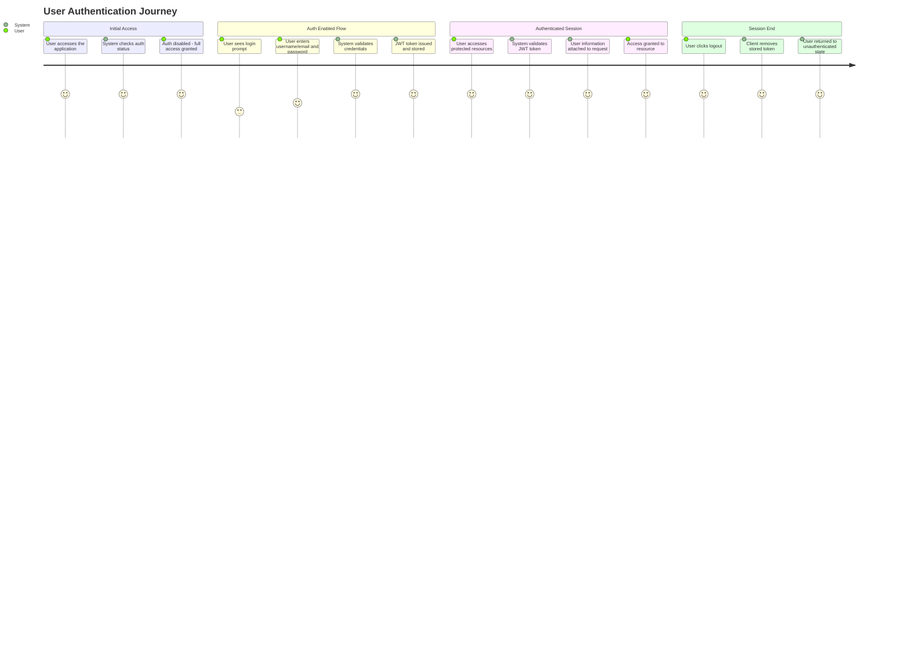
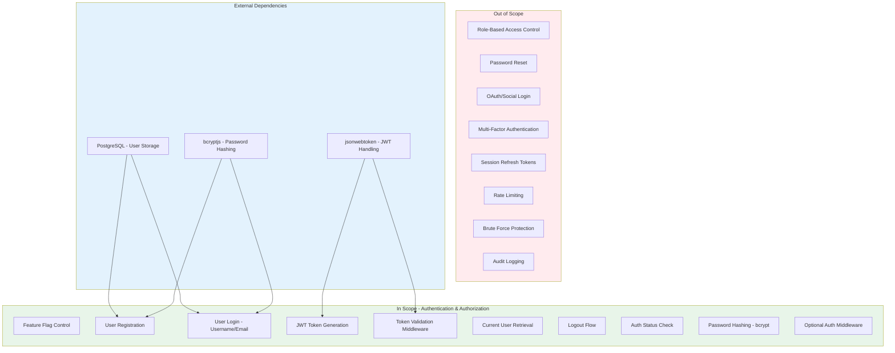

# PRD: User Authentication & Authorization

**Version**: 1.0.0
**Status**: Verified (Reverse-Engineered)
**Created**: 2026-01-23
**Last Updated**: 2026-01-23

---

## Overview

### One-line Summary

JWT-based authentication system with feature flag control (ENABLE_AUTH) supporting user registration, login via username or email, token-based session management, and zero-downtime deployment with safe defaults (authentication disabled by default).

### Background

JustJeeps operates an internal operations API that manages orders, products, vendors, and purchase orders. As the system evolves and more users require access, a secure authentication mechanism is needed to:

1. Control access to sensitive business data (orders, pricing, vendor costs)
2. Track which users perform operations (purchase order creation is linked to users)
3. Support gradual rollout without disrupting existing workflows
4. Maintain backward compatibility during the transition period

The authentication system was designed with a "safety-first" approach using feature flags, ensuring that:
- Existing deployments continue to work unchanged (auth disabled by default)
- New deployments can enable authentication when ready
- Zero downtime is achieved during authentication rollout

---

## User Journey Diagram



---

## Scope Boundary Diagram



---

## User Stories

### Primary Users

| User Type | Role Description | Primary Goals |
|-----------|------------------|---------------|
| Operations Staff | Uses the API to process orders, manage products, create purchase orders | Secure access to business data, personalized session |
| System Administrator | Manages user accounts and system configuration | Control who can access the system, enable/disable auth |
| Application (Client) | Frontend application consuming the API | Programmatic authentication, token management |

### User Stories

**US-1: Feature Flag Check**
```
As a System Administrator
I want to check if authentication is enabled
So that I can determine the system's security posture
```

**US-2: User Login**
```
As an Operations Staff member
I want to log in using my username or email
So that I can access the system securely
```

**US-3: User Registration**
```
As a System Administrator
I want to register new users with secure credentials
So that team members can access the system
```

**US-4: Session Verification**
```
As an authenticated user
I want to verify my current session is valid
So that I know I'm properly logged in
```

**US-5: Graceful Logout**
```
As an authenticated user
I want to log out of the system
So that my session is terminated securely
```

**US-6: Transparent Access (Auth Disabled)**
```
As any user
I want full API access when authentication is disabled
So that existing workflows are not disrupted during rollout
```

### Use Cases

1. **Daily Login**: Staff member opens the application, enters credentials (username or email), receives JWT token, and proceeds to use the system with authenticated session.

2. **New Employee Onboarding**: Administrator creates new user account via registration endpoint with secure password, user receives credentials and can immediately log in.

3. **Session Validation**: Frontend application checks `/api/auth/me` to verify token validity and retrieve current user information for display.

4. **Gradual Rollout**: System deployed with `ENABLE_AUTH=false`, all endpoints work without authentication. When ready, administrator changes to `ENABLE_AUTH=true` and restarts server; authentication becomes required.

5. **Mixed Environment**: Some routes use `optionalAuth` middleware to enhance experience for logged-in users while still allowing anonymous access.

---

## Functional Requirements

### Must Have (MVP)

- [x] **FR-1**: Feature Flag Control (ENABLE_AUTH)
  - AC: When `ENABLE_AUTH=false` or unset, all authentication is bypassed
  - AC: When `ENABLE_AUTH=true`, authentication is enforced
  - AC: Login and register endpoints return 403 when auth is disabled

- [x] **FR-2**: User Login with Username or Email
  - AC: POST /api/auth/login accepts `username` and `password` fields
  - AC: Username field can contain either username or email address
  - AC: Successful login returns JWT token and user object (id, username, email, firstname, lastname)
  - AC: Invalid credentials return 401 with generic error message (no enumeration)
  - AC: Missing credentials return 400 with validation error

- [x] **FR-3**: User Registration
  - AC: POST /api/auth/register accepts username, email, password, firstname, lastname
  - AC: Password is hashed with bcrypt (10 salt rounds) before storage
  - AC: Duplicate username or email returns 409 conflict error
  - AC: Successful registration returns JWT token and user object
  - AC: All fields are required; missing fields return 400 error

- [x] **FR-4**: JWT Token Generation
  - AC: Token contains userId claim
  - AC: Token signed with JWT_SECRET from environment
  - AC: Token expires based on JWT_EXPIRES_IN (default 24h)
  - AC: Token uses HS256 algorithm (jsonwebtoken default)

- [x] **FR-5**: Token Validation Middleware (authenticateToken)
  - AC: When auth disabled, middleware calls next() without validation
  - AC: When auth enabled, missing token returns 401
  - AC: When auth enabled, invalid/expired token returns 403
  - AC: Valid token attaches user object to req.user
  - AC: User not found in database returns 403

- [x] **FR-6**: Optional Authentication Middleware (optionalAuth)
  - AC: When auth disabled, proceeds without user attachment
  - AC: When auth enabled but no token, proceeds without user (no error)
  - AC: When auth enabled with valid token, attaches user to request
  - AC: Invalid token silently ignored (proceeds without user)

- [x] **FR-7**: Current User Retrieval
  - AC: GET /api/auth/me requires authentication (authenticateToken middleware)
  - AC: Returns current user object from req.user
  - AC: Response includes id, username, email, firstname, lastname

- [x] **FR-8**: Logout Endpoint
  - AC: POST /api/auth/logout always returns success
  - AC: Logout is stateless (client removes token)
  - AC: No server-side token invalidation

- [x] **FR-9**: Authentication Status Endpoint
  - AC: GET /api/auth/status returns whether auth is enabled
  - AC: Response includes authEnabled boolean and human-readable message
  - AC: Endpoint is always accessible (no auth required)

- [x] **FR-10**: Password Security
  - AC: Passwords hashed using bcrypt with 10 salt rounds
  - AC: Password comparison uses bcrypt.compare (timing-safe)
  - AC: Plain text passwords never stored or logged

### Nice to Have

- [ ] **FR-11**: Role-based permissions (Admin, Manager, User)
  - Listed in documentation as planned feature
- [ ] **FR-12**: Password reset functionality via email
- [ ] **FR-13**: OAuth integration (Google, GitHub)
- [ ] **FR-14**: Session management with refresh tokens
- [ ] **FR-15**: Multi-factor authentication (MFA)

### Out of Scope

- **Token Blacklisting**: Server does not maintain invalid token list
  - Reason: Stateless JWT design for simplicity; acceptable for internal tool
- **Rate Limiting**: No request throttling on auth endpoints
  - Reason: Internal network only; planned as future enhancement
- **Brute Force Protection**: No account lockout mechanism
  - Reason: Future enhancement listed in documentation
- **Audit Logging**: No security event logging
  - Reason: Future enhancement listed in documentation
- **Password Complexity Rules**: No enforcement of password strength
  - Reason: Internal users with trusted credentials

---

## Non-Functional Requirements

### Performance

| Metric | Current Implementation | Target |
|--------|----------------------|--------|
| Login Response Time | Direct DB lookup + bcrypt compare | < 500ms |
| Token Validation | JWT verify + DB user lookup | < 100ms |
| Registration | bcrypt hash (10 rounds) + DB insert | < 1 second |
| Auth Status Check | Environment variable check | < 10ms |

### Reliability

| Metric | Current State | Notes |
|--------|--------------|-------|
| Auth Bypass Safety | ENABLE_AUTH defaults to false | Safe deployment default |
| Error Handling | Try/catch with generic messages | Prevents information leakage |
| Database Connection | Prisma Client with auto-reconnect | Standard Prisma behavior |

### Security

| Security Control | Implementation |
|-----------------|----------------|
| Password Storage | bcrypt hash with 10 salt rounds |
| Token Signing | HS256 with JWT_SECRET (recommended 64+ chars) |
| Token Expiration | Configurable via JWT_EXPIRES_IN (default 24h) |
| Bearer Token | Authorization header with "Bearer" prefix |
| Error Messages | Generic "Invalid credentials" (no enumeration) |
| Credential Validation | Server-side validation of all inputs |

### Scalability

| Consideration | Current State | Limitation |
|--------------|---------------|------------|
| Stateless JWT | No server-side session storage | Horizontally scalable |
| Database Users | PostgreSQL User table | Single database instance |
| Token Validation | Per-request DB lookup for user | Could cache for performance |

---

## Data Model

### User Entity

```
User
  - id: Int (Primary Key, auto-increment)
  - firstname: String
  - lastname: String
  - username: String (unique - enforced at application level)
  - email: String (unique - enforced at application level)
  - password: String (bcrypt hashed)
  - Relations:
    - purchaseOrders: PurchaseOrder[] (user creates purchase orders)
```

### JWT Token Payload

```
{
  "userId": Int,        // User.id from database
  "iat": Int,           // Issued at timestamp
  "exp": Int            // Expiration timestamp
}
```

### Request Context (after middleware)

```
req.user = {
  id: Int,
  username: String,
  email: String,
  firstname: String,
  lastname: String
}
```

---

## API Specification

### Authentication Endpoints (/api/auth)

| Method | Endpoint | Auth Required | Description |
|--------|----------|---------------|-------------|
| POST | /api/auth/login | No | Authenticate user and receive JWT |
| POST | /api/auth/register | No | Create new user account |
| GET | /api/auth/me | Yes | Get current authenticated user |
| POST | /api/auth/logout | No | Logout (client-side token removal) |
| GET | /api/auth/status | No | Check if authentication is enabled |

### Endpoint Details

#### POST /api/auth/login

**Request Body:**
```json
{
  "username": "string (username or email)",
  "password": "string"
}
```

**Success Response (200):**
```json
{
  "success": true,
  "message": "Login successful",
  "token": "eyJhbGciOiJIUzI1NiIsInR5cCI6IkpXVCJ9...",
  "user": {
    "id": 1,
    "username": "admin",
    "email": "admin@example.com",
    "firstname": "Admin",
    "lastname": "User"
  }
}
```

**Error Responses:**
- 400: Missing username or password
- 401: Invalid credentials
- 403: Authentication not enabled
- 500: Internal server error

#### POST /api/auth/register

**Request Body:**
```json
{
  "username": "string",
  "email": "string",
  "password": "string",
  "firstname": "string",
  "lastname": "string"
}
```

**Success Response (201):**
```json
{
  "success": true,
  "message": "Registration successful",
  "token": "eyJhbGciOiJIUzI1NiIsInR5cCI6IkpXVCJ9...",
  "user": {
    "id": 2,
    "username": "newuser",
    "email": "user@example.com",
    "firstname": "John",
    "lastname": "Doe"
  }
}
```

**Error Responses:**
- 400: Missing required fields
- 403: Authentication not enabled
- 409: Username or email already exists
- 500: Internal server error

#### GET /api/auth/me

**Headers:**
```
Authorization: Bearer <token>
```

**Success Response (200):**
```json
{
  "success": true,
  "user": {
    "id": 1,
    "username": "admin",
    "email": "admin@example.com",
    "firstname": "Admin",
    "lastname": "User"
  }
}
```

**Error Responses:**
- 401: Access token required (when auth enabled)
- 403: Invalid or expired token
- 500: Internal server error

#### POST /api/auth/logout

**Success Response (200):**
```json
{
  "success": true,
  "message": "Logout successful"
}
```

#### GET /api/auth/status

**Success Response (200):**
```json
{
  "authEnabled": true,
  "message": "Authentication is enabled"
}
```
or
```json
{
  "authEnabled": false,
  "message": "Authentication is disabled"
}
```

---

## Integration Points

### Environment Configuration

| Variable | Description | Default | Required When |
|----------|-------------|---------|---------------|
| ENABLE_AUTH | Feature flag to enable/disable auth | `false` | Always |
| JWT_SECRET | Secret key for signing tokens | - | Auth enabled |
| JWT_EXPIRES_IN | Token expiration duration | `24h` | Never (optional) |

### Middleware Integration

The authentication system provides two middleware functions:

1. **authenticateToken**: For routes requiring authentication
   - Used on `/api/auth/me`
   - Can be applied to any route requiring login

2. **optionalAuth**: For routes that work with or without authentication
   - Attaches user if token present
   - Does not require authentication

### Database Integration

- User model stored in PostgreSQL via Prisma
- User.id foreign key referenced in PurchaseOrder model
- Unique constraints on username/email enforced at application level

### Frontend Integration

The system is designed for integration with React frontend:
- AuthContext provider for state management
- ProtectedRoute component for route guarding
- Token stored in localStorage (client responsibility)

---

## Success Criteria

### Quantitative Metrics

| Metric | Measurement | Target |
|--------|-------------|--------|
| Login Success Rate | (Successful logins / Total attempts) x 100 | > 95% for valid credentials |
| Token Validation Performance | 95th percentile latency | < 100ms |
| Zero-Downtime Deployment | Service interruptions during auth rollout | 0 |
| Password Hash Strength | bcrypt cost factor | 10 rounds |

### Qualitative Metrics

| Metric | Assessment Method |
|--------|------------------|
| Developer Experience | Clear API responses with helpful error messages |
| Security Posture | No credential exposure in logs or responses |
| Rollout Flexibility | Auth can be enabled/disabled without code changes |

---

## Technical Considerations

### Dependencies

| Dependency | Version | Purpose |
|------------|---------|---------|
| jsonwebtoken | - | JWT generation and verification |
| bcryptjs | - | Password hashing and comparison |
| @prisma/client | - | Database access for User model |
| dotenv | - | Environment variable loading |
| express | - | HTTP routing framework |

### Constraints

1. **Stateless Sessions**: JWT tokens cannot be invalidated server-side
2. **Single Secret**: All tokens signed with same JWT_SECRET
3. **No Unique Constraints in Schema**: Username/email uniqueness enforced at application level only
4. **Password in User Data File**: Seed data contains plain text passwords (hashed during seeding)

### Assumptions

- [VERIFIED] PostgreSQL database is available and accessible
- [VERIFIED] Environment variables are properly loaded via dotenv
- [VERIFIED] bcryptjs provides timing-safe password comparison
- [VERIFIED] JWT_SECRET is kept secure and not committed to version control
- [VERIFIED] Frontend handles token storage and refresh appropriately

### Risks and Mitigation

| Risk | Impact | Probability | Mitigation |
|------|--------|-------------|------------|
| JWT_SECRET exposure | High | Low | Store in environment, never commit to repo |
| Token theft | High | Low | Short expiration, HTTPS enforcement |
| Brute force attack | Medium | Medium | Future: implement rate limiting |
| User enumeration | Low | Low | Generic error messages implemented |
| Database unavailable | High | Low | Standard error handling with 500 response |

---

## Appendix

### References

- JSON Web Token (JWT) RFC 7519
- bcrypt Password Hashing
- OWASP Authentication Cheat Sheet
- Express.js Middleware Documentation

### Glossary

| Term | Definition |
|------|------------|
| JWT | JSON Web Token - compact, URL-safe token format for claims |
| Bearer Token | Authentication scheme using "Bearer" prefix in Authorization header |
| bcrypt | Password hashing function with salt and configurable cost factor |
| Salt Rounds | bcrypt cost factor; 10 rounds = 2^10 iterations |
| Feature Flag | Configuration-based toggle for enabling/disabling features |
| Stateless Auth | Authentication without server-side session storage |

### Related Files

| File | Description |
|------|-------------|
| `/routes/auth.js` | Authentication API route handlers |
| `/middleware/auth.js` | JWT verification middleware |
| `/schema.prisma` | User model definition |
| `/prisma/seeds/seed-individual/seed-users.js` | User seeding script |
| `/prisma/seeds/hard-code_data/users_data.js` | Initial user data |
| `/README-AUTHENTICATION.md` | Comprehensive authentication documentation |
| `/SECURITY.md` | Security best practices and configuration |

### Test User Accounts

| Username | Email | Role |
|----------|-------|------|
| jerry | jerry@justjeeps.com | Staff |
| jacob | jkemper@justjeeps.com | Staff |
| david | dhunter@justjeeps.com | Staff |
| paula | pmello@justjeeps.com | Staff |
| tess | tsantos@justjeeps.com | Staff |
| rafael | rafaelp@justjeeps.com | Staff |

*Note: Passwords are hashed during seeding process. See seed-users.js for seeding instructions.*

### Configuration Examples

**Enable Authentication (Production):**
```bash
ENABLE_AUTH=true
JWT_SECRET=<64+ character random string>
JWT_EXPIRES_IN=24h
```

**Generate Secure JWT Secret:**
```bash
node -e "console.log(require('crypto').randomBytes(64).toString('hex'))"
```

**Disable Authentication (Development/Legacy):**
```bash
ENABLE_AUTH=false
# JWT_SECRET not required when auth disabled
```
